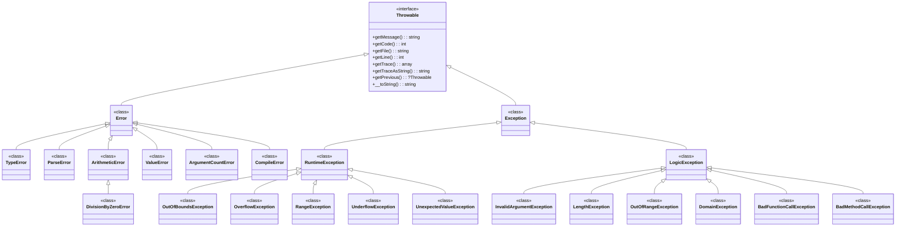

# PHP Debugging & Error Handling

## 1. Overview

Error handling and debugging are foundational to PHP development. PHP 8.4 provides a mature, layered system: traditional error levels (E_WARNING, E_NOTICE, etc.) coexist with the modern Exception/Error hierarchy, while tools like Xdebug, PHPDBG, and PHP's built-in assertions provide the debugging arsenal. This skill covers the complete error lifecycle — from detecting and reporting errors through troubleshooting and production monitoring.

### The Error Handling Spectrum

```
User-facing errors ────────────────────────── Internal errors
        │                                            │
   Exceptions                                  Error levels
(Throwable hierarchy)                        (E_WARNING, etc.)
        │                                            │
   try/catch                                  set_error_handler()
        │                                            │
   Framework error handling                  Custom error handlers
        │                                            │
   HTTP error responses (500)              Logging + monitoring
```

---

## 2. Concepts

### 2.1 Error Levels in PHP

PHP defines 17 error level constants (bitmask flags). Every error raised at runtime has a severity level:

| Constant | Value | Description | Caught by Default Error Handler? |
|----------|-------|-------------|--|
| `E_ERROR` | 1 | Fatal runtime error | Yes (script halts) |
| `E_WARNING` | 2 | Non-fatal warning | Yes |
| `E_PARSE` | 4 | Compile-time parse error | Yes |
| `E_NOTICE` | 8 | Runtime notice (undefined var, etc.) | Yes |
| `E_CORE_ERROR` | 16 | Fatal on PHP startup | Yes |
| `E_CORE_WARNING` | 32 | Warning on PHP startup | Yes |
| `E_COMPILE_ERROR` | 64 | Fatal compile error | Yes |
| `E_COMPILE_WARNING` | 128 | Warning on compile | Yes |
| `E_USER_ERROR` | 256 | User-generated fatal (trigger_error()) | Yes |
| `E_USER_WARNING` | 512 | User-generated warning | Yes |
| `E_USER_NOTICE` | 1024 | User-generated notice | Yes |
| `E_STRICT` | 2048 | Suggestion for code interoperability (PHP 7+) | Yes |
| `E_RECOVERABLE_ERROR` | 4096 | Catchable fatal | Yes (converted to exception with ErrorException) |
| `E_DEPRECATED` | 8192 | Deprecation warning | Yes |
| `E_USER_DEPRECATED` | 16384 | User-generated deprecation | Yes |
| `E_ALL` | 32767 | All errors and warnings | Yes |

**PHP 8.4 changes:** `E_STRICT` is no longer generated by the engine (it remains defined for backward compatibility). Deprecations (`E_DEPRECATED`) are generated for PHP 8.x deprecated features.

### 2.2 The PHP Throwable Hierarchy (PHP 7+)



**Key insight:** In PHP 7+, fatal errors (`E_ERROR`, `E_CORE_ERROR`, `E_COMPILE_ERROR`) are no longer unrecoverable — they throw `Error` exceptions (or subclasses like `TypeError`, `ValueError`). This means **every error is theoretically catchable** with `catch (Throwable $e)`.

### 2.3 Error Handling Flow

```mermaid
flowchart TD
    A[\"Error Occurs\"] --> B{Has error handler?\\n(set_error_handler)\"}
    B -->|\"Yes\"| C[\"Error handler\\ncallback invoked\"]
    B -->|\"No\"| D[\"Default PHP\\nerror handler\"]
    C --> E{Handler returns\\nfalse?}
    E -->|\"Yes\"| D
    E -->|\"No\"| F[\"Execution continues\\n(or halts for E_ERROR)\"]
    D --> G{Error level\\nfatal?}
    G -->|\"Yes\"| H[\"Script halted\\n(or Error thrown in PHP 7+)\"]
    G -->|\"No\"| I[\"Log error\\nDisplay if display_errors=On\"]
    A --> J{Thrown Exception\\nin try block?}
    J -->|\"Yes\"| K[\"catch block\\ninvoked\"]
    K --> L[\"Finally block\\n(always runs)\"]
```

### 2.4 Xdebug Architecture

Xdebug 3 operates in distinct modes (set via `xdebug.mode`):

| Mode | Function | Use Case |
|------|----------|----------|
| `debug` | Step debugging (breakpoints) | Development |
| `develop` | Improved var_dump, stack traces | Development |
| `profile` | Performance profiling | Optimization |
| `trace` | Function call tracing | Deep Debugging |
| `gc_stats` | Garbage collection stats | Memory analysis |
| `coverage` | Code coverage analysis | Testing |

**Communication flow (step debugging):**

```
PHP Process (Xdebug)  ←→  DBGp Protocol (port 9003)  ←→  IDE (VS Code / PHPStorm)
```

---

## 3. Internal Architecture

### 3.1 Error Reporting Implementation

Error handling in the Zend Engine lives in `Zend/zend.c` and `Zend/zend_execute_API.c`:

```c
// Conceptual flow when an error occurs
void zend_error(int type, const char *format, ...)
{
    // 1. Check if error_type is in error_reporting mask
    if (!(type & EG(error_reporting))) {
        return;  // Error suppressed by error_reporting level
    }

    // 2. Check for @ operator (suppression)
    if (EG(suppress_errors)) {
        return;  // Error suppressed by @
    }

    // 3. Check if there's a user error handler
    if (EG(user_error_handler)) {
        // Call the user-registered handler (from set_error_handler)
        zend_try {
            call_user_function(EG(user_error_handler), type, message, ...);
        } zend_catch {
            // Fall through to default handler if user handler throws
        } zend_end_try();
        return;
    }

    // 4. Default handling: log, maybe display, maybe halt
    if (type & FATAL_ERRORS) {
        zend_throw_error_or_exception(type, message);
        // Or halt if before/after exception handling is unavailable
    } else {
        php_error_cb(type, message);  // Log and/or display
    }
}
```

### 3.2 The `@` Suppression Operator

The `@` operator sets `EG(suppress_errors) = 1` and `EG(error_reporting) = 0` temporarily:

```php
// This line:
$value = @file_get_contents('missing.txt');

// Is conceptually equivalent to:
$saved = ini_get('error_reporting');
error_reporting(0);
$savedSuppress = error_reporting() ? 1 : 0; // simplified
$value = file_get_contents('missing.txt');
error_reporting($saved);
```

**Performance impact:** The `@` operator is expensive — it changes the error reporting level back and forth, and the expression itself cannot be JIT-compiled in PHP 8.0+. Avoid in hot paths.

### 3.3 The Exception Handling Engine

PHP's exception handling uses `zend_execute_data` chains and `zjump` buffers. When `throw` is executed:

1. An `EG(exception)` is set on the executor globals
2. The engine unwinds the call stack looking for matching `catch` blocks
3. Each frame checks `zend_cleanup_function_data()` and `zend_cleanup_user_class_data()`
4. If no catch is found, the exception becomes an `Uncaught...` fatal error
5. `finally` blocks execute during unwinding via `zend_handle_finally()`
6. If a `finally` block itself throws, the original exception is discarded

```php
// PHP 8.4 catch syntax with multiple types and variable capture
try {
    riskyOperation();
} catch (InvalidArgumentException | OutOfBoundsException $e) {
    // Handle specific exceptions first
    logError($e);
} catch (RuntimeException $e) {
    // Broader exception
    reportError($e);
    throw $e;  // Re-throw
} finally {
    // Always runs: cleanup resources
    $this->close();
}
```

### 3.4 Xdebug Internals

Xdebug operates as a `zend_extension` (not a standard PHP extension). It hooks into:

- `zend_execute_ex` — intercepts function calls for tracing/stepping
- `zend_error_cb` — intercepts error handling for enhanced stack traces
- `zend_compile_file` — intercepts file compilation for code coverage
- `zend_objects_store_del` — intercepts garbage collection for GC stats

Xdebug communicates with IDEs via the **DBGp protocol** (a text-based, XML-like protocol over TCP port 9003 by default):

```
DBGp command: step_into -i 1
Response: <?xml version=\"1.0\" encoding=\"iso-8859-1\"?>
<response xmlns=\"urn:debugger_protocol_v1\" xmlns:xdebug=\"https://xdebug.org/dbgp/xdebug\"
    command=\"step_into\" transaction_id=\"1\"
    status=\"break\" reason=\"ok\">
    <xdebug:message filename=\"file:///var/www/app/index.php\" lineno=\"42\">
    </xdebug:message>
</response>
```

---

## 4. API Reference

### 4.1 Error Handling Functions

```php
// Error handler registration
set_error_handler(
    ?callable $handler,    // null to restore default
    int $error_levels = E_ALL
): ?callable               // Returns previous handler

// Exception handler
set_exception_handler(?callable $handler): ?callable

// Error reporting
error_reporting(?int $error_level = null): int  // Get/set
error_get_last(): ?array                        // Last occurred error
error_clear_last(): void                        // Clear last error
restore_error_handler(): bool
restore_exception_handler(): bool

// Trigger errors
trigger_error(string $message, int $error_level = E_USER_NOTICE): bool
user_error(string $message, int $error_level): bool  // Alias for trigger_error

// Debugging
debug_backtrace(int $options = DEBUG_BACKTRACE_PROVIDE_OBJECT, int $limit = 0): array
debug_print_backtrace(int $options = 0, int $limit = 0): void

// Assertions (PHP 8.4)
assert(mixed $assertion, ?Throwable $exception = null): bool
```

### 4.2 Exception Class API

```php
// Custom exception — always extend one of the SPL exceptions
class ValidationException extends \\InvalidArgumentException
{
    private array $errors;

    public function __construct(
        string $message = 'Validation failed',
        array $errors = [],
        int $code = 422,
        ?\\Throwable $previous = null
    ) {
        parent::__construct($message, $code, $previous);
        $this->errors = $errors;
    }

    public function getErrors(): array
    {
        return $this->errors;
    }
}
```

### 4.3 Xdebug Functions

```php
// Available when xdebug extension loaded
xdebug_break(): void                              // Break into debugger at this point
xdebug_get_code_coverage(): array                 // Get coverage data
xdebug_get_function_count(): int                  // Function call count
xdebug_get_function_stack(): array                // Current call stack
xdebug_get_headers(): array                       // All headers set so far
xdebug_get_monitored_functions(): array           // Monitored function calls
xdebug_memory_usage(): int                        // Current memory usage
xdebug_peak_memory_usage(): int                   // Peak memory usage
xdebug_print_function_stack(): void               // Print a function call stack
xdebug_start_code_coverage(int $options = 0): void
xdebug_stop_code_coverage(bool $cleanup = false): void
xdebug_start_error_collection(): void
xdebug_stop_error_collection(): array             // Collected errors
xdebug_time_index(): float                        // Script execution time index
xdebug_var_dump(mixed ...$variable): void         // Enhanced var_dump
```

### 4.4 PHPDBG Functions

```php
// PHP 8.4 — available when phpdbg SAPI is used
phpdbg_break_next(): void           // Break on next opcode
phpdbg_break_file(string $file, int $line): void  // Set file:line breakpoint
phpdbg_break_function(string $function): void     // Set function breakpoint
phpdbg_break_method(string $class, string $method): void  // Set method breakpoint
phpdbg_color(int $element, string $color): void   // Set terminal color
phpdbg_end_oplog(array $options = []): ?array     // End opcode log
phpdbg_exec(string $cmd): string|array            // Execute debugger command
phpdbg_prompt(): string                           // Get current prompt
phpdbg_start_oplog(): void                        // Start opcode log
```

---

## 5. Examples

### 5.1 Robust Global Error Handler

```php
<?php
declare(strict_types=1);

/**
 * Global error and exception handler for production.
 * Converts PHP errors to exceptions for uniform handling.
 */

// Convert all PHP errors to ErrorException
set_error_handler(function (
    int $severity,
    string $message,
    string $file,
    int $line
): bool {
    // Respect error_reporting level
    if (!(error_reporting() & $severity)) {
        return false;
    }
    throw new \\ErrorException($message, 0, $severity, $file, $line);
});

// Handle uncaught exceptions (last line of defense)
set_exception_handler(function (\\Throwable $e): void {
    // Log the full exception
    error_log(sprintf(
        \"[UNCAUGHT] %s: %s in %s:%d\\n%s\",
        get_class($e),
        $e->getMessage(),
        $e->getFile(),
        $e->getLine(),
        $e->getTraceAsString()
    ));

    // In production: show user-friendly error page
    if (PHP_SAPI !== 'cli') {
        http_response_code(500);
        header('Content-Type: application/json');
        echo json_encode([
            'error' => 'Internal Server Error',
            'request_id' => $_SERVER['HTTP_X_REQUEST_ID'] ?? 'unknown',
        ]) . \"\\n\";
    } else {
        fwrite(STDERR, \"Fatal error: \" . $e->getMessage() . \"\\n\");
    }
});

// Register shutdown function for fatal errors
register_shutdown_function(function (): void {
    $error = error_get_last();
    if ($error !== null && ($error['type'] & (E_ERROR | E_PARSE | E_CORE_ERROR | E_COMPILE_ERROR))) {
        error_log(sprintf(
            \"[FATAL] %s: %s in %s:%d\",
            $error['type'],
            $error['message'],
            $error['file'],
            $error['line']
        ));
    }
});
```

### 5.2 Xdebug Step Debugging Configuration

```ini
; /etc/php/8.4/cli/conf.d/20-xdebug.ini
zend_extension=xdebug.so

; Enable step debugging mode
xdebug.mode=debug,develop
xdebug.start_with_request=yes

; Connection settings (PHP 8.4 default IDE key)
xdebug.client_host=127.0.0.1
xdebug.client_port=9003

; IDE key for VS Code or PhpStorm
xdebug.idekey=VSCODE

; Performance — only connect when triggered
xdebug.discover_client_host=false
xdebug.trigger_value=PHPSTORM

; Output
xdebug.output_dir=/tmp/xdebug
xdebug.profiler_output_name=cachegrind.out.%p

; Stack trace settings
xdebug.max_nesting_level=512
xdebug.show_error_trace=1
xdebug.show_exception_trace=1
```

### 5.3 Debugging with `debug_backtrace()`

```php
<?php
declare(strict_types=1);

/**
 * Utility to capture a clean backtrace without excessive object data.
 */
function getBacktrace(int $limit = 10): array
{
    $trace = debug_backtrace(DEBUG_BACKTRACE_IGNORE_ARGS, $limit);
    // Remove the call to this function itself
    array_shift($trace);
    return $trace;
}

/**
 * Log a structured trace to the error log.
 */
function logTrace(string $message, int $traceLimit = 5): void
{
    $trace = getBacktrace($traceLimit);
    $lines = [$message];

    foreach ($trace as $i => $frame) {
        $file = $frame['file'] ?? '[internal]';
        $line = $frame['line'] ?? 0;
        $function = $frame['function'] ?? '[unknown]';
        $class = $frame['class'] ?? '';

        $lines[] = sprintf(
            \"  #%d %s%s(%s) called at [%s:%d]\",
            $i,
            $class ? \"$class::\" : '',
            $function,
            $frame['args'] ?? '...',
            basename($file),
            $line
        );
    }

    error_log(implode(\"\\n\", $lines));
}

// Usage
function riskyOperation(): void
{
    logTrace('Risky operation entered');
    // ... actual logic ...
}

riskyOperation();
```

### 5.4 Assertions for Development

```php
<?php
declare(strict_types=1);

/**
 * Assertions for internal invariants.
 * Enabled only when zend.assertions = 1.
 * In production (zend.assertions = -1), assertions are no-ops.
 */

class UserService
{
    public function createUser(string $email, string $name): User
    {
        // Runtime assertion — validates preconditions
        assert(
            filter_var($email, FILTER_VALIDATE_EMAIL) !== false,
            new \\InvalidArgumentException(\"Invalid email: $email\")
        );

        // Assertion for internal invariants
        $user = new User($email, $name);
        assert(
            $user->getEmail() === $email,
            'User email should match constructor argument'
        );

        return $user;
    }
}

// PHP 8.4: Assertions can throw custom exceptions
// php -d zend.assertions=1 -d assert.exception=1 script.php
```

### 5.5 Using PHPDBG

```bash
# PHPDBG — built-in PHP debugger, no extension needed
phpdbg -qrr script.php

# Within PHPDBG prompt:
# > break file.php:42       — Set breakpoint at line 42
# > run                      — Run script
# > step                     — Step into
# > next                     — Step over
# > continue                 — Continue execution
# > stack                    — Show call stack
# > print $variable          — Print variable
# > ev $var                  — Evaluate expression
# > quit                     — Exit debugger

# Non-interactive: run with breakpoints
phpdbg -qrr -b /path/to/script.php \\
    -e \"break file.php:42\" \\
    -e \"run\" \\
    -e \"print \\$variable\" \\
    -e \"continue\"
```

---

## 6. Common Patterns

### 6.1 Contextual Exception Pattern

```php
<?php
declare(strict_types=1);

/**
 * Wrap exceptions with context for better debugging.
 */
class DatabaseException extends \\RuntimeException
{
    public function __construct(
        string $message,
        private readonly string $sql,
        private readonly array $params,
        ?\\Throwable $previous = null
    ) {
        parent::__construct($message, 0, $previous);
    }

    public function getSql(): string
    {
        return $this->sql;
    }

    public function getParams(): array
    {
        return $this->params;
    }
}

// Usage
try {
    $stmt = $pdo->prepare($sql);
    $stmt->execute($params);
} catch (\\PDOException $e) {
    throw new DatabaseException(
        'Database query failed: ' . $e->getMessage(),
        $sql,
        $params,
        $e
    );
}
```

### 6.2 Error Logging with Context

```php
<?php
declare(strict_types=1);

/**
 * Structured logging with context — better than string interpolation.
 */
class Logger
{
    private array $context = [];

    public function withContext(array $context): self
    {
        $clone = clone $this;
        $clone->context = array_merge($this->context, $context);
        return $clone;
    }

    public function error(string $message, array $context = []): void
    {
        $merged = array_merge($this->context, $context);
        $line = $message;
        foreach ($merged as $key => $value) {
            $line .= sprintf(' [%s=%s]', $key, json_encode($value));
        }
        error_log($line);
    }

    public function warning(string $message, array $context = []): void
    {
        $this->error(\"[WARN] $message\", $context);
    }

    public function info(string $message, array $context = []): void
    {
        $this->error(\"[INFO] $message\", $context);  // Still goes to error_log
    }
}

// Usage
$logger = new Logger();
$logger->error('User registration failed', [
    'user_id' => 1234,
    'email' => 'test@example.com',
    'reason' => 'email_already_exists',
]);
```

### 6.3 Custom `var_dump` Alternative

```php
<?php
declare(strict_types=1);

/**
 * A human-readable variable dump for debugging.
 * Unlike var_dump, this returns a string and can be used in CLI or logs.
 */
function dumpVar(mixed $value, int $depth = 0): string
{
    $indent = str_repeat('  ', $depth);

    return match (true) {
        $value === null => $indent . 'null',
        is_bool($value) => $indent . ($value ? 'true' : 'false'),
        is_int($value)  => $indent . $value,
        is_float($value) => $indent . (string) $value,
        is_string($value) => $indent . '\"' . addslashes($value) . '\"',
        is_array($value) => dumpArray($value, $depth),
        is_object($value) => dumpObject($value, $depth),
        default => $indent . gettype($value),
    };
}

function dumpArray(array $arr, int $depth): string
{
    if ($arr === []) {
        return str_repeat('  ', $depth) . '[]';
    }

    $lines = [str_repeat('  ', $depth) . '['];
    foreach ($arr as $key => $value) {
        $k = is_string($key) ? \"'$key'\" : (string) $key;
        $lines[] = str_repeat('  ', $depth + 1) . \"$k => \" . dumpVar($value, $depth + 1);
    }
    $lines[] = str_repeat('  ', $depth) . ']';
    return implode(\"\\n\", $lines);
}

function dumpObject(object $obj, int $depth): string
{
    $class = $obj::class;
    $props = (new \\ReflectionObject($obj))->getProperties();
    if ($props === []) {
        return str_repeat('  ', $depth) . \"$class {}\";
    }

    $lines = [str_repeat('  ', $depth) . \"$class {\"];
    foreach ($props as $prop) {
        $prop->setAccessible(true);
        $lines[] = str_repeat('  ', $depth + 1) . \"{$prop->getName()} => \"
            . dumpVar($prop->getValue($obj), $depth + 1);
    }
    $lines[] = str_repeat('  ', $depth) . '}';
    return implode(\"\\n\", $lines);
}

// Usage
echo dumpVar(['name' => 'Alice', 'scores' => [95, 87, 92], 'active' => true]);
```

---

## 7. Anti-patterns

### 7.1 Using `@` to Suppress Errors
❌ Silently ignoring errors hides bugs. If an error is expected, use proper error handling:
```php
// ❌ Bad
$data = @file_get_contents('config.json');

// ✅ Good
$data = file_get_contents('config.json');
if ($data === false) {
    throw new \\RuntimeException('Could not read config.json');
}
```

### 7.2 Catching `Throwable` and Doing Nothing
❌ Empty catch blocks swallow all errors, including fatals:
```php
// ❌ Bad
try {
    riskyOperation();
} catch (\\Throwable $e) {
    // Nothing — silently swallows everything
}

// ✅ Good
try {
    riskyOperation();
} catch (\\Throwable $e) {
    logger->error('Operation failed', ['exception' => $e]);
    throw $e;  // Or handle appropriately
}
```

### 7.3 Using `exit()` or `die()` in Library Code
❌ Killing the process makes debugging impossible and breaks tests:
```php
// ❌ Bad
if (!file_exists($path)) {
    die('File not found');
}

// ✅ Good
if (!file_exists($path)) {
    throw new \\InvalidArgumentException(\"File not found: $path\");
}
```

### 7.4 Displaying Errors in Production
❌ `display_errors=On` shows stack traces including file paths, SQL, and source to users.

### 7.5 Not Logging Exceptions Before Re-throwing
❌ Re-throwing without logging loses the original context in the outer handler:
```php
// ❌ Bad
catch (\\PDOException $e) {
    throw new \\RuntimeException('Database error');
}

// ✅ Good
catch (\\PDOException $e) {
    logger->error('Database error', ['exception' => $e]);
    throw new \\RuntimeException('Database error', 0, $e);
}
```

### 7.6 `var_dump()` and `print_r()` in Production Code
❌ Debug output functions left in production expose internals. Use logging instead.

### 7.7 Relying on `error_get_last()` for Fatal Error Handling
❌ `register_shutdown_function()` combined with `error_get_last()` is fragile — the last error may not be the one you expect. Use `set_error_handler()` (which catches non-fatal errors) and `set_exception_handler()` for uncaught exceptions.

### 7.8 Suppressing Xdebug in Production via `php.ini`
❌ Installing Xdebug in production is itself a risk. If you must profile in production, only enable Xdebug on a separate FPM pool or via trigger.

---

## 8. Performance

### 8.1 Error Handling Performance Impact

| Operation | Cost | Notes |
|-----------|------|-------|
| `@` operator | ~100× normal opcode | Suppression + reinstatement overhead |
| Custom error handler | ~2× normal error | Function call + stack manipulation |
| `try` block (no throw) | ~1.01× | No overhead in PHP 7+ (no-cost try) |
| `throw` + `catch` | ~100-500× normal path | Stack unwinding, catch matching |
| `debug_backtrace()` | ~50-200× | Allocates array, walks frames |
| Xdebug (develop mode) | ~2-5× overhead | Function arg capture, stack traces |
| Xdebug (step debug) | ~100-1000× overhead | Network roundtrips per opcode |

### 8.2 When to Use Assertions

```ini
; Development — assertions are active, throw on failure
zend.assertions = 1
assert.exception = 1

; Production — assertions are compiled away, zero overhead
zend.assertions = -1
assert.exception = 0
```

**Performance note:** When `zend.assertions = -1`, the PHP compiler skips assertion expressions entirely. They are not just disabled — they are **never evaluated or compiled** into opcodes.

### 8.3 Xdebug Performance Tuning

```ini
; Enable only what you need (reduce overhead)
xdebug.mode = develop   ; lighter than 'debug'

; Limit nested function capture
xdebug.max_nesting_level = 256

; Limit stack frame collection
xdebug.collect_params = 0       ; Don't capture parameter values
xdebug.collect_return = 0       ; Don't collect return values

; Only connect on demand
xdebug.start_with_request = trigger
```

---

## 9. Security

### 9.1 Production Error Handling Security

```ini
; Production — never expose internals
display_errors = Off
display_startup_errors = Off
log_errors = On
error_reporting = E_ALL & ~E_DEPRECATED & ~E_STRICT
```

### 9.2 Don't Log Sensitive Data

```php
<?php
declare(strict_types=1);

// Log safe fields only
class SafeLogger
{
    private const SENSITIVE_KEYS = [
        'password', 'secret', 'token', 'authorization',
        'credit_card', 'ssn', 'api_key',
    ];

    public function sanitize(array $context): array
    {
        foreach ($context as $key => $value) {
            if (in_array(strtolower((string) $key), self::SENSITIVE_KEYS, true)) {
                $context[$key] = '***REDACTED***';
            }
        }
        return $context;
    }

    public function error(string $message, array $context = []): void
    {
        error_log($message . ' ' . json_encode($this->sanitize($context)));
    }
}
```

### 9.3 Stack Trace Exposure

Exception stack traces can reveal internal paths, SQL, and environment details:

```php
// Never expose raw stack traces to users
try {
    $user = $this->userRepository->find($id);
} catch (\\Throwable $e) {
    // Log the full trace internally
    $this->logger->error('User lookup failed', ['exception' => $e]);

    // Return a sanitized response
    throw new \\RuntimeException('An error occurred');
}
```

---

## 10. Testing

### 10.1 Testing Error Handlers

```php
<?php
declare(strict_types=1);

class ErrorHandlerTest extends \\PHPUnit\\Framework\\TestCase
{
    public function testErrorIsConvertedToException(): void
    {
        $this->expectException(\\ErrorException::class);
        $this->expectExceptionMessage('Division by zero');

        // Trigger a warning under our error handler
        set_error_handler(function ($severity, $message) {
            throw new \\ErrorException($message, 0, $severity, __FILE__, __LINE__);
        });

        1 / 0;  // Division by zero triggers E_WARNING
    }

    public function testExceptionIsLogged(): void
    {
        $logged = '';

        set_exception_handler(function (\\Throwable $e) use (&$logged): void {
            $logged = $e->getMessage();
        });

        throw new \\RuntimeException('Test error');

        $this->assertStringContainsString('Test error', $logged);
    }
}
```

### 10.2 Testing Exception Behavior

```php
<?php
declare(strict_types=1);

class UserServiceTest extends \\PHPUnit\\Framework\\TestCase
{
    public function testCreateUserThrowsOnInvalidEmail(): void
    {
        $this->expectException(\\InvalidArgumentException::class);
        $this->expectExceptionMessage('Invalid email');
        $this->expectExceptionCode(422);

        $service = new UserService();
        $service->createUser('not-an-email', 'Alice');
    }

    public function testDatabaseExceptionWrapsPDOError(): void
    {
        $mockPdo = $this->createMock(\\PDO::class);
        $mockPdo->method('prepare')
            ->willThrowException(new \\PDOException('Table not found', '42S02'));

        $repo = new UserRepository($mockPdo);

        $this->expectException(DatabaseException::class);
        $this->expectExceptionMessageMatches('/Table not found/');

        $repo->findByEmail('test@example.com');
    }
}
```

### 10.3 Log Testing

```php
<?php
declare(strict_types=1);

class LoggerTest extends \\PHPUnit\\Framework\\TestCase
{
    private string $logFile;

    protected function setUp(): void
    {
        $this->logFile = tempnam(sys_get_temp_dir(), 'php_log_test_');
        ini_set('error_log', $this->logFile);
    }

    protected function tearDown(): void
    {
        unlink($this->logFile);
    }

    public function testErrorLogged(): void
    {
        $logger = new Logger();
        $logger->error('Something failed', ['code' => 500]);

        $contents = file_get_contents($this->logFile);
        $this->assertStringContainsString('Something failed', $contents);
        $this->assertStringContainsString('\"code\":500', $contents);
    }
}
```

---

## 11. Troubleshooting

### 11.1 Common Error Messages

| Error | Likely Cause | Solution |
|-------|-------------|----------|
| `Call to undefined function` | Extension not loaded | `php -m` to verify; install extension |
| `Undefined variable` | Variable used before assignment | Initialize with default; check array keys |
| `Trying to access array offset on null` | Null variable treated as array | Check with `isset()` or null coalesce |
| `Allowed memory size exhausted` | Memory limit reached | Profile memory; increase limit or fix leak |
| `Maximum execution time exceeded` | Script timed out | Optimize query; increase `max_execution_time` |
| `Cannot use object of type X as array` | Object accessed with array syntax | Implement `ArrayAccess` or use properties |
| `Object of class X could not be converted to string` | Object used in string context | Implement `__toString()` |
| `Uncaught TypeError` | Type mismatch | Check function signatures and arguments |

### 11.2 Debugging a White Screen of Death

```bash
# Step 1: Check error log
tail -50 /var/log/php/errors.log

# Step 2: Run from CLI to see actual error
php -d display_errors=1 /path/to/script.php

# Step 3: Enable full error reporting
php -d error_reporting=E_ALL -d display_errors=1 /path/to/script.php

# Step 4: Check for parse errors
php -l /path/to/script.php

# Step 5: If still nothing, check for fatal errors in PHP-FPM
journalctl -u php8.4-fpm --no-pager | tail -20
```

### 11.3 Xdebug Not Connecting

```bash
# Verify Xdebug is loaded
php -v | grep Xdebug

# Check Xdebug mode and port
php -i | grep -E \"xdebug.mode|xdebug.client_port\"

# Test connectivity from PHP to IDE
php -r \"xdebug_break(); echo 'should not reach here';\"
# If breakpoint works, execution stops at xdebug_break()

# Check firewall
netstat -tulpn | grep 9003

# Common fixes:
# 1. IDE not listening — start listening in IDE first
# 2. Wrong port — default is 9003 (was 9000 in Xdebug 2)
# 3. IDE key mismatch — check xdebug.idekey
# 4. Docker: need to map port 9003 and set xdebug.client_host properly
```

### 11.4 PHPDBG Debugging

```bash
# Start PHPDBG session
phpdbg -qrr script.php

# PHPDBG commands
#   help              — Show available commands
#   break file.php:42 — Set breakpoint
#   run               — Run to first breakpoint
#   step              — Step into function
#   next              — Step over line
#   continue          — Continue to next breakpoint
#   finish            — Step out of function
#   stack <depth>     — Show call stack
#   print $var        — Print variable
#   ev $var           — Evaluate expression
#   frame <num>       — Switch stack frame
#   info classes      — List loaded classes
#   info functions    — List compiled functions
```

### 11.5 Xdebug Profiling Analysis

```bash
# Generate profile
php -d xdebug.mode=profile script.php

# Find the generated file
ls -la /tmp/xdebug/cachegrind.out.*

# Analyze with KCacheGrind (Linux) or QCacheGrind (macOS)
qcachegrind /tmp/xdebug/cachegrind.out.1234

# Or use CLI tools for text analysis
php -r '
$profile = file_get_contents(\"/tmp/xdebug/cachegrind.out.1234\");
preg_match_all(\"/fn: (.+)/\", $profile, $matches);
print_r(array_count_values($matches[1]));
'
```

---

## 12. Recipes

### 12.1 Production Error Monitoring Setup

```php
<?php
declare(strict_types=1);

/**
 * Error monitoring bootstrap — add to application entry point.
 * Integrates with logging services (Sentry, Bugsnag, etc.).
 */
class ErrorMonitor
{
    private array $sensitiveKeys = ['password', 'token', 'secret'];

    public function register(): void
    {
        // Convert PHP errors to exceptions
        set_error_handler(fn(int $severity, string $message, string $file, int $line): bool => match (true) {
            !(error_reporting() & $severity) => false,
            default => throw new \\ErrorException($message, 0, $severity, $file, $line)
        });

        // Capture uncaught exceptions
        set_exception_handler(function (\\Throwable $e): void {
            $this->sendToMonitoring($e);
            $this->renderErrorPage($e);
        });

        // Handle fatal errors
        register_shutdown_function(function (): void {
            $error = error_get_last();
            if ($error !== null && ($error['type'] & (E_ERROR | E_PARSE | E_COMPILE_ERROR))) {
                $this->sendToMonitoring(
                    new \\ErrorException(
                        $error['message'], 0, $error['type'], $error['file'], $error['line']
                    )
                );
            }
        });
    }

    private function sendToMonitoring(\\Throwable $e): void
    {
        $payload = [
            'exception' => get_class($e),
            'message'   => $e->getMessage(),
            'file'      => $e->getFile(),
            'line'      => $e->getLine(),
            'trace'     => $this->sanitizeTrace($e->getTrace()),
            'request'   => [
                'method'  => $_SERVER['REQUEST_METHOD'] ?? 'CLI',
                'url'     => $_SERVER['REQUEST_URI'] ?? '',
                'ip'      => $_SERVER['REMOTE_ADDR'] ?? '',
            ],
            'timestamp' => date('c'),
        ];

        // Send to monitoring service (async HTTP POST)
        $this->sendAsync('https://monitoring.example.com/errors', $payload);
    }

    private function sanitizeTrace(array $trace): array
    {
        foreach ($trace as &$frame) {
            foreach ($frame['args'] ?? [] as &$arg) {
                if (is_string($arg) && strlen($arg) > 1000) {
                    $arg = substr($arg, 0, 1000) . '...';
                }
            }
        }
        return $trace;
    }

    private function renderErrorPage(\\Throwable $e): void
    {
        if (PHP_SAPI === 'cli') {
            fwrite(STDERR, \"Fatal error: \" . $e->getMessage() . \"\\n\");
            exit(1);
        }

        http_response_code(500);
        header('Content-Type: application/json');
        echo json_encode([
            'error'       => 'Internal Server Error',
            'request_id'  => $_SERVER['HTTP_X_REQUEST_ID'] ?? bin2hex(random_bytes(8)),
        ]);
        exit(1);
    }

    private function sendAsync(string $url, array $payload): void
    {
        // Use non-blocking socket or enqueue to background job
        $ch = curl_init($url);
        curl_setopt_array($ch, [
            CURLOPT_POST           => true,
            CURLOPT_POSTFIELDS     => json_encode($payload),
            CURLOPT_HTTPHEADER     => ['Content-Type: application/json'],
            CURLOPT_RETURNTRANSFER => true,
            CURLOPT_TIMEOUT_MS     => 200,
            CURLOPT_CONNECTTIMEOUT_MS => 100,
        ]);
        curl_exec($ch);
        curl_close($ch);
    }
}
```

### 12.2 Quick CLI Error Check Script

```bash
#!/bin/bash
# php-diag.sh — Quick PHP diagnostic

echo \"=== PHP Diagnostics ===\"
echo \"Version: $(php -v | head -1)\"
echo \"Config: $(php -i | grep 'Loaded Configuration File' | head -1)\"
echo \"\"

# Check extensions
echo \"=== Critical Extensions ===\"
for ext in OPcache mbstring pdo_mysql json ctype filter hash openssl pdo; do
    php -m | grep -qi \"$ext\" && echo \"  ✅ $ext\" || echo \"  ❌ $ext\"
done

# Check settings
echo \"\"
echo \"=== Security Settings ===\"
check_setting() {
    value=$(php -r \"echo ini_get('$1');\")
    [ -n \"$value\" ] && echo \"  ⚙️  $1 = $value\" || echo \"  ⚙️  $1 = (not set)\"
}

check_setting display_errors
check_setting expose_php
check_setting disable_functions
check_setting allow_url_fopen
check_setting memory_limit
check_setting max_execution_time
check_setting error_reporting

# Check error log
echo \"\"
echo \"=== Recent Errors ===\"
ERROR_LOG=$(php -i | grep 'error_log' | head -1 | awk -F'=> ' '{print $2}')
if [ -f \"$ERROR_LOG\" ]; then
    tail -20 \"$ERROR_LOG\"
else
    echo \"Error log not found: $ERROR_LOG\"
fi
```

### 12.3 Debugging Memory Leaks

```php
<?php
declare(strict_types=1);

/**
 * Track memory usage to identify leaks.
 * Useful for long-running scripts (workers, daemons).
 */
class MemoryTracker
{
    private array $snapshots = [];

    public function snapshot(string $label): void
    {
        $this->snapshots[] = [
            'label'   => $label,
            'time'    => microtime(true),
            'memory'  => memory_get_usage(),
            'peak'    => memory_get_peak_usage(),
            'real'    => memory_get_usage(true),
        ];
    }

    public function report(): string
    {
        $lines = [\"Memory Tracker Report\"];
        $lines[] = str_repeat('-', 60);
        $lines[] = sprintf(\"%-20s %12s %12s %12s\", 'Label', 'Memory', 'Peak', 'Real');
        $lines[] = str_repeat('-', 60);

        $prevMemory = array_values($this->snapshots)[0]['memory'] ?? 0;

        foreach ($this->snapshots as $snap) {
            $delta = $snap['memory'] - $prevMemory;
            $sign = $delta >= 0 ? '+' : '';
            $lines[] = sprintf(
                \"%-20s %10sB (%s%sB) %10sB %10sB\",
                $snap['label'],
                $this->formatBytes($snap['memory']),
                $sign,
                $this->formatBytes($delta),
                $this->formatBytes($snap['peak']),
                $this->formatBytes($snap['real'])
            );
            $prevMemory = $snap['memory'];
        }

        return implode(\"\\n\", $lines);
    }

    private function formatBytes(int $bytes): string
    {
        return match (true) {
            $bytes >= 1024 * 1024 => round($bytes / 1024 / 1024, 2) . 'MB',
            $bytes >= 1024        => round($bytes / 1024, 2) . 'KB',
            default               => $bytes . 'B',
        };
    }
}

// Usage
$tracker = new MemoryTracker();
$tracker->snapshot('start');
// ... do work ...
$tracker->snapshot('after query');
// ... do more work ...
$tracker->snapshot('after processing');
echo $tracker->report();
```

---

## 13. AI Reasoning Notes

### Key Mental Models

1. **The throwable hierarchy is your contract**: PHP 7+ unified error handling under `Throwable`. `Error` = programming errors (type mismatches, parse errors) — things you can't recover from. `Exception` = runtime conditions you can handle. Catch `Throwable` only at the top level. Catch `Exception` (or specific subtypes) everywhere else.

2. **Error handlers are filters, not final destinations**: `set_error_handler()` receives all non-fatal errors. Returning `false` passes the error to the default handler. Throwing an `ErrorException` converts the error into the exception system — this is the pattern most frameworks use.

3. **Xdebug modes are exclusive, not cumulative**: You set one mode at a time (`xdebug.mode=debug,develop` is a combination). Profiling and step debugging simultaneously causes massive overhead.

4. **Assertions are free in production**: With `zend.assertions = -1`, assertions are not just disabled — they're entirely absent from the compiled opcodes. Use them freely for invariants.

5. **The `@` operator is a code smell**: It hides errors, degrades performance, and disables optimization. If an operation is expected to fail, handle the failure explicitly.

6. **`try` blocks are free; `throw` is not**: PHP 7+ uses a no-cost try model. Setting up a try block has zero overhead if no exception is thrown. Throwing and catching is the expensive part — stack unwinding incurs real cost.

7. **CLI vs FPM debugging is fundamentally different**: In CLI, you control the process lifecycle. In FPM, you're debugging across process pools. Use `error_log` for FPM and interactive debugging (PHPDBG, Xdebug) for CLI.

8. **Log context is more important than log formatting**: A structured log with key=value pairs (or JSON) is easier to search and parse than formatted prose. Always include identifiers (request ID, user ID, correlation ID).

### When to Reach for This Skill

- Setting up error handling for a new PHP application
- Configuring Xdebug for development or CI
- Debugging a \"white screen of death\" with no error message
- Building a production error monitoring system
- Investigating memory leaks or performance regressions
- Setting up structured logging for a microservice
- Writing unit tests that exercise error handling paths
- Migrating an application from PHP 7.x to 8.x error handling
- Diagnosing why an exception handler isn't firing
- Configuring error reporting levels for a specific environment