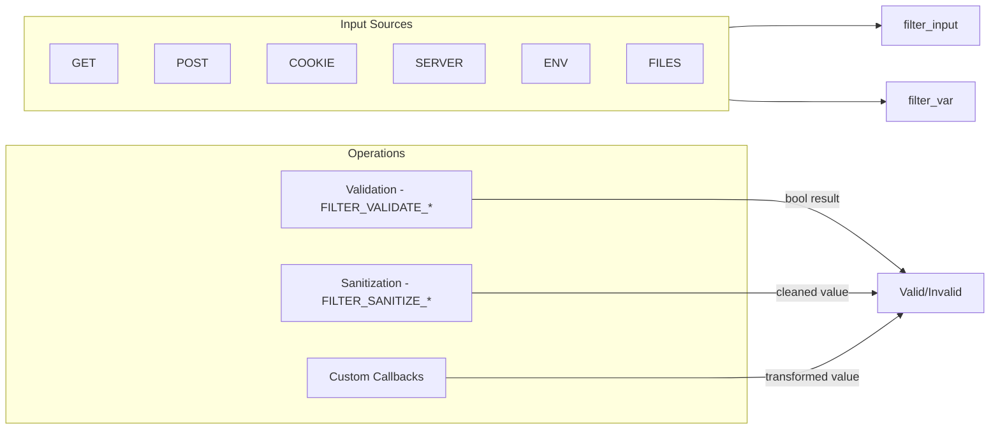

# Data Filtering — The Filter Extension

## Overview

The Filter extension provides a unified API for validating and sanitizing external data (user input, API requests, file contents). It eliminates the need for manual regex-based validation for common data types and reduces injection vulnerabilities through strict type coercion and sanitation.



## Core Functions

### `filter_var()`

Validates or sanitizes a single value.

```php
<?php
declare(strict_types=1);

// syntax
// filter_var(mixed $value, int $filter = FILTER_DEFAULT, array|int $options = 0): mixed

// Validation returns the validated value or false
$email = filter_var('user@example.com', FILTER_VALIDATE_EMAIL);
if ($email === false) {
    echo 'Invalid email';
} else {
    echo "Valid: $email"; // Valid: user@example.com
}

// Sanitization returns the cleaned value
$sanitized = filter_var("<script>alert('xss')</script>", FILTER_SANITIZE_STRING);
// Note: FILTER_SANITIZE_STRING is DEPRECATED in PHP 8.1+, use htmlspecialchars() instead
```

### `filter_var_array()`

Validates or sanitizes multiple values at once.

```php
<?php
declare(strict_types=1);

$data = [
    'email' => 'user@example.com',
    'age' => '25',
    'website' => 'https://example.com',
];

$definitions = [
    'email'   => FILTER_VALIDATE_EMAIL,
    'age'     => ['filter' => FILTER_VALIDATE_INT, 'options' => ['min_range' => 1, 'max_range' => 150]],
    'website' => FILTER_VALIDATE_URL,
];

$result = filter_var_array($data, $definitions);
// ['email' => 'user@example.com', 'age' => 25, 'website' => 'https://example.com']

// Add missing keys (when some inputs aren't provided)
$result = filter_var_array($data, $definitions, false); // false = no add_empty
```

### `filter_input()` & `filter_input_array()`

Fetch and filter external input in one step.

```php
<?php
declare(strict_types=1);

// Single input from GET
$id = filter_input(INPUT_GET, 'id', FILTER_VALIDATE_INT, [
    'options' => ['min_range' => 1, 'max_range' => 10000],
]);

// Single input from POST
$email = filter_input(INPUT_POST, 'email', FILTER_VALIDATE_EMAIL);

// Multiple inputs from different sources
$definitions = [
    'username' => FILTER_SANITIZE_SPECIAL_CHARS,
    'email'    => FILTER_VALIDATE_EMAIL,
    'age'      => [
        'filter'  => FILTER_VALIDATE_INT,
        'flags'   => FILTER_REQUIRE_SCALAR,
        'options' => ['min_range' => 13, 'max_range' => 120],
    ],
    'bio'      => [
        'filter'  => FILTER_CALLBACK,
        'options' => function (string $value): string {
            return strip_tags(substr($value, 0, 500));
        },
    ],
];

$input = filter_input_array(INPUT_POST, $definitions);

// Input sources available
// INPUT_GET, INPUT_POST, INPUT_COOKIE, INPUT_SERVER, INPUT_ENV, INPUT_REQUEST (PHP 8.3+)
```

## Validation Filters (`FILTER_VALIDATE_*`)

These return either the validated value (with proper type) or `false` on failure.

| Filter | Description | Flags / Options |
|--------|-------------|-----------------|
| `FILTER_VALIDATE_BOOLEAN` | Boolean value (`"1"`, `"true"`, `"on"`, `"yes"` = true) | `FILTER_NULL_ON_FAILURE` returns `null` instead of `false` |
| `FILTER_VALIDATE_DOMAIN` | Domain name (since PHP 7.0) | `FILTER_FLAG_HOSTNAME` — strict RFC 952/1123 |
| `FILTER_VALIDATE_EMAIL` | Email address (RFC 5321/5322) | No flags |
| `FILTER_VALIDATE_FLOAT` | Float with optional decimal/thousands | `FILTER_FLAG_ALLOW_THOUSAND`, `FILTER_FLAG_ALLOW_SCIENTIFIC` |
| `FILTER_VALIDATE_INT` | Integer in an optional range | `min_range`, `max_range` as options |
| `FILTER_VALIDATE_IP` | IPv4 or IPv6 address | `FILTER_FLAG_IPV4`, `FILTER_FLAG_IPV6`, `FILTER_FLAG_NO_PRIV_RANGE`, `FILTER_FLAG_NO_RES_RANGE` |
| `FILTER_VALIDATE_MAC` | MAC address | No flags |
| `FILTER_VALIDATE_REGEXP` | Regex validation | `regexp` — **required** option with valid pattern |
| `FILTER_VALIDATE_URL` | URL with optional scheme checks | `FILTER_FLAG_SCHEME_REQUIRED`, `FILTER_FLAG_HOST_REQUIRED`, `FILTER_FLAG_PATH_REQUIRED`, `FILTER_FLAG_QUERY_REQUIRED` |

### Validation Examples

```php
<?php
declare(strict_types=1);

// Boolean — handles string representations
var_dump(filter_var('yes', FILTER_VALIDATE_BOOLEAN));       // bool(true)
var_dump(filter_var('1', FILTER_VALIDATE_BOOLEAN));         // bool(true)
var_dump(filter_var('true', FILTER_VALIDATE_BOOLEAN));      // bool(true)
var_dump(filter_var('on', FILTER_VALIDATE_BOOLEAN));        // bool(true)
var_dump(filter_var('no', FILTER_VALIDATE_BOOLEAN));        // bool(false)
var_dump(filter_var('maybe', FILTER_VALIDATE_BOOLEAN));     // bool(false)

// Integer with range constraints
$age = filter_var('25', FILTER_VALIDATE_INT, [
    'options' => ['min_range' => 1, 'max_range' => 150],
]);
// Returns 25 (int) or false if out of range

// Float with thousands separator
$salary = filter_var('1,234.56', FILTER_VALIDATE_FLOAT, [
    'flags' => FILTER_FLAG_ALLOW_THOUSAND,
]);
// Returns 1234.56 (float)

// Email
$email = filter_var('test@example.com', FILTER_VALIDATE_EMAIL);
// Returns 'test@example.com' (string) or false

// IP address
$ip = filter_var('192.168.1.1', FILTER_VALIDATE_IP, [
    'flags' => FILTER_FLAG_IPV4 | FILTER_FLAG_NO_PRIV_RANGE,
]);
// false — private range rejected

// URL with scheme requirement
$url = filter_var('https://example.com/path?q=1', FILTER_VALIDATE_URL, [
    'flags' => FILTER_FLAG_SCHEME_REQUIRED | FILTER_FLAG_HOST_REQUIRED,
]);
// Returns the URL (string) or false

// Domain
$domain = filter_var('example.com', FILTER_VALIDATE_DOMAIN, [
    'flags' => FILTER_FLAG_HOSTNAME,
]);
// Returns 'example.com' (string) or false

// Regex validation
$alphanumeric = filter_var('abc123', FILTER_VALIDATE_REGEXP, [
    'options' => ['regexp' => '/^[a-zA-Z0-9]+$/'],
]);
// Returns 'abc123' or false
```

## Sanitization Filters (`FILTER_SANITIZE_*`)

These strip or encode invalid characters from the value.

| Filter | Description | Flags |
|--------|-------------|-------|
| `FILTER_SANITIZE_EMAIL` | Remove all chars except `a-zA-Z0-9!#$%&'*+-/=?^_`{|}~@.[]` | — |
| `FILTER_SANITIZE_ENCODED` | URL-encode (`rawurlencode`) | `FILTER_FLAG_STRIP_LOW`, `FILTER_FLAG_STRIP_HIGH`, `FILTER_FLAG_ENCODE_HIGH` |
| `FILTER_SANITIZE_FULL_SPECIAL_CHARS` | Encode HTML entities (like `htmlspecialchars()` with ENT_QUOTES) | `FILTER_FLAG_NO_ENCODE_QUOTES` |
| `FILTER_SANITIZE_NUMBER_FLOAT` | Strip non-numeric float characters | `FILTER_FLAG_ALLOW_FRACTION`, `FILTER_FLAG_ALLOW_THOUSAND`, `FILTER_FLAG_ALLOW_SCIENTIFIC` |
| `FILTER_SANITIZE_NUMBER_INT` | Strip all non-digit characters (+/- allowed) | — |
| `FILTER_SANITIZE_SPECIAL_CHARS` | HTML-encode special chars (`htmlspecialchars()`) | `FILTER_FLAG_STRIP_LOW`, `FILTER_FLAG_STRIP_HIGH`, `FILTER_FLAG_ENCODE_HIGH` |
| `FILTER_SANITIZE_URL` | Remove all chars except `a-zA-Z0-9$-_.+!*'(),{}|\\^~[]`<>#%";/?:@&=` | — |
| `FILTER_SANITIZE_ADD_SLASHES` | Add slashes (deprecated, use `addslashes()`) | — |
| `FILTER_UNSAFE_RAW` | Apply flag modifiers (strip/encode low/high) without other filtering | — |
| `FILTER_SANITIZE_STRING` | **DEPRECATED in PHP 8.1** — use `htmlspecialchars()` | — |
| `FILTER_SANITIZE_STRIPPED` | **DEPRECATED** — alias of SANITIZE_STRING | — |
| `FILTER_SANITIZE_MAGIC_QUOTES` | **REMOVED in PHP 8.0** | — |

### Sanitization Examples

```php
<?php
declare(strict_types=1);

// Email sanitization
$email = filter_var(" user@exa<mple.com ", FILTER_SANITIZE_EMAIL);
// 'user@example.com' (strips spaces and <, >)

// Integer sanitization
$id = filter_var("123abc456def", FILTER_SANITIZE_NUMBER_INT);
// '123456'

// Float sanitization
$price = filter_var("$1,234.56", FILTER_SANITIZE_NUMBER_FLOAT, [
    'flags' => FILTER_FLAG_ALLOW_FRACTION | FILTER_FLAG_ALLOW_THOUSAND,
]);
// '1234.56'

// URL sanitization
$url = filter_var("https://example.com/path with spaces?q=1", FILTER_SANITIZE_URL);
// 'https://example.com/pathwithspaces?q=1'

// Full special chars encoding (XSS-safe display)
$comment = filter_var(
    "<script>alert('xss')</script>",
    FILTER_SANITIZE_FULL_SPECIAL_CHARS
);
// '&lt;script&gt;alert(&#039;xss&#039;)&lt;/script&gt;'

// Strip low characters (control chars)
$text = filter_var("Hello\x00World\x1F", FILTER_SANITIZE_SPECIAL_CHARS, [
    'flags' => FILTER_FLAG_STRIP_LOW,
]);
```

## Custom Callbacks (`FILTER_CALLBACK`)

Apply arbitrary transformation or validation via a `callable`.

```php
<?php
declare(strict_types=1);

// Sanitization callback — slugify a string
$slug = filter_var('Hello World! 2024', FILTER_CALLBACK, [
    'options' => function (string $value): string {
        return strtolower(preg_replace('/[^a-z0-9]+/', '-', $value));
    },
]);
// 'hello-world-2024'

// Validation callback — check custom business logic
$productCode = filter_var('PRD-1234-XYZ', FILTER_CALLBACK, [
    'options' => function (string $value): string|false {
        if (!preg_match('/^PRD-\d{4}-[A-Z]{3}$/', $value)) {
            return false; // invalid
        }
        [$prefix, $num, $suffix] = explode('-', $value);
        return sprintf('%s-%04d-%s', $prefix, (int)$num, $suffix);
    },
]);
// Returns normalized code or false

// Type coercion via callback
$userId = filter_var('42', FILTER_CALLBACK, [
    'options' => fn(mixed $v): int => (int)$v,
]);
// int(42)

// Multi-step pipeline
$transform = filter_var(
    '  User@Example.COM  ',
    FILTER_CALLBACK,
    ['options' => function (string $v): string {
        return strtolower(trim(filter_var($v, FILTER_SANITIZE_EMAIL)));
    }]
);
// 'user@example.com'
```

## Validation vs Sanitization — When to Use What

### Rule of Thumb

| Use Case | Approach |
|----------|----------|
| User registration (email, password) | Validate only — reject invalid |
| Blog comments (HTML-stripped display) | Sanitize — keep what's safe |
| Database queries (IDs, integers) | Validate as int — reject non-numeric |
| Search queries (free text) | Sanitize — strip control chars |
| File upload names | Sanitize — remove path chars |
| API endpoint params | Validate strictly — 400 on failure |
| Display output in HTML | Sanitize with `FILTER_SANITIZE_FULL_SPECIAL_CHARS` |

## Security Patterns

### Input Validation Pipeline

```php
<?php
declare(strict_types=1);

class InputValidator {
    /** @var array<string, mixed> Cleaned and validated input */
    private array $data = [];
    /** @var array<string, string[]> Validation errors */
    private array $errors = [];
    
    public function __construct(array $source) {
        $this->data = $source;
    }
    
    public function int(string $key, int $min = null, int $max = null): self {
        $value = $this->data[$key] ?? null;
        $options = [];
        if ($min !== null) $options['min_range'] = $min;
        if ($max !== null) $options['max_range'] = $max;
        
        $filtered = filter_var($value, FILTER_VALIDATE_INT, ['options' => $options]);
        if ($filtered === false) {
            $this->errors[$key][] = "Must be a valid integer" 
                . ($min !== null ? " (min: $min)" : "")
                . ($max !== null ? " (max: $max)" : "");
        }
        $this->data[$key] = $filtered;
        return $this;
    }
    
    public function email(string $key): self {
        $value = $this->data[$key] ?? null;
        $filtered = filter_var($value, FILTER_VALIDATE_EMAIL);
        if ($filtered === false) {
            $this->errors[$key][] = 'Must be a valid email address';
        }
        $this->data[$key] = $filtered;
        return $this;
    }
    
    public function string(string $key, int $maxLength = null): self {
        $value = (string)($this->data[$key] ?? '');
        $filtered = filter_var($value, FILTER_SANITIZE_FULL_SPECIAL_CHARS);
        if ($maxLength !== null && strlen($filtered) > $maxLength) {
            $this->errors[$key][] = "Must be at most $maxLength characters";
        }
        $this->data[$key] = $filtered;
        return $this;
    }
    
    public function url(string $key, bool $requireScheme = true): self {
        $value = $this->data[$key] ?? null;
        $flags = $requireScheme ? FILTER_FLAG_SCHEME_REQUIRED | FILTER_FLAG_HOST_REQUIRED : 0;
        $filtered = filter_var($value, FILTER_VALIDATE_URL, ['flags' => $flags]);
        if ($filtered === false) {
            $this->errors[$key][] = 'Must be a valid URL';
        }
        $this->data[$key] = $filtered;
        return $this;
    }
    
    public function validate(): array {
        if (!empty($this->errors)) {
            throw new \RuntimeException(json_encode($this->errors));
        }
        return $this->data;
    }
    
    public function errors(): array {
        return $this->errors;
    }
}

// Usage
$input = new InputValidator($_POST);
try {
    $clean = $input
        ->int('user_id', 1)
        ->email('email')
        ->string('name', 100)
        ->url('website')
        ->validate();
} catch (\RuntimeException $e) {
    http_response_code(422);
    echo $e->getMessage();
}
```

### Comprehensive Request Validation

```php
<?php
declare(strict_types=1);

// API endpoint input: POST /api/users
$input = filter_input_array(INPUT_POST, [
    'username' => [
        'filter' => FILTER_CALLBACK,
        'options' => function (string $v): string|false {
            $v = trim($v);
            if (strlen($v) < 3 || strlen($v) > 30) return false;
            if (!preg_match('/^[a-zA-Z][a-zA-Z0-9_]+$/', $v)) return false;
            return $v;
        },
    ],
    'email' => FILTER_VALIDATE_EMAIL,
    'password' => [
        'filter' => FILTER_CALLBACK,
        'options' => function (string $v): string|false {
            if (strlen($v) < 8) return false;
            if (!preg_match('/[A-Z]/', $v)) return false;
            if (!preg_match('/[a-z]/', $v)) return false;
            if (!preg_match('/[0-9]/', $v)) return false;
            return $v;
        },
    ],
    'age' => [
        'filter' => FILTER_VALIDATE_INT,
        'options' => ['min_range' => 13, 'max_range' => 150],
    ],
    'terms_accepted' => FILTER_VALIDATE_BOOLEAN,
]);

$errors = [];
foreach (['username', 'email', 'password', 'age', 'terms_accepted'] as $field) {
    if ($input[$field] === false || $input[$field] === null) {
        $errors[$field] = 'Invalid value';
    }
}
if (!empty($errors)) {
    http_response_code(400);
    echo json_encode(['errors' => $errors]);
    exit;
}
```

## Common Pitfalls

1. **`false` vs failure** — `FILTER_VALIDATE_*` returns `false` on failure. Use `=== false` check, not `is_null()` or implicit falsiness.
2. **`filter_var(0, FILTER_VALIDATE_INT)` returns `0`** — falsy but valid integer.
3. **`FILTER_VALIDATE_BOOLEAN` returns `false` for both invalid input and legitimate `false`** — Use `FILTER_NULL_ON_FAILURE` flag to distinguish: `null` = invalid, `false` = valid false.
4. **`FILTER_SANITIZE_STRING` deprecated in PHP 8.1** — Removed in PHP 9.0. Use `htmlspecialchars()`, `strip_tags()`, or `FILTER_SANITIZE_FULL_SPECIAL_CHARS`.
5. **Email validation is not RFC-complete** — `FILTER_VALIDATE_EMAIL` allows many technically invalid addresses. For production, use `egulias/email-validator` or `symfony/validator`.
6. **`filter_input()` returns null for missing keys** — Distinguish: `null` = key not present, `false` = validation failed.
7. **`FILTER_SANITIZE_URL` is not a validator** — Only removes invalid URL chars. Always pair with `FILTER_VALIDATE_URL`.
8. **Callback filters with `FILTER_FORCE_ARRAY`** — When using `FILTER_REQUIRE_ARRAY` flag with callbacks, the callback receives the entire array.

## References

- [PHP: Data Filtering](https://www.php.net/manual/en/book.filter.php)
- [PHP: Filter Types](https://www.php.net/manual/en/filter.filters.php)
- [PHP: filter_var](https://www.php.net/manual/en/function.filter-var.php)
- [PHP: filter_input](https://www.php.net/manual/en/function.filter-input.php)
- [PHP: Sanitization Filters](https://www.php.net/manual/en/filter.filters.sanitize.php)