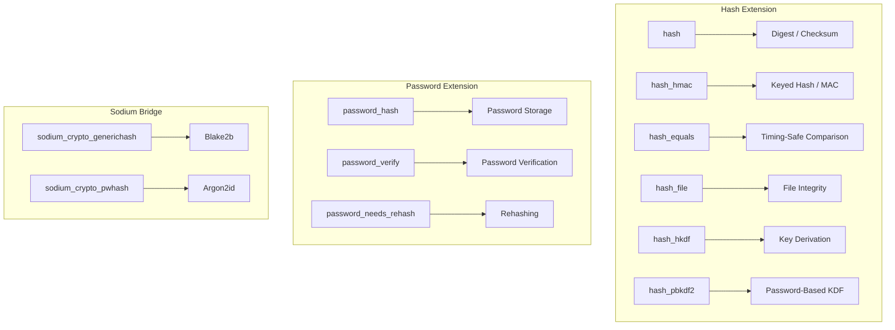

# HASH Framework — Full Reference

## Overview

PHP's Hash extension provides a unified interface for message digest (hash) computation, HMAC generation, keyed hashing, and timing-safe comparison. Combined with the `password_*` API, it covers virtually all server-side hashing needs — from checksums and integrity verification to password storage and cryptographic authentication.



## Core Hash Functions

### `hash()`

```php
<?php
declare(strict_types=1);

// Compute a hash of a string
$hash = hash('sha256', 'data to hash');
// '3a6eb0790f39ac87c94f3856b2dd2c5d110e6811602261a9a923d3bb23adc8b7'

// Binary output
$binary = hash('sha256', 'data', binary: true);  // PHP 8.4 named arg

// Hex output (default)
$hex = hash('sha256', 'data', binary: false);

// Algorithm detection
$algorithms = hash_algos();  // List all registered algorithms
```

### `hash_hmac()`

Hash-based Message Authentication Code — ensures both integrity and authenticity.

```php
<?php
declare(strict_types=1);

// Basic HMAC
$signature = hash_hmac('sha256', 'message', 'secret-key');
$expected = hash_hmac('sha256', 'message', 'secret-key');
$valid = hash_equals($expected, $signature);
```

### `hash_equals()` — Timing-Safe String Comparison

```php
<?php
declare(strict_types=1);

// ⚠️ NEVER use === for comparing hashes, MACs, or signatures
// Constant-time comparison prevents timing attacks

// Correct:
$valid = hash_equals($expectedHash, $userProvidedHash);

// WRONG (timing vulnerable):
// $valid = $expectedHash === $userProvidedHash;
```

### `hash_file()` & `hash_hmac_file()`

```php
<?php
declare(strict_types=1);

// File integrity check
$hash = hash_file('sha256', '/path/to/file.zip');

// Stream-based (for large files without loading into memory)
$ctx = hash_init('sha256');
hash_update_stream($ctx, fopen('/path/to/large-file', 'rb'));
$hash = hash_final($ctx);
```

## Password Hashing API

### `password_hash()`

```php
<?php
declare(strict_types=1);

// Default algorithm (currently bcrypt)
$hash = password_hash('user-password', PASSWORD_DEFAULT);

// Explicit bcrypt
$hash = password_hash('user-password', PASSWORD_BCRYPT, ['cost' => 12]);

// Argon2id (PHP 8.1+ default, most secure)
$hash = password_hash('user-password', PASSWORD_ARGON2ID, [
    'memory_cost' => 65536,
    'time_cost'   => 4,
    'threads'     => 3,
]);
```

### `password_verify()` & `password_needs_rehash()`

```php
<?php
declare(strict_types=1);

// Verify — always constant-time
if (password_verify($userInput, $storedHash)) {
    echo "Password correct";
}

// Check if hash needs upgrading
if (password_needs_rehash($storedHash, PASSWORD_ARGON2ID, [
    'memory_cost' => 65536, 'time_cost' => 4,
])) {
    $newHash = password_hash($userInput, PASSWORD_ARGON2ID, [
        'memory_cost' => 65536, 'time_cost' => 4,
    ]);
}
```

### Algorithm Selection Guide

| Algorithm | Output Size | Use Case |
|-----------|-------------|----------|
| `sha256` | 256 bits | General-purpose, TLS certificates |
| `sha384` | 384 bits | FIPS 140-2 compliance |
| `sha512` | 512 bits | High-security, longer output needed |
| `sha3-256` | 256 bits | Post-quantum readiness |
| `blake2b` | 512 bits | High performance, file integrity |
| `blake2s` | 256 bits | Embedded/32-bit systems |
| `md5` | 128 bits | ❌ **Never use** — collision broken |
| `sha1` | 160 bits | ❌ **Avoid** — SHAttered collision demo |

## Key Derivation Functions

### `hash_hkdf()` (PHP 7.1.2+)

HMAC-based Extract-and-Expand Key Derivation Function (RFC 5869).

```php
<?php
declare(strict_types=1);

$inputKey = random_bytes(32);
$salt = random_bytes(16);
$info = 'encryption-key-v1';

$derivedKey = hash_hkdf('sha256', $inputKey, 32, $info, $salt);

// Multiple derived keys from same input
$encKey = hash_hkdf('sha256', $inputKey, 32, 'encryption', $salt);
$authKey = hash_hkdf('sha256', $inputKey, 32, 'authentication', $salt);
```

## Performance Benchmarks

| Algorithm | ops/sec |
|-----------|---------|
| MD5 (unsafe) | ~5,000,000 |
| SHA1 (unsafe) | ~4,500,000 |
| SHA256 | ~2,000,000 |
| BLAKE2b (64 bytes) | ~3,500,000 |
| SHA3-256 | ~1,200,000 |
| bcrypt (cost 12) | ~200 |
| Argon2id (default) | ~100 |

## Common Pitfalls

1. **Timing attacks with `===`** — Always use `hash_equals()`.
2. **`PASSWORD_DEFAULT` could change** — Use explicit algorithm (`PASSWORD_BCRYPT` or `PASSWORD_ARGON2ID`).
3. **`password_verify()` needs the full hash** — Store the full output (60–96 characters).
4. **BCrypt truncates passwords >72 bytes** — Pre-hash with SHA256 if users may use long passwords.
5. **MD5/SHA1 for security** — Both have practical collision attacks.

## References

- [PHP: Hash Framework](https://www.php.net/manual/en/book.hash.php)
- [PHP: password_hash](https://www.php.net/manual/en/function.password-hash.php)
- [PHP: hash_equals](https://www.php.net/manual/en/function.hash-equals.php)
- [PHP: hash_hkdf](https://www.php.net/manual/en/function.hash-hkdf.php)
- [RFC 5869: HKDF](https://datatracker.ietf.org/doc/html/rfc5869)