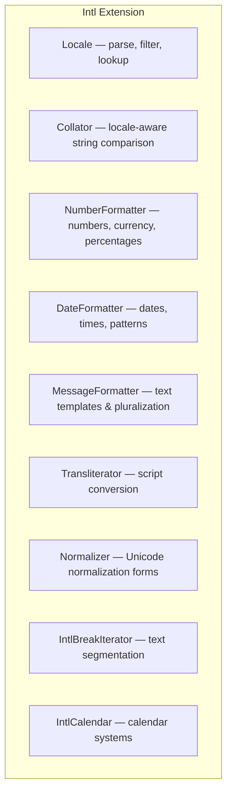

# Intl — Internationalization Extension

## Overview

The Intl extension provides a comprehensive set of internationalization tools built on top of the ICU (International Components for Unicode) library. It handles locale-aware string comparison, number/currency formatting, date/time formatting, message translation, transliteration, and Unicode normalization. Intl is essential for building applications that support multiple languages, cultures, and locales.



## Locale

### Working with Locales

```php
<?php
declare(strict_types=1);

// Get default locale
$default = Locale::getDefault();
echo $default;  // e.g., 'en_US_POSIX'

// Set default locale
Locale::setDefault('fr_FR');

// Parse locale string
$parts = Locale::parseLocale('zh_Hans_CN');
// [
//     'language' => 'zh',
//     'script' => 'Hans',
//     'region' => 'CN',
// ]

// Get canonical form
$canonical = Locale::canonicalize('en_US');
// 'en_US'

// Composed locales
// Format: language[_script][_region][_variant]
// Examples:
// 'en'             — English
// 'en_US'          — English (United States)
// 'en_GB'          — English (United Kingdom)
// 'zh_Hans_CN'    — Chinese, Simplified script (China)
// 'ar_AE'          — Arabic (UAE)
// 'de_DE'          — German (Germany)
// 'fr_FR'          — French (France)
// 'ja_JP'          — Japanese (Japan)

// Find best matching locale from a list
$available = ['en_US', 'fr_FR', 'de_DE'];
$best = Locale::lookup($available, 'en_GB', false, 'en_US');
// 'en_US'

// Filter locales by region
$candidates = ['de_DE', 'de_AT', 'de_CH'];
$german = Locale::filterMatches('de', $candidates);
```

## Collator (String Comparison)

### Locale-Aware Sorting

```php
<?php
declare(strict_types=1);

// Create collator for a locale
$collator = new Collator('de_DE');

// Compare strings
$result = $collator->compare('ä', 'z');
// Returns:
// -1: first < second
//  0: equal
//  1: first > second

// Sorting an array
$words = ['Österreich', 'Ägypten', 'Zürich', 'Andorra'];
$collator->sort($words);
// ['Ägypten', 'Andorra', 'Österreich', 'Zürich']
// (German phonebook order)

// Sorting with keys
$fruits = ['Apfel' => 'apple', 'Äpfel' => 'apples', 'Birne' => 'pear'];
$collator->asort($fruits);  // Maintain key-value association

// Different collation strengths
$collator->setStrength(Collator::PRIMARY);
// Only base letters differ: 'a' == 'A' == 'ä'
$collator->setStrength(Collator::SECONDARY);
// Accent-sensitive: 'a' == 'A' but != 'ä'
$collator->setStrength(Collator::TERTIARY);
// Case-sensitive (default): 'a' != 'A' != 'ä'
$collator->setStrength(Collator::IDENTICAL);
// Strict comparison: all differences matter

// Get sort key (binary representation for database indexing)
$key = $collator->getSortKey('Ägypten');
// Store $key in DB for indexed locale-aware sorting

// Case and accent handling
$collator->setAttribute(Collator::CASE_FIRST, Collator::ON);
$collator->setAttribute(Collator::CASE_LEVEL, Collator::ON);

// Numeric sorting
$numbers = ['img2', 'img10', 'img1', 'img20'];
$collator->setAttribute(Collator::NUMERIC_COLLATION, Collator::ON);
$collator->sort($numbers);
// ['img1', 'img2', 'img10', 'img20']
```

## NumberFormatter

### Number, Currency, and Percentage Formatting

```php
<?php
declare(strict_types=1);

// Create formatter
$fmt = new NumberFormatter('en_US', NumberFormatter::DECIMAL);
echo $fmt->format(1234567.89);
// '1,234,567.89'

// German format
$de = new NumberFormatter('de_DE', NumberFormatter::DECIMAL);
echo $de->format(1234567.89);
// '1.234.567,89'

// Currency
$usd = new NumberFormatter('en_US', NumberFormatter::CURRENCY);
echo $usd->formatCurrency(1234.56, 'USD');
// '$1,234.56'

$eur = new NumberFormatter('de_DE', NumberFormatter::CURRENCY);
echo $eur->formatCurrency(1234.56, 'EUR');
// '1.234,56 €'

$jpy = new NumberFormatter('ja_JP', NumberFormatter::CURRENCY);
echo $jpy->formatCurrency(1234, 'JPY');
// '￥1,234' (note: no decimals for JPY)

// Percentage
$pct = new NumberFormatter('en_US', NumberFormatter::PERCENT);
echo $pct->format(0.25);
// '25%'

// Scientific notation
$sci = new NumberFormatter('en_US', NumberFormatter::SCIENTIFIC);
echo $sci->format(12345);
// '1.2345E4'

// Ordinal
$ord = new NumberFormatter('en_US', NumberFormatter::ORDINAL);
echo $ord->format(42);
// '42nd'
echo $ord->format(21);
// '21st'

// Spellout (number as words)
$spell = new NumberFormatter('en_US', NumberFormatter::SPELLOUT);
echo $spell->format(1234);
// 'one thousand two hundred thirty-four'

$spellFR = new NumberFormatter('fr_FR', NumberFormatter::SPELLOUT);
echo $spellFR->format(1234);
// 'mille deux cent trente-quatre'

// Duration
$dur = new NumberFormatter('en_US', NumberFormatter::DURATION);
echo $dur->format(3600 + 30*60 + 15);  // 5415 seconds
// '1:30:15'

// Custom pattern
$pattern = new NumberFormatter('en_US', NumberFormatter::PATTERN_DECIMAL, '#,##0.00;(#,##0.00)');
echo $pattern->format(-1234.56);
// '(1,234.56)'

// Parsing
$fmt = new NumberFormatter('de_DE', NumberFormatter::DECIMAL);
$parsed = $fmt->parse('1.234,56');
echo $parsed;  // 1234.56 (float)

// Parsing currency
$parsedCurrency = $usd->parseCurrency('$1,234.56', $currency);
echo $parsedCurrency;  // 1234.56
echo $currency;        // 'USD'

// Text attributes
$fmt->setTextAttribute(NumberFormatter::NEGATIVE_PREFIX, 'minus ');
$fmt->setTextAttribute(NumberFormatter::POSITIVE_PREFIX, 'plus ');

// Symbol customization
$fmt->setSymbol(NumberFormatter::DECIMAL_SEPARATOR_SYMBOL, ',');
$fmt->setSymbol(NumberFormatter::GROUPING_SEPARATOR_SYMBOL, '.');
```

## DateFormatter (IntlDateFormatter)

### Locale-Aware Date/Time Formatting

```php
<?php
declare(strict_types=1);

// Create date formatter
$fmt = new IntlDateFormatter(
    'en_US',                                    // Locale
    IntlDateFormatter::MEDIUM,                  // Date type
    IntlDateFormatter::SHORT,                   // Time type
    'America/New_York',                         // Timezone
    IntlDateFormatter::GREGORIAN,               // Calendar
    'yyyy-MM-dd HH:mm:ss'                       // Pattern (optional)
);

$now = new DateTime();

// Format DateTime object
echo $fmt->format($now);
// '2024-12-25 15:30:00'

// Format timestamp
echo $fmt->format(time());

// Predefined format types
// Date types:
// NONE   — omit date
// SHORT  — 12/25/24
// MEDIUM — Dec 25, 2024
// LONG   — December 25, 2024
// FULL   — Wednesday, December 25, 2024

// Time types:
// SHORT  — 3:30 PM
// MEDIUM — 3:30:00 PM
// LONG   — 3:30:00 PM EST
// FULL   — 3:30:00 PM Eastern Standard Time

// Examples with different locales
$locales = ['en_US', 'de_DE', 'fr_FR', 'ja_JP', 'ar_AE'];

foreach ($locales as $locale) {
    $fmt = new IntlDateFormatter(
        $locale,
        IntlDateFormatter::FULL,
        IntlDateFormatter::MEDIUM
    );
    echo "$locale: " . $fmt->format($now) . "\n";
}
// en_US: Wednesday, December 25, 2024 at 3:30:00 PM EST
// de_DE: Mittwoch, 25. Dezember 2024 um 15:30:00 MEZ
// fr_FR: mercredi 25 décembre 2024 à 15:30:00 UTC−5
// ja_JP: 2024年12月25日水曜日 15時30分00秒 東部標準時

// Pattern-based formatting
$fmt = new IntlDateFormatter(
    'en_US',
    IntlDateFormatter::NONE,
    IntlDateFormatter::NONE,
    null,
    null,
    "EEEE, MMMM d 'at' h:mm a"
);
echo $fmt->format($now);
// 'Wednesday, December 25 at 3:30 PM'

// Parsing
$fmt = new IntlDateFormatter(
    'en_US',
    IntlDateFormatter::MEDIUM,
    IntlDateFormatter::SHORT
);
$parsed = $fmt->parse('Dec 25, 2024, 3:30 PM');
// Returns Unix timestamp (int|float|false)

// Date format pattern symbols
// yyyy — 4-digit year
// yy   — 2-digit year
// MMMM — Full month name
// MMM  — Abbreviated month
// MM   — Zero-padded month
// dd   — Zero-padded day
// EEEE — Full weekday name
// E    — Abbreviated weekday
// HH   — 24-hour (00-23)
// hh   — 12-hour (01-12)
// mm   — Minutes
// ss   — Seconds
// a    — AM/PM
// zzzz — Full timezone name
// z    — Short timezone
```

## MessageFormatter

### ICU Message Format for Translation

```php
<?php
declare(strict_types=1);

// Simple message with placeholders
$fmt = new MessageFormatter('en_US', '{0} has {1} messages');
echo $fmt->format(['Alice', 5]);
// 'Alice has 5 messages'

// Plural rules (ICU pluralization — handles all languages)
$fmt = new MessageFormatter('en_US', <<<MSG
{0} has {1,plural,
    =0 {no messages}
    =1 {one message}
    other {# messages}
}
MSG
);
echo $fmt->format(['Alice', 0]);  // 'Alice has no messages'
echo $fmt->format(['Alice', 1]);  // 'Alice has one message'
echo $fmt->format(['Alice', 5]);  // 'Alice has 5 messages'

// Plural with Russian (many grammatical plurals)
$ruFmt = new MessageFormatter('ru_RU', <<<MSG
У {0} {1,plural,
    =0 {нет сообщений}
    one {# сообщение}
    few {# сообщения}
    many {# сообщений}
    other {# сообщения}
}
MSG
);
echo $ruFmt->format(['Анна', 1]);  // 'У Анны 1 сообщение'
echo $ruFmt->format(['Анна', 2]);  // 'У Анны 2 сообщения'
echo $ruFmt->format(['Анна', 5]);  // 'У Анны 5 сообщений'

// Select (gender-based)
$fmt = new MessageFormatter('en_US', <<<MSG
{gender,select,
    male {He has}
    female {She has}
    other {They have}
} {count,plural,
    =0 {no books}
    =1 {one book}
    other {# books}
}.
MSG
);
echo $fmt->format(['gender' => 'male', 'count' => 2]);
// 'He has 2 books.'

echo $fmt->format(['gender' => 'female', 'count' => 1]);
// 'She has one book.'

// Named parameters
$fmt = new MessageFormatter('en_US', '{name} is {age} years old');
echo $fmt->format(['name' => 'Bob', 'age' => 30]);
// 'Bob is 30 years old'

// Parsing a formatted message back
$fmt = new MessageFormatter('en_US', '{0} has {1} messages');
$parsed = $fmt->parse('Alice has 5 messages');
// ['Alice', '5']
```

## Transliterator

### Script and Character Conversion

```php
<?php
declare(strict_types=1);

// Transliterate Latin to Cyrillic (approximate)
$trans = Transliterator::create('Latin-Cyrillic');
echo $trans->transliterate('Hello World');
// 'Хелло Ворлд'

// Remove accents
$noAccents = Transliterator::create('NFD; [:Nonspacing Mark:] Remove; NFC');
echo $noAccents->transliterate('Crème brûlée');
// 'Creme brulee'

// Romanize CJK
$roman = Transliterator::create('Any-Latin; Latin-ASCII');
echo $roman->transliterate('日本語');
// 'nihongo' (or 'ri-ben-yu' depending on ICU version)

// Case folding
$fold = Transliterator::create('Any-Lower');
echo $fold->transliterate('Hello World');  // 'hello world'

// Multiple transforms chained
$multi = Transliterator::create('Any-Latin; Latin-ASCII; Lower');
echo $multi->transliterate('Beyoncé');
// 'beyonce'

// Available transform IDs (thousands available)
// 'Any-Latin' — All scripts to Latin
// 'Latin-ASCII' — Latin with diacritics to ASCII
// 'Any-Accents' — or specific accent transforms
// 'Full/Halfwidth' — Fullwidth/Halfwidth forms
// 'Katakana-Latin' — Japanese to Latin
// 'Cyrillic-Latin' — Cyrillic to Latin
// 'Greek-Latin' — Greek to Latin
// 'Arabic-Latin' — Arabic to Latin

// Get all available transforms
$ids = Transliterator::listIDs();
```

## Normalizer

### Unicode Normalization Forms

```php
<?php
declare(strict_types=1);

// NFD — Canonical Decomposition
$nfd = Normalizer::normalize('Café', Normalizer::NFD);
// 'Cafe' + combining acute accent on e
// Useful for accent-insensitive search

// NFC — Canonical Decomposition followed by Canonical Composition (default)
$nfc = Normalizer::normalize('Café', Normalizer::NFC);
// 'Café' (single é code point)

// NFKD — Compatibility Decomposition
$nfkd = Normalizer::normalize('fi', Normalizer::NFKD);
// 'fi' (ligature broken into two letters)
// Useful for searching and indexing

// NFKC — Compatibility Decomposition + Composition
$nfkc = Normalizer::normalize('ℌ', Normalizer::NFKC);
// 'H' (black-letter capital H → regular H)

// Check normalization
$isNfc = Normalizer::isNormalized('Café', Normalizer::NFC);

// Compare Unicode strings (safe equality)
$a = Normalizer::normalize('Café', Normalizer::NFC);
$b = Normalizer::normalize('Café', Normalizer::NFD);
var_dump($a === $b);   // false — different byte sequences!
var_dump($a === Normalizer::normalize($b, Normalizer::NFC));  // true

// Best practice: always normalize to NFC for storage/comparison
function normalizeUnicode(string $input): string
{
    $result = Normalizer::normalize($input, Normalizer::NFC);
    return $result !== false ? $result : $input;
}
```

## IntlBreakIterator (Text Segmentation)

### Word, Sentence, and Line Boundaries

```php
<?php
declare(strict_types=1);

// Word break iteration
$text = 'Hello world. This is a test.';
$iterator = IntlBreakIterator::createWordInstance('en_US');
$iterator->setText($text);

$boundaries = [];
foreach ($iterator as $offset) {
    $boundaries[] = $offset;
}
// [0, 5, 6, 11, 12, 13, 15, 17, 18, 19, 20, 24, 25]
// Boundaries at each word start/end

// Word boundaries (useful for character count)
$wordIt = IntlBreakIterator::createWordInstance('en_US');
$wordIt->setText($text);

$previous = 0;
$words = [];
foreach ($wordIt as $offset) {
    $word = substr($text, $previous, $offset - $previous);
    $type = $wordIt->getRuleStatus();
    // IntlBreakIterator::WORD_NONE         — no word
    // IntlBreakIterator::WORD_NONE_LIMIT   — 
    // IntlBreakIterator::WORD_NUMBER       — numeric
    // IntlBreakIterator::WORD_LETTER       — alphabetic
    // IntlBreakIterator::WORD_KANA         — Japanese kana
    // IntlBreakIterator::WORD_IDEO         — CJK ideographs
    
    if ($type !== IntlBreakIterator::WORD_NONE) {
        $words[] = trim($word);
    }
    $previous = $offset;
}

// Sentence boundaries
$sentIt = IntlBreakIterator::createSentenceInstance('en_US');
$sentIt->setText('Dr. Smith went to Washington. He arrived at 3:00 P.M.');
foreach ($sentIt as $offset) {
    echo substr($text, 0, $offset) . "\n";
}

// Line break opportunities
$lineIt = IntlBreakIterator::createLineInstance('en_US');
$lineIt->setText('A very long text that needs line breaking...');

// Character boundaries (grapheme clusters)
$charIt = IntlBreakIterator::createCharacterInstance('en_US');
$charIt->setText('Café 🌍');
foreach ($charIt as $offset) {
    // Each grapheme cluster (emoji = 1 cluster)
}
```

## ICU Resource Bundles

### Loading ICU-Localized Data

```php
<?php
declare(strict_types=1);

// Load ICU data files for application-specific translations
// Requires compiled .res files
$bundle = new ResourceBundle('en_US', '/path/to/bundles');
echo $bundle->get('app_name');  // 'My App'

// Iterate over bundle
foreach ($bundle as $key => $value) {
    echo "$key: $value\n";
}

// Locale-sensitive error messages
$errors = new ResourceBundle('de_DE', '/path/to/errors');
echo $errors->get('file_not_found');  // 'Datei nicht gefunden'
```

## Best Practices & Patterns

### Locale-Aware Application Pattern

```php
<?php
declare(strict_types=1);

class InternationalizedApp
{
    private string $locale;
    private ?Collator $collator = null;
    private array $formatters = [];
    
    public function __construct(string $locale = 'en_US')
    {
        $this->locale = $locale;
        Locale::setDefault($locale);
    }
    
    public function getCollator(): Collator
    {
        if ($this->collator === null) {
            $this->collator = new Collator($this->locale);
        }
        return $this->collator;
    }
    
    public function formatCurrency(float $amount, string $currency = 'USD'): string
    {
        $key = "currency_$currency";
        if (!isset($this->formatters[$key])) {
            $this->formatters[$key] = new NumberFormatter(
                $this->locale,
                NumberFormatter::CURRENCY
            );
        }
        return $this->formatters[$key]->formatCurrency($amount, $currency);
    }
    
    public function formatDate(DateTime $date, int $dateType = IntlDateFormatter::MEDIUM): string
    {
        $key = "date_$dateType";
        if (!isset($this->formatters[$key])) {
            $this->formatters[$key] = new IntlDateFormatter(
                $this->locale,
                $dateType,
                IntlDateFormatter::NONE
            );
        }
        return $this->formatters[$key]->format($date);
    }
    
    public function sortArray(array &$items): bool
    {
        return $this->getCollator()->sort($items);
    }
    
    public function translate(string $message, array $params = []): string
    {
        // ICU MessageFormat
        $fmt = new MessageFormatter($this->locale, $message);
        return $fmt->format($params);
    }
}

// Usage
$app = new InternationalizedApp('de_DE');
echo $app->formatCurrency(1234.56, 'EUR');
// '1.234,56 €'
echo $app->formatDate(new DateTime());
// '25.12.2024'
$app->sortArray($names);  // Locale-aware sort
```

## Common Pitfalls

1. **Intl extension not installed** — Not enabled by default in some PHP distributions. Requires `ext-intl` package.
2. **ICU version mismatch** — PHP's Intl binds to a specific ICU version. Behavior differences exist between versions.
3. **`NumberFormatter::parse()` returns float** — Can lose precision for very large numbers. Use `parseCurrency()` for exact amounts.
4. **Memory usage** — Creating many `IntlDateFormatter`/`NumberFormatter` objects is expensive. Cache and reuse formatters.
5. **Collator::sort() modifies array in place** — Unlike `usort()`, it doesn't return a sorted copy.
6. **Normalizer::normalize() returns false on failure** — Always check with `=== false`.
7. **Timezone confusion** — `IntlDateFormatter` timezone must be a valid timezone string like `'America/New_York'`, not abbreviations like `'EST'`.
8. **ICU plural rules are language-specific** — Don't assume `plural` rules from English work in Russian (6 forms), Arabic (6 forms), or Chinese (no plural forms).
9. **MessageFormatter position vs named args** — Use named args (`{name}`) over positional (`{0}`) for translatable strings — translators reorder words.
10. **Performance of break iteration** — Creating break iterators has overhead. Reuse for multiple texts on the same locale.

## References

- [PHP: Intl](https://www.php.net/manual/en/book.intl.php)
- [PHP: Collator](https://www.php.net/manual/en/class.collator.php)
- [PHP: NumberFormatter](https://www.php.net/manual/en/class.numberformatter.php)
- [PHP: IntlDateFormatter](https://www.php.net/manual/en/class.intldateformatter.php)
- [PHP: MessageFormatter](https://www.php.net/manual/en/class.messageformatter.php)
- [ICU User Guide](https://unicode-org.github.io/icu/userguide/)
- [ICU Message Format](https://unicode-org.github.io/icu/userguide/format_parse/messages/)
