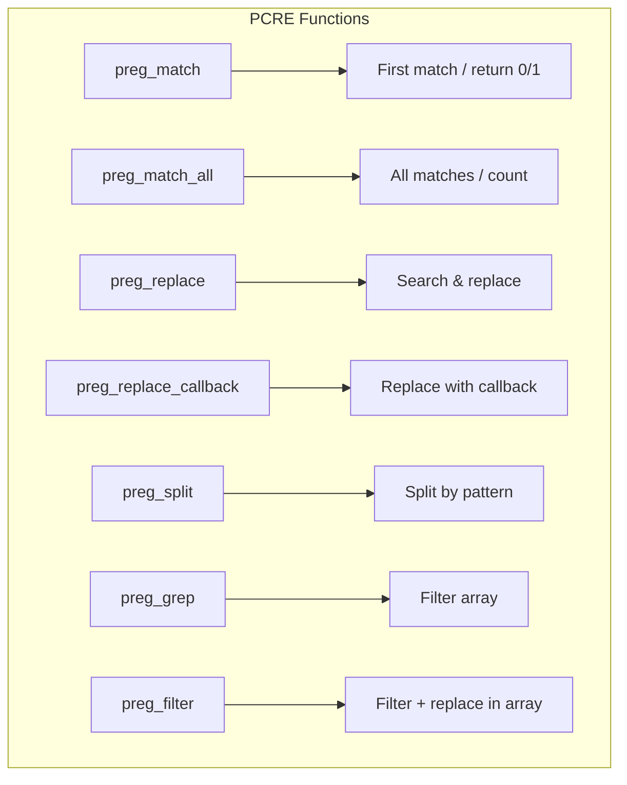

# PCRE — Perl Compatible Regular Expressions

## Overview

PHP's PCRE extension provides Perl-compatible regular expression matching, replacement, splitting, and filtering using the PCRE2 library (since PHP 7.3). It is the primary regex engine in PHP, superseding the POSIX-extended regex extension (`ereg`) which was removed in PHP 7.0.



## Core Functions

### `preg_match()` — First Match

```php
<?php
declare(strict_types=1);

$subject = 'The quick brown fox jumps over the lazy dog';

if (preg_match('/quick (\w+) fox/', $subject, $matches)) {
    echo "Matched: " . $matches[0];    // 'quick brown fox'
    echo "Capture 1: " . $matches[1];  // 'brown'
}

// Named captures
preg_match('/(?<animal>\w+) jumps/', $subject, $matches);
echo $matches['animal'];  // 'fox'

// Offset capture
preg_match('/fox/', $subject, $matches, PREG_OFFSET_CAPTURE);
// $matches[0] = ['fox', 16]

// Start offset
preg_match('/the/', $subject, $matches, 0, 10); // Start at position 10
```

### `preg_match_all()` — All Matches

```php
<?php
declare(strict_types=1);

$subject = 'foo=1&bar=2&baz=3';
preg_match_all('/(\w+)=(\d+)/', $subject, $matches);

// Default: PREG_PATTERN_ORDER
// [0 => ['foo=1', 'bar=2', 'baz=3'], 1 => ['foo', 'bar', 'baz'], 2 => ['1', '2', '3']]

// PREG_SET_ORDER — grouped by match
preg_match_all('/(\w+)=(\d+)/', $subject, $matches, PREG_SET_ORDER);
```

### `preg_replace()` — Search and Replace

```php
<?php
declare(strict_types=1);

$result = preg_replace('/(\w+) (\w+)/', '$2, $1', 'first last');
// 'last, first'

$result = preg_replace('/(\d{4})-(\d{2})-(\d{2})/', '$3/$2/$1', '2024-12-25');
// '25/12/2024'

// Limit replacements
$result = preg_replace('/a/', 'X', 'aaa', limit: 2); // 'XXa'

// Count replacements
$count = 0;
$result = preg_replace('/a/', 'X', 'aaa', limit: -1, count: $count);
echo $count; // 3
```

### `preg_replace_callback()`

```php
<?php
declare(strict_types=1);

$result = preg_replace_callback(
    '/\b(\w+)\b/',
    fn(array $m) => ucfirst($m[1]),
    'hello world'
);
// 'Hello World'
```

### `preg_split()` — Split by Pattern

```php
<?php
declare(strict_types=1);

$parts = preg_split('/[,\s]+/', 'apple, banana, cherry');
// ['apple', 'banana', 'cherry']

$parts = preg_split('/:/', 'a:b:c:d', limit: 3);
// ['a', 'b', 'c:d']
```

### `preg_grep()` — Filter Array

```php
<?php
declare(strict_types=1);

$files = ['readme.txt', 'index.php', 'style.css', 'script.js'];
$phpFiles = preg_grep('/\.php$/', $files);
// ['index.php']
```

## Common Modifiers

| Modifier | Name | Description |
|----------|------|-------------|
| `i` | Case-insensitive | `/foo/i` matches `FOO`, `foo`, `Foo` |
| `m` | Multiline | `^` and `$` match line start/end |
| `s` | Dotall | `.` matches newline (`\n`) |
| `x` | Extended | Whitespace in pattern is ignored |
| `u` | UTF-8 | Pattern and subject treated as UTF-8 |
| `U` | Ungreedy | Quantifiers are lazy by default |

## Performance & Backtracking

### Backtracking Limits

```ini
; php.ini — PCRE configuration
pcre.backtrack_limit = 1000000
pcre.recursion_limit = 100000
pcre.jit = On
```

```php
<?php
declare(strict_types=1);

// Check for backtrack limit exceeded
$result = preg_match('/(a+)+b/', str_repeat('a', 100) . 'c');
if ($result === false) {
    $error = preg_last_error();
    // PHP 8.4: preg_last_error_msg() for human-readable error
    echo preg_last_error_msg();
}
```

### Avoiding Catastrophic Backtracking

```php
<?php
declare(strict_types=1);

// ❌ Bad — nested quantifiers
$pattern = '/(a+)+b/';

// ✅ Good — atomic group
$pattern = '/(?>a+)+b/';

// ❌ Bad for long strings
$pattern = '/.*b/';

// ✅ Good — use possessive or specific class
$pattern = '/[^b]*b/';
```

## UTF-8 Handling

```php
<?php
declare(strict_types=1);

// Always use /u for UTF-8 strings
preg_match('/^.{4}$/u', 'Café'); // 1 — 'é' is one character

// Unicode character properties
preg_match('/^\p{L}+$/u', '日本語');     // Letters only
preg_match('/^\p{Sc}+$/u', '$');         // Currency symbols
preg_match('/^\p{Han}+$/u', '汉字');     // Chinese characters
```

## Common Pitfalls

1. **Unescaped `/` in patterns** — Use alternative delimiters (`#...#`, `~...~`).
2. **Missing `/u` modifier for UTF-8** — Without it, `.` matches bytes, not characters.
3. **`preg_match()` returns 0 or 1, not the matched string** — Use the `$matches` parameter.
4. **`$matches[0]` is the full match, not the first group** — Groups start at index 1.
5. **Catastrophic backtracking on user-provided patterns** — Limit backtracking.
6. **`PREG_OFFSET_CAPTURE` returns byte offset, not character offset** — For UTF-8, use `mb_strlen()` to get character position.

## References

- [PHP: PCRE](https://www.php.net/manual/en/book.pcre.php)
- [PHP: preg_match](https://www.php.net/manual/en/function.preg-match.php)
- [PHP: PCRE Configuration](https://www.php.net/manual/en/pcre.configuration.php)
- [PCRE2 Pattern Documentation](https://www.pcre.org/current/doc/html/)