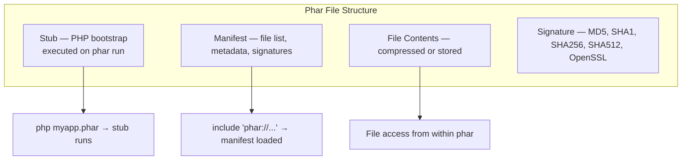

# PHAR — PHP Archive

## Overview

Phar (PHP Archive) allows distributing an entire PHP application as a single file. It bundles PHP scripts, static files, and metadata into a convenient archive that can be executed directly by PHP (like a binary) or included from other scripts. Phar files use a custom format based on the TAR/PHAR/ZIP specification with a PHP executable stub.



## Creating Phar Archives

### Basic Phar Creation

```php
<?php
declare(strict_types=1);

// Note: phar.readonly must be Off in php.ini to create/modify phars
// php -d phar.readonly=0 create-phar.php

$phar = new Phar('/tmp/myapp.phar');
$phar->startBuffering();

// Add files from disk
$phar->buildFromDirectory('/path/to/app', '/\\.php$/');  // Only PHP files

// Add individual files
$phar->addFile('index.php');
$phar->addFile('src/App.php');
$phar->addFile('vendor/autoload.php');

// Add from string
$phar->addFromString('config.php', "<?php\nreturn ['version' => '1.0.0'];\n");

// Set the stub (entry point)
$phar->setStub(
    "#!/usr/bin/env php\n"
    . $phar->createDefaultStub('index.php')
);

// Set metadata
$phar->setMetadata([
    'name'    => 'My App',
    'version' => '1.0.0',
    'author'  => 'Developer',
]);

$phar->stopBuffering();

echo "Created phar: {$phar->getPath()}\n";
```

### Building from Directory

```php
<?php
declare(strict_types=1);

$phar = new Phar('/tmp/app.phar');
$phar->startBuffering();

// Build from directory with file filter
$phar->buildFromDirectory('/home/user/project', '/^(?!.*\\.(git|svn|DS_Store)).*$/i');

// Or with iterator
$iterator = new RecursiveIteratorIterator(
    new RecursiveDirectoryIterator('/home/user/project', FilesystemIterator::SKIP_DOTS)
);
$phar->buildFromIterator($iterator, '/home/user/project');

// Set default stub
$phar->setStub($phar->createDefaultStub('public/index.php'));

// Compress all files
$phar->compressFiles(Phar::GZ);  // GZIP compression

$phar->stopBuffering();
```

## Stub Files

The stub is executed when the phar is run via `php myapp.phar`. It's the entry point.

```php
<?php
declare(strict_types=1);

// Default stub — auto-generated
$stub = $phar->createDefaultStub('index.php', 'web/index.php');
// First param: CLI entry point
// Second param: Web server entry point

// Custom stub — full control
$phar->setStub(
    "#!/usr/bin/env php\n"
    . "<?php\n"
    . "Phar::mapPhar();\n"
    . "// Custom bootstrap\n"
    . "require 'phar://' . __FILE__ . '/vendor/autoload.php';\n"
    . "require 'phar://' . __FILE__ . '/app.php';\n"
    . "__HALT_COMPILER();\n"
);

// Minimal stub
$phar->setStub(
    "<?php\nPhar::mapPhar();\n"
    . "require 'phar://' . __FILE__ . '/index.php';\n"
    . "__HALT_COMPILER();\n"
    . "?>"
);

// Shebang stub — makes phar executable directly
$phar->setStub(
    "#!/usr/bin/env php\n<?php\n"
    . "Phar::mapPhar();\n"
    . "include 'phar://' . __FILE__ . '/bootstrap.php';\n"
    . "__HALT_COMPILER();\n"
);

// After creating with shebang:
// chmod +x myapp.phar
// ./myapp.phar  ← works directly
```

## Compression

```php
<?php
declare(strict_types=1);

$phar = new Phar('/tmp/app.phar');

// Compress all files (requires buffering)
$phar->compressFiles(Phar::GZ);    // GZIP — good balance
$phar->compressFiles(Phar::BZ2);   // BZIP2 — better compression, slower

// No compression
$phar->compressFiles(Phar::NONE);

// Compress entire phar (creates .phar.gz or .phar.bz2)
$phar->compress(Phar::GZ);    // Creates app.phar.gz
$phar->compress(Phar::BZ2);   // Creates app.phar.bz2
$phar->compress(Phar::NONE);  // Decompress

// Check compression
$compressed = $phar->isCompressed();
if ($compressed === Phar::GZ) {
    echo "Compressed with GZIP\n";
} elseif ($compressed === Phar::BZ2) {
    echo "Compressed with BZIP2\n";
} else {
    echo "Not compressed\n";
}

// File-level compression check
$fileCompressed = $phar->isFileCompressed('index.php');
```

## Signing

Phar archives can be signed to verify integrity and authenticity.

```php
<?php
declare(strict_types=1);

$phar = new Phar('/tmp/app.phar');

// MD5 signature (fast, less secure)
$phar->setSignatureAlgorithm(Phar::MD5);

// SHA1 signature
$phar->setSignatureAlgorithm(Phar::SHA1);

// SHA256 signature — recommended
$phar->setSignatureAlgorithm(Phar::SHA256);

// SHA512 signature — strongest built-in
$phar->setSignatureAlgorithm(Phar::SHA512);

// OpenSSL signing — requires private key
$privateKey = openssl_pkey_new([
    'private_key_bits' => 2048,
    'private_key_type' => OPENSSL_KEYTYPE_RSA,
]);
openssl_pkey_export($privateKey, $privateKeyStr);

$phar->setSignatureAlgorithm(Phar::OPENSSL, $privateKeyStr);

// Verification on load
try {
    $phar = new Phar('/tmp/signed.phar');
    // If OpenSSL-signed, PHP verifies the signature automatically
    // Requires: openssl.cafile or openssl.capath in php.ini
} catch (PharException $e) {
    echo "Signature verification failed: " . $e->getMessage() . "\n";
}
```

## Reading & Extracting

### Accessing Phar Contents

```php
<?php
declare(strict_types=1);

// Load existing phar
$phar = new Phar('/tmp/myapp.phar');

// List contents
echo "Files in phar:\n";
foreach (new RecursiveIteratorIterator($phar) as $file) {
    /** @var PharFileInfo $file */
    echo "  [{$file->getCompressedSize()} bytes] {$file->getPathname()}\n";
}

// Count files
echo $phar->count() . " files\n";
echo "Phar size: " . $phar->getSize() . " bytes\n";

// Read file content
$config = $phar['config.php']->getContent();
echo $config;

// Check if file exists
if (isset($phar['index.php'])) {
    echo "index.php exists\n";
}

// Get file metadata
$meta = $phar['config.php']->getMetadata();
```

### Phar Stream Wrapper (`phar://`)

```php
<?php
declare(strict_types=1);

// Include files from a phar
require_once 'phar://myapp.phar/vendor/autoload.php';

// Read file content
$config = file_get_contents('phar://myapp.phar/config.php');

// Include autoload from phar
$pharPath = 'phar://' . __DIR__ . '/myapp.phar';
require_once $pharPath . '/vendor/autoload.php';

// File operations inside phar
$fileInfo = new SplFileInfo('phar://myapp.phar/public/index.php');
echo $fileInfo->getSize();

// Stream operations
$stream = fopen('phar://myapp.phar/large-file.dat', 'rb');
while (!feof($stream)) {
    $chunk = fread($stream, 4096);
}
fclose($stream);
```

### Extracting Phar to Directory

```php
<?php
declare(strict_types=1);

$phar = new Phar('/tmp/myapp.phar');

// Extract all files
$phar->extractTo('/tmp/myapp-extracted/');

// Extract specific files
$phar->extractTo('/tmp/myapp-extracted/', ['public/index.php', 'config.php']);

// Extract with overwrite flag
$phar->extractTo('/tmp/myapp-extracted/', null, true);  // true = overwrite
```

## Web Application Distribution

Phar is particularly useful for distributing web applications and frameworks.

```php
<?php
declare(strict_types=1);

// Create a web-accessible phar
$phar = new Phar('/tmp/webapp.phar');
$phar->startBuffering();

// Add all app files
$phar->buildFromDirectory('/path/to/webapp');

// Web-specific stub
$phar->setStub(
    "<?php\n"
    . "Phar::mapPhar();\n"
    . "// Web application bootstrap\n"
    . "\$request = \$_SERVER['REQUEST_URI'];\n"
    . "// Serve static files directly\n"
    . "\$staticFile = 'phar://' . __FILE__ . '/public' . \$request;\n"
    . "if (file_exists(\$staticFile) && !is_dir(\$staticFile)) {\n"
    . "    return false;\n"
    . "}\n"
    . "// Route everything else through front controller\n"
    . "require 'phar://' . __FILE__ . '/public/index.php';\n"
    . "__HALT_COMPILER();\n"
);

$phar->stopBuffering();

// Web server setup (Apache .htaccess or Nginx):
// For Apache with mod_rewrite:
// RewriteEngine On
// RewriteRule ^(.*)$ webapp.phar [L]

// For PHP built-in server:
// php -d phar.readonly=0 -S localhost:8080 webapp.phar
```

## Phar-Specific Classes

### `Phar` vs `PharData`

```php
<?php
declare(strict_types=1);

// Phar — PHP Archive with executable stub
$phar = new Phar('/tmp/app.phar');
$phar->setStub($phar->createDefaultStub('index.php'));

// PharData — Non-executable data archive (TAR/ZIP without stub)
$tar = new PharData('/tmp/data.tar');
$tar->buildFromDirectory('/path/to/data');

// PharData supports TAR and ZIP formats
$zip = new PharData('/tmp/data.zip');
$zip->addFile('/path/to/file.txt');

// Convert between formats
$phar = new Phar('/tmp/app.phar');
$phar->convertToData(Phar::TAR, Phar::GZ);  // Creates app.tar.gz
$phar->convertToData(Phar::ZIP, Phar::NONE); // Creates app.zip
$phar->convertToExecutable(Phar::ZIP);       // Creates app.phar.zip

// Compression conversion
$phar->convertToExecutable(Phar::PHAR, Phar::GZ);
```

### `PharFileInfo`

```php
<?php
declare(strict_types=1);

$phar = new Phar('/tmp/app.phar');
$file = $phar['src/App.php'];

/** @var PharFileInfo $file */
echo $file->getFilename();          // 'App.php'
echo $file->getSize();              // Size in bytes
echo $file->getCompressedSize();    // Compressed size
echo $file->getCRC32();             // CRC32 checksum
echo $file->isCompressed();         // Compression type (GZ/BZ2/NONE)
echo $file->isCRCCheck();           // Whether CRC checked
echo $file->getPharFlags();         // PHAR entry flags

$file->delMetadata();               // Delete metadata
$file->setMetadata(['key' => 'value']);  // Set metadata
$meta = $file->getMetadata();       // Get metadata

// Compression per file
$file->compress(Phar::GZ);
$file->decompress();
```

## Error Handling & Exceptions

```php
<?php
declare(strict_types=1);

try {
    $phar = new Phar('/tmp/app.phar');
} catch (UnexpectedValueException $e) {
    echo "Phar corrupt or invalid: " . $e->getMessage() . "\n";
} catch (PharException $e) {
    echo "Phar operation failed: " . $e->getMessage() . "\n";
} catch (BadMethodCallException $e) {
    echo "Method not allowed (phar.readonly?): " . $e->getMessage() . "\n";
}

// Common exception types:
// UnexpectedValueException — Corrupt, invalid signature, wrong format
// PharException — Generic phar operation failure
// BadMethodCallException — Write operation while phar.readonly=On
```

## Complete Application Packaging

```php
<?php
declare(strict_types=1);

// build-phar.php — complete build script
$target = __DIR__ . '/build/myapp.phar';
$srcDir = __DIR__ . '/src';
$vendorDir = __DIR__ . '/vendor';

// Ensure phar.readonly is off
if (ini_get('phar.readonly')) {
    echo "ERROR: Set phar.readonly=0 in php.ini\n";
    exit(1);
}

// Clean up
if (file_exists($target)) {
    unlink($target);
}
if (!is_dir(dirname($target))) {
    mkdir(dirname($target), 0755, true);
}

$phar = new Phar($target, 0, 'myapp.phar');
$phar->startBuffering();

// Set metadata
$phar->setMetadata([
    'name'    => 'MyApp',
    'version' => '1.0.0',
    'built'   => date('c'),
    'php'     => PHP_VERSION,
]);

// Build from source
$phar->buildFromDirectory($srcDir, '/\\.php$/');

// Add vendor
$phar->buildFromDirectory($vendorDir, '/\\.php$/');

// Exclude dev files
foreach ($phar as $fileInfo) {
    /** @var PharFileInfo $fileInfo */
    $name = $fileInfo->getFilename();
    if (in_array($name, ['phpunit.xml', '.gitignore', 'README.md'])) {
        $phar->delete($fileInfo->getBasename());
    }
}

// Compress
$phar->compressFiles(Phar::GZ);

// Sign
$phar->setSignatureAlgorithm(Phar::SHA512);

// Stub
$phar->setStub(
    "#!/usr/bin/env php\n"
    . $phar->createDefaultStub('main.php')
);

$phar->stopBuffering();

// Make executable
chmod($target, 0755);

echo "Built: $target (" . filesize($target) . " bytes)\n";
```

## Common Pitfalls

1. **`phar.readonly = On`** — Cannot create or modify phars. Set `phar.readonly=0` in php.ini or pass `-d phar.readonly=0` on CLI.
2. **OpenSSL signing requires public key on consumer side** — Distribute the `.pubkey` file alongside the `.phar` file.
3. **Compression increases memory usage** — Loading compressed phars requires decompression; large archives can consume significant memory.
4. **`__HALT_COMPILER();` is required** — The stub must end with `__HALT_COMPILER();` followed by a newline. Without it, the phar is invalid.
5. **Phar stream wrapper requires phar loaded** — The phar extension must be enabled even when *using* a phar file (reading only).
6. **File permissions inside phars** — `PharFileInfo` doesn't support `chmod()`. Permissions are determined at extraction time.
7. **`convertToExecutable`/`convertToData` create new files** — The original phar is NOT modified. The converted file is created alongside.
8. **Alias conflicts** — Using `Phar::loadPhar()` with conflicting aliases throws an exception.
9. **Large phars take time to load** — PHP must parse the manifest before any file access. For very large phars (>100MB), this can be slow.
10. **Phar objects are not serializable** — You cannot serialize a `Phar` object.

## References

- [PHP: Phar](https://www.php.net/manual/en/book.phar.php)
- [PHP: Phar File Format](https://www.php.net/manual/en/phar.fileformat.php)
- [PHP: Phar Stub](https://www.php.net/manual/en/phar.stub.php)
- [PHP: Phar Building](https://www.php.net/manual/en/phar.building.php)
- [PHP: phar:// Wrapper](https://www.php.net/manual/en/wrappers.phar.php)
