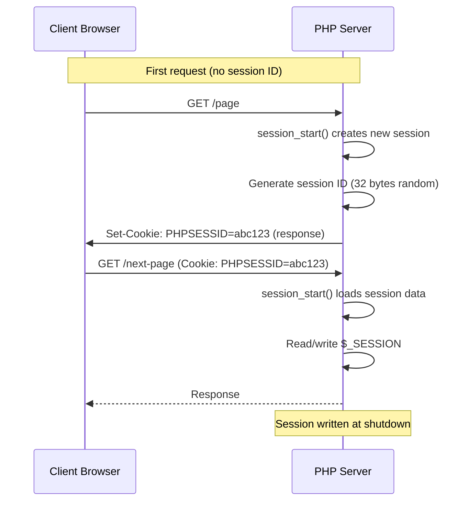

# Sessions — Full Reference

## Overview

PHP sessions provide a way to preserve state across multiple HTTP requests. The session extension is built-in and available by default. Understanding session mechanics — handlers, locking, security, and storage — is essential for building secure, performant web applications.



## Core Functions

### `session_start()`

```php
<?php
declare(strict_types=1);

// Standard start
session_start();
$_SESSION['user_id'] = 42;

// With options (PHP 7.0+)
session_start([
    'cookie_lifetime' => 86400 * 7,   // 7 days
    'cookie_httponly' => true,
    'cookie_samesite' => 'Lax',
    'cookie_secure'   => true,         // HTTPS only
    'read_and_close'  => true,         // Read session, release lock immediately
]);

// Read only — no write lock needed
session_start(['read_and_close' => true]);
$userId = $_SESSION['user_id'] ?? null;
// No session_write_close() needed — already closed

// Lazy write (PHP 7.0+) — only saves if data changed
// session.lazy_write = On (default) — skips write if $_SESSION unchanged
```

### Session ID Management

```php
<?php
declare(strict_types=1);

session_start();

// Regenerate ID after login (prevents fixation)
session_regenerate_id(true);  // true = delete old session

// Get current ID
$currentId = session_id();

// Set a custom ID (before session_start())
session_id('custom-id-here');

// Get and set module name (files, redis, etc.)
$handler = session_module_name(); // 'files'
```

### Session Data Management

```php
<?php
declare(strict_types=1);

session_start();

// Read
$userId = $_SESSION['user_id'];

// Write
$_SESSION['cart'] = [['item_id' => 1, 'qty' => 2]];
$_SESSION['last_activity'] = time();

// Check if a key exists
$hasKey = array_key_exists('csrf_token', $_SESSION);

// Delete specific key
unset($_SESSION['old_temp_data']);

// Delete all session data (keep session alive)
$_SESSION = [];
session_reset();     // Reset to pre-request state (PHP 5.6+)

// Destroy session entirely
session_destroy();   // Clear data on server
// Also delete cookie:
setcookie(session_name(), '', time() - 3600, '/');

// Session encoding/decoding (manual serialization)
$encoded = session_encode();               // 'user_id|i:42;cart|a:0:{}'
session_decode($encoded);                  // Populate $_SESSION from string
```

## Session Handlers

### Built-in Save Handlers

| Handler | Description | Storage |
|---------|-------------|---------|
| `files` | Default. Stores sessions as files in `session.save_path` | Filesystem |
| `memcached` | Uses Memcached for storage | Memcached daemon |
| `memcache` | Uses Memcache (legacy) | Memcache daemon |
| `redis` | Uses Redis via phpredis extension | Redis server |
| `sqlite` | Stores sessions in SQLite database | SQLite file |
| `mm` | Shared memory (mmap) — **removed in PHP 8.0** | Shared memory |
| `user` | Custom handler via `session_set_save_handler()` | User-defined |

### Files Handler

```ini
; php.ini — default file-based session
session.save_handler = files
session.save_path = "/tmp/sessions"  ; or "N;/path" for N-level subdirs
session.serialize_handler = php       ; php|php_binary|php_serialize
```

### Redis Handler

```ini
; php.ini — redis sessions
session.save_handler = redis
session.save_path = "tcp://127.0.0.1:6379?auth=password&database=0&timeout=2"
; TLS
session.save_path = "tls://127.0.0.1:6379?auth=password&database=0"
; Unix socket
session.save_path = "unix:///var/run/redis/redis.sock?database=1"
```

### Memcached Handler

```ini
; php.ini
session.save_handler = memcached
session.save_path = "127.0.0.1:11211,127.0.0.2:11211?weight=50"
```

## Custom Session Handlers

Implement `SessionHandlerInterface` for custom storage (database, API, custom key-value store).

```php
<?php
declare(strict_types=1);

class DatabaseSessionHandler implements SessionHandlerInterface
{
    private \PDO $pdo;
    private string $table;
    
    public function __construct(\PDO $pdo, string $table = 'sessions')
    {
        $this->pdo = $pdo;
        $this->table = $table;
    }
    
    public function open(string $savePath, string $sessionName): bool { return true; }
    
    public function close(): bool { return true; }
    
    public function read(string $sessionId): string|false
    {
        $stmt = $this->pdo->prepare(
            "SELECT data FROM {$this->table} WHERE id = :id AND expires > :now"
        );
        $stmt->execute(['id' => $sessionId, 'now' => time()]);
        $row = $stmt->fetchColumn();
        return $row !== false ? (string)$row : '';
    }
    
    public function write(string $sessionId, string $data): bool
    {
        $lifetime = (int)ini_get('session.gc_maxlifetime');
        $stmt = $this->pdo->prepare(
            "INSERT INTO {$this->table} (id, data, last_accessed, expires)
             VALUES (:id, :data, :now, :expires)
             ON DUPLICATE KEY UPDATE data = :data2, last_accessed = :now2, expires = :expires2"
        );
        return $stmt->execute([
            'id' => $sessionId, 'data' => $data, 'now' => time(),
            'expires' => time() + $lifetime,
            'data2' => $data, 'now2' => time(), 'expires2' => time() + $lifetime,
        ]);
    }
    
    public function destroy(string $sessionId): bool
    {
        $stmt = $this->pdo->prepare("DELETE FROM {$this->table} WHERE id = :id");
        return $stmt->execute(['id' => $sessionId]);
    }
    
    public function gc(int $maxLifetime): int|false
    {
        $stmt = $this->pdo->prepare("DELETE FROM {$this->table} WHERE expires < :now");
        $stmt->execute(['now' => time()]);
        return $stmt->rowCount();
    }
}

// Register the custom handler BEFORE session_start()
$handler = new DatabaseSessionHandler($pdo);
session_set_save_handler($handler, true);
session_start();
```

## Session Security

### Critical Security Settings

```ini
; php.ini — security-focused session config
session.use_strict_mode = On        ; Reject uninitialized session IDs
session.use_cookies = On            ; Use cookies only (not URL)
session.use_only_cookies = On       ; Never accept session ID from URL
session.cookie_httponly = On        ; No JavaScript access
session.cookie_secure = On          ; HTTPS-only cookies
session.cookie_samesite = "Lax"     ; CSRF protection (Strict for banking)
session.sid_length = 32             ; 32 bytes = 256 bits (PHP 7.1+)
session.sid_bits_per_character = 6  ; Stronger session IDs (base64-variant)
```

### Session Fixation Prevention

```php
<?php
declare(strict_types=1);

function loginUser(int $userId): void
{
    session_start();
    session_regenerate_id(true);
    $_SESSION['user_id'] = $userId;
    $_SESSION['logged_in_at'] = time();
    $_SESSION['ip'] = $_SERVER['REMOTE_ADDR'] ?? '';
    $_SESSION['user_agent'] = $_SERVER['HTTP_USER_AGENT'] ?? '';
}

function logoutUser(): void
{
    $_SESSION = [];
    $params = session_get_cookie_params();
    setcookie(session_name(), '', time() - 42000, $params['path'], $params['domain'], $params['secure'], $params['httponly']);
    session_destroy();
}
```

## Session Locking

PHP sessions acquire an **exclusive write lock** on `session_start()` by default, blocking concurrent requests for the same session.

### Locking Strategies

```php
<?php
declare(strict_types=1);

// Strategy 1: Read-and-close (no lock if you only read)
session_start(['read_and_close' => true]);
$theme = $_SESSION['theme'] ?? 'default';

// Strategy 2: Explicit close early
session_start();
$userId = $_SESSION['user_id'];
session_write_close();
// Now other requests can access this session
performSlowDatabaseQuery();

// Strategy 3: Close before redirect
session_start();
$_SESSION['flash_message'] = 'Saved!';
session_write_close();
header('Location: /next-page');
exit;
```

## Session Configuration Reference

```ini
session.save_handler = files
session.save_path = "/tmp/sessions"
session.name = PHPSESSID
session.auto_start = Off
session.gc_probability = 1
session.gc_divisor = 1000
session.gc_maxlifetime = 1440
session.serialize_handler = php
session.cookie_lifetime = 0
session.cookie_path = /
session.cookie_domain = ""
session.cookie_secure = On
session.cookie_httponly = On
session.cookie_samesite = "Lax"
session.use_strict_mode = On
session.use_cookies = On
session.use_only_cookies = On
session.sid_length = 32
session.sid_bits_per_character = 6
session.lazy_write = On
session.upload_progress.enabled = On
session.upload_progress.cleanup = On
session.upload_progress.prefix = "upload_progress_"
session.upload_progress.name = "PHP_UPLOAD_PROGRESS"
session.upload_progress.freq = "1%"
session.upload_progress.min_freq = "1"
```

## Common Pitfalls

1. **Session file locking kills concurrent AJAX requests** — Use `read_and_close` or `session_write_close()` early.
2. **`session_destroy()` without cookie deletion** — Session data is gone, but the cookie remains. Always delete the cookie.
3. **`session_regenerate_id()` without `true`** — Default keeps old session data, which defeats fixation prevention.
4. **Session GC not running** — Probability-based GC is unreliable on low-traffic sites. Use cron-based GC.
5. **`session.auto_start = On`** — Prevents custom session handler registration. Always `Off`.
6. **Custom handler serialization mismatch** — `session.serialize_handler` must match across all app servers.
7. **`$_SESSION` not immediately saved after write** — Session write happens at shutdown unless you call `session_write_close()`.
8. **Redis sessions without authentication** — Always use `auth=password` in `session.save_path`.

## References

- [PHP: Sessions](https://www.php.net/manual/en/book.session.php)
- [PHP: SessionHandlerInterface](https://www.php.net/manual/en/class.sessionhandlerinterface.php)
- [PHP: session_set_save_handler](https://www.php.net/manual/en/function.session-set-save-handler.php)
- [PHP: Sessions Configuration](https://www.php.net/manual/en/session.configuration.php)