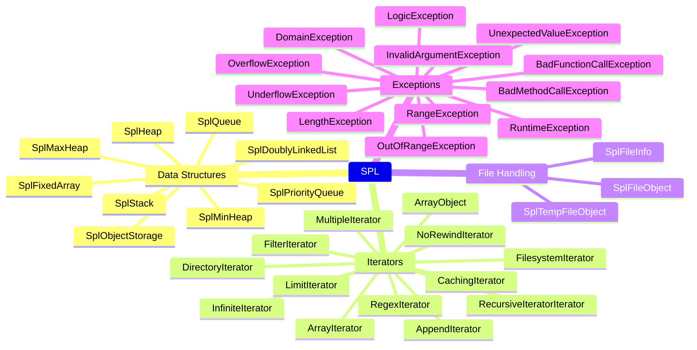
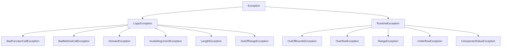

# SPL — Standard PHP Library

## Overview

The Standard PHP Library (SPL) is a collection of interfaces, classes, and data structures built into PHP with no external dependencies. It provides solutions for common problems: data structure management, object iteration, file and directory handling, and exception hierarchies. SPL is always available in PHP 8.4 — no extension loading required.



## Data Structures

### SplFixedArray

A more memory-efficient array with fixed length. Arrays cannot be resized but use less memory than regular PHP arrays.

```php
<?php
declare(strict_types=1);

// Create with size
$array = new SplFixedArray(5);
$array[0] = 'a';
$array[1] = 'b';
$array[2] = 'c';
$array[3] = 'd';
$array[4] = 'e';

// Access like a regular array
echo $array[0]; // 'a'

// Count
echo $array->count(); // 5
echo count($array);   // 5

// Set size (truncates or extends)
$array->setSize(3);

// Convert to/from regular array
$regular = $array->toArray();
$fromRegular = SplFixedArray::fromArray([1, 2, 3, 4, 5]);

// Free arrays with large datasets
SplFixedArray::fromArray(range(0, 1_000_000));
flush(); // GC runs

// Serialization
$array->setSize(3);
$serialized = serialize($array);
$restored = unserialize($serialized);
```

**Performance tip:** Use `SplFixedArray` when you know the size in advance and need to iterate millions of elements. Benchmark shows 20–40% memory savings over regular arrays for large datasets.

### SplDoublyLinkedList

A doubly linked list supporting iteration in both directions.

```php
<?php
declare(strict_types=1);

$list = new SplDoublyLinkedList();
$list->push('first');
$list->push('second');
$list->push('third');

// Iterate forward
$list->setIteratorMode(SplDoublyLinkedList::IT_MODE_FIFO);
foreach ($list as $item) {
    echo $item; // first, second, third
}

// Iterate backward
$list->setIteratorMode(SplDoublyLinkedList::IT_MODE_LIFO | SplDoublyLinkedList::IT_MODE_DELETE);
foreach ($list as $item) {
    echo $item; // third, second, first — each removes after read
}

// Stack operations
$list->push('top');
$top = $list->pop();  // 'top'
$list->unshift('bottom');
$bottom = $list->shift(); // 'bottom'

// Direct access
$list[] = 'value';       // Append
echo $list[0];           // Read first
$list[0] = 'modified';   // Write first
unset($list[1]);         // Remove second element
var_dump(isset($list[0])); // bool(true)
```

### SplStack & SplQueue

Specialized subclasses of `SplDoublyLinkedList`.

```php
<?php
declare(strict_types=1);

// Stack — LIFO
$stack = new SplStack();
$stack->push('a');
$stack->push('b');
$stack->push('c');
echo $stack->pop();   // 'c'
echo $stack->pop();   // 'b'
echo $stack->top();   // 'a' — peek without removal

// Queue — FIFO
$queue = new SplQueue();
$queue->enqueue('a');
$queue->enqueue('b');
$queue->enqueue('c');
echo $queue->dequeue(); // 'a'
echo $queue->dequeue(); // 'b'
echo $queue->bottom();  // 'c' — peek without removal
```

### SplHeap, SplMaxHeap & SplMinHeap

Binary heap data structures. Elements are automatically ordered on insertion.

```php
<?php
declare(strict_types=1);

// Min-heap (built-in)
$minHeap = new SplMinHeap();
$minHeap->insert(5);
$minHeap->insert(3);
$minHeap->insert(8);
$minHeap->insert(1);

echo $minHeap->extract(); // 1
echo $minHeap->extract(); // 3
echo $minHeap->extract(); // 5
echo $minHeap->extract(); // 8

// Max-heap (built-in)
$maxHeap = new SplMaxHeap();
$maxHeap->insert(5);
$maxHeap->insert(3);
echo $maxHeap->extract(); // 5

// Custom heap (compare by priority value)
class PriorityHeap extends SplHeap {
    protected function compare(mixed $a, mixed $b): int {
        return $a['priority'] <=> $b['priority'];
    }
}

$heap = new PriorityHeap();
$heap->insert(['priority' => 3, 'task' => 'low']);
$heap->insert(['priority' => 10, 'task' => 'high']);
$heap->insert(['priority' => 7, 'task' => 'medium']);
echo $heap->extract()['task']; // 'high'
```

### SplPriorityQueue

A priority queue where elements are extracted by priority order (O(log n) per operation).

```php
<?php
declare(strict_types=1);

$queue = new SplPriorityQueue();

// Higher number = higher priority (default)
$queue->insert('Low priority', 1);
$queue->insert('High priority', 100);
$queue->insert('Medium priority', 50);

// Flag: extract only data (default: EXTR_DATA)
$queue->setExtractFlags(SplPriorityQueue::EXTR_DATA);

while (!$queue->isEmpty()) {
    echo $queue->extract() . "\n";
}
// High priority
// Medium priority
// Low priority

// Alternative: extract data + priority
$queue2 = new SplPriorityQueue();
$queue2->insert('task', 5);
$queue2->setExtractFlags(SplPriorityQueue::EXTR_BOTH);
$result = $queue2->extract();
// ['data' => 'task', 'priority' => 5]
```

### SplObjectStorage

A map from objects to associated data. Objects are used as keys (by identity, not value).

```php
<?php
declare(strict_types=1);

$storage = new SplObjectStorage();

$obj1 = new stdClass();
$obj2 = new stdClass();

$storage[$obj1] = 'metadata for obj1';
$storage[$obj2] = 'metadata for obj2';

// Check existence
var_dump($storage->contains($obj1)); // true

// Retrieve
echo $storage[$obj1]; // 'metadata for obj1'

// Remove
$storage->detach($obj1);

// Iterate
foreach ($storage as $object) {
    echo get_class($object) . ': ' . $storage[$object] . "\n";
}

// Use cases
// 1. Mark visited nodes in graph traversal
$visited = new SplObjectStorage();
function dfs(Node $node, SplObjectStorage $visited): void {
    if ($visited->contains($node)) return;
    $visited->attach($node);
    foreach ($node->neighbors() as $neighbor) {
        dfs($neighbor, $visited);
    }
}

// 2. Object event listeners
class EventEmitter {
    private SplObjectStorage $listeners;
    
    public function __construct() {
        $this->listeners = new SplObjectStorage();
    }
    
    public function on(object $listener, string $event): void {
        $this->listeners->attach($listener, $event);
    }
    
    public function emit(string $event): void {
        foreach ($this->listeners as $listener) {
            if ($this->listeners[$listener] === $event) {
                $listener->handle($event);
            }
        }
    }
}
```

## Iterators

### ArrayObject & ArrayIterator

Allow objects to behave like arrays while providing iterator capabilities.

```php
<?php
declare(strict_types=1);

// ArrayObject — treat an object like an array
$obj = new ArrayObject(['a', 'b', 'c']);

// Array access
$obj[] = 'd';
echo $obj[0]; // 'a'
echo count($obj); // 4

// Sort in place
$obj->asort();

// Exchange array
$obj->exchangeArray(['x', 'y', 'z']);

// Get iterator
$iterator = $obj->getIterator();

// ArrayObject flags
$obj->setFlags(
    ArrayObject::ARRAY_AS_PROPS  // Access elements as properties
);

$obj2 = new ArrayObject(['name' => 'Alice', 'age' => 30]);
$obj2->setFlags(ArrayObject::ARRAY_AS_PROPS);
echo $obj2->name; // 'Alice'

// ArrayIterator — standalone iterator
$iterator = new ArrayIterator(['one', 'two', 'three']);
$iterator->append('four');
$iterator->ksort();  // Sort by key

while ($iterator->valid()) {
    echo $iterator->current() . "\n";
    $iterator->next();
}
```

### DirectoryIterator & FilesystemIterator

```php
<?php
declare(strict_types=1);

// Basic directory listing
$dir = new DirectoryIterator('/var/www');

foreach ($dir as $fileInfo) {
    if ($fileInfo->isDot()) continue;
    
    printf(
        "%s  %s  %s\n",
        $fileInfo->isDir() ? 'D' : 'F',
        $fileInfo->getSize(),
        $fileInfo->getFilename()
    );
}

// FilesystemIterator — more flags and filtering
$iterator = new FilesystemIterator(
    '/var/www',
    FilesystemIterator::KEY_AS_FILENAME
    | FilesystemIterator::CURRENT_AS_FILEINFO
    | FilesystemIterator::SKIP_DOTS
    | FilesystemIterator::UNIX_PATHS
);

foreach ($iterator as $filename => $fileInfo) {
    echo $filename . "\n";
}
```

### SplFileInfo & SplFileObject

```php
<?php
declare(strict_types=1);

// SplFileInfo — metadata and operations on a file
$file = new SplFileInfo('/var/log/php-fpm.log');

echo $file->getPathname();    // '/var/log/php-fpm.log'
echo $file->getSize();        // 102400
echo $file->getMTime();       // 1711000000
echo $file->getExtension();   // 'log'
echo $file->getType();        // 'file'
echo $file->getPerms();       // 0644
var_dump($file->isReadable()); // true
var_dump($file->isWritable()); // true

// SplFileObject — OOP file reading with line iteration
$file = new SplFileObject('/var/log/php-fpm.log');
$file->setFlags(
    SplFileObject::DROP_NEW_LINE
    | SplFileObject::READ_AHEAD
    | SplFileObject::SKIP_EMPTY
);

// Iterate every line
foreach ($file as $lineNumber => $line) {
    echo "$lineNumber: $line\n";
}

// CSV reading
$csv = new SplFileObject('/path/to/data.csv');
$csv->setFlags(SplFileObject::READ_CSV);
$csv->setCsvControl(',', '"', '\\');

foreach ($csv as $row) {
    // $row is array of fields
    print_r($row);
}

// File writing
$out = new SplFileObject('/tmp/output.txt', 'w');
$out->fwrite("Hello, SPL!\n");
$out->fputcsv(['name', 'email']);

// Temp file for testing
$tmp = new SplTempFileObject();
$tmp->fwrite("Temporary data");
$tmp->rewind();
echo $tmp->fread(1024);
```

### RecursiveIteratorIterator

Flatten recursive structures (directories, nested arrays) into a linear iteration.

```php
<?php
declare(strict_types=1);

// List all PHP files recursively
$directory = new RecursiveDirectoryIterator(
    '/var/www',
    RecursiveDirectoryIterator::SKIP_DOTS
);
$iterator = new RecursiveIteratorIterator($directory);
$phpFiles = new RegexIterator($iterator, '/\.php$/');

foreach ($phpFiles as $file) {
    echo $file->getPathname() . "\n";
}

// Flatten nested arrays
$nested = new RecursiveArrayIterator([
    'a' => [1, 2, [3, 4]],
    'b' => [5, 6],
]);
$flat = new RecursiveIteratorIterator($nested, RecursiveIteratorIterator::LEAVES_ONLY);

foreach ($flat as $key => $value) {
    echo "$key => $value\n";
}
```

### RegexIterator

Filter an iterator based on a regular expression.

```php
<?php
declare(strict_types=1);

$dir = new FilesystemIterator('/var/www', FilesystemIterator::SKIP_DOTS);
$images = new RegexIterator(
    $dir,
    '/\.(jpg|png|gif)$/i',
    RegexIterator::MATCH,
    RegexIterator::USE_KEY
);

foreach ($images as $file) {
    echo $file->getFilename() . "\n";
}

// Replacement mode
$files = new ArrayIterator(['a.txt', 'b.php', 'c.txt']);
$replace = new RegexIterator(
    $files,
    '/\.txt$/',
    RegexIterator::REPLACE
);
$replace->replacement = '.bak';
foreach ($replace as $filename) {
    echo $filename; // a.bak, b.php, c.bak
}
```

## SPL Exceptions

SPL provides a rich exception hierarchy that extends the built-in `Exception` class.



```php
<?php
declare(strict_types=1);

function validateUser(string $name, int $age): void {
    if (strlen($name) === 0) {
        throw new InvalidArgumentException('Name cannot be empty');
    }
    if (strlen($name) > 100) {
        throw new LengthException('Name exceeds maximum length');
    }
    if ($age < 0 || $age > 150) {
        throw new DomainException('Age out of valid range');
    }
}

// Subtype-specific catching
try {
    validateUser(str_repeat('x', 101), 25);
} catch (LengthException $e) {
    echo "Length error: " . $e->getMessage();
} catch (InvalidArgumentException $e) {
    echo "Invalid input: " . $e->getMessage();
} catch (DomainException $e) {
    echo "Domain error: " . $e->getMessage();
}

// Runtime exceptions
function processQueue(SplQueue $queue): void {
    if ($queue->isEmpty()) {
        throw new UnderflowException('Cannot process from empty queue');
    }
    while (!$queue->isEmpty()) {
        $item = $queue->dequeue();
        if (strlen((string)$item) > 1000) {
            throw new OverflowException('Item exceeds processing limit');
        }
    }
}

// In-range vs Out-of-Range
function getElement(array $arr, int $index): mixed {
    if ($index < 0) {
        throw new OutOfRangeException("Negative index: $index");
    }
    if (!array_key_exists($index, $arr)) {
        throw new OutOfBoundsException("Index $index not found");
    }
    return $arr[$index];
}
```

## Advanced Patterns

### Iterator Aggregation

```php
<?php
declare(strict_types=1);

// Chunk filter with FilterIterator
class ChunkFilter extends FilterIterator {
    private int $chunkSize;
    private int $current = 0;
    
    public function __construct(\Traversable $iterator, int $chunkSize = 100) {
        parent::__construct($iterator);
        $this->chunkSize = $chunkSize;
    }
    
    public function accept(): bool {
        return (int)floor($this->current++ / $this->chunkSize) % 2 === 0;
    }
}

// Limit results
$all = new ArrayIterator(range(1, 100));
$limited = new LimitIterator($all, 0, 10); // First 10

// Pagination
function paginate(array $data, int $page, int $perPage): LimitIterator {
    $all = new ArrayIterator($data);
    return new LimitIterator($all, ($page - 1) * $perPage, $perPage);
}
```

### SplObjectStorage as a Set

```php
<?php
declare(strict_types=1);

class UniqueObjectSet {
    private SplObjectStorage $storage;
    
    public function __construct() {
        $this->storage = new SplObjectStorage();
    }
    
    public function add(object $obj): void {
        $this->storage->attach($obj);
    }
    
    public function has(object $obj): bool {
        return $this->storage->contains($obj);
    }
    
    public function remove(object $obj): void {
        $this->storage->detach($obj);
    }
    
    public function all(): array {
        $result = [];
        foreach ($this->storage as $obj) {
            $result[] = $obj;
        }
        return $result;
    }
    
    public function count(): int {
        return $this->storage->count();
    }
}
```

### InfiniteIterator & NoRewindIterator

```php
<?php
declare(strict_types=1);

// Loop endlessly over a set of banners
$banners = new ArrayIterator(['banner1.jpg', 'banner2.jpg', 'banner3.jpg']);
$infinite = new InfiniteIterator($banners);

$count = 0;
foreach ($infinite as $banner) {
    if ($count++ >= 10) break;
    echo $banner . "\n";
}

// Prevent rewinding for streams
$stream = new SplFileObject('/var/log/app.log');
$noRewind = new NoRewindIterator($stream);
// Cannot rewind — safe for continuous reading
```

## Common Pitfalls

1. **`SplFixedArray` not resizable in the same way** — `setSize()` truncates or extends; there's no dynamic push/pop. Use `SplDoublyLinkedList` for dynamic collections.
2. **`SplObjectStorage` uses identity (===), not equality (==)** — Two separate objects with identical properties are different keys.
3. **`SplPriorityQueue` extract order** — Extracts highest priority first by default. For ascending order, negate comparison or use `SplMinHeap`.
4. **`RecursiveDirectoryIterator` follows symlinks** — Can cause infinite loops on circular symlinks. Use `RecursiveDirectoryIterator::FOLLOW_SYMLINKS` flag explicitly.
5. **`SplFileObject` iteration consumes file handle** — Iteration moves the internal pointer; rewind before iterating again.
6. **`RegexIterator` performance** — Mode `RegexIterator::MATCH` checks every element; on large iterators, this can be slow. Pre-filter with a `CallbackFilterIterator` when possible.
7. **`FilterIterator` requires subclassing** — Unlike `CallbackFilterIterator`, `FilterIterator` needs a child class with `accept()`.

## References

- [PHP: SPL](https://www.php.net/manual/en/book.spl.php)
- [PHP: SPL Data Structures](https://www.php.net/manual/en/spl.datastructures.php)
- [PHP: SPL Iterators](https://www.php.net/manual/en/spl.iterators.php)
- [PHP: SPL Exceptions](https://www.php.net/manual/en/spl.exceptions.php)
- [PHP: SPL File Handling](https://www.php.net/manual/en/spl.files.php)