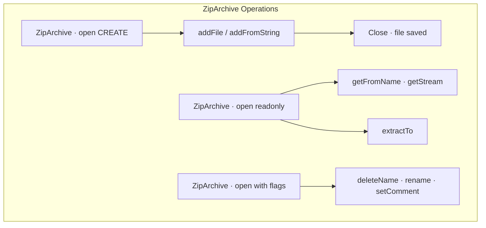

# Zip — Archive Management

## Overview

PHP's Zip extension provides read, write, and modification capabilities for ZIP archives using the `ZipArchive` class. It supports full archive operations: creating, extracting, adding files, password protection, and compression control. The extension also provides a `zip://` stream wrapper for accessing files within archives without full extraction.



## Opening & Creating Archives

### Creating a New Archive

```php
<?php
declare(strict_types=1);

$zip = new ZipArchive();

// Create new file (overwrite if exists)
$result = $zip->open('/tmp/archive.zip', ZipArchive::CREATE | ZipArchive::OVERWRITE);
if ($result !== true) {
    throw new \RuntimeException("Failed to create archive (code: $result)");
}

// Add a file from disk
$zip->addFile('/path/to/file.pdf', 'documents/file.pdf');

// Add from string
$zip->addFromString('hello.txt', 'Hello World!');

// Add an empty directory
$zip->addEmptyDir('empty-folder');

// Set compression
$zip->setCompressionName('hello.txt', ZipArchive::CM_DEFLATE, 9);
// or for all files:
$zip->setCompressionIndex(0, ZipArchive::CM_DEFLATE, 9);

// Set a comment on the archive
$zip->setArchiveComment('Archive created: ' . date('Y-m-d'));

// Save & close
$zip->close();

echo "Archive created successfully\n";
```

### Opening Existing Archives

```php
<?php
declare(strict_types=1);

$zip = new ZipArchive();

// Read-only
$result = $zip->open('/tmp/archive.zip', ZipArchive::RDONLY);
if ($result !== true) {
    // Error codes handled below
}

// Read-write (exclusive access)
$result = $zip->open('/tmp/archive.zip');

// Error handling
$errorMessages = [
    ZipArchive::ER_OK       => 'No error',
    ZipArchive::ER_MULTIDISK => 'Multi-disk zip archives not supported',
    ZipArchive::ER_RENAME   => 'Renaming temporary file failed',
    ZipArchive::ER_CLOSE    => 'Closing zip archive failed',
    ZipArchive::ER_SEEK     => 'Seek error',
    ZipArchive::ER_READ     => 'Read error',
    ZipArchive::ER_WRITE    => 'Write error',
    ZipArchive::ER_CRC      => 'CRC error',
    ZipArchive::ER_ZIPCLOSED => 'Archive was closed',
    ZipArchive::ER_NOENT    => 'File not found',
    ZipArchive::ER_EXISTS   => 'File already exists',
    ZipArchive::ER_OPEN     => 'Cannot open file',
    ZipArchive::ER_TMPOPEN  => 'Cannot open temp file',
    ZipArchive::ER_ZLIB     => 'Zlib error',
    ZipArchive::ER_MEMORY   => 'Memory allocation failure',
    ZipArchive::ER_CHANGED  => 'Entry has been changed',
    ZipArchive::ER_COMPNOTSUPP => 'Compression method not supported',
    ZipArchive::ER_EOF      => 'Premature EOF',
    ZipArchive::ER_INVAL    => 'Invalid argument',
    ZipArchive::ER_NOZIP    => 'Not a zip archive',
    ZipArchive::ER_INTERNAL => 'Internal error',
    ZipArchive::ER_INCONS   => 'Zip archive inconsistent',
    ZipArchive::ER_REMOVE   => 'Cannot remove file',
    ZipArchive::ER_DELETED  => 'Entry has been deleted',
];

if ($result !== true) {
    throw new \RuntimeException(
        "Zip error: " . ($errorMessages[$result] ?? "Unknown code: $result")
    );
}
```

## Reading Archives

### Listing and Reading Files

```php
<?php
declare(strict_types=1);

$zip = new ZipArchive();
$zip->open('/tmp/archive.zip');

// Count files
$numFiles = $zip->numFiles;  // int
echo "Archive contains $numFiles files\n";

// List files with details
for ($i = 0; $i < $numFiles; $i++) {
    $stat = $zip->statIndex($i);
    
    printf(
        "[%s] %s — %s bytes, crc32: %s, compressed: %s bytes\n",
        $stat['comp_method'] === ZipArchive::CM_STORE ? 'STORED' : 'DEFLATED',
        $stat['name'],
        number_format($stat['size']),
        dechex($stat['crc']),
        number_format($stat['comp_size'])
    );
}

// Get file contents by name
$contents = $zip->getFromName('hello.txt');
if ($contents === false) {
    echo "File not found\n";
}

// Get file contents by index
$contents = $zip->getFromIndex(0);

// Stream access (for large files without loading into memory)
$stream = $zip->getStream('large-file.mp4');
if ($stream !== false) {
    while (!feof($stream)) {
        $chunk = fread($stream, 8192);
        // Process chunk
    }
    fclose($stream);
}
```

### Extracting Archives

```php
<?php
declare(strict_types=1);

$zip = new ZipArchive();
$zip->open('/tmp/archive.zip');

// Extract all files to directory
$zip->extractTo('/tmp/extracted/');

// Extract specific files
$zip->extractTo('/tmp/extracted/', ['documents/file.pdf', 'hello.txt']);

// Extract by pattern (manual iteration)
for ($i = 0; $i < $zip->numFiles; $i++) {
    $name = $zip->getNameIndex($i);
    if (str_ends_with($name, '.jpg')) {
        $zip->extractTo('/tmp/images/', $name);
    }
}

$zip->close();
```

## Modifying Archives

### Adding & Updating Files

```php
<?php
declare(strict_types=1);

$zip = new ZipArchive();
$zip->open('/tmp/archive.zip', ZipArchive::CREATE);

// Add a file with local path preservation
$zip->addFile('/var/log/app.log', 'logs/app.log');

// Add file from string with timestamp
$zip->addFromString('config.json', json_encode(['version' => 2], JSON_PRETTY_PRINT));

// Set file modification time (timestamp)
$zip->setMtimeName('config.json', time());

// Add directory contents recursively
function addDirToZip(ZipArchive $zip, string $dir, string $basePath = ''): void
{
    $iterator = new RecursiveIteratorIterator(
        new RecursiveDirectoryIterator($dir, RecursiveDirectoryIterator::SKIP_DOTS)
    );
    
    foreach ($iterator as $file) {
        /** @var SplFileInfo $file */
        $localPath = $basePath . '/' . $iterator->getSubPathname();
        $zip->addFile($file->getPathname(), ltrim($localPath, '/'));
    }
}

addDirToZip($zip, '/var/www/html', 'html');

// Replace existing file
$zip->deleteName('old-config.xml');
$zip->addFromString('old-config.xml', $newContent);

$zip->close();
```

### Deleting & Renaming

```php
<?php
declare(strict_types=1);

$zip = new ZipArchive();
$zip->open('/tmp/archive.zip');

// Delete by name
$zip->deleteName('unwanted-file.txt');

// Delete by index
$zip->deleteIndex(3);

// Rename
$zip->renameName('old-name.txt', 'new-name.txt');
$zip->renameIndex(0, 'renamed-file.txt');

$zip->close();

// Note: Deletions and renames take effect on close()
// Until then, other ops see the old state
```

## Compression Options

### Compression Methods

```php
<?php
declare(strict_types=1);

// Compression methods
ZipArchive::CM_STORE;     // No compression (fast, large)
ZipArchive::CM_DEFLATE;   // DEFLATE (good balance)
ZipArchive::CM_BZIP2;     // BZIP2 (better compression, slower)
ZipArchive::CM_LZMA;      // LZMA (best compression, very slow)
ZipArchive::CM_XZ;        // XZ compression

// Set compression for a specific file
$zip->setCompressionName('text.txt', ZipArchive::CM_DEFLATE, 9);
$zip->setCompressionIndex(0, ZipArchive::CM_BZIP2, 9);

// Default for new files
$zip->setCompressionName('*', ZipArchive::CM_DEFLATE, 6);
```

### Compression Levels

| Level | DEFLATE | BZIP2 | Use Case |
|-------|---------|-------|----------|
| 0 | None | None | Already-compressed data (images, video) |
| 1–3 | Fast | Fast | Quick archival |
| 4–6 | Balanced | Balanced | **Default choice** |
| 7–9 | Max | Max | Distribution archives, minimize size |

## Password Protection

```php
<?php
declare(strict_types=1);

$zip = new ZipArchive();
$zip->open('/tmp/protected.zip', ZipArchive::CREATE);

// Set password — applied to all subsequent add operations
$zip->setPassword('secure-password-123');

// Add files with encryption (ZipArchive::EM_AES_256 recommended)
$zip->addFile('confidential.pdf', 'report.pdf');
$zip->setEncryptionName('report.pdf', ZipArchive::EM_AES_256); // PHP 7.2+

// Or for all files
$zip->setEncryptionIndex(0, ZipArchive::EM_AES_256);

// Also supports:
// ZipArchive::EM_NONE       — No encryption
// ZipArchive::EM_AES_128   — AES-128
// ZipArchive::EM_AES_192   — AES-192
// ZipArchive::EM_AES_256   — AES-256 (recommended)
// ZipArchive::EM_TRAD_PKZIP — Traditional PKZIP 2.0 (WEAK)

$zip->close();

// Opening password-protected archive
$zip2 = new ZipArchive();
$zip2->open('/tmp/protected.zip');
$zip2->setPassword('secure-password-123');

$contents = $zip2->getFromName('report.pdf');
if ($contents === false) {
    echo "Wrong password or corrupted file\n";
}
```

## Stream Wrapper (`zip://`)

```php
<?php
declare(strict_types=1);

// Read a file inside a ZIP without opening it via ZipArchive
$contents = file_get_contents('zip:///tmp/archive.zip#hello.txt');

// Write to a file inside a ZIP (not supported — use ZipArchive)

// Open a stream
$fp = fopen('zip:///tmp/archive.zip#documents/report.pdf', 'rb');
while (!feof($fp)) {
    echo fread($fp, 4096);
}
fclose($fp);

// Include a PHP file from a ZIP
// First register as a prefix:
// Or simply use the stream:
include 'zip:///tmp/app.zip#vendor/autoload.php';
```

## Archive Properties & Metadata

```php
<?php
declare(strict_types=1);

$zip = new ZipArchive();
$zip->open('/tmp/archive.zip');

// Archive comment
$comment = $zip->getArchiveComment();
$zip->setArchiveComment('Updated: ' . date('c'));

// File-level comments
for ($i = 0; $i < $zip->numFiles; $i++) {
    $comment = $zip->getCommentIndex($i);
    $name = $zip->getNameIndex($i);
    
    $zip->setCommentIndex($i, "Added on: " . date('Y-m-d'));
}

// File status
$status = $zip->status;             // ZipArchive::ER_*
$systemStatus = $zip->statusSys;    // System-level error code
```

## Error Handling

```php
<?php
declare(strict_types=1);

// ZipArchive methods return true on success, false on failure
// BUT open() returns integer error codes

function safeExtract(string $archivePath, string $destDir): void
{
    $zip = new ZipArchive();
    $code = $zip->open($archivePath, ZipArchive::RDONLY);
    
    if ($code !== true) {
        $messages = [
            ZipArchive::ER_NOENT  => "Archive not found: $archivePath",
            ZipArchive::ER_NOZIP  => "Not a valid ZIP file: $archivePath",
            ZipArchive::ER_OPEN   => "Can't open file: $archivePath",
            ZipArchive::ER_MEMORY => "Out of memory",
            ZipArchive::ER_INCONS => "Archive is corrupted: $archivePath",
        ];
        throw new \RuntimeException(
            $messages[$code] ?? "Unknown error (code: $code)"
        );
    }
    
    // Verify each file before extraction
    for ($i = 0; $i < $zip->numFiles; $i++) {
        $name = $zip->getNameIndex($i);
        
        // Prevent zip slip (directory traversal)
        $realPath = realpath($destDir) . '/' . $name;
        if (!str_starts_with($realPath, realpath($destDir) . DIRECTORY_SEPARATOR)) {
            throw new \RuntimeException("Zip slip detected: $name");
        }
        
        // Check CRC
        $stat = $zip->statIndex($i);
        $contents = $zip->getFromIndex($i);
        if ($contents === false) {
            throw new \RuntimeException("Failed to read: $name");
        }
        if (crc32($contents) !== $stat['crc']) {
            throw new \RuntimeException("CRC mismatch: $name");
        }
    }
    
    $zip->extractTo($destDir);
    $zip->close();
}
```

## Large Archive Handling

```php
<?php
declare(strict_types=1);

// For archives with thousands of files

// Use getStream() instead of getFromName() for large files
$zip = new ZipArchive();
$zip->open('/tmp/huge.zip');

for ($i = 0; $i < $zip->numFiles; $i++) {
    $name = $zip->getNameIndex($i);
    if (filesize-like-check && $zip->statIndex($i)['size'] > 100 * 1024 * 1024) {
        // Stream it, don't load into memory
        $stream = $zip->getStream($name);
        // Write to output file chunk by chunk
        $out = fopen("/tmp/extracted/$name", 'wb');
        stream_copy_to_stream($stream, $out);
        fclose($out);
        fclose($stream);
    } else {
        $zip->extractTo('/tmp/extracted/', $name);
    }
}

$zip->close();
```

## Common Pitfalls

1. **Open failure codes** — `ZipArchive::open()` returns integer error codes, not `false`. Always compare to `true`.
2. **Zip Slip vulnerability** — Always validate extracted paths with `realpath()` to prevent directory traversal attacks.
3. **Password must be set before extraction** — `$zip->setPassword()` must be called before `getFromName()` or `extractTo()`.
4. **AES-256 not supported on all systems** — `ZipArchive::EM_AES_256` requires libzip ≥ 1.6.0. Older systems may only support traditional PKZIP encryption.
5. **File handles remain open** — `close()` must be called to flush changes. The destructor attempts this, but errors are suppressed.
6. **`overwrite` flag behavior** — Without `ZipArchive::OVERWRITE`, open with `CREATE` appends to an existing archive.
7. **Empty directories** — `addEmptyDir()` adds a directory entry. Some unzip tools may not show it if no files are inside.
8. **UTF-8 filenames in older ZIP tools** — Modern ZIP supports UTF-8, but `ZipArchive::FL_ENC_RAW`, `FL_ENC_GUESS`, `FL_ENC_UTF8` flags control encoding behavior.

## References

- [PHP: ZipArchive](https://www.php.net/manual/en/class.ziparchive.php)
- [PHP: Zip Functions](https://www.php.net/manual/en/book.zip.php)
- [PHP: zip:// Wrapper](https://www.php.net/manual/en/wrappers.compression.php)
- [libzip Documentation](https://libzip.org/documentation/)
