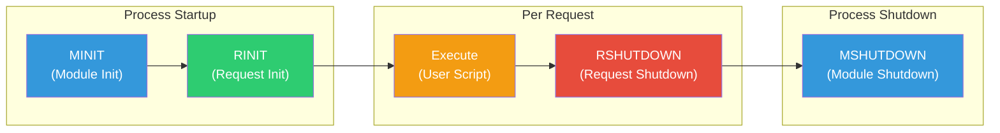
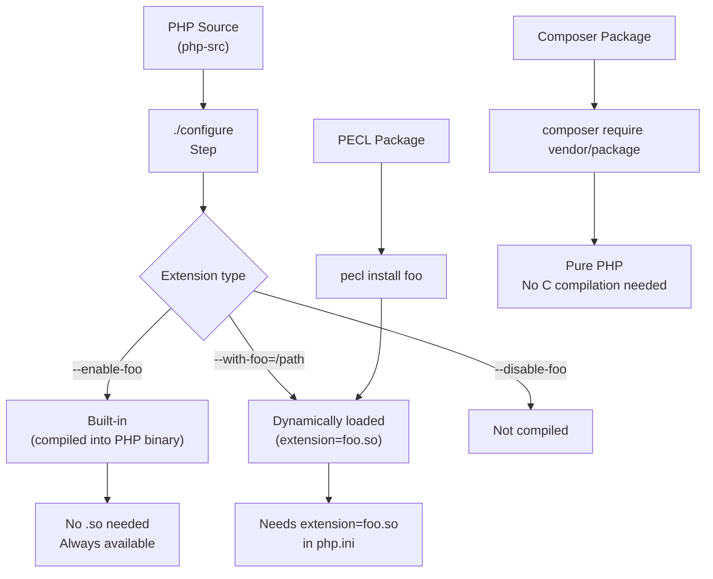

# PHP Extension Architecture

## 1. Overview

PHP extensions are compiled libraries that extend PHP's core functionality. They range from built-in extensions like `mbstring` and `PDO` to third-party PECL extensions like `Xdebug` and `Redis`. Understanding how extensions work — their lifecycle, C API, build system, and operational considerations — is essential for any PHP developer who needs to choose, configure, or (rarely) write extensions.

PHP 8.4 supports two categories of extensions:

- **Core extensions**: Bundled with PHP, compiled during `./configure` (e.g., `json`, `ctype`, `session`)
- **External extensions**: Distributed via PECL or bundled with PHP but compiled separately (e.g., `xdebug`, `redis`, `imagick`)

Additionally, PHP provides **FFI (Foreign Function Interface)** — a way to call C libraries from PHP without writing a C extension — and **Composer packages** for pure-PHP library functionality.

### Extension vs Library Decision

```
Need to extend PHP? 
    │
    ├── Calling a C library → Use FFI (PHP 8.4+) or write a C extension
    ├── Adding PHP functions/classes → Write a Composer package
    ├── Modifying language behavior → Write a zend_extension (Xdebug, Opcache)
    └── Optimizing hot path → Write a C extension (or use FFI + JIT)
```

---

## 2. Concepts

### 2.1 Extension Types

PHP has two distinct categories of extensions, loaded via different mechanisms:

| Type | Loading Directive | Examples | Purpose |
|------|------------------|----------|---------|
| **PHP Extension** | `extension=foo.so` | `mbstring`, `pdo_mysql`, `redis` | Adds functions, classes, constants |
| **Zend Extension** | `zend_extension=foo.so` | `Xdebug`, `Opcache`, `Tideways` | Modifies engine internals, hooks into execution |

**Key difference:** Zend extensions hook into the Zend Engine at a deeper level (they can intercept `zend_execute_ex`, `zend_compile_file`, etc.). PHP extensions use the Zend API to register functions and classes but cannot modify engine behavior.

### 2.2 Extension Lifecycle

Every PHP extension follows a four-phase lifecycle that mirrors the PHP process lifecycle:



**Phase details:**

| Phase | Called | Purpose | Zend Function |
|-------|--------|---------|---------------|
| **MINIT** | Module init (once per process) | Register classes, constants, INI entries, resource types | `PHP_MINIT_FUNCTION` |
| **RINIT** | Request init (once per request) | Reset per-request state, allocate request memory | `PHP_RINIT_FUNCTION` |
| **Execute** | User script runs | The actual PHP script execution | N/A |
| **RSHUTDOWN** | Request shutdown (after script) | Clean up request resources, free memory | `PHP_RSHUTDOWN_FUNCTION` |
| **MSHUTDOWN** | Module shutdown (process end) | Free module-level resources, unregister entries | `PHP_MSHUTDOWN_FUNCTION` |

### 2.3 Extension Registration

Extensions register themselves via the `zend_module_entry` struct:

```c
// Conceptual C struct for extension registration
typedef struct _zend_module_entry {
    unsigned short size;          // sizeof(zend_module_entry)
    unsigned int zend_api;        // ZEND_MODULE_API_NO
    unsigned char zend_debug;     // Whether built with debug
    unsigned char zts;            // Whether built with ZTS
    const struct _zend_ini_entry *ini_entry;
    const struct _zend_function_entry *functions;
    // ... module globals, startup/shutdown handlers ...
    int (*module_startup_func)(int type, int module_number);
    int (*request_startup_func)(int type, int module_number);
    int (*request_shutdown_func)(int type, int module_number);
    int (*module_shutdown_func)(int type, int module_number);
} zend_module_entry;
```

### 2.4 Built-in vs External Extensions



---

## 3. Internal Architecture

### 3.1 The `config.w32` / `config.m4` Build System

Each C extension ships with build configuration files:

- **`config.m4`** — Autoconf-based (Linux/macOS): defines how to locate libraries, set compiler flags, and link against system libraries
- **`config.w32`** — Windows build configuration

```m4
# Simplified config.m4 for a PHP extension
PHP_ARG_ENABLE(myext, whether to enable my extension,
[  --enable-myext          Enable my extension support])

if test "$PHP_MYEXT" != "no"; then
    PHP_NEW_EXTENSION(myext, myext.c, $ext_shared)
fi
```

### 3.2 The `zend_extension` (Engine Hook) Architecture

Zend extensions register callbacks at the engine level:

```c
typedef struct _zend_extension {
    char *name;
    char *version;
    char *author;
    // ... metadata ...
    void (*startup)(zend_extension *extension);
    void (*shutdown)(zend_extension *extension);
    void (*activate)(void);      // Per-request activation
    void (*deactivate)(void);    // Per-request deactivation
    void (*op_array_handler)(zend_op_array *op_array);  // Called per compiled file
    void (*exception_handler)(zend_exception *exception);
    void (*execute_handler)(zend_execute_data *execute_data);  // Intercept execution
    // ...
} zend_extension;
```

**How Xdebug hooks in (simplified):**

```c
// Xdebug replaces the engine's execute function
original_zend_execute_ex = zend_execute_ex;
zend_execute_ex = xdebug_execute_ex;

void xdebug_execute_ex(zend_execute_data *execute_data) {
    // 1. Check if breakpoint at this location
    // 2. Send "break" status to IDE via DBGp
    // 3. Wait for IDE command (step over, step in, continue)
    // 4. Resume execution: original_zend_execute_ex(execute_data)
}
```

### 3.3 PHP Extension Function Registration

A PHP extension registers functions using `zend_function_entry`:

```c
// Registering functions in an extension
const zend_function_entry myext_functions[] = {
    PHP_FE(myext_do_something, arginfo_myext_do_something)
    PHP_FE(myext_get_version,  arginfo_myext_get_version)
    PHP_FE_END  // Sentinel
};

// Function implementation
PHP_FUNCTION(myext_do_something)
{
    zend_string *input;
    
    ZEND_PARSE_PARAMETERS_START(1, 1)
        Z_PARAM_STR(input)
    ZEND_PARSE_PARAMETERS_END();
    
    // ... actual work ...
    RETURN_STRING("processed: " . ZSTR_VAL(input));
}
```

### 3.4 Extension Resource Types

PHP C extensions manage non-PHP resources (database connections, file handles, streams) via **resource types** (`zend_resource`):

```c
// Register a resource destructor in MINIT
int le_myext_connection;
// ...
le_myext_connection = zend_register_list_destructors_ex(
    myext_connection_dtor,   // Destructor function
    "myext connection",      // Name
    module_number
);

// Resource destructor (called in RSHUTDOWN or when unset)
void myext_connection_dtor(zend_resource *rsrc)
{
    myext_connection *conn = (myext_connection *) rsrc->ptr;
    myext_close_connection(conn);
}
```

---

## 4. API Reference

### 4.1 PHP Functions for Extension Management

```php
// Loading/unloading
dl(string $extension_filename): bool  // Load extension at runtime (deprecated, CLI only)

// Introspection
extension_loaded(string $name): bool
get_loaded_extensions(bool $zend_extensions = false): array
get_extension_funcs(string $extension_name): array|false
extension_classes(string $extension, bool $autoload = true): array  // PHP 8.3+

// Module discovery
get_defined_functions(bool $exclude_disabled = true): array
get_declared_classes(): array
get_declared_interfaces(): array
get_declared_traits(): array

// Class/method existence
class_exists(string $class, bool $autoload = true): bool
method_exists(object|string $object_or_class, string $method): bool
function_exists(string $function): bool

// Version info
phpversion(?string $extension = null): string|false  // Get PHP or extension version
phpinfo(int $flags = INFO_ALL): true                  // Show extension information
```

### 4.2 FFI API (Foreign Function Interface)

PHP 8.4 FFI allows calling C functions and using C structs from PHP:

```php
// FFI basic API
FFI::cdef(string $code = '', ?string $lib = null): FFI
FFI::load(string $filename): FFI                  // Load C header file
FFI::scope(string $name): FFI                     // Reuse preloaded definition
FFI::new(string $type, bool $owned = true, bool $persistent = false): FFI\CData
FFI::free(FFI\CData $ptr): void
FFI::cast(string $type, FFI\CData $ptr): FFI\CData
FFI::typeof(FFI\CData $ptr): FFI\CType
FFI::arrayType(FFI\CType $type, array $dimensions): FFI\CType
FFI::memcpy(FFI\CData $to, FFI\CData|string $from, int $size): void
FFI::memcmp(FFI\CData|string $a, FFI\CData|string $b, int $size): int
FFI::memset(FFI\CData $ptr, int $value, int $size): void
FFI::string(FFI\CData $ptr, int $size = -1): string
FFI::addr(FFI\CData $ptr): FFI\CData
```

### 4.3 Extension Lifecycle Hooks (C API)

```c
// Module lifecycle — defined in the extension's source
PHP_MINIT_FUNCTION(extension_name);      // Module initialization
PHP_MSHUTDOWN_FUNCTION(extension_name);  // Module shutdown
PHP_RINIT_FUNCTION(extension_name);      // Request initialization
PHP_RSHUTDOWN_FUNCTION(extension_name);  // Request shutdown

// Module info (shown by phpinfo())
PHP_MINFO_FUNCTION(extension_name);

// Globals (per-module state)
ZEND_BEGIN_MODULE_GLOBALS(extension_name)
    zend_long  some_setting;
    zend_bool  initialized;
ZEND_END_MODULE_GLOBALS(extension_name)

#ifdef ZTS
#define MYEXT_G(v) TSRMG(myext_globals_id, zend_myext_globals *, v)
#else
#define MYEXT_G(v) (myext_globals.v)
#endif
```

---

## 5. Examples

### 5.1 Managing Extensions

```bash
# List all loaded extensions
php -m
php -m | grep -i redis

# List only Zend extensions
php -i | grep "Zend Extension" -A 20 | head -25

# Check if a specific extension is loaded
php -r "echo extension_loaded('mbstring') ? 'loaded' : 'not loaded';"

# Get extension version
php -r "echo phpversion('xdebug') ?: 'not installed';"

# Get extension functions
php -r "print_r(get_extension_funcs('json'));"

# Enable/disable via phpenmod (Ubuntu/Debian)
phpenmod xdebug       # Enable Xdebug
phpdismod xdebug      # Disable Xdebug

# Enable/disable manually
# In php.ini or conf.d/
# ; Enable extension
# extension=redis.so
# ; Disable (comment out)
# ;extension=redis.so
```

### 5.2 Install via PECL

```bash
# Install a PECL extension
pecl install redis
pecl install xdebug
pecl install imagick

# Install a specific version
pecl install redis-6.0.2

# List installed PECL packages
pecl list

# Uninstall
pecl uninstall redis

# Build from a package file
pecl install ./package-1.0.tgz

# Common PECL options
pecl install -a         # Auto-enable in php.ini
pecl install -f         # Force reinstall
```

### 5.3 Using FFI to Call C Libraries

```php
<?php
declare(strict_types=1);

/**
 * FFI example: call libc's printf and use libcurl from PHP.
 * Requires: extension=ffi (bundled with PHP 8.4)
 */

// Load libc printf
$libc = FFI::cdef(
    "int printf(const char *format, ...);",
    "libc.so.6"  // or "libc.dylib" on macOS, "msvcrt.dll" on Windows
);

$libc->printf("Hello from FFI! %d + %d = %d\n", 3, 4, 3 + 4);

// Load curl version from libcurl
$curl = FFI::cdef(
    "const char *curl_version(void);",
    "libcurl.so.4"
);

echo "libcurl version: " . $curl->curl_version() . "\n";

// Working with C structs
$ffi = FFI::cdef("
    typedef struct {
        double x;
        double y;
    } point_t;
    
    double distance(point_t *a, point_t *b);
", "./libgeometry.so");

$p1 = $ffi->new('point_t');
$p1->x = 0.0;
$p1->y = 0.0;

$p2 = $ffi->new('point_t');
$p2->x = 3.0;
$p2->y = 4.0;

$dist = $ffi->distance(FFI::addr($p1), FFI::addr($p2));
echo "Distance: $dist\n";  // 5.0
```

### 5.4 Verifying Extension Dependencies

```php
<?php
declare(strict_types=1);

/**
 * Extension dependency checker — verify required extensions at boot.
 */
class ExtensionDependencyChecker
{
    /** @var array<string, array{loaded: bool, version: string}> */
    private array $extensions = [];

    /**
     * @param array<string, string|null> $requirements [name => minVersion|null]
     */
    public function __construct(
        private readonly array $requirements
    ) {}

    public function check(): array
    {
        $errors = [];

        foreach ($this->requirements as $ext => $minVersion) {
            $loaded = extension_loaded($ext);
            $version = $loaded ? (phpversion($ext) ?: 'unknown') : 'not loaded';

            $this->extensions[$ext] = [
                'loaded' => $loaded,
                'version' => $version,
            ];

            if (!$loaded) {
                $errors[] = "Required extension '$ext' is not loaded";
                continue;
            }

            if ($minVersion !== null && version_compare($version, $minVersion, '<')) {
                $errors[] = "Extension '$ext' version $version is below minimum $minVersion";
            }
        }

        return $errors;
    }

    public function report(): string
    {
        $lines = ["=== Extension Dependency Report ==="];
        foreach ($this->extensions as $name => $info) {
            $status = $info['loaded'] ? '✅' : '❌';
            $lines[] = sprintf(
                "  %s %s v%s",
                $status,
                str_pad($name, 20),
                $info['version']
            );
        }
        return implode("\n", $lines);
    }
}

// Usage
$checker = new ExtensionDependencyChecker([
    'mbstring' => '8.0',
    'pdo_mysql' => null,   // Any version
    'json' => null,
    'redis' => '5.0',
]);

$errors = $checker->check();
if ($errors !== []) {
    error_log(implode("\n", $errors));
    exit(1);
}

echo $checker->report();
```

### 5.5 Composer Package with Extension Requirements

```json
{
    "name": "myorg/database-tools",
    "type": "library",
    "require": {
        "php": ">=8.1",
        "ext-pdo": "*",
        "ext-pdo_mysql": "*",
        "ext-mbstring": "*"
    },
    "require-dev": {
        "ext-xdebug": "*",
        "phpunit/phpunit": "^11.0"
    },
    "suggest": {
        "ext-redis": "For Redis-based caching support",
        "ext-apcu": "For APCu local caching"
    }
}
```

---

## 6. Common Patterns

### 6.1 Feature Detection Using Extension Checks

```php
<?php
declare(strict_types=1);

class CacheFactory
{
    public function create(): CacheInterface
    {
        return match (true) {
            extension_loaded('redis') && class_exists(\Redis::class) => new RedisCache(),
            extension_loaded('apcu')  => new ApcuCache(),
            extension_loaded('memcached') => new MemcachedCache(),
            default => new ArrayCache(),
        };
    }
}

// Usage: gracefully degrade when extensions aren't available
$cache = (new CacheFactory())->create();
```

### 6.2 FFI Library Loader with Caching

```php
<?php
declare(strict_types=1);

/**
 * FFI library loader — load C libraries with preloading optimization.
 */
class FFILoader
{
    private static array $instances = [];

    public static function load(string $headerCode, string $library): FFI
    {
        $key = md5($headerCode . $library);

        if (!isset(self::$instances[$key])) {
            if (!extension_loaded('ffi')) {
                throw new \RuntimeException('FFI extension not loaded');
            }
            self::$instances[$key] = FFI::cdef($headerCode, $library);
        }

        return self::$instances[$key];
    }

    /**
     * Preload FFI definitions via opcache.preload.
     * Reduces per-request overhead of FFI::cdef().
     */
    public static function preload(): void
    {
        // These FFI instances will be shared via Opcache preloading
        self::load(
            "int printf(const char *format, ...);",
            PHP_OS_FAMILY === 'Windows' ? 'msvcrt.dll' : 'libc.so.6'
        );
    }
}

// In opcache.preload script:
// FFILoader::preload();
```

### 6.3 Graceful Extension Unavailability

```php
<?php
declare(strict_types=1);

/**
 * Graceful fallback when an extension is not available.
 */
function imageResize(string $path, int $width, int $height): string
{
    if (extension_loaded('imagick')) {
        // High-quality ImageMagick path
        $img = new \Imagick($path);
        $img->resizeImage($width, $height, Imagick::FILTER_LANCZOS, 1);
        $result = $img->getImageBlob();
        $img->destroy();
        return $result;
    }

    if (extension_loaded('gd')) {
        // GD fallback (lower quality but always available)
        $img = imagecreatefromstring(file_get_contents($path));
        $resized = imagescale($img, $width, $height);
        ob_start();
        imagepng($resized);
        $result = ob_get_clean();
        imagedestroy($img);
        imagedestroy($resized);
        return $result;
    }

    throw new \RuntimeException(
        'No image processing extension available (install imagick or gd)'
    );
}
```

---

## 7. Anti-patterns

### 7.1 Loading Extensions at Runtime with `dl()`
❌ `dl()` is deprecated and only works in CLI. Extensions should be loaded via `php.ini` or `conf.d/`. Never call `dl()` in application code.

### 7.2 Assuming All Extensions Are Available
❌ Writing code that depends on a non-core extension without checking:
```php
// ❌ Bad
$redis = new Redis();
$redis->connect('127.0.0.1');

// ✅ Good
if (!class_exists(\Redis::class)) {
    throw new \RuntimeException('Redis extension not installed');
}
$redis = new Redis();
$redis->connect('127.0.0.1');
```

### 7.3 Using PECL Extensions Without Compatibility Checking
❌ Installing `pecl install xdebug` on a PHP version that's incompatible. Always check the extension's PHP version requirements.

### 7.4 Loading Duplicate Extensions
❌ Loading an extension both compiled-in AND via `php.ini`:
```ini
; ❌ Bad: json is built-in, no need to load it again
extension=json.so
```
Check with `php -m` — built-in extensions don't need `extension=` lines.

### 7.5 FFI Abuse
❌ Using FFI for every C library call instead of writing a proper extension when performance matters. FFI has per-call overhead (~50-200ns) versus a native extension (~5-20ns).

### 7.6 Not Using `extension=` Ordering
❌ Extensions are loaded in order. Some extensions depend on others (e.g., `mysqli` needs `pdo_mysql`). Use numbered files in `conf.d/` to control loading order:
```ini
conf.d/
├── 10-opcache.ini
├── 20-pdo.ini
├── 30-pdo_mysql.ini
└── 40-redis.ini
```

### 7.7 Disabling PHP Extensions Via `php.ini` That Are Compiled In
❌ Core extensions can't be disabled via `php.ini` — they're compiled directly into the PHP binary. Use `./configure` flags to exclude them at build time.

---

## 8. Performance

### 8.1 Extension Loading Overhead

Each dynamically loaded extension (`extension=foo.so`) adds:

- File I/O to read the `.so` file (once per process startup)
- Symbol resolution and linking (~1-50ms depending on extension size)
- Memory from the extension's `.data` and `.bss` segments
- Per-request overhead (RINIT/RSHUTDOWN) for extensions that allocate request resources

**Benchmark:** Disabling unused extensions can reduce PHP-FPM startup time by 30-50%:

```bash
# Measure startup time
php -r "echo microtime(true) - PHP_STARTUP_TIME;"
# With all extensions: ~30ms
# With minimal extensions: ~15ms
```

### 8.2 FFI Performance Characteristics

| Operation | Latency | Notes |
|-----------|---------|-------|
| `FFI::cdef()` | ~50-500μs | C parsing + symbol resolution — cache these |
| `FFI::new()` struct | ~50-100ns | Memory allocation for C data |
| FFI function call | ~50-200ns | Marshalling overhead per call |
| FFI array access | ~10-50ns | Bounds-checked |
| Native C extension call | ~5-20ns | No FFI overhead |

**Preloading FFI:** Use `opcache.preload` to define FFI instances once, eliminating `FFI::cdef()` overhead on every request.

### 8.3 Minimize Extension Footprint

```bash
# List all loaded extensions with memory info
php -i | grep -E "(memory_limit|Memory usage)"

# Profile extension load time (custom build)
# --with-<ext>=shared → compiled as .so
# --with-<ext>=static → compiled into PHP binary (no separate load)
```

---

## 9. Security

### 9.1 Extension Security Considerations

| Concern | Risk | Mitigation |
|---------|------|------------|
| **Untrusted extensions** | Malicious C code can access all memory | Only install from PECL or trusted sources |
| **Outdated extensions** | Known CVEs | Regular `pecl upgrade` |
| **FFI with user input** | Arbitrary memory access | Validate all input to FFI functions |
| **Extension privileges** | Extensions run as PHP process | Least-privilege OS user for PHP |

### 9.2 Safe FFI Usage

```php
<?php
declare(strict_types=1);

/**
 * Safe FFI — never expose FFI::new() or FFI::cast() to user input.
 */
class SafeCrypt
{
    private ?FFI $libsodium = null;

    public function encrypt(string $plaintext, string $key): string
    {
        // Use PHP's native sodium extension instead of FFI libsodium
        // (safer, no C data exposure)
        $nonce = random_bytes(SODIUM_CRYPTO_SECRETBOX_NONCEBYTES);
        $ciphertext = sodium_crypto_secretbox($plaintext, $nonce, $key);
        return $nonce . $ciphertext;
    }
}
```

### 9.3 Extension Validation

```bash
# Verify integrity of installed PECL extensions
pecl info <package> | grep -E "(Installed|Version|MD5)"

# Check for known PHP extension CVEs
# https://github.com/FriendsOfPHP/security-advisories
composer require --dev friends-of-php/security-advisories
```

---

## 10. Testing

### 10.1 Testing Extension Availability

```php
<?php
declare(strict_types=1);

class ExtensionTest extends \PHPUnit\Framework\TestCase
{
    public function testRequiredExtensionsLoaded(): void
    {
        $required = [
            'mbstring'  => 'All string functions (multibyte)',
            'pdo'       => 'Database abstraction',
            'json'      => 'JSON encoding/decoding',
            'ctype'     => 'Character type checking',
            'filter'    => 'Input validation',
            'hash'      => 'Hashing algorithms',
            'session'   => 'Session handling',
        ];

        foreach ($required as $ext => $reason) {
            $this->assertTrue(
                extension_loaded($ext),
                "Required extension '$ext' is not loaded ($reason)"
            );
        }
    }

    public function testExtensionVersions(): void
    {
        if (extension_loaded('redis')) {
            $version = phpversion('redis');
            $this->assertNotNull($version, 'Redis extension version unknown');
            $this->assertTrue(
                version_compare($version, '5.0.0', '>='),
                "Redis extension $version < 5.0.0"
            );
        }
    }

    /** @dataProvider functionExistenceProvider */
    public function testExtensionFunctions(string $extension, string $function): void
    {
        $this->assertTrue(
            function_exists($function),
            "Function '$function' should exist when '$extension' is loaded"
        );
    }

    public function functionExistenceProvider(): array
    {
        return [
            'json'    => ['json', 'json_encode'],
            'mbstring' => ['mbstring', 'mb_strlen'],
            'pdo'      => ['pdo', 'pdo_drivers'],
        ];
    }
}
```

### 10.2 Testing Composer Extension Requirements

```json
{
    "scripts": {
        "check-extensions": [
            "@php -r \"extension_loaded('pdo_mysql') || exit(1);\"",
            "@php -r \"extension_loaded('mbstring') || exit(1);\"",
            "@php -r \"extension_loaded('json') || exit(1);\""
        ],
        "post-install-cmd": ["@check-extensions"],
        "post-update-cmd": ["@check-extensions"]
    }
}
```

---

## 11. Troubleshooting

### 11.1 Extension Won't Load

```bash
# Step 1: Check if file exists
ls -la $(php -i | grep extension_dir | awk -F'=> ' '{print $2}')/myext.so

# Step 2: Verify PHP binary compatibility
php -i | grep "PHP API"
php -i | grep "Zend Extension Build"

# Step 3: Test loading directly
php -d extension=myext.so -m

# Step 4: Check for symbol errors (Linux)
ldd /path/to/myext.so

# Step 5: Check PHP error log
tail -20 /var/log/php/errors.log
```

### 11.2 Extension Conflicts

```bash
# Two extensions registering the same function
php -r "get_extension_funcs('ext1');" | grep conflicting
php -r "get_extension_funcs('ext2');" | grep conflicting

# Solution: disable one of them
phpdismod conflicting-ext
```

### 11.3 PECL Installation Issues

```bash
# PECL build fails — check PHP development headers
phpize --version
# If missing: apt install php8.4-dev

# Build against specific PHP config
phpize
./configure --with-php-config=/usr/bin/php-config8.4
make
make install

# Check PECL channel
pecl channel-update pecl.php.net
```

### 11.4 Common Extension Errors

| Error | Cause | Solution |
|-------|-------|----------|
| `PHP Warning: PHP Startup: Unable to load dynamic library` | `.so` not found or incompatible | Check `extension_dir` and PHP API version |
| `Call to undefined function` | Extension not loaded | `php -m | grep ext_name` |
| `PHP Fatal error: Cannot redeclare function` | Two extensions with same function | Check for duplicates in `conf.d/` |
| `pecl: command not found` | PECL not installed | `apt install php-pear` or `pecl install` via `php -r` |
| `configure: error: libfoo not found` | Missing dev library | `apt install libfoo-dev` |
| `make: *** [ext/foo.lo] Error 1` | Compilation error | Check PHP version compatibility |

---

## 12. Recipes

### 12.1 Extension Audit Script

```bash
#!/bin/bash
# ext-audit.sh — Comprehensive PHP extension audit

echo "=== PHP Extension Audit ==="
echo "PHP Version: $(php -v | head -1)"
echo ""

echo "Loaded Extensions ($(php -m | grep -v '^\[' | wc -l)):"
echo "--- Core (built-in) ---"
php -m | grep -v -x -f <(php -m 2>/dev/null | head -1) || true
echo ""

echo "--- Zend Extensions ---"
php -i | grep -A 100 "Zend Extension" | head -20
echo ""

echo "--- Dynamic Extensions ---"
php -i | grep "extension_dir" | head -1
ls -la "$(php -i | grep extension_dir | awk -F'=> ' '{print $2}')" 2>/dev/null
echo ""

echo "--- Extension Versions ---"
for ext in $(php -m | grep -v '^\[' | tr '[:upper:]' '[:lower:]'); do
    ver=$(php -r "echo phpversion('$ext') ?: '-';")
    printf "  %-20s %s\n" "$ext" "$ver"
done
```

### 12.2 Writing a Minimal C Extension (Hello World)

```c
/* hello.c — Minimal PHP extension
 * Build: phpize && ./configure && make && make install
 * Enable: extension=hello.so
 */

#ifdef HAVE_CONFIG_H
#include "config.h"
#endif

#include "php.h"
#include "ext/standard/info.h"

#define PHP_HELLO_VERSION "1.0.0"

/* Function declaration */
PHP_FUNCTION(hello_world);

/* Argument info */
ZEND_BEGIN_ARG_INFO(arginfo_hello_world, 0)
    ZEND_ARG_INFO(0, name)
ZEND_END_ARG_INFO()

/* Function entries */
static const zend_function_entry hello_functions[] = {
    PHP_FE(hello_world, arginfo_hello_world)
    PHP_FE_END
};

/* Module entry */
zend_module_entry hello_module_entry = {
    STANDARD_MODULE_HEADER,
    "hello",
    hello_functions,
    NULL,  // MINIT
    NULL,  // MSHUTDOWN
    NULL,  // RINIT
    NULL,  // RSHUTDOWN
    NULL,  // MINFO
    PHP_HELLO_VERSION,
    STANDARD_MODULE_PROPERTIES
};

#ifdef COMPILE_DL_HELLO
#ifdef ZTS
ZEND_TSRMLS_CACHE_DEFINE()
#endif
ZEND_GET_MODULE(hello)
#endif

/* Function implementation */
PHP_FUNCTION(hello_world)
{
    zend_string *name = NULL;

    ZEND_PARSE_PARAMETERS_START(0, 1)
        Z_PARAM_OPTIONAL
        Z_PARAM_STR(name)
    ZEND_PARSE_PARAMETERS_END();

    if (name != NULL) {
        RETURN_STRF("Hello, %s!", ZSTR_VAL(name));
    }

    RETURN_STRING("Hello, World!");
}
```

### 12.3 FFI Preloading for Performance

```php
<?php
declare(strict_types=1);

// preload-ffi.php — Add to opcache.preload

// Preload common FFI definitions to avoid per-request cdef() overhead
$loaded = [];

// System math library
$loaded['libm'] = FFI::cdef("
    double sin(double x);
    double cos(double x);
    double sqrt(double x);
    double pow(double x, double y);
    double floor(double x);
    double ceil(double x);
", PHP_OS_FAMILY === 'Windows' ? 'msvcrt.dll' : 'libm.so.6');

// Register in a global scope for reuse
if (function_exists('opcache_preload')) {
    // These FFI objects are now cached in shared memory
    echo "Preloaded " . count($loaded) . " FFI definitions\n";
}
```

### 12.4 PHP 8.4 Extension Compatibility Matrix

| Extension | Status in PHP 8.4 | Notes |
|-----------|-------------------|-------|
| Xdebug 3 | ✅ Compatible | Requires Xdebug 3.3+ |
| Opcache | ✅ Built-in | Core zend_extension |
| Redis | ✅ Compatible | PECL 6.0+ recommended |
| APCu | ✅ Compatible | PECL version |
| Memcached | ✅ Compatible | PECL 3.2+ |
| imagick | ✅ Compatible | PECL 3.7+ |
| MongoDB | ✅ Compatible | PECL 1.17+ |
| PDO | ✅ Built-in | Core |
| mbstring | ✅ Built-in | Core |
| FFI | ✅ Built-in | Core, no longer experimental |
| Swoole | ⚠️ Check | Requires Swoole 5.1+ for PHP 8.4 |
| Componere | ⚠️ Check | May need updates for PHP 8.4 |

---

## 13. AI Reasoning Notes

### Key Mental Models

1. **Extensions are C code running in the PHP process**: They share the same memory space, same lifetime, and same privileges. A buggy extension can crash PHP, leak memory, or create security vulnerabilities.

2. **The lifecycle defines the contract**: MINIT/MSHUTDOWN are for module-level resources (once per process). RINIT/RSHUTDOWN are for per-request resources. Getting this wrong means either leaking memory across requests or re-initializing unnecessarily.

3. **Zend extensions vs PHP extensions**: Zend extensions (Opcache, Xdebug) modify the engine itself. PHP extensions (PDO, mbstring) use the engine API. Zend extensions are more powerful but also more fragile — they hook into internal engine functions that can change between minor PHP versions.

4. **FFI replaces 80% of the C extension use case**: Before PHP 7.4, if you needed to call a C library, you wrote a C extension. FFI eliminates that need for most cases. The remaining cases for C extensions are: (a) modifying engine behavior, (b) performance-critical paths where FFI overhead matters, (c) libraries with complex C ABIs that are hard to express in `FFI::cdef()`.

5. **Extension loading is ordered and stateful**: The order of `extension=` directives in `php.ini` matters. Extensions loaded earlier can affect later ones. `zend_extension` directives are processed before `extension` directives.

6. **PECL is a source distribution system, not a binary one**: `pecl install` compiles extensions from source. This means you need PHP development headers (`phpize`), a C compiler, and any library the extension depends on. It also means extensions are compiled with your specific PHP API version — no "binary compatibility" concerns.

7. **Composer packages are safer than PECL extensions**: Pure PHP packages run in sandboxed PHP — they can't crash the process. C extensions can. Prefer Composer packages when possible, PECL when you need native performance or direct C library access.

### When to Reach for This Skill

- Choosing between a Composer package, PECL extension, or FFI for a task
- Debugging an extension that won't load (incompatible API version, missing symbols)
- Setting up a new PHP environment and deciding which extensions are needed
- Writing a Composer package with platform/extension requirements
- Using FFI to call a system library from PHP
- Deciding whether to compile an extension statically or as a shared library
- Auditing which extensions are loaded and their security posture
- Understanding extension lifecycle for custom extension development
- Preloading FFI definitions for performance optimization

### Pro Tips

- **`php -m` is your quick-check** — it lists everything loaded without running script code
- **Use `php -i | grep` before `phpinfo()`** in web contexts to avoid HTML output
- **PECL extensions must be rebuilt after PHP upgrades** — the C ABI changes between PHP minor versions
- **`opcache.preload` can preload FFI definitions** — eliminates `FFI::cdef()` overhead per request
- **Number your `conf.d/` files** (`10-`, `20-`, `99-`) to get predictable loading order
- **Check `extension_dir` value** before debugging load failures — it's the first thing to verify
- **Static compilation (`--with-ext`) eliminates `.so` file loading** but increases binary size
- **FFI is not a security boundary** — calling C code from FFI has the same security implications as running a native extension