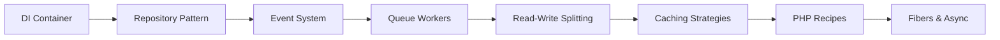
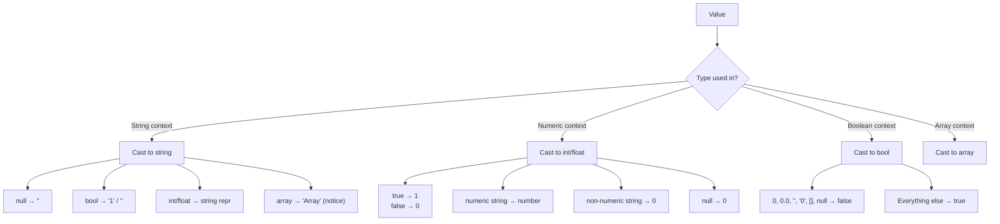

# PHP Skills Index

> Complete navigable catalog of PHP 8.4 language skills.
> Each skill below is a standalone reference with production code, best practices, and common pitfalls.

---

## 1. Language Fundamentals

| # | Skill | Description |
|---|-------|-------------|
| 1 | [PHP Syntax](../php-syntax/skill.md) | PHP tags, comments, statements, echo/print, encoding, file format |
| 2 | [PHP Types](../php-types/skill.md) | Scalar, compound, special types; type declarations; strict_types; nullable/union/intersection types; mixed, never, void, static, false, true |
| 3 | [PHP Variables](../php-variables/skill.md) | Variable scope, variable variables, references, predefined variables, type coercion |
| 4 | [PHP Operators](../php-operators/skill.md) | Arithmetic, assignment, comparison, logical, bitwise, string, array, nullsafe, error control, instanceof |
| 5 | [PHP Functions](../php-functions/skill.md) | User-defined functions, parameters, return types, closures, arrow functions, generators, variadic |
| 6 | [PHP Classes (OOP)](../php-classes/skill.md) | Classes, objects, constructor promotion, inheritance, abstract, final, interfaces, traits, readonly, property hooks, asymmetric visibility |
| 7 | [PHP Enums](../php-enums/skill.md) | Pure enums, backed enums, methods, match with enums, serialization |
| 8 | [PHP Traits](../php-traits/skill.md) | Horizontal code reuse, composition, conflict resolution, trait precedence, abstract members |
| 9 | [PHP Namespaces](../php-namespaces/skill.md) | Namespace declaration, import, use, PSR-4 autoloading, Composer, global fallback |
| 10 | [PHP Attributes](../php-attributes/skill.md) | Native attribute syntax, built-in attributes (#[Override], #[Deprecated], etc.), custom attributes, reflection |
| 11 | [PHP Reflection](../php-reflection/skill.md) | ReflectionClass, ReflectionMethod, ReflectionProperty, ReflectionAttribute, dynamic inspection and invocation |
| 12 | [PHP Exceptions](../php-exceptions/skill.md) | Throwable, Exception, Error, try/catch/finally, custom exceptions, set_exception_handler |
| 13 | [PHP Fibers](../php-fibers/skill.md) | Cooperative multitasking, Fiber::suspend(), Fiber::resume(), async patterns |
| 14 | [PHP Generators](../php-generators/skill.md) | yield, yield from, send(), return, Generator interface, lazy iteration |
| 15 | [PHP OOP](../php-oop/skill.md) | Comprehensive OOP reference: encapsulation, inheritance, polymorphism, late static binding, magic methods |

---

## 2. Data & Strings

| # | Skill | Description |
|---|-------|-------------|
| 16 | [PHP Arrays](../php-arrays/skill.md) | Array creation, access, sorting, searching, stack/queue ops, array_* functions, destructuring, spread |
| 17 | [PHP Strings](../php-strings/skill.md) | String functions, encoding, regex, interpolation, heredoc/nowdoc, multibyte, formatting |
| 18 | [PHP JSON](../php-json/skill.md) | json_encode/decode, flags, JSON_THROW_ON_ERROR, JsonSerializable, streaming |

---

## 3. Filesystem & Streams

| # | Skill | Description |
|---|-------|-------------|
| 19 | [PHP Filesystem](../php-filesystem/skill.md) | File read/write, directories, permissions, uploads, temp files, path manipulation, locking |
| 20 | [PHP Streams](../php-streams/skill.md) | Stream wrappers, contexts, filters, php://, data://, stream_select, non-blocking I/O |

---

## 4. Web & Networking

| # | Skill | Description |
|---|-------|-------------|
| 21 | [PHP cURL](../php-curl/skill.md) | HTTP client, curl_setopt_array, multi handles, concurrent requests, cookie handling, authentication, proxies |
| 22 | [PHP Sessions](../php-session/skill.md) | Session handling, session handlers, security, custom save handlers, Redis session storage |
| 23 | [PHP XML](../php-xml/skill.md) | DOMDocument, SimpleXML, XMLReader/XMLWriter, XPath, XSLT, parsing, RSS/Atom |

---

## 5. Database

| # | Skill | Description |
|---|-------|-------------|
| 24 | [PHP PDO](../php-pdo/skill.md) | PDO connections, prepared statements, transactions, fetch modes, error handling, driver-specific quirks |
| 25 | [PHP MySQLi](../php-mysqli/skill.md) | MySQLi procedural and OOP, prepared statements, transactions, multi-query, metadata |

---

## 6. Security & Cryptography

| # | Skill | Description |
|---|-------|-------------|
| 26 | [PHP Security](../php-security/skill.md) | Input validation, CSRF, XSS prevention, SQL injection, file upload security, cryptography, password hashing, CSP |
| 27 | [PHP OpenSSL](../php-openssl/skill.md) | Encryption/decryption, CSR, certificates, public/private keys, signing, secure random |
| 28 | [PHP Sodium](../php-sodium/skill.md) | libsodium: authenticated encryption (XChaCha20-Poly1305), secret-key, public-key, hashing |
| 29 | [PHP Hash](../php-hash/skill.md) | hash, hash_hmac, hash_equals, timing-safe comparison, password_hash/verify, hash_pbkdf2 |
| 30 | [PHP Filter](../php-filter/skill.md) | filter_var, FILTER_VALIDATE_*, FILTER_SANITIZE_*, input validation, custom filters |
| 31 | [PHP Random](../php-random/skill.md) | random_bytes, random_int, CSPRNG, shuffle, shuffle with secure random, token generation |

---

## 7. Extensions & Specialized

| # | Skill | Description |
|---|-------|-------------|
| 32 | [PHP Date/Time](../php-datetime/skill.md) | DateTime, DateTimeImmutable, DateInterval, timezones, formatting, cron parsing, calendar |
| 33 | [PHP PCRE](../php-pcre/skill.md) | preg_match, preg_replace, regex patterns, modifiers, PCRE2 JIT, performance, Unicode |
| 34 | [PHP BCMath](../php-bcmath/skill.md) | Arbitrary precision decimal arithmetic: bcadd, bccomp, bcdiv, bcmod, bcmul, bcpow, bcscale |
| 35 | [PHP GMP](../php-gmp/skill.md) | GNU Multiple Precision: gmp_add, gmp_mul, gmp_pow, gmp_prob_prime, number theory operations |
| 36 | [PHP SPL](../php-spl/skill.md) | Standard PHP Library: data structures (SplStack, SplQueue, SplHeap, SplObjectStorage), iterators, file handling |
| 37 | [PHP Debugging](../php-debugging/skill.md) | xdebug, error handling, logging, profiling, tracing, assertion, debug_backtrace, dump/debug helpers |
| 38 | [PHP Performance](../php-performance/skill.md) | OPcache, JIT tuning, profiling, memory optimization, opcodes, benchmarking, profiling tools |

---

## 8. Configuration & Environment

| # | Skill | Description |
|---|-------|-------------|
| 39 | [PHP Configuration](../php-configuration/skill.md) | System configuration: extensions, ini settings, environment setup, compile-time options, module loading |
| 40 | [PHP php.ini](../php-phpini/skill.md) | Complete php.ini directives reference: core settings, resource limits, error handling, OPcache, JIT, uploads, sessions |
| 41 | [PHP SAPI](../php-sapi/skill.md) | Server API reference: CLI, CGI, FastCGI, FPM, Apache mod_php, built-in server, embedded SAPI |

---

## 9. PHP Archive & Compression

| # | Skill | Description |
|---|-------|-------------|
| 42 | [PHP ZIP](../php-ext-zip/skill.md) | ZipArchive: create, read, modify, extract ZIP archives, stream wrappers, password protection, compression levels |
| 43 | [PHP PHAR](../php-ext-phar/skill.md) | PHAR archives: create, extract, stub files, compression, signing, phar:// stream, web distribution |

---

## 10. Networking & File Transfer

| # | Skill | Description |
|---|-------|-------------|
| 44 | [PHP FTP](../php-ext-ftp/skill.md) | FTP client: ftp_connect, login, passive/active mode, FTPS, recursive operations, ftp:// stream wrapper |

---

## 11. Internationalization

| # | Skill | Description |
|---|-------|-------------|
| 45 | [PHP Intl](../php-ext-intl/skill.md) | Internationalization: Collator, NumberFormatter, DateFormatter, MessageFormatter, Transliterator, Normalizer, Locale |

---

## 12. Recipes (Production Patterns)

| # | Skill | Description |
|---|-------|-------------|
| 46 | [PHP Recipes](../php-recipes/skill.md) | Production-ready implementations: REST API, JWT, Repository, DI Container, Caching, Logger, CLI, Webhook, File Upload, Image Processing, Pagination, Rate Limiter, Queue, Events, Validation, cURL Multi |
| 47 | [PHP Recipes — Auth](../php-recipes-auth/skill.md) | Authentication & authorization: JWT, session auth, OAuth 2.0 client, API tokens, TOTP/2FA, RBAC, password policies, CSRF, password reset, security headers |
| 48 | [PHP Recipes — Database](../php-recipes-database/skill.md) | Database patterns: PDO wrapper, query builder, repository, migrations, seeding, transactions with savepoints, read-write splitting, offset & cursor pagination, connection pooling |

---

## 13. Extensions Reference (Overview)

| # | Skill | Key Classes/Functions | Use Case |
|---|-------|----------------------|----------|
| 49 | [Extensions Overview](../php-extensions/skill.md) | Core vs bundled vs external | Understanding PHP extension architecture |

### Extension details by category:

**Database** — PDO (24 drivers), MySQLi (MySQL-only), SQLite3, PostgreSQL (pgsql), Oracle (oci8), MongoDB, Redis
**Web** — cURL (HTTP client), Sessions (session handling), XML/SimpleXML (parsing), JSON, SOAP, FTP, SSH2
**Security** — OpenSSL (encryption/CSR), Sodium (modern crypto), Hash, Filter (validation), Random
**Math** — BCMath (decimal), GMP (big integers), stats
**Text** — PCRE (regex), mbstring (multibyte), intl (i18n), iconv, POSIX regex
**Files** — Zip, Phar, Rar, LZF, LZ4, Zstd
**Images** — GD, Imagick, Exif
**Dates** — DateTime, Calendar
**Meta** — Reflection, SPL, Tokenizer, OPcache, FFI

---

## 14. Quick Reference Tables

### 14.1 PHP Type System

| Type | Category | Example | Declaration |
|------|----------|---------|-------------|
| `bool` | Scalar | `true` | `bool` |
| `int` | Scalar | `42` | `int` |
| `float` | Scalar | `3.14` | `float` |
| `string` | Scalar | `"hello"` | `string` |
| `array` | Compound | `[1, 2, 3]` | `array` |
| `object` | Compound | `new Foo()` | `object` |
| `callable` | Special | `fn() => 1` | `callable` |
| `iterable` | Special | `[1,2]` | `iterable` |
| `mixed` | Supertype | anything | `mixed` |
| `never` | Return | never returns | `never` |
| `void` | Return | no return | `void` |
| `null` | Special | `null` | `?Type` / `null` |
| `true`/`false` | Standalone | `true` | PHP 8.2+ |
| `resource` | Special | `fopen()` | (legacy) |

### 14.2 PHP 8.x Feature Timeline

| Feature | Version | Status |
|---------|---------|--------|
| Named arguments | 8.0 | Stable |
| Constructor promotion | 8.0 | Stable |
| Match expression | 8.0 | Stable |
| Nullsafe operator `?->` | 8.0 | Stable |
| Union types | 8.0 | Stable |
| `mixed` type | 8.0 | Stable |
| `static` return type | 8.0 | Stable |
| `Stringable` interface | 8.0 | Stable |
| Enums | 8.1 | Stable |
| `readonly` properties | 8.1 | Stable |
| Fibers | 8.1 | Stable |
| First-class callable syntax | 8.1 | Stable |
| `never` type | 8.1 | Stable |
| Intersection types | 8.1 | Stable |
| `readonly` classes | 8.2 | Stable |
| Standalone `true`/`false`/`null` types | 8.2 | Stable |
| Disjunctive normal form types | 8.2 | Stable |
| `#[SensitiveParameter]` | 8.2 | Stable |
| `json_validate()` | 8.3 | Stable |
| `#[Override]` | 8.3 | Stable |
| Typed class constants | 8.3 | Stable |
| `mb_str_pad()`, `mb_trim()`, etc. | 8.3 | Stable |
| Property hooks | 8.4 | Stable |
| Asymmetric visibility | 8.4 | Stable |
| `array_find()`, `array_find_key()` | 8.4 | Stable |
| PDO driver-specific subclasses | 8.4 | Stable |
| `mb_ucfirst()`, `mb_lcfirst()` | 8.4 | Stable |
| `http_get_last_response_headers()` | 8.4 | Stable |
| BCMath with `BcMath\\Number` | 8.4 | Stable |
| DOM HTML5 support | 8.4 | Stable |
| `#[\Deprecated]` attribute | 8.4 | Stable |
| `request_parse_body()` | 8.4 | Stable |
| `PhpToken::getTokenName()` | 8.4 | Stable |

### 14.3 Common `php.ini` Values

```ini
; — Resource Limits —
memory_limit = 128M          ; Per-script memory (0 = unlimited in CLI)
max_execution_time = 30      ; Seconds (0 = unlimited in CLI)
max_input_time = 60           ; Seconds to parse input
post_max_size = 8M            ; Max POST data
upload_max_filesize = 2M      ; Max file upload
max_file_uploads = 20         ; Max files per request

; — Error Handling —
error_reporting = E_ALL
display_errors = Off          ; On in development
log_errors = On
error_log = /var/log/php_errors.log

; — OPcache —
opcache.enable = On
opcache.memory_consumption = 256
opcache.max_accelerated_files = 40000
opcache.revalidate_freq = 2
opcache.jit = tracing         ; PHP 8.0+
opcache.jit_buffer_size = 256M

; — Session —
session.save_handler = files
session.save_path = /tmp/sessions
session.gc_maxlifetime = 1440
session.cookie_httponly = On
session.cookie_samesite = Lax
session.use_strict_mode = On
session.sid_length = 32
session.sid_bits_per_character = 5

; — Uploads —
file_uploads = On
upload_tmp_dir = /tmp

; — Date —
date.timezone = UTC

; — Security —
expose_php = Off
allow_url_include = Off       ; [Critical] Disable remote file inclusion
cgi.fix_pathinfo = 0          ; [Critical] Disable path info attacks
```

### 14.4 Common Design Patterns

| Pattern | When to Use | Key Components |
|---------|-------------|----------------|
| Repository | Abstract data access | Interface + Impl (PDO, Redis, in-memory) |
| Dependency Injection | Manage service wiring | Container + Autowiring |
| Factory | Complex object creation | Factory class/static method |
| Singleton | Shared resource (discouraged) | private constructor, static instance |
| Strategy | Swappable algorithms | Interface + multiple implementations |
| Observer | Event-driven architecture | Event + Dispatcher + Listeners |
| Decorator | Add behavior dynamically | Wrapper class with same interface |
| Adapter | Interface compatibility | Converter between incompatible interfaces |
| Template Method | Skeleton algorithm | Abstract class with overridable steps |
| Middleware | Request pipeline | Chain of responsibility pattern |

### 14.5 PSR Standards

| PSR | Title | Status | Summary |
|-----|-------|--------|---------|
| PSR-1 | Basic Coding Standard | Accepted | PHP tags, side effects, class/namespace naming |
| PSR-3 | Logger Interface | Accepted | `LoggerInterface` with 8 log levels |
| PSR-4 | Autoloading | Accepted | Namespace-to-directory mapping |
| PSR-6 | Caching Interface | Accepted | `CacheItemPoolInterface`, `CacheItemInterface` |
| PSR-7 | HTTP Message Interface | Accepted | `RequestInterface`, `ResponseInterface` |
| PSR-11 | Container Interface | Accepted | `ContainerInterface` with `get()` and `has()` |
| PSR-12 | Extended Coding Style | Accepted | PSR-1 superset with strict formatting rules |
| PSR-14 | Event Dispatcher | Accepted | `EventDispatcherInterface`, `ListenerInterface` |
| PSR-17 | HTTP Factories | Accepted | `RequestFactoryInterface`, `ResponseFactoryInterface` |
| PSR-18 | HTTP Client | Accepted | `ClientInterface` with `sendRequest()` |

---

## 15. Learning Path

### For PHP Beginners


### For Intermediate Developers


### For Advanced Developers



---

## 16. Version Compatibility Map

### PHP 8.4 New Features

```mermaid
flowchart TD
    subgraph "PHP 8.4 New Features"
        PH[Property Hooks]
        AV[Asymmetric Visibility]
        AF[array_find, array_find_key]
        PDOR[PDO Driver Subclasses]
        MULTI[mb_ucfirst, mb_lcfirst]
        HTTP[http_get_last_response_headers]
        DOMHTML[DOM HTML5 Support]
        DEPR[#[Deprecated] attribute]
        BCMATH[BcMath\Number class]
        RPB[request_parse_body]
        PT[PhpToken::getTokenName]
    end
    
    PH --> OOP[Classes / OOP]
    AV --> OOP
    AF --> ARR[Arrays]
    PDOR --> DB[PDO / Database]
    MULTI --> STR[Strings]
    HTTP --> LIBCURL[cURL / HTTP]
    DOMHTML --> XML[XML / DOM]
    DEPR --> ATTRIBUTES[Attributes]
    BCMATH --> MATH[BCMath]
    RPB --> FW[Web / Framework]
    PT --> REFLECTION[Reflection]
```

### Backward Compatibility Breaks

| Change | PHP Version | Impact |
|--------|-------------|--------|
| `E_NOTICE` → `E_WARNING` for some operations | 8.0 | Moderate |
| `get_class()` without argument deprecated | 8.0 | Low |
| Reflection methods signature changes | 8.0 | Low |
| `PDO::ATTR_EMULATE_PREPARES` default → `true` | 8.1 | Moderate |
| `Serializable` interface deprecated | 8.1 | Low |
| `mbstring` `func_overload` removed | 8.2 | Low (removed) |
| `utf8_encode`/`decode` deprecated | 8.2 | Low |
| `${var}` string interpolation removed | 8.2 | Low (removed) |
| Dynamic properties deprecated | 8.2 | High (disable with `#[AllowDynamicProperties]`) |
| `SensitiveParameterValue` added | 8.2 | None (additive) |
| `json_serialize()` function renamed | 8.3 | Low |
| `randomizer` engine changes | 8.3 | Low |
| `mb_check_encoding()` without argument deprecated | 8.4 | Low |
| Soft deprecation of `E_STRICT` | 8.4 | Low |
| `session. gc_*` default changes | 8.4 | Low |
| BCMath as `BcMath\Number` class | 8.4 | Additive |

---

## 17. Quick Reference

### 17.1 Common `$_SERVER` Values

| Variable | Description | Available In |
|----------|-------------|-------------|
| `$_SERVER['REQUEST_METHOD']` | HTTP method (GET, POST, etc.) | Web |
| `$_SERVER['REQUEST_URI']` | Full URI path + query string | Web |
| `$_SERVER['QUERY_STRING']` | Query string only | Web |
| `$_SERVER['HTTP_HOST']` | Host header | Web |
| `$_SERVER['HTTP_USER_AGENT']` | Browser user agent | Web |
| `$_SERVER['REMOTE_ADDR']` | Client IP address | Web |
| `$_SERVER['SERVER_NAME']` | Server hostname | Web |
| `$_SERVER['SCRIPT_FILENAME']` | Absolute script path | Web + CLI |
| `$_SERVER['argv']` | CLI arguments array | CLI |

### 17.2 Reserved Constants

| Constant | Value | Description |
|----------|-------|-------------|
| `PHP_VERSION` | `"8.4.0"` | PHP version |
| `PHP_MAJOR_VERSION` | `8` | Major version |
| `PHP_MINOR_VERSION` | `4` | Minor version |
| `PHP_RELEASE_VERSION` | `0` | Release version |
| `PHP_INT_MAX` | `9223372036854775807` | Max integer (64-bit) |
| `PHP_INT_MIN` | `-9223372036854775808` | Min integer (64-bit) |
| `PHP_INT_SIZE` | `8` | Integer byte size (64-bit) |
| `PHP_FLOAT_MAX` | `1.7976931348623E+308` | Max float |
| `PHP_FLOAT_MIN` | `2.2250738585072E-308` | Min positive float |
| `PHP_OS` | `"Linux"` | Operating system |
| `PHP_EOL` | `"\n"` | Line ending |
| `PHP_SAPI` | `"cli"` | Server API |
| `DIRECTORY_SEPARATOR` | `"/"` | Directory separator |

### 17.3 Magic Methods Summary

| Method | Purpose |
|--------|---------|
| `__construct()` | Constructor |
| `__destruct()` | Destructor |
| `__get($name)` | Read inaccessible property |
| `__set($name, $value)` | Write inaccessible property |
| `__isset($name)` | Check inaccessible property |
| `__unset($name)` | Unset inaccessible property |
| `__call($name, $args)` | Call inaccessible method |
| `__callStatic($name, $args)` | Call inaccessible static method |
| `__toString()` | String conversion |
| `__invoke($...)` | Object as function |
| `__clone()` | Object cloning |
| `__serialize()` → `array` | Custom serialization (PHP 7.4+) |
| `__unserialize(array $data)` | Custom deserialization (PHP 7.4+) |
| `__debugInfo()` → `array` | var_dump() output |
| `__set_state(array $props)` | var_export() callback (static) |

### 17.4 Type Juggling Rules



---

## 18. Reference

- [PHP Manual](https://www.php.net/manual/en/)
- [PHP: Language Reference](https://www.php.net/manual/en/langref.php)
- [PHP: Function Reference](https://www.php.net/manual/en/funcref.php)
- [PHP: Features](https://www.php.net/manual/en/features.php)
- [PHP RFCs](https://wiki.php.net/rfc)
- [PHP Supported Versions](https://www.php.net/supported-versions.php)
- [PHP: The Right Way](https://phptherightway.com/)
- [PSR Standards](https://www.php-fig.org/psr/)
- [Composer](https://getcomposer.org/)
- [PHP-FIG](https://www.php-fig.org/)
