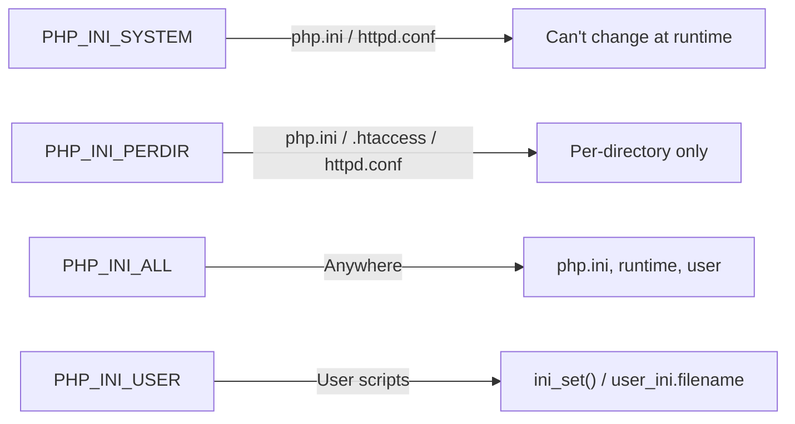
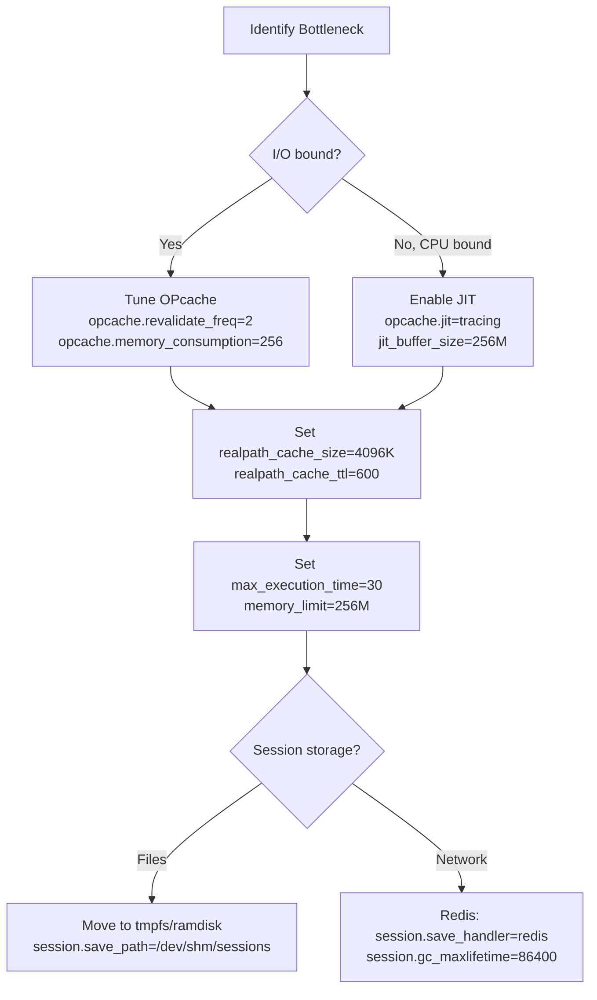

# PHP.INI Directives — Master Reference

## Overview

`php.ini` is the central configuration file for the PHP runtime, controlling everything from resource limits and error reporting to extension loading and performance tuning. PHP reads `php.ini` at startup; settings prefixed with `PHP_INI_SYSTEM` or `PHP_INI_PERDIR` require a server restart or request-boundary reset, while `PHP_INI_ALL` and `PHP_INI_USER` can be changed at runtime via `ini_set()`.

## Configuration Modes (PHP_INI_*)



## Core Directives

### Resource Limits

| Directive | Default | Description |
|-----------|---------|-------------|
| `max_execution_time` | `30` | Maximum script runtime in seconds (0 = unlimited). CLI defaults to `0`. |
| `max_input_time` | `60` | Maximum time to parse input data (POST/GET/files). |
| `memory_limit` | `128M` | Per-script memory ceiling. Use `-1` for unlimited (CLI). |
| `max_input_vars` | `1000` | Maximum number of `$_GET`/`$_POST`/`$_COOKIE` vars accepted. |
| `max_file_uploads` | `20` | Maximum number of uploaded files per request. |
| `upload_max_filesize` | `2M` | Maximum size of an individual uploaded file. |
| `post_max_size` | `8M` | Maximum size of POST data (must exceed `upload_max_filesize`). |
| `max_input_nesting_level` | `64` | Maximum nesting depth for input variables. |

### Error Handling & Logging

```php
// Recommended development configuration
error_reporting = E_ALL
display_errors = On
display_startup_errors = On
log_errors = On
error_log = "/var/log/php_errors.log"
// Recommended production configuration
error_reporting = E_ALL & ~E_DEPRECATED & ~E_STRICT
display_errors = Off
display_startup_errors = Off
log_errors = On
error_log = "/var/log/php_errors.log"
```

| Directive | Default | Notes |
|-----------|---------|-------|
| `error_reporting` | `E_ALL & ~E_DEPRECATED & ~E_STRICT` | Bitmask of reported levels |
| `display_errors` | `On` | **Off** in production (security) |
| `display_startup_errors` | `Off` | Shows errors during PHP startup |
| `log_errors` | `On` | Send errors to `error_log` |
| `error_log` | *empty* | Path to error log file or `syslog` |
| `ignore_repeated_errors` | `Off` | Suppress duplicate error messages |
| `html_errors` | `On` | HTML-formatted error output |
| `xmlrpc_errors` | `Off` | Special XML-RPC error formatting |

### File Uploads

```ini
file_uploads = On
upload_tmp_dir = "/tmp/php-uploads"
upload_max_filesize = 64M
max_file_uploads = 20
post_max_size = 80M  ; Must exceed upload_max_filesize
```

### Date & Time

```ini
date.timezone = "UTC"
date.default_latitude = 31.7667
date.default_longitude = 35.2333
date.sunrise_zenith = 90.583333
date.sunset_zenith = 90.583333
```

## OPcache Directives

OPcache dramatically improves performance by storing precompiled script bytecode in shared memory.

```ini
opcache.enable = On                              ; Enable OPcache
opcache.memory_consumption = 256                 ; MB of shared memory (default: 128)
opcache.interned_strings_buffer = 16             ; MB for interned strings (default: 8)
opcache.max_accelerated_files = 40000            ; Max files in cache (default: 10000)
opcache.revalidate_freq = 2                      ; Seconds between file checks (0 = check every request)
opcache.fast_shutdown = On                       ; Fast shutdown sequence
opcache.enable_cli = Off                         ; Enable for CLI (usually Off)
opcache.validate_timestamps = On                 ; Check file mtimes
opcache.revalidate_path = Off                    ; Revalidate with include_path changes
opcache.save_comments = On                       ; Keep doc comments (required by many frameworks)
opcache.load_comments = On                       ; Load doc comments
opcache.file_cache = "/tmp/php-opcache"          ; File-based fallback cache
opcache.file_cache_only = Off                    ; Use only file cache
opcache.max_file_size = 0                        ; Max file size to cache (0 = all)
opcache.consistency_checks = 0                   ; Check hash consistency (0 = never)
opcache.optimization_level = 0x7FFEBFFF          ; Enable optimization passes
opcache.huge_code_pages = On                     ; Use huge pages for code (Linux)
opcache.validate_permission = On                 ; Check file permissions on revalidate
opcache.validate_root = On                       ; Check doc_root on revalidate
```

### JIT (Just-In-Time Compilation)

PHP 8.0+ with OPcache JIT compiles hot paths to native machine code.

```ini
opcache.jit = tracing                            ; tracing|function|on|off
opcache.jit_buffer_size = 256M                   ; JIT buffer (default: 0, JIT disabled)
opcache.jit_bisect_limit = 0
opcache.jit_debug = 0
opcache.jit_hot_func = 127                       ; Function call count before JIT
opcache.jit_hot_loop = 64                        ; Loop iteration count before JIT
opcache.jit_hot_return = 8                       ; Return call count before JIT
opcache.jit_hot_side_exit = 8                    ; Side exit threshold
opcache.jit_max_exit_count = 1024                ; Max traced exits
opcache.jit_max_loop_count = 128                 ; Max traced loops
opcache.jit_max_polymorphic = 8                  ; Max polymorphic calls traced
opcache.jit_max_recursive_calls = 256            ; Max recursion depth traced
opcache.jit_max_recursive_return_calls = 256     ; Max recursive return calls
opcache.jit_max_root_traces = 1024               ; Max root traces in pending queue
opcache.jit_max_side_traces = 128                ; Max side traces per root
opcache.jit_max_trace_length = 1024              ; Max instructions per trace
opcache.jit_prof_threshold = 0.005               ; Profiling threshold (seconds)
```

**JIT profiles:**

| `opcache.jit` value | Description |
|---------------------|-------------|
| `tracing` | JIT compiles hot code paths (traces). Best CPU-bound perf. |
| `function` | JIT compiles entire hot functions. Lower memory, less perf. |
| `on` | Use CPU-based CFG heuristic (tracing-based detection) |
| `off` | NO JIT compilation (this was removed in 8.4, use `opcache.jit=disable`)|

> **Warning:** JIT is not always beneficial for I/O-bound web apps. Profile first with `opcache.jit=tracing` vs `off`.

## Stream Directives

```ini
allow_url_fopen = On               ; Allow http://, ftp://, etc. in fopen()
allow_url_include = Off            ; [Security] Disable remote file inclusion
default_socket_timeout = 60        ; Socket timeout in seconds
auto_detect_line_endings = Off     ; Auto-detect \r\n (legacy)
from = ""                          ; Anonymous FTP password
user_agent = "PHP"                 ; Default User-Agent for stream wrappers
```

## Session Directives

```ini
session.save_handler = files             ; files|redis|memcached|user
session.save_path = "/tmp/sessions"      ; Directory or DSN
session.name = PHPSESSID                 ; Cookie name
session.auto_start = Off                 ; Auto-start on every page
session.gc_probability = 1               ; GC probability numerator
session.gc_divisor = 1000                ; GC probability denominator
session.gc_maxlifetime = 1440            ; Session expiry (seconds)
session.serialize_handler = php          ; php|php_binary|php_serialize
session.cookie_lifetime = 0              ; 0 = until browser close
session.cookie_path = /                  ; Cookie path
session.cookie_domain = ""               ; Cookie domain
session.cookie_secure = Off              ; HTTPS-only cookie
session.cookie_httponly = On             ; No JS access
session.cookie_samesite = "Lax"          ; Lax|Strict|None
session.use_strict_mode = On             ; Reject uninitialized session IDs
session.use_cookies = On                 ; Use cookies vs URL transport
session.use_only_cookies = On            ; Force cookies only
session.referer_check = ""               ; Referer check for session IDs
session.cache_limiter = nocache          ; Cache-control for session pages
session.cache_expire = 180               ; Cache expiry in minutes
session.sid_length = 32                  ; Session ID length (bytes)
session.sid_bits_per_character = 5       ; Higher = stronger IDs
session.lazy_write = On                  ; Only write if data changed
session.trans_sid_tags = "a=href,area=href,frame=src,form="
```

## Mail Directives

```ini
SMTP = "localhost"                       ; Windows only: SMTP host
smtp_port = 25                           ; Windows only: SMTP port
sendmail_from = ""                       ; Windows only: From address
sendmail_path = "/usr/sbin/sendmail -t -i" ; Unix: sendmail binary
mail.force_extra_parameters = ""         ; Override extra `-f` param
MAIL = ""                                ; Windows only: mail utility
```

## Extension-Specific Directives

```ini
; MySQL / MariaDB
mysqli.default_host = ""
mysqli.default_user = ""
mysqli.default_password = ""
mysqli.default_port = 3306
mysqli.default_socket = ""
mysqli.allow_persistent = On
mysqli.max_persistent = -1
mysqli.max_links = -1
mysqli.reconnect = Off

; PDO
pdo_mysql.default_socket = ""

; PostgreSQL
pgsql.allow_persistent = On
pgsql.max_persistent = -1
pgsql.max_links = -1
pgsql.auto_reset_persistent = Off
pgsql.ignore_notice = Off
pgsql.log_notice = Off

; cURL
curl.cainfo = "/etc/ssl/certs/ca-certificates.crt"

; OpenSSL
openssl.cafile = "/etc/ssl/certs/ca-certificates.crt"
openssl.capath = "/etc/ssl/certs"

; LDAP
ldap.max_links = -1

; SOAP
soap.wsdl_cache_enabled = On
soap.wsdl_cache_dir = "/tmp/soap-wsdl-cache"
soap.wsdl_cache_ttl = 86400
soap.wsdl_cache_limit = 5

; Intl
intl.default_locale = "en_US_POSIX"
intl.error_level = E_WARNING
intl.use_exceptions = Off
```

## Security-Critical Directives

```ini
; Disable dangerous functions in production
disable_functions = "exec,system,passthru,shell_exec,popen,proc_open,pcntl_exec,show_source,phpinfo"
disable_classes = ""
; Open-basedir restriction
open_basedir = "/var/www:/tmp"
; Document root
doc_root = ""
; CGI safety
cgi.force_redirect = 1
cgi.redirect_status_env = "REDIRECT_STATUS"
cgi.fix_pathinfo = 0           ; [Critical] Disable path info exploits
; FastCGI
fastcgi.impersonate = Off
fastcgi.logging = On
; Expose PHP version in headers (remove for security)
expose_php = Off
; Register globals (deprecated/removed — still a legacy concern)
register_globals = Off         ; REMOVED IN PHP 5.4+
; Magic quotes (deprecated/removed)
magic_quotes_gpc = Off         ; REMOVED IN PHP 5.4+
; Assert
assert.active = On
assert.exception = On          ; Throw AssertionError instead of warning
assert.bail = Off
assert.callback = ""
assert.warning = On
; COM (Windows)
com.allow_dcom = Off
com.autoregister_typelib = On
com.autoregister_casesensitive = On
com.autoregister_verbose = On
com.code_page = ""
com.typelib_file = ""
```

## Modern PHP 8.x Directives

```ini
; PHP 8.1+
mysqli.fetch_data = Off                  ; Use native types from MySQL
; PHP 8.2+
sodium.default_restricted = Off          ; Default restricted mode for Sodium
; PHP 8.3+
mbstring.language = "neutral"            ; Default mbstring language
; PHP 8.4+
pcre.backtrack_limit = 1000000           ; Increased default
pcre.jit = On                            ; PCRE2 JIT compilation
session.gc_probability = 1               ; GC is now more aggressive by default
```

## Performance Tuning Cheat Sheet



## Detecting Current Configuration

```php
<?php
declare(strict_types=1);

// Show effective value of a specific directive
echo ini_get('memory_limit');           // e.g. "128M"

// Show all configuration as array
print_r(ini_get_all());

// Show loaded configuration file(s)
echo php_ini_loaded_file();             // Path to php.ini
print_r(php_ini_scanned_files());       // Additional .ini files from scan dir

// Check if an extension is loaded
var_dump(extension_loaded('sodium'));

// Test JIT status
$jit = opcache_get_status()['jit'] ?? null;
if ($jit) {
    echo "JIT enabled, buffer size: {$jit['buffer_size']}";
}

// Check OPcache status
$status = opcache_get_status(false);
echo "Memory used: {$status['memory_usage']['used_memory']} bytes";
echo "Cached scripts: {$status['opcache_statistics']['num_cached_scripts']}";
```

## Common Patterns

### Setting Runtime Directives

```php
<?php
declare(strict_types=1);

// Increase memory for a specific operation
$previous = ini_set('memory_limit', '512M');
ini_set('max_execution_time', '0');  // Unlimited
processLargeDataset();
ini_set('memory_limit', $previous);  // Restore

// Override display errors for a maintenance page
ini_set('display_errors', '1');
ini_set('error_reporting', (string)E_ALL);
```

### Environment-Specific Configurations

```ini
; php.ini — base
memory_limit = 128M
error_reporting = E_ALL & ~E_DEPRECATED & ~E_STRICT

; php.ini — development overrides (loaded from conf.d/99-dev.ini)
display_errors = On
opcache.validate_timestamps = On

; php.ini — production overrides (conf.d/99-prod.ini)
display_errors = Off
opcache.validate_timestamps = Off
opcache.jit = tracing
opcache.jit_buffer_size = 256M
```

## Pitfalls & Troubleshooting

1. **Changes not taking effect:** Verify the correct `php.ini` is being loaded (`php --ini` from CLI). PHP may use a different ini for CLI vs FPM.
2. **Memory limit too low for JIT:** `opcache.jit_buffer_size` competes with `opcache.memory_consumption`. Ensure total shared memory fits in available RAM.
3. **`post_max_size` < `upload_max_filesize`:** Uploads fail silently when `post_max_size` is smaller than a single file's `upload_max_filesize`.
4. **Session GC not running on high-traffic sites:** The probability-based GC (`gc_probability`/`gc_divisor`) may not fire often enough; use cron-based GC instead (`session.gc_probability=0`, run `session_gc()` via cron).
5. **`disable_functions` breaking frameworks:** Composer, Symfony, and others need `proc_open`, `exec`, `popen` for cache clearing and plugin loading. Audit before disabling.
6. **OPcache stale code:** During deployments, touch the doc root or call `opcache_reset()` to clear stale bytecode.
7. **JIT disabling assertions:** `zend.assertions = -1` disables assertion bytecode generation entirely; JIT won't compile assertions that aren't generated.

## References

- [PHP: List of php.ini Directives](https://www.php.net/manual/en/ini.list.php)
- [PHP: OPcache Directives](https://www.php.net/manual/en/opcache.configuration.php)
- [PHP: Runtime Configuration](https://www.php.net/manual/en/configuration.php)
- [PHP: JIT](https://www.php.net/manual/en/opcache.configuration.php#ini.opcache.jit)
