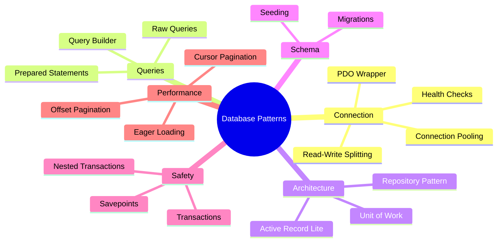
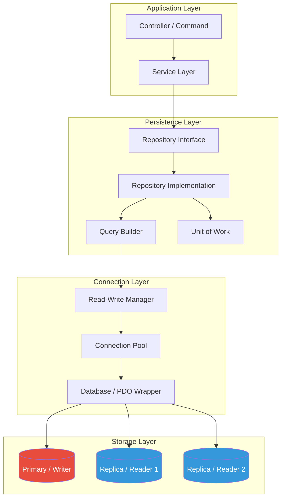
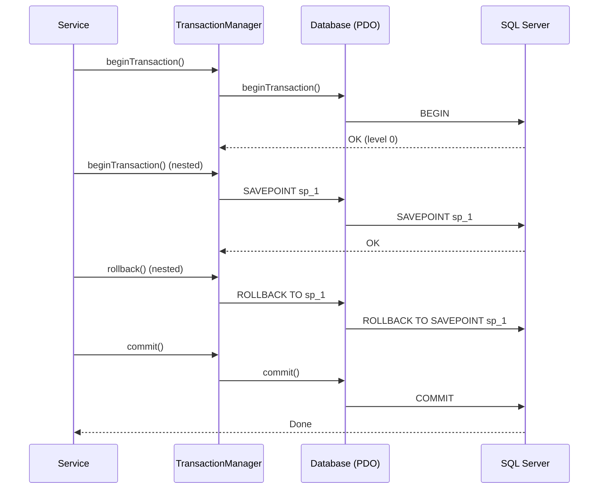

# PHP Database Patterns

## 1. Overview

Database access is the backbone of most PHP applications. This skill provides production-hardened patterns for every major database concern: connection management, query building, repository abstraction, schema migrations, transaction safety, pagination strategies, and high-availability read-write splitting. All patterns use `declare(strict_types=1)`, follow PSR-12, and leverage PHP 8.4 features (constructor promotion, readonly classes, enums, match expressions, named arguments, property hooks, asymmetric visibility).



**Available Patterns:**

| # | Pattern | Description | Key Classes |
|---|---------|-------------|-------------|
| 1 | PDO Wrapper | Connection factory with config, retry, and error handling | `Database`, `ConnectionConfig` |
| 2 | Query Builder | Fluent SELECT/INSERT/UPDATE/DELETE builder | `QueryBuilder`, `Expression` |
| 3 | Repository Pattern | Interface-based data access with caching decorator | `RepositoryInterface`, `PdoRepository` |
| 4 | Migrations | Versioned schema changes with rollback | `Migration`, `Migrator` |
| 5 | Seeding | Test/data seeding with factories | `Seeder`, `Factory` |
| 6 | Transactions | Nested transactions with savepoints | `TransactionManager` |
| 7 | Read-Write Splitting | Primary/replica connection routing | `ReadWriteManager` |
| 8 | Offset Pagination | SQL LIMIT/OFFSET with metadata | `OffsetPaginator` |
| 9 | Cursor Pagination | Keyset-based pagination for large datasets | `CursorPaginator` |
| 10 | Connection Pooling | Managed connection lifecycle with limits | `ConnectionPool` |

## 2. Installation / Configuration

```php
// composer.json
{
    "require": {
        "php": ">=8.4",
        "ext-pdo": "*",
        "ext-pdo_mysql": "*",
        "ext-pdo_pgsql": "*",
        "ext-pdo_sqlite": "*"
    },
    "autoload": {
        "psr-4": {
            "App\\Database\\": "src/Database/"
        }
    }
}
```

```ini
; php.ini
extension=pdo_mysql
extension=pdo_pgsql
extension=pdo_sqlite
; PDO settings
pdo_mysql.default_socket="/var/run/mysqld/mysqld.sock"
; Connection pooling (persistent connections)
pdo_mysql.allow_persistent=1
pdo_mysql.max_persistent=100
pdo_mysql.max_links=-1
```

## 3. Architecture

### 3.1 Layered Database Architecture



### 3.2 Transaction Flow



## 4. Syntax & Usage

### 4.1 PDO Wrapper with Connection Management

```php
declare(strict_types=1);

namespace App\Database;

/**
 * Database connection configuration.
 * @immutable
 */
readonly class ConnectionConfig
{
    public \PDO $pdo;

    /**
     * @param array<int, mixed> $options PDO driver options
     */
    public function __construct(
        public string $driver = 'mysql',
        public string $host = '127.0.0.1',
        public int $port = 3306,
        public string $database = 'app',
        public string $username = 'root',
        public string $password = '',
        public string $charset = 'utf8mb4',
        public string $unixSocket = '',
        public array $options = [],
    ) {
        $dsn = $this->buildDsn();
        $defaultOptions = [
            \PDO::ATTR_ERRMODE => \PDO::ERRMODE_EXCEPTION,
            \PDO::ATTR_DEFAULT_FETCH_MODE => \PDO::FETCH_ASSOC,
            \PDO::ATTR_EMULATE_PREPARES => false,
            \PDO::ATTR_STRINGIFY_FETCHES => false,
            \PDO::ATTR_CASE => \PDO::CASE_NATURAL,
        ];

        $this->pdo = new \PDO(
            $dsn,
            $this->username,
            $this->password,
            [...$defaultOptions, ...$this->options],
        );
    }

    private function buildDsn(): string
    {
        return match ($this->driver) {
            'mysql' => $this->mysqlDsn(),
            'pgsql' => $this->pgsqlDsn(),
            'sqlite' => "sqlite:{$this->database}",
            'sqlsrv' => "sqlsrv:Server={$this->host},{$this->port};Database={$this->database}",
            default => throw new \InvalidArgumentException("Unsupported driver: {$this->driver}"),
        };
    }

    private function mysqlDsn(): string
    {
        if ($this->unixSocket !== '') {
            return "mysql:unix_socket={$this->unixSocket};dbname={$this->database};charset={$this->charset}";
        }
        return "mysql:host={$this->host};port={$this->port};dbname={$this->database};charset={$this->charset}";
    }

    private function pgsqlDsn(): string
    {
        return "pgsql:host={$this->host};port={$this->port};dbname={$this->database}";
    }
}

/**
 * Database abstraction layer.
 *
 * Provides connection management, query shortcuts, and health checks.
 */
final class Database
{
    private \PDO $pdo;
    private int $queryCount = 0;
    private float $totalQueryTime = 0.0;

    public function __construct(
        ConnectionConfig $config,
        private readonly bool $logQueries = false,
    ) {
        $this->pdo = $config->pdo;
    }

    /**
     * Execute a prepared statement.
     *
     * @param string $sql SQL query with named or positional placeholders
     * @param array<string, mixed> $params Bound parameters
     * @return \PDOStatement
     */
    public function query(string $sql, array $params = []): \PDOStatement
    {
        $start = microtime(true);
        $stmt = $this->pdo->prepare($sql);
        $stmt->execute($params);
        $elapsed = (microtime(true) - $start) * 1000;

        $this->queryCount++;
        $this->totalQueryTime += $elapsed;

        if ($this->logQueries) {
            $this->logQuery($sql, $params, $elapsed);
        }

        return $stmt;
    }

    /**
     * Fetch all rows as associative arrays.
     *
     * @return array<int, array<string, mixed>>
     */
    public function fetchAll(string $sql, array $params = []): array
    {
        return $this->query($sql, $params)->fetchAll();
    }

    /**
     * Fetch a single row.
     *
     * @return array<string, mixed>|null
     */
    public function fetchOne(string $sql, array $params = []): ?array
    {
        $row = $this->query($sql, $params)->fetch();
        return $row !== false ? $row : null;
    }

    /**
     * Fetch a single scalar value.
     */
    public function fetchColumn(string $sql, array $params = []): mixed
    {
        return $this->query($sql, $params)->fetchColumn();
    }

    /**
     * Execute INSERT and return the last insert ID.
     */
    public function insert(string $table, array $data): int|string
    {
        $columns = implode(', ', array_keys($data));
        $placeholders = ':' . implode(', :', array_keys($data));
        $sql = "INSERT INTO {$table} ({$columns}) VALUES ({$placeholders})";
        $this->query($sql, $data);
        return (int) $this->pdo->lastInsertId();
    }

    /**
     * Execute UPDATE.
     */
    public function update(string $table, array $data, string $where, array $whereParams = []): int
    {
        $sets = implode(
            ', ',
            array_map(fn(string $col) => "{$col} = :{$col}", array_keys($data)),
        );
        $sql = "UPDATE {$table} SET {$sets} WHERE {$where}";
        $stmt = $this->query($sql, [...$data, ...$whereParams]);
        return $stmt->rowCount();
    }

    /**
     * Execute DELETE.
     */
    public function delete(string $table, string $where, array $params = []): int
    {
        $sql = "DELETE FROM {$table} WHERE {$where}";
        $stmt = $this->query($sql, $params);
        return $stmt->rowCount();
    }

    // ── Transaction shortcuts ──

    public function beginTransaction(): bool
    {
        return $this->pdo->beginTransaction();
    }

    public function commit(): bool
    {
        return $this->pdo->commit();
    }

    public function rollback(): bool
    {
        return $this->pdo->rollBack();
    }

    public function inTransaction(): bool
    {
        return $this->pdo->inTransaction();
    }

    // ── Helpers ──

    /**
     * Quote an identifier (table/column name).
     */
    public function quoteIdentifier(string $identifier): string
    {
        $driver = $this->pdo->getAttribute(\PDO::ATTR_DRIVER_NAME);
        $char = match ($driver) {
            'mysql' => '`',
            'pgsql', 'sqlite' => '"',
            default => '',
        };
        if ($char === '') {
            return $identifier;
        }
        return $char . str_replace($char, $char . $char, $identifier) . $char;
    }

    /**
     * Prepare a LIKE-safe value.
     */
    public function escapeLike(string $value, string $escapeChar = '\\'): string
    {
        return str_replace([$escapeChar, '%', '_'], [$escapeChar . $escapeChar, $escapeChar . '%', $escapeChar . '_'], $value);
    }

    /**
     * Get the underlying PDO instance (use sparingly).
     */
    public function getPdo(): \PDO
    {
        return $this->pdo;
    }

    /**
     * Return query statistics.
     * @return array{count: int, totalTimeMs: float, avgTimeMs: float}
     */
    public function stats(): array
    {
        return [
            'count' => $this->queryCount,
            'totalTimeMs' => round($this->totalQueryTime, 2),
            'avgTimeMs' => $this->queryCount > 0
                ? round($this->totalQueryTime / $this->queryCount, 2)
                : 0.0,
        ];
    }

    private function logQuery(string $sql, array $params, float $elapsedMs): void
    {
        error_log(sprintf(
            '[DB] %.2fms | %s | params: %s',
            $elapsedMs,
            $sql,
            json_encode($params, JSON_UNESCAPED_SLASHES),
        ));
    }
}
```

### 4.2 Query Builder

```php
declare(strict_types=1);

namespace App\Database\QueryBuilder;

/**
 * SQL expression (raw or parameterized).
 * @immutable
 */
readonly class Expression
{
    public function __construct(
        public string $sql,
        public array $params = [],
    ) {}

    public static function raw(string $sql): self
    {
        return new self($sql);
    }
}

/**
 * Fluent SQL query builder.
 *
 * Builds parameterized queries safe from SQL injection.
 */
final class QueryBuilder
{
    private string $table = '';
    /** @var array<string, string> */
    private array $select = [];
    /** @var array<array{type: string, sql: string, params: array}> */
    private array $joins = [];
    /** @var array<string, array{sql: string, params: array}> */
    private array $wheres = [];
    /** @var array<string, string> */
    private array $orderBy = [];
    private ?int $limit = null;
    private ?int $offset = null;
    /** @var array<string, string> */
    private array $groupBy = [];
    /** @var array<array{sql: string, params: array}> */
    private array $havings = [];
    private array $params = [];

    public function from(string $table): self
    {
        $clone = clone $this;
        $clone->table = $table;
        return $clone;
    }

    /**
     * Add SELECT columns.
     */
    public function select(string ...$columns): self
    {
        $clone = clone $this;
        foreach ($columns as $col) {
            $alias = $col;
            if (stripos($col, ' as ') !== false) {
                $parts = preg_split('/\s+as\s+/i', $col);
                $alias = $parts[1] ?? $col;
            }
            $clone->select[$alias] = $col;
        }
        return $clone;
    }

    /**
     * Add a JOIN clause.
     */
    public function join(string $table, string $condition, string $type = 'INNER'): self
    {
        $clone = clone $this;
        $clone->joins[] = ['type' => $type, 'sql' => "{$type} JOIN {$table} ON {$condition}", 'params' => []];
        return $clone;
    }

    /**
     * Add a LEFT JOIN clause.
     */
    public function leftJoin(string $table, string $condition): self
    {
        return $this->join($table, $condition, 'LEFT');
    }

    /**
     * Add a WHERE condition (AND).
     *
     * @param string $sql "column = :param" or "column = ?"
     * @param array $params
     */
    public function where(string $sql, array $params = []): self
    {
        $clone = clone $this;
        $clone->wheres[] = ['sql' => $sql, 'params' => $params];
        return $clone;
    }

    /**
     * Add a WHERE ... IN (...) clause.
     */
    public function whereIn(string $column, array $values): self
    {
        if ($values === []) {
            return $this->where('1 = 0');
        }
        $placeholders = implode(', ', array_fill(0, count($values), '?'));
        return $this->where("{$column} IN ({$placeholders})", array_values($values));
    }

    /**
     * Add a WHERE ... BETWEEN clause.
     */
    public function whereBetween(string $column, mixed $min, mixed $max): self
    {
        return $this->where("{$column} BETWEEN ? AND ?", [$min, $max]);
    }

    /**
     * Add WHERE ... LIKE clause.
     */
    public function whereLike(string $column, string $pattern): self
    {
        return $this->where("{$column} LIKE ?", [$pattern]);
    }

    /**
     * Add ORDER BY.
     */
    public function orderBy(string $column, string $direction = 'ASC'): self
    {
        $clone = clone $this;
        $direction = strtoupper($direction) === 'DESC' ? 'DESC' : 'ASC';
        $clone->orderBy[$column] = "{$column} {$direction}";
        return $clone;
    }

    /**
     * Add GROUP BY.
     */
    public function groupBy(string ...$columns): self
    {
        $clone = clone $this;
        foreach ($columns as $col) {
            $clone->groupBy[$col] = $col;
        }
        return $clone;
    }

    /**
     * Add HAVING clause.
     */
    public function having(string $sql, array $params = []): self
    {
        $clone = clone $this;
        $clone->havings[] = ['sql' => $sql, 'params' => $params];
        return $clone;
    }

    /**
     * Set LIMIT.
     */
    public function limit(int $limit): self
    {
        $clone = clone $this;
        $clone->limit = $limit;
        return $clone;
    }

    /**
     * Set OFFSET.
     */
    public function offset(int $offset): self
    {
        $clone = clone $this;
        $clone->offset = $offset;
        return $clone;
    }

    /**
     * Build the SELECT SQL and parameters.
     *
     * @return array{sql: string, params: array}
     */
    public function buildSelect(): array
    {
        $params = [];

        $cols = $this->select !== []
            ? implode(', ', $this->select)
            : '*';

        $sql = "SELECT {$cols} FROM {$this->table}";

        // Joins
        foreach ($this->joins as $join) {
            $sql .= " {$join['sql']}";
            $params = [...$params, ...$join['params']];
        }

        // WHERE
        if ($this->wheres !== []) {
            $conditions = [];
            foreach ($this->wheres as $where) {
                $conditions[] = $where['sql'];
                $params = [...$params, ...$where['params']];
            }
            $sql .= ' WHERE ' . implode(' AND ', $conditions);
        }

        // GROUP BY
        if ($this->groupBy !== []) {
            $sql .= ' GROUP BY ' . implode(', ', $this->groupBy);
        }

        // HAVING
        foreach ($this->havings as $having) {
            $sql .= ' HAVING ' . $having['sql'];
            $params = [...$params, ...$having['params']];
        }

        // ORDER BY
        if ($this->orderBy !== []) {
            $sql .= ' ORDER BY ' . implode(', ', $this->orderBy);
        }

        // LIMIT / OFFSET
        if ($this->limit !== null) {
            $sql .= " LIMIT {$this->limit}";
        }
        if ($this->offset !== null) {
            $sql .= " OFFSET {$this->offset}";
        }

        return ['sql' => $sql, 'params' => $params];
    }

    /**
     * Build INSERT SQL.
     *
     * @return array{sql: string, params: array}
     */
    public function buildInsert(array $data): array
    {
        $columns = implode(', ', array_keys($data));
        $placeholders = implode(', ', array_fill(0, count($data), '?'));
        return [
            'sql' => "INSERT INTO {$this->table} ({$columns}) VALUES ({$placeholders})",
            'params' => array_values($data),
        ];
    }

    /**
     * Build UPDATE SQL.
     *
     * @return array{sql: string, params: array}
     */
    public function buildUpdate(array $data): array
    {
        $sets = implode(', ', array_map(fn(string $col) => "{$col} = ?", array_keys($data)));
        $params = array_values($data);

        $sql = "UPDATE {$this->table} SET {$sets}";

        if ($this->wheres !== []) {
            $conditions = [];
            foreach ($this->wheres as $where) {
                $conditions[] = $where['sql'];
                $params = [...$params, ...$where['params']];
            }
            $sql .= ' WHERE ' . implode(' AND ', $conditions);
        }

        return ['sql' => $sql, 'params' => $params];
    }

    /**
     * Build DELETE SQL.
     *
     * @return array{sql: string, params: array}
     */
    public function buildDelete(): array
    {
        $sql = "DELETE FROM {$this->table}";
        $params = [];

        if ($this->wheres !== []) {
            $conditions = [];
            foreach ($this->wheres as $where) {
                $conditions[] = $where['sql'];
                $params = [...$params, ...$where['params']];
            }
            $sql .= ' WHERE ' . implode(' AND ', $conditions);
        }

        return ['sql' => $sql, 'params' => $params];
    }

    /**
     * Build COUNT query.
     *
     * @return array{sql: string, params: array}
     */
    public function buildCount(): array
    {
        $result = $this->buildSelect();
        $result['sql'] = preg_replace(
            '/^SELECT .*? FROM /i',
            'SELECT COUNT(*) FROM ',
            $result['sql'],
        );
        return $result;
    }
}
```

### 4.3 Repository Pattern

```php
declare(strict_types=1);

namespace App\Database\Repository;

/**
 * Generic repository interface.
 *
 * @template T of object
 */
interface RepositoryInterface
{
    /** @return T|null */
    public function findById(int|string $id): ?object;

    /** @return T[] */
    public function findAll(array $criteria = [], array $orderBy = [], ?int $limit = null, ?int $offset = null): array;

    /** @param T $entity */
    public function save(object $entity): object;

    /** @param T $entity */
    public function delete(object $entity): bool;

    public function count(array $criteria = []): int;
}

/**
 * PDO-based repository with hydration/extraction.
 *
 * @template T of object
 * @implements RepositoryInterface<T>
 */
abstract class PdoRepository implements RepositoryInterface
{
    protected \PDO $pdo;
    protected string $table;
    protected string $entityClass;

    public function __construct(\PDO $pdo)
    {
        $this->pdo = $pdo;
        $this->table = $this->resolveTableName();
        $this->entityClass = $this->resolveEntityClass();
    }

    /**
     * Determine the table name from the entity class.
     */
    protected function resolveTableName(): string
    {
        $ref = new \ReflectionClass($this->entityClass ?? $this->guessEntityClass());
        $attrs = $ref->getAttributes(Table::class);
        if ($attrs !== []) {
            return $attrs[0]->newInstance()->name;
        }
        // Snake_case plural of class name
        $short = $ref->getShortName();
        return strtolower(preg_replace('/(?<!^)[A-Z]/', '_$0', $short)) . 's';
    }

    /**
     * Guess the entity class from the repository class name.
     */
    protected function guessEntityClass(): string
    {
        $name = (new \ReflectionClass(static::class))->getShortName();
        // RepositoryName -> EntityName
        $entity = preg_replace('/Repository$/', '', $name);
        return (new \ReflectionClass(static::class))->getNamespaceName() . '\\Entity\\' . $entity;
    }

    /**
     * Resolve the entity class (override in concrete repos).
     */
    protected function resolveEntityClass(): string
    {
        return $this->entityClass ?? $this->guessEntityClass();
    }

    public function findById(int|string $id): ?object
    {
        $stmt = $this->pdo->prepare(
            "SELECT * FROM {$this->table} WHERE id = :id LIMIT 1",
        );
        $stmt->execute(['id' => $id]);
        $row = $stmt->fetch(\PDO::FETCH_ASSOC);

        return $row !== false ? $this->hydrate($row) : null;
    }

    public function findAll(array $criteria = [], array $orderBy = [], ?int $limit = null, ?int $offset = null): array
    {
        $sql = "SELECT * FROM {$this->table}";
        $params = [];

        if ($criteria !== []) {
            $conditions = [];
            foreach ($criteria as $column => $value) {
                if (is_array($value)) {
                    // WHERE IN
                    $placeholders = implode(', ', array_fill(0, count($value), '?'));
                    $conditions[] = "{$column} IN ({$placeholders})";
                    $params = [...$params, ...array_values($value)];
                } else {
                    $conditions[] = "{$column} = ?";
                    $params[] = $value;
                }
            }
            $sql .= ' WHERE ' . implode(' AND ', $conditions);
        }

        if ($orderBy !== []) {
            $orders = [];
            foreach ($orderBy as $column => $direction) {
                $orders[] = "{$column} " . (strtoupper($direction) === 'DESC' ? 'DESC' : 'ASC');
            }
            $sql .= ' ORDER BY ' . implode(', ', $orders);
        }

        if ($limit !== null) {
            $sql .= " LIMIT {$limit}";
        }
        if ($offset !== null) {
            $sql .= " OFFSET {$offset}";
        }

        $stmt = $this->pdo->prepare($sql);
        $stmt->execute($params);
        $rows = $stmt->fetchAll(\PDO::FETCH_ASSOC);

        return array_map(fn(array $row): object => $this->hydrate($row), $rows);
    }

    public function save(object $entity): object
    {
        $data = $this->extract($entity);
        $id = $data['id'] ?? null;

        if ($id !== null) {
            $existing = $this->findById($id);
            if ($existing !== null) {
                return $this->doUpdate($data);
            }
        }

        return $this->doInsert($data);
    }

    public function delete(object $entity): bool
    {
        $id = $this->getEntityId($entity);
        if ($id === null) {
            return false;
        }
        $stmt = $this->pdo->prepare("DELETE FROM {$this->table} WHERE id = :id");
        return $stmt->execute(['id' => $id]);
    }

    public function count(array $criteria = []): int
    {
        $sql = "SELECT COUNT(*) FROM {$this->table}";
        $params = [];

        if ($criteria !== []) {
            $conditions = [];
            foreach ($criteria as $column => $value) {
                $conditions[] = "{$column} = ?";
                $params[] = $value;
            }
            $sql .= ' WHERE ' . implode(' AND ', $conditions);
        }

        $stmt = $this->pdo->prepare($sql);
        $stmt->execute($params);
        return (int) $stmt->fetchColumn();
    }

    /**
     * Convert database row to entity object.
     *
     * @param array<string, mixed> $row
     * @return T
     */
    abstract protected function hydrate(array $row): object;

    /**
     * Convert entity to database column map.
     *
     * @param T $entity
     * @return array<string, mixed>
     */
    abstract protected function extract(object $entity): array;

    /**
     * Get the entity's identifier value.
     */
    abstract protected function getEntityId(object $entity): int|string|null;

    /**
     * @param array<string, mixed> $data
     * @return T
     */
    private function doInsert(array $data): object
    {
        $columns = implode(', ', array_keys($data));
        $placeholders = ':' . implode(', :', array_keys($data));
        $stmt = $this->pdo->prepare(
            "INSERT INTO {$this->table} ({$columns}) VALUES ({$placeholders})",
        );
        $stmt->execute($data);

        $id = $this->pdo->lastInsertId();
        return $this->findById($id);
    }

    /**
     * @param array<string, mixed> $data
     * @return T
     */
    private function doUpdate(array $data): object
    {
        $id = $data['id'];
        unset($data['id']);
        $set = implode(
            ', ',
            array_map(fn(string $col) => "{$col} = :{$col}", array_keys($data)),
        );
        $data['id'] = $id;
        $stmt = $this->pdo->prepare(
            "UPDATE {$this->table} SET {$set} WHERE id = :id",
        );
        $stmt->execute($data);

        return $this->findById($id);
    }
}

/**
 * Repository caching decorator.
 *
 * @template T of object
 * @implements RepositoryInterface<T>
 */
final class CachedRepository implements RepositoryInterface
{
    /** @var RepositoryInterface<T> */
    private RepositoryInterface $inner;

    public function __construct(
        RepositoryInterface $inner,
        private readonly CacheInterface $cache,
        private readonly int $ttl = 300,
    ) {}

    public function findById(int|string $id): ?object
    {
        $key = "repo:{$this->getCacheKey()}:id:{$id}";
        return $this->cache->remember($key, fn() => $this->inner->findById($id), $this->ttl);
    }

    public function findAll(array $criteria = [], array $orderBy = [], ?int $limit = null, ?int $offset = null): array
    {
        $key = "repo:{$this->getCacheKey()}:all:" . md5(serialize(func_get_args()));
        return $this->cache->remember($key, fn() => $this->inner->findAll($criteria, $orderBy, $limit, $offset), $this->ttl);
    }

    public function save(object $entity): object
    {
        $result = $this->inner->save($entity);
        // Invalidate cache
        $this->cache->delete("repo:{$this->getCacheKey()}:id:{$this->getEntityId($entity)}");
        $this->cache->deleteByPrefix("repo:{$this->getCacheKey()}:all:");
        return $result;
    }

    public function delete(object $entity): bool
    {
        $result = $this->inner->delete($entity);
        $this->cache->delete("repo:{$this->getCacheKey()}:id:{$this->getEntityId($entity)}");
        $this->cache->deleteByPrefix("repo:{$this->getCacheKey()}:all:");
        return $result;
    }

    public function count(array $criteria = []): int
    {
        return $this->inner->count($criteria);
    }

    private function getCacheKey(): string
    {
        return str_replace('\\\\', '_', $this->inner::class);
    }

    private function getEntityId(object $entity): int|string|null
    {
        return $entity->id ?? null;
    }
}

// Minimal cache interface for the decorator
interface CacheInterface
{
    public function get(string $key): mixed;
    public function set(string $key, mixed $value, int $ttl = 0): bool;
    public function delete(string $key): bool;
    public function remember(string $key, callable $callback, int $ttl = 0): mixed;
    public function deleteByPrefix(string $prefix): void;
}

/**
 * #[Table] attribute for entity-to-table mapping.
 */
#[\\Attribute(\\Attribute::TARGET_CLASS)]
readonly class Table
{
    public function __construct(public string $name) {}
}
```

### 4.4 Migrations

```php
declare(strict_types=1);

namespace App\Database\Migrations;

/**
 * Migration interface — each migration is a class with up() and down().
 */
interface MigrationInterface
{
    public function up(\\PDO $pdo): void;
    public function down(\\PDO $pdo): void;
    public function getName(): string;
}

/**
 * Migration runner — applies pending migrations in order.
 */
final class Migrator
{
    private string $table = 'migrations';

    public function __construct(
        private readonly \PDO $pdo,
        private readonly string $migrationsDir,
    ) {
        if (!is_dir($this->migrationsDir)) {
            throw new \RuntimeException("Migrations directory not found: {$this->migrationsDir}");
        }
        $this->ensureMigrationTable();
    }

    /**
     * Run all pending migrations.
     *
     * @return array{applied: int, names: string[]}
     */
    public function migrate(): array
    {
        $applied = [];
        $batch = $this->getNextBatch();

        foreach ($this->getPendingMigrations() as $name => $file) {
            require_once $file;

            $class = $this->getMigrationClass($file, $name);
            $migration = new $class();

            $this->pdo->beginTransaction();
            try {
                $migration->up($this->pdo);
                $this->recordMigration($name, $batch);
                $this->pdo->commit();
                $applied[] = $name;
                echo "  ✓ {$name}\n";
            } catch (\Throwable $e) {
                $this->pdo->rollBack();
                throw new \RuntimeException("Migration {$name} failed: {$e->getMessage()}", 0, $e);
            }
        }

        return ['applied' => count($applied), 'names' => $applied];
    }

    /**
     * Roll back the last batch of migrations.
     *
     * @return array{rolledBack: int, names: string[]}
     */
    public function rollback(): array
    {
        $lastBatch = $this->getLastBatch();
        if ($lastBatch === null) {
            return ['rolledBack' => 0, 'names' => []];
        }

        $rolledBack = [];

        $stmt = $this->pdo->prepare(
            "SELECT name FROM {$this->table} WHERE batch = ? ORDER BY id DESC",
        );
        $stmt->execute([$lastBatch]);
        $names = $stmt->fetchAll(\PDO::FETCH_COLUMN);

        foreach ($names as $name) {
            $file = $this->findMigrationFile($name);
            if ($file === null) {
                throw new \RuntimeException("Migration file not found: {$name}");
            }

            require_once $file;
            $class = $this->getMigrationClass($file, $name);
            $migration = new $class();

            $this->pdo->beginTransaction();
            try {
                $migration->down($this->pdo);
                $stmt = $this->pdo->prepare("DELETE FROM {$this->table} WHERE name = ?");
                $stmt->execute([$name]);
                $this->pdo->commit();
                $rolledBack[] = $name;
                echo "  ✓ {$name} rolled back\n";
            } catch (\Throwable $e) {
                $this->pdo->rollBack();
                throw new \RuntimeException("Rollback {$name} failed: {$e->getMessage()}", 0, $e);
            }
        }

        return ['rolledBack' => count($rolledBack), 'names' => $rolledBack];
    }

    /**
     * Show migration status.
     *
     * @return array<int, array{name: string, applied: bool, batch: ?int}>
     */
    public function status(): array
    {
        $files = $this->getMigrationFiles();
        $applied = $this->getAppliedMigrations();
        $result = [];

        foreach ($files as $name => $file) {
            $result[] = [
                'name' => $name,
                'applied' => isset($applied[$name]),
                'batch' => $applied[$name] ?? null,
            ];
        }

        return $result;
    }

    // ── Private helpers ──

    private function ensureMigrationTable(): void
    {
        $driver = $this->pdo->getAttribute(\PDO::ATTR_DRIVER_NAME);
        $sql = match ($driver) {
            'mysql' => "CREATE TABLE IF NOT EXISTS {$this->table} (
                id INT AUTO_INCREMENT PRIMARY KEY,
                name VARCHAR(255) NOT NULL,
                batch INT NOT NULL,
                executed_at TIMESTAMP DEFAULT CURRENT_TIMESTAMP,
                UNIQUE KEY migration_name (name)
            ) ENGINE=InnoDB DEFAULT CHARSET=utf8mb4",
            'pgsql' => "CREATE TABLE IF NOT EXISTS {$this->table} (
                id SERIAL PRIMARY KEY,
                name VARCHAR(255) NOT NULL,
                batch INT NOT NULL,
                executed_at TIMESTAMP DEFAULT CURRENT_TIMESTAMP,
                UNIQUE (name)
            )",
            'sqlite' => "CREATE TABLE IF NOT EXISTS {$this->table} (
                id INTEGER PRIMARY KEY AUTOINCREMENT,
                name TEXT NOT NULL UNIQUE,
                batch INTEGER NOT NULL,
                executed_at TEXT DEFAULT (datetime('now'))
            )",
            default => throw new \RuntimeException("Unsupported driver: {$driver}"),
        };
        $this->pdo->exec($sql);
    }

    /**
     * @return array<string, string> name => path
     */
    private function getMigrationFiles(): array
    {
        $files = glob($this->migrationsDir . '/*.php');
        if ($files === false) {
            return [];
        }

        sort($files);
        $migrations = [];

        foreach ($files as $file) {
            $name = pathinfo($file, PATHINFO_FILENAME);
            $migrations[$name] = $file;
        }

        return $migrations;
    }

    /**
     * @return array<string, int> name => batch
     */
    private function getAppliedMigrations(): array
    {
        $stmt = $this->pdo->query("SELECT name, batch FROM {$this->table} ORDER BY id");
        $result = [];
        while ($row = $stmt->fetch(\PDO::FETCH_ASSOC)) {
            $result[$row['name']] = (int) $row['batch'];
        }
        return $result;
    }

    /**
     * @return array<string, string> pending migrations name => path
     */
    private function getPendingMigrations(): array
    {
        $all = $this->getMigrationFiles();
        $applied = $this->getAppliedMigrations();

        return array_diff_key($all, $applied);
    }

    private function getNextBatch(): int
    {
        $stmt = $this->pdo->query("SELECT COALESCE(MAX(batch), 0) + 1 FROM {$this->table}");
        return (int) $stmt->fetchColumn();
    }

    private function getLastBatch(): ?int
    {
        $stmt = $this->pdo->query("SELECT MAX(batch) FROM {$this->table}");
        $batch = $stmt->fetchColumn();
        return $batch !== false && $batch !== null ? (int) $batch : null;
    }

    private function recordMigration(string $name, int $batch): void
    {
        $stmt = $this->pdo->prepare(
            "INSERT INTO {$this->table} (name, batch) VALUES (?, ?)",
        );
        $stmt->execute([$name, $batch]);
    }

    private function findMigrationFile(string $name): ?string
    {
        $path = $this->migrationsDir . '/' . $name . '.php';
        return file_exists($path) ? $path : null;
    }

    /**
     * Extract migration class name from file.
     */
    private function getMigrationClass(string $file, string $name): string
    {
        $content = file_get_contents($file);
        if ($content === false) {
            throw new \RuntimeException("Cannot read migration file: {$file}");
        }

        if (preg_match('/^namespace\s+(.+?);/m', $content, $m)) {
            $namespace = $m[1];
            // Class name is typically StudlyCase version of the file name
            $className = $this->migrationNameToClassName($name);
            return "{$namespace}\\{$className}";
        }

        return $this->migrationNameToClassName($name);
    }

    /**
     * Convert snake_case migration name to StudlyCase class name.
     * e.g., "2024_01_01_000001_create_users_table" => "CreateUsersTable"
     */
    private function migrationNameToClassName(string $name): string
    {
        // Remove timestamp prefix
        $parts = explode('_', $name, 4);
        $namePart = $parts[3] ?? $name;

        return str_replace('_', '', ucwords($namePart, '_'));
    }
}

// ── Example migration ──

/**
 * Migration file: migrations/2024_01_01_000001_create_users_table.php
 *
 * namespace App\Database\Migrations;
 *
 * final class CreateUsersTable implements MigrationInterface
 * {
 *     public function getName(): string { return '2024_01_01_000001_create_users_table'; }
 *
 *     public function up(\PDO $pdo): void
 *     {
 *         $pdo->exec("CREATE TABLE users (
 *             id INT AUTO_INCREMENT PRIMARY KEY,
 *             name VARCHAR(255) NOT NULL,
 *             email VARCHAR(255) NOT NULL UNIQUE,
 *             password_hash VARCHAR(255) NOT NULL,
 *             created_at TIMESTAMP DEFAULT CURRENT_TIMESTAMP,
 *             updated_at TIMESTAMP DEFAULT CURRENT_TIMESTAMP ON UPDATE CURRENT_TIMESTAMP
 *         ) ENGINE=InnoDB DEFAULT CHARSET=utf8mb4");
 *     }
 *
 *     public function down(\PDO $pdo): void
 *     {
 *         $pdo->exec("DROP TABLE IF EXISTS users");
 *     }
 * }
 */

// ── Seeder pattern (for test/development data) ──

/**
 * Simple seeder for populating test data.
 */
final class Seeder
{
    public function __construct(
        private readonly \PDO $pdo,
    ) {}

    /**
     * Run all seeders.
     *
     * @param array<string, callable> $seeders name => fn(\PDO): void
     */
    public function seed(array $seeders): void
    {
        foreach ($seeders as $name => $seeder) {
            echo "Seeding: {$name}\n";
            $seeder($this->pdo);
        }
    }

    /**
     * Insert multiple rows efficiently.
     *
     * @param string $table
     * @param array<int, array<string, mixed>> $rows
     */
    public function insertRows(string $table, array $rows): void
    {
        if ($rows === []) {
            return;
        }

        $columns = implode(', ', array_keys($rows[0]));
        $placeholders = '(' . implode(', ', array_fill(0, count($rows[0]), '?')) . ')';
        $values = implode(', ', array_fill(0, count($rows), $placeholders));

        $params = [];
        foreach ($rows as $row) {
            $params = [...$params, ...array_values($row)];
        }

        $stmt = $this->pdo->prepare(
            "INSERT INTO {$table} ({$columns}) VALUES {$values}",
        );
        $stmt->execute($params);
    }

    /**
     * User factory helper.
     *
     * @return array<string, mixed>
     */
    public static function fakeUser(string $email = ''): array
    {
        return [
            'name' => 'John Doe',
            'email' => $email ?: 'user@example.com',
            'password_hash' => password_hash('password', PASSWORD_BCRYPT),
            'created_at' => date('Y-m-d H:i:s'),
        ];
    }
}
```

### 4.5 Transactions (Nested with Savepoints)

```php
declare(strict_types=1);

namespace App\Database\Transaction;

/**
 * Transaction manager with nested transaction support via savepoints.
 *
 * Usage:
 *   $tm = new TransactionManager($pdo);
 *   $tm->begin();          // BEGIN
 *   $tm->begin();          // SAVEPOINT sp_1
 *   $tm->commit();         // RELEASE SAVEPOINT sp_1
 *   $tm->commit();         // COMMIT
 */
final class TransactionManager
{
    private int $depth = 0;
    private int $savepointCounter = 0;

    public function __construct(
        private readonly \PDO $pdo,
        private readonly string $savepointPrefix = 'sp_',
    ) {}

    /**
     * Begin a transaction (or create a savepoint if already in one).
     */
    public function begin(): bool
    {
        if ($this->depth === 0) {
            $result = $this->pdo->beginTransaction();
        } else {
            $this->savepointCounter++;
            $name = $this->savepointPrefix . $this->savepointCounter;
            $result = $this->pdo->exec("SAVEPOINT {$name}") !== false;
        }

        if ($result) {
            $this->depth++;
        }

        return $result;
    }

    /**
     * Commit the current nesting level.
     */
    public function commit(): bool
    {
        if ($this->depth === 0) {
            throw new \RuntimeException('No active transaction to commit');
        }

        if ($this->depth === 1) {
            $result = $this->pdo->commit();
        } else {
            $name = $this->savepointPrefix . $this->savepointCounter;
            $result = $this->pdo->exec("RELEASE SAVEPOINT {$name}") !== false;
            $this->savepointCounter--;
        }

        if ($result) {
            $this->depth--;
        }

        return $result;
    }

    /**
     * Roll back to the current nesting level.
     */
    public function rollback(): bool
    {
        if ($this->depth === 0) {
            throw new \RuntimeException('No active transaction to roll back');
        }

        if ($this->depth === 1) {
            $result = $this->pdo->rollBack();
        } else {
            $name = $this->savepointPrefix . $this->savepointCounter;
            $result = $this->pdo->exec("ROLLBACK TO SAVEPOINT {$name}") !== false;
            $this->savepointCounter--;
        }

        if ($result) {
            $this->depth--;
        }

        return $result;
    }

    /**
     * Execute a callable within a transaction.
     *
     * @template T
     * @param callable(): T $callback
     * @return T
     */
    public function transactional(callable $callback): mixed
    {
        $this->begin();

        try {
            $result = $callback();
            $this->commit();
            return $result;
        } catch (\Throwable $e) {
            $this->rollback();
            throw $e;
        }
    }

    /**
     * Get current nesting depth.
     */
    public function getDepth(): int
    {
        return $this->depth;
    }

    /**
     * Check if inside a transaction.
     */
    public function isActive(): bool
    {
        return $this->depth > 0;
    }

    /**
     * Wrap a callable in nested transaction context.
     *
     * Use this when a method can be called both independently and inside
     * an existing transaction.
     *
     * @template T
     * @param callable(): T $callback
     * @return T
     */
    public function nested(callable $callback): mixed
    {
        $wasActive = $this->isActive();
        if (!$wasActive) {
            $this->begin();
        }

        try {
            $result = $callback();
            if (!$wasActive) {
                $this->commit();
            }
            return $result;
        } catch (\Throwable $e) {
            if (!$wasActive) {
                $this->rollback();
            }
            throw $e;
        }
    }
}
```

### 4.6 Read-Write Splitting

```php
declare(strict_types=1);

namespace App\Database\ReadWrite;

/**
 * Read-write connection manager.
 *
 * Routes SELECT queries to replica(s) and INSERT/UPDATE/DELETE to primary.
 */
final class ReadWriteManager
{
    private \PDO $primary;
    /** @var \PDO[] */
    private array $replicas = [];
    private int $replicaIndex = 0;

    public function __construct(
        \PDO $primary,
        \PDO ...$replicas,
    ) {
        $this->primary = $primary;
        $this->replicas = $replicas;
    }

    /**
     * Get the appropriate connection for a SQL statement.
     */
    public function getConnection(string $sql): \PDO
    {
        $type = strtoupper(trim(substr(ltrim($sql), 0, 6)));

        if (in_array($type, ['SELECT', 'WITH'], true)) {
            return $this->getReplica();
        }

        return $this->primary;
    }

    /**
     * Execute a query on the appropriate connection.
     *
     * @return \PDOStatement
     */
    public function query(string $sql, array $params = []): \PDOStatement
    {
        $pdo = $this->getConnection($sql);
        $stmt = $pdo->prepare($sql);
        $stmt->execute($params);
        return $stmt;
    }

    /**
     * Get primary connection.
     */
    public function getPrimary(): \PDO
    {
        return $this->primary;
    }

    /**
     * Get a replica connection (round-robin).
     */
    public function getReplica(): \PDO
    {
        if ($this->replicas === []) {
            return $this->primary;
        }

        $replica = $this->replicas[$this->replicaIndex % count($this->replicas)];
        $this->replicaIndex++;

        return $replica;
    }

    /**
     * Check health of all connections.
     *
     * @return array{primary: bool, replicas: array<int, bool>}
     */
    public function health(): array
    {
        $primaryHealth = $this->checkConnection($this->primary);
        $replicaHealth = [];

        foreach ($this->replicas as $i => $replica) {
            $replicaHealth[$i] = $this->checkConnection($replica);
        }

        return [
            'primary' => $primaryHealth,
            'replicas' => $replicaHealth,
        ];
    }

    private function checkConnection(\PDO $pdo): bool
    {
        try {
            $pdo->query('SELECT 1');
            return true;
        } catch (\Throwable) {
            return false;
        }
    }
}
```

### 4.7 Pagination

```php
declare(strict_types=1);

namespace App\Database\Pagination;

/**
 * Paginated result set.
 *
 * @template T
 * @immutable
 */
readonly class PaginatedResult
{
    /** @param T[] $items */
    public function __construct(
        public array $items,
        public int $total,
        public int $page,
        public int $perPage,
    ) {}

    public function lastPage(): int
    {
        return max(1, (int) ceil($this->total / max($this->perPage, 1)));
    }

    public function hasNext(): bool
    {
        return $this->page < $this->lastPage();
    }

    public function hasPrevious(): bool
    {
        return $this->page > 1;
    }

    /**
     * @return array{data: T[], meta: array{total: int, page: int, perPage: int, lastPage: int, hasNext: bool, hasPrevious: bool}}
     */
    public function toArray(): array
    {
        return [
            'data' => $this->items,
            'meta' => [
                'total' => $this->total,
                'page' => $this->page,
                'perPage' => $this->perPage,
                'lastPage' => $this->lastPage(),
                'hasNext' => $this->hasNext(),
                'hasPrevious' => $this->hasPrevious(),
            ],
        ];
    }
}

/**
 * Offset-based pagination strategy.
 *
 * SQL: SELECT ... LIMIT :limit OFFSET :offset
 * Best for: Small-medium datasets, page-jumping UI (e.g., "Go to page 5").
 * Warning: OFFSET becomes expensive on large datasets — the database must
 *          scan and discard `offset` rows.
 */
final class OffsetStrategy
{
    private const DEFAULT_PER_PAGE = 20;
    private const MAX_PER_PAGE = 100;

    /**
     * @template T
     * @param callable(int, int): array{0: T[], 1: int} $fetcher fn(limit, offset): [items, total]
     * @return PaginatedResult<T>
     */
    public static function paginate(
        callable $fetcher,
        int $page = 1,
        int $perPage = self::DEFAULT_PER_PAGE,
    ): PaginatedResult {
        $page = max(1, $page);
        $perPage = min(max(1, $perPage), self::MAX_PER_PAGE);
        $offset = ($page - 1) * $perPage;

        [$items, $total] = $fetcher($perPage, $offset);

        return new PaginatedResult(
            items: $items,
            total: $total,
            page: $page,
            perPage: $perPage,
        );
    }
}

/**
 * Cursor-based pagination strategy (keyset pagination).
 *
 * SQL: SELECT ... WHERE sort_column > :cursor ORDER BY sort_column LIMIT :limit
 * Best for: Large datasets, infinite scroll, real-time feeds.
 * Advantages: O(1) per page regardless of depth, stable under writes.
 * Disadvantages: Cannot jump to arbitrary pages, requires sequential access.
 */
final class CursorStrategy
{
    /**
     * @template T
     * @param callable(mixed, int, string, array): T[] $fetcher fn(cursor, limit, operator, orderBy): items
     * @param array{column: string, direction?: string} $orderBy
     * @return array{data: T[], nextCursor: mixed, hasMore: bool}
     */
    public static function paginate(
        callable $fetcher,
        mixed $cursor = null,
        int $limit = 20,
        array $orderBy = ['column' => 'id', 'direction' => 'ASC'],
    ): array {
        $limit = min(max(1, $limit), 100);
        $direction = strtoupper($orderBy['direction'] ?? 'ASC');
        $operator = $direction === 'ASC' ? '>' : '<';

        // Fetch one extra item to determine hasMore
        $items = $fetcher($cursor, $limit + 1, $operator, $orderBy);

        $hasMore = count($items) > $limit;
        if ($hasMore) {
            $items = array_slice($items, 0, $limit);
        }

        $lastItem = $items[array_key_last($items)] ?? null;
        $nextCursor = $hasMore && $lastItem !== null
            ? (is_object($lastItem) ? $lastItem->{$orderBy['column']} : $lastItem[$orderBy['column']] ?? null)
            : null;

        return [
            'data' => $items,
            'nextCursor' => $nextCursor,
            'hasMore' => $hasMore,
        ];
    }
}

// ── PDO-specific pagination helpers ──

/**
 * Offset-based paginator using PDO.
 */
final class PdoOffsetPaginator
{
    /**
     * @param \PDO $pdo
     * @param string $baseSql SQL without LIMIT/OFFSET (e.g., "SELECT * FROM users WHERE active = ?")
     * @param array $params
     * @param int $page
     * @param int $perPage
     * @return PaginatedResult
     */
    public static function paginate(
        \PDO $pdo,
        string $baseSql,
        array $params = [],
        int $page = 1,
        int $perPage = 20,
    ): PaginatedResult {
        $page = max(1, $page);
        $perPage = min(max(1, $perPage), 100);
        $offset = ($page - 1) * $perPage;

        // Count
        $countSql = preg_replace(
            '/^SELECT\s+(?:DISTINCT\s+)?.*?\s+FROM\s/i',
            'SELECT COUNT(*) FROM ',
            $baseSql,
            1,
        );
        // Remove ORDER BY from count query
        $countSql = preg_replace('/\s+ORDER\s+BY\s+.+$/i', '', $countSql);

        $countStmt = $pdo->prepare($countSql);
        $countStmt->execute($params);
        $total = (int) $countStmt->fetchColumn();

        // Data
        $dataSql = "{$baseSql} LIMIT {$perPage} OFFSET {$offset}";
        $dataStmt = $pdo->prepare($dataSql);
        $dataStmt->execute($params);
        $items = $dataStmt->fetchAll(\PDO::FETCH_ASSOC);

        return new PaginatedResult(
            items: $items,
            total: $total,
            page: $page,
            perPage: $perPage,
        );
    }
}

/**
 * Cursor-based paginator using PDO.
 */
final class PdoCursorPaginator
{
    /**
     * @param \PDO $pdo
     * @param string $table
     * @param string $cursorColumn Column used for cursor comparison
     * @param mixed $cursor Current cursor value (null for first page)
     * @param int $limit
     * @param string $direction 'ASC' or 'DESC'
     * @param array<string, mixed> $where Extra WHERE conditions
     * @return array{data: array, nextCursor: mixed, hasMore: bool}
     */
    public static function paginate(
        \PDO $pdo,
        string $table,
        string $cursorColumn = 'id',
        mixed $cursor = null,
        int $limit = 20,
        string $direction = 'ASC',
        array $where = [],
    ): array {
        $operator = strtoupper($direction) === 'DESC' ? '<' : '>';
        $orderDir = strtoupper($direction) === 'DESC' ? 'DESC' : 'ASC';
        $limitClause = $limit + 1; // Fetch one extra for hasMore check

        $whereClauses = [];
        $params = [];

        if ($cursor !== null) {
            $whereClauses[] = "{$cursorColumn} {$operator} ?";
            $params[] = $cursor;
        }

        foreach ($where as $column => $value) {
            $whereClauses[] = "{$column} = ?";
            $params[] = $value;
        }

        $whereSql = $whereClauses !== []
            ? 'WHERE ' . implode(' AND ', $whereClauses)
            : '';

        $sql = "SELECT * FROM {$table} {$whereSql} ORDER BY {$cursorColumn} {$orderDir} LIMIT {$limitClause}";
        $stmt = $pdo->prepare($sql);
        $stmt->execute($params);
        $rows = $stmt->fetchAll(\PDO::FETCH_ASSOC);

        $hasMore = count($rows) > $limit;
        if ($hasMore) {
            $rows = array_slice($rows, 0, $limit);
        }

        $lastRow = $rows[array_key_last($rows)] ?? null;
        $nextCursor = $hasMore && $lastRow !== null
            ? $lastRow[$cursorColumn]
            : null;

        return [
            'data' => $rows,
            'nextCursor' => $nextCursor,
            'hasMore' => $hasMore,
        ];
    }
}
```

### 4.8 Connection Pooling

```php
declare(strict_types=1);

namespace App\Database\Pool;

/**
 * Connection pool configuration.
 * @immutable
 */
readonly class PoolConfig
{
    public function __construct(
        public string $driver = 'mysql',
        public string $host = '127.0.0.1',
        public int $port = 3306,
        public string $database = 'app',
        public string $username = 'root',
        public string $password = '',
        public int $minConnections = 2,
        public int $maxConnections = 20,
        public int $maxIdleTime = 300,     // 5 minutes
        public int $connectionTimeout = 5,  // seconds
        public bool $persistent = false,
        /** @var array<int, mixed> */
        public array $options = [],
    ) {}
}

/**
 * Managed connection pool.
 *
 * Maintains a pool of PDO connections, creating new ones on demand
 * up to a configurable maximum. Idle connections are pruned after
 * a configurable timeout.
 *
 * NOTE: True connection pooling in PHP is limited by the shared-nothing
 * architecture. This pattern is most useful in long-running processes
 * (CLI workers, ReactPHP, Swoole, FrankenPHP). For traditional PHP-FPM,
 * consider persistent connections via php.ini instead.
 */
final class ConnectionPool
{
    private PoolConfig $config;
    /** @var \SplObjectStorage<\PDO, float> */
    private \SplObjectStorage $connections;
    private int $activeCount = 0;
    private bool $pruneRegistered = false;

    public function __construct(?PoolConfig $config = null)
    {
        $this->config = $config ?? new PoolConfig();
        $this->connections = new \SplObjectStorage();
    }

    /**
     * Acquire a connection from the pool.
     */
    public function acquire(): \PDO
    {
        // Try to reuse an existing idle connection
        foreach ($this->connections as $pdo) {
            $idleTime = microtime(true) - $this->connections[$pdo];
            if ($idleTime > 0.1) { // Idle for at least 100ms
                $this->connections[$pdo] = microtime(true); // Mark as active
                try {
                    $pdo->query('SELECT 1');
                    return $pdo;
                } catch (\Throwable) {
                    // Connection lost, remove it
                    $this->connections->detach($pdo);
                    $this->activeCount--;
                }
            }
        }

        // Create new connection if under limit
        if ($this->activeCount >= $this->config->maxConnections) {
            throw new \RuntimeException(
                "Connection pool exhausted (max: {$this->config->maxConnections})",
            );
        }

        $pdo = $this->createConnection();
        $this->connections->attach($pdo, microtime(true));
        $this->activeCount++;

        return $pdo;
    }

    /**
     * Release a connection back to the pool.
     */
    public function release(\PDO $pdo): void
    {
        if ($this->connections->contains($pdo)) {
            $this->connections[$pdo] = microtime(true);
        }
    }

    /**
     * Get current pool statistics.
     *
     * @return array{active: int, idle: int, total: int, maxConnections: int}
     */
    public function stats(): array
    {
        $now = microtime(true);
        $idle = 0;

        foreach ($this->connections as $pdo) {
            $idleTime = $now - $this->connections[$pdo];
            if ($idleTime > 0.1) {
                $idle++;
            }
        }

        return [
            'active' => $this->activeCount - $idle,
            'idle' => $idle,
            'total' => $this->activeCount,
            'maxConnections' => $this->config->maxConnections,
        ];
    }

    /**
     * Prune idle connections that exceed max idle time.
     *
     * Call this periodically from a cron job or worker loop.
     *
     * @return int Number of connections pruned
     */
    public function prune(): int
    {
        $pruned = 0;
        $now = microtime(true);

        foreach ($this->connections as $pdo) {
            $idleTime = $now - $this->connections[$pdo];
            if ($idleTime > $this->config->maxIdleTime && $this->activeCount > $this->config->minConnections) {
                $this->connections->detach($pdo);
                $this->activeCount--;
                $pruned++;
            }
        }

        return $pruned;
    }

    /**
     * Warm up the pool to minimum connections.
     *
     * @return int Number of connections created
     */
    public function warmup(): int
    {
        $created = 0;

        while ($this->activeCount < $this->config->minConnections) {
            $pdo = $this->createConnection();
            $this->connections->attach($pdo, microtime(true));
            $this->activeCount++;
            $created++;
        }

        return $created;
    }

    /**
     * Close all connections.
     */
    public function close(): void
    {
        $this->connections = new \SplObjectStorage();
        $this->activeCount = 0;
    }

    /**
     * Create a new PDO connection.
     */
    private function createConnection(): \PDO
    {
        $config = $this->config;

        $dsn = match ($config->driver) {
            'mysql' => "mysql:host={$config->host};port={$config->port};dbname={$config->database};charset=utf8mb4",
            'pgsql' => "pgsql:host={$config->host};port={$config->port};dbname={$config->database}",
            'sqlite' => "sqlite:{$config->database}",
            default => throw new \InvalidArgumentException("Unsupported driver: {$config->driver}"),
        };

        $options = [
            \PDO::ATTR_ERRMODE => \PDO::ERRMODE_EXCEPTION,
            \PDO::ATTR_DEFAULT_FETCH_MODE => \PDO::FETCH_ASSOC,
            \PDO::ATTR_EMULATE_PREPARES => false,
            \PDO::ATTR_TIMEOUT => $config->connectionTimeout,
            ...$config->options,
        ];

        if ($config->persistent) {
            $options[\PDO::ATTR_PERSISTENT] = true;
        }

        return new \PDO($dsn, $config->username, $config->password, $options);
    }
}
```

## 5. Best Practices

1. **Always use prepared statements** — Never interpolate user input into SQL strings
2. **Use `PDO::ERRMODE_EXCEPTION`** — Never silent error mode; always throw on failure
3. **Disable emulated prepares** — `PDO::ATTR_EMULATE_PREPARES => false` for real prepared statement security
4. **Use named placeholders** for complex queries — more readable than positional `?`
5. **Wrap migrations in transactions** — Each migration should be atomic with rollback on failure
6. **Use cursor pagination for large datasets** — OFFSET pagination degrades on large offsets
7. **Always set a `LIMIT` on SELECT queries** — Prevent accidental full table scans
8. **Use `EXPLAIN` to verify query performance** — Before deploying to production
9. **Prefer `fetchColumn()` for COUNT queries** — Avoid hydrating full objects just for a count
10. **Use `random_bytes()` for IDs, not `uniqid()`** — Cryptographically secure identifiers
11. **Set `PDO::ATTR_STRINGIFY_FETCHES => false`** — Get native PHP types from the database
12. **Use `RETURNING` clause in PostgreSQL** — Avoid extra SELECT after INSERT
13. **Prefer chunked processing for large updates** — Avoid long-running transactions
14. **Use `LOCK_EX` on file-based databases** — SQLite needs write locking
15. **Test replica lag tolerance** — Read-after-write consistency may require primary reads

## 6. Anti-Patterns

### 6.1 SQL Injection via String Interpolation
```php
// ❌ BAD — SQL injection vulnerability
$pdo->query("SELECT * FROM users WHERE id = {$id}");

// ✅ GOOD — Parameterized query
$stmt = $pdo->prepare('SELECT * FROM users WHERE id = :id');
$stmt->execute(['id' => $id]);
```

### 6.2 Silently Swallowing Errors
```php
// ❌ BAD — hides connection failures
$pdo = new PDO($dsn, $user, $pass);
$pdo->setAttribute(PDO::ATTR_ERRMODE, PDO::ERRMODE_SILENT);

// ✅ GOOD — throws on errors
$pdo = new PDO($dsn, $user, $pass);
$pdo->setAttribute(PDO::ATTR_ERRMODE, PDO::ERRMODE_EXCEPTION);
```

### 6.3 Emulated Prepares Left On
```php
// ❌ BAD — real prepared statements not sent to database
$pdo->setAttribute(PDO::ATTR_EMULATE_PREPARES, true);

// ✅ GOOD — real prepared statements used
$pdo->setAttribute(PDO::ATTR_EMULATE_PREPARES, false);
```

### 6.4 N+1 Query Problem
```php
// ❌ BAD — N+1 queries
$users = $pdo->query('SELECT * FROM users')->fetchAll();
foreach ($users as $user) {
    $posts = $pdo->query("SELECT * FROM posts WHERE user_id = {$user['id']}")->fetchAll();
}

// ✅ GOOD — join or batch load
$users = $pdo->query('SELECT u.*, p.* FROM users u LEFT JOIN posts p ON p.user_id = u.id')->fetchAll();
```

### 6.5 No Index on Pagination Columns
```php
// ❌ BAD — full table scan on every page
SELECT * FROM users ORDER BY created_at DESC LIMIT 20 OFFSET 10000;

// ✅ GOOD — index on sorting column
// CREATE INDEX idx_users_created_at ON users(created_at DESC);
```

## 7. Trade-offs

| Decision | Benefit | Cost |
|----------|---------|------|
| PDO over MySQLi | Database agnostic, named params | No MySQL-specific features (multi-statement) |
| Query Builder | Safe SQL composition, fluent API | One more abstraction layer, debug complexity |
| Repository pattern | Testable, swappable storage | Extra boilerplate per entity |
| Migrations with rollback | Safe schema changes, team collaboration | Requires up/down discipline |
| Nested transactions | Safe compositional logic | Savepoint overhead on many levels |
| Read-write splitting | Horizontal read scaling | Stale reads, connection management |
| Cursor pagination | O(1) per page regardless of offset | No page-jumping, cursor management |
| Offset pagination | Simple, page-jumping UI | O(n) cost on large offsets |
| Persistent connections | Reduced connection overhead | Connection leaks, resource limits |
| Connection pool (CLI) | Reuse connections in long-running processes | Complexity, memory per connection |
| Emulated prepares on | Works with all drivers, debugging | Weaker SQL injection protection |
| Emulated prepares off | Real prepared statements, security | Driver-specific limitations |

## 8. AI Reasoning Guide

### When generating database code:

1. **Simple CRUD** → `Database` wrapper with direct queries or Query Builder
2. **Business logic entities** → Repository pattern with PdoRepository base
3. **Schema changes** → MigrationInterface + Migrator
4. **Multiple operations atomically** → TransactionManager::transactional()
5. **Method callable inside or outside transaction** → TransactionManager::nested()
6. **Read-heavy workload** → ReadWriteManager with replicas
7. **UI with page numbers** → OffsetStrategy / PdoOffsetPaginator
8. **Infinite scroll / large dataset** → CursorStrategy / PdoCursorPaginator
9. **Long-running CLI worker** → ConnectionPool with warmup/prune
10. **Test data population** → Seeder with fake data generators

## 9. Examples

### 9.1 Complete CRUD with Repository

```php
declare(strict_types=1);

namespace App\Entity;

use App\Database\Repository\Table;

#[Table(name: 'users')]
class User
{
    public function __construct(
        public int $id = 0,
        public string $name = '',
        public string $email = '',
        public string $passwordHash = '',
        public \DateTimeImmutable $createdAt = new \DateTimeImmutable(),
    ) {}
}

namespace App\Repository;

use App\Database\Repository\PdoRepository;
use App\Entity\User;

final class UserRepository extends PdoRepository
{
    protected string $entityClass = User::class;

    public function findByEmail(string $email): ?User
    {
        $stmt = $this->pdo->prepare(
            "SELECT * FROM {$this->table} WHERE email = :email LIMIT 1",
        );
        $stmt->execute(['email' => $email]);
        $row = $stmt->fetch(\PDO::FETCH_ASSOC);

        return $row !== false ? $this->hydrate($row) : null;
    }

    /** @return User[] */
    public function search(string $query, int $limit = 10): array
    {
        $stmt = $this->pdo->prepare(
            "SELECT * FROM {$this->table} WHERE name LIKE :query OR email LIKE :query LIMIT :limit",
        );
        $stmt->bindValue('query', "%{$query}%");
        $stmt->bindValue('limit', $limit, \PDO::PARAM_INT);
        $stmt->execute();

        return array_map(
            fn(array $row): User => $this->hydrate($row),
            $stmt->fetchAll(\PDO::FETCH_ASSOC),
        );
    }

    protected function hydrate(array $row): User
    {
        return new User(
            id: (int) $row['id'],
            name: $row['name'],
            email: $row['email'],
            passwordHash: $row['password_hash'],
            createdAt: new \DateTimeImmutable($row['created_at']),
        );
    }

    protected function extract(object $entity): array
    {
        assert($entity instanceof User);
        return [
            'id' => $entity->id,
            'name' => $entity->name,
            'email' => $entity->email,
            'password_hash' => $entity->passwordHash,
            'created_at' => $entity->createdAt->format('Y-m-d H:i:s'),
        ];
    }

    protected function getEntityId(object $entity): int|string|null
    {
        return $entity instanceof User ? $entity->id : null;
    }
}

// Usage:
// $pdo = new PDO(...);
// $users = new UserRepository($pdo);
// $user = $users->findByEmail('user@example.com');
```

### 9.2 Nested Transaction with Savepoints

```php
declare(strict_types=1);

$config = new \App\Database\ConnectionConfig(database: ':memory:', driver: 'sqlite');
$db = new \App\Database\Database($config);

$tm = new \App\Database\Transaction\TransactionManager($config->pdo);

// Outer transaction
$tm->transactional(function () use ($tm, $db) {
    $userId = $db->insert('users', ['name' => 'Alice', 'email' => 'alice@example.com']);

    // Nested transaction (creates savepoint)
    $tm->transactional(function () use ($db, $userId) {
        $db->insert('profiles', ['user_id' => $userId, 'bio' => 'Hello!']);

        // This rollback only affects the inner savepoint
        if (false) {
            $tm->rollback();
        }
    });

    // If this throws, everything rolls back
    $db->insert('settings', ['user_id' => $userId, 'theme' => 'dark']);
});

echo "All changes committed atomically.\n";
```

### 9.3 Read-Write Splitting in Action

```php
declare(strict_types=1);

$primary = new \PDO('mysql:host=primary.db;dbname=app', 'user', 'pass');
$replica1 = new \PDO('mysql:host=replica1.db;dbname=app', 'user', 'pass');
$replica2 = new \PDO('mysql:host=replica2.db;dbname=app', 'user', 'pass');

$rw = new \App\Database\ReadWrite\ReadWriteManager($primary, $replica1, $replica2);

// SELECT → replica (round-robin)
$stmt = $rw->query('SELECT * FROM users WHERE id = ?', [1]);
$user = $stmt->fetch();

// INSERT → primary
$rw->query('INSERT INTO users (name) VALUES (?)', ['Bob']);

// UPDATE → primary
$rw->query('UPDATE users SET name = ? WHERE id = ?', ['Robert', 1]);
```

### 9.4 Migration Example

```php
declare(strict_types=1);

// File: migrations/2024_06_15_000001_create_posts_table.php
namespace App\Database\Migrations;

final class CreatePostsTable implements MigrationInterface
{
    public function getName(): string
    {
        return '2024_06_15_000001_create_posts_table';
    }

    public function up(\PDO $pdo): void
    {
        $pdo->exec("CREATE TABLE posts (
            id INT AUTO_INCREMENT PRIMARY KEY,
            user_id INT NOT NULL,
            title VARCHAR(255) NOT NULL,
            body TEXT NOT NULL,
            status VARCHAR(20) DEFAULT 'draft',
            created_at TIMESTAMP DEFAULT CURRENT_TIMESTAMP,
            updated_at TIMESTAMP DEFAULT CURRENT_TIMESTAMP ON UPDATE CURRENT_TIMESTAMP,
            FOREIGN KEY (user_id) REFERENCES users(id) ON DELETE CASCADE,
            INDEX idx_posts_user_id (user_id),
            INDEX idx_posts_status (status)
        ) ENGINE=InnoDB DEFAULT CHARSET=utf8mb4");
    }

    public function down(\PDO $pdo): void
    {
        $pdo->exec('DROP TABLE IF EXISTS posts');
    }
}

// Usage:
// $migrator = new Migrator($pdo, __DIR__ . '/migrations');
// $migrator->migrate();
```

### 9.5 Cursor Pagination for a Feed

```php
declare(strict_types=1);

$pdo = new \PDO('mysql:host=localhost;dbname=app', 'user', 'pass');

// First page (no cursor)
$result = \App\Database\Pagination\PdoCursorPaginator::paginate(
    pdo: $pdo,
    table: 'posts',
    cursorColumn: 'id',
    cursor: null,
    limit: 20,
    direction: 'DESC',
    where: ['status' => 'published'],
);

// $result['data'] → 20 posts
// $result['nextCursor'] → last post ID (e.g., 1042)
// $result['hasMore'] → true

// Second page (use cursor)
$result2 = \App\Database\Pagination\PdoCursorPaginator::paginate(
    pdo: $pdo,
    table: 'posts',
    cursorColumn: 'id',
    cursor: $result['nextCursor'], // 1042
    limit: 20,
    direction: 'DESC',
    where: ['status' => 'published'],
);
```

## 10. Common Pitfalls

1. **Prepared statement placeholder reuse** — Named placeholders cannot be reused for the same parameter name in MySQL with emulated prepares off
2. **`PDO::lastInsertId()` after batch insert** — Returns the first ID from the batch, not the last, in some drivers
3. **Missing indexes on pagination columns** — OFFSET 100000 without an index causes a full table scan
4. **Transaction nesting depth** — Some databases limit savepoints (MySQL: 64, PostgreSQL: unlimited but resource-bound)
5. **Read-after-write consistency** — Replica may lag behind primary; critical reads should hit primary
6. **Persistent connection state leakage** — Session variables, temporary tables, and locks persist across requests
7. **SQLite concurrent writes** — Only one writer at a time; use WAL mode for better concurrency
8. **Unicode collation mismatches** — `utf8_general_ci` vs `utf8mb4_unicode_520_ci` produce different sort/compare results
9. **`PDO::PARAM_INT` binding for LIMIT** — MySQL casts LIMIT to integer anyway but PDO needs explicit type
10. **Forgetting `setAttribute(PDO::ATTR_EMULATE_PREPARES, false)`** — Default is `true` in many PHP installations
11. **Migration version conflicts in teams** — Use timestamps + developer initials to avoid collisions
12. **Large batch inserts without chunking** — MySQL `max_allowed_packet` limits single query size (~16MB by default)
13. **Connection pool exhaustion in workers** — Acquire/release discipline required; use `try/finally`
14. **`GROUP BY` with non-aggregated columns** — SQL mode `ONLY_FULL_GROUP_BY` in MySQL 5.7+ causes errors
15. **Time zone mismatches** — Set `SET time_zone = '+00:00'` or use `DateTimeImmutable` with UTC storage

## 11. Related Skills

| Skill | Connection |
|-------|-----------|
| [PDO Extension](../../pdo/skill.md) | Foundation for all database patterns (drivers, DSN, attributes) |
| [MySQLi Extension](../../mysqli/skill.md) | Alternative MySQL-specific connection when PDO is insufficient |
| [Security](../../security/skill.md) | SQL injection prevention, credential management, encryption at rest |
| [Performance](../../performance/skill.md) | Query optimization, connection pooling, caching strategies |
| [JSON](../../json/skill.md) | JSON column types, JSON functions in queries, API response formatting |
| [DateTime](../../datetime/skill.md) | Timestamp handling, date formatting in queries, timezone management |
| [Random](../../random/skill.md) | Secure ID generation for primary keys, token generation |
| [Configuration](../../configuration/skill.md) | Database connection config, environment-specific DSN |
| [Extensions/Session](../../extensions/session/skill.md) | Session handler with database storage |
| [Language/Classes](../../language/classes/skill.md) | Entity design, readonly DTOs, constructor promotion for models |
| [Language/Enums](../../language/enums/skill.md) | Status enums, typed columns (e.g., `status: 'draft'|'published'`) |

## 12. Version Compatibility

| Feature | PHP Version | Status |
|---------|-------------|--------|
| PDO | 5.1+ | Stable |
| Named parameters | 5.1+ | Stable |
| `PDO::lastInsertId()` | 5.1+ | Stable |
| `PDO::ERRMODE_EXCEPTION` | 5.1+ | Stable |
| `PDO::ATTR_EMULATE_PREPARES` | 5.1+ | Stable |
| `fetchColumn()` | 5.1+ | Stable |
| `PDO::ATTR_STRINGIFY_FETCHES` | 5.1+ | Stable |
| Constructor promotion | 8.0+ | Stable |
| Named arguments | 8.0+ | Stable |
| Match expression | 8.0+ | Stable |
| `readonly` classes | 8.2+ | Stable |
| `#[\\Attribute]` | 8.0+ | Stable |
| Asymmetric visibility | 8.4+ | Stable |
| PDO driver subclasses (e.g., `Pdo\\Mysql`) | 8.4+ | Stable |
| `PDO::ATTR_DEFAULT_FETCH_MODE` | 5.1+ | Stable |
| `PDO::ATTR_CASE` | 5.1+ | Stable |

## 13. Reference

- [PHP Manual: PDO](https://www.php.net/manual/en/book.pdo.php)
- [PHP Manual: PDO::prepare](https://www.php.net/manual/en/pdo.prepare.php)
- [PHP Manual: PDO::lastInsertId](https://www.php.net/manual/en/pdo.lastinsertid.php)
- [PHP Manual: PDO::setAttribute](https://www.php.net/manual/en/pdo.setattribute.php)
- [PHP Manual: PDO::beginTransaction](https://www.php.net/manual/en/pdo.begintransaction.php)
- [MySQL Documentation: SAVEPOINT](https://dev.mysql.com/doc/refman/8.0/en/savepoint.html)
- [PostgreSQL Documentation: SAVEPOINT](https://www.postgresql.org/docs/current/sql-savepoint.html)
- [Use the Index, Luke: Pagination](https://use-the-index-luke.com/no-offset)
- [Martin Fowler: Repository Pattern](https://martinfowler.com/eaaCatalog/repository.html)
- [PSR-12: Extended Coding Style](https://www.php-fig.org/psr/psr-12/)
- [SQL Injection Prevention Cheat Sheet](https://cheatsheetseries.owasp.org/cheatsheets/SQL_Injection_Prevention_Cheat_Sheet.html)
