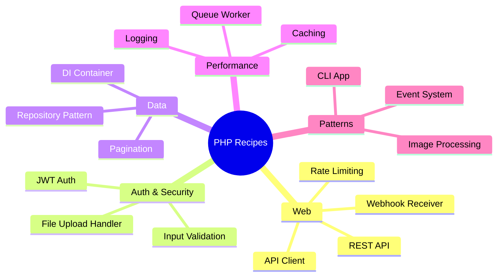
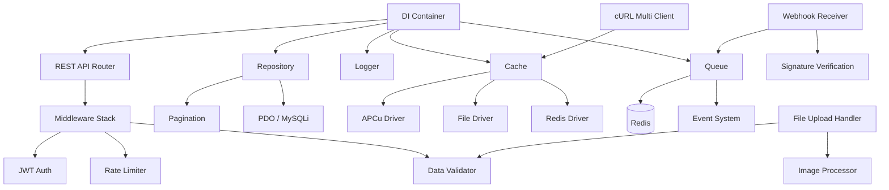
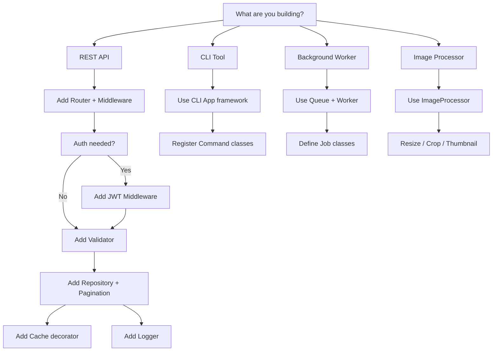

# PHP Recipes — Production-Ready Implementations

## 1. Overview

This skill provides complete, copy-paste-ready PHP implementations for the 16 most common production patterns. Every recipe is written with `declare(strict_types=1)`, follows PSR-12, and uses modern PHP 8.4 features (constructor promotion, readonly classes, property hooks, asymmetric visibility, enum-backed options, named arguments, and match expressions). Each recipe is self-contained and production-hardened — including error handling, edge cases, and security considerations.



**Recipe List:**

| # | Recipe | Key Pattern | Lines |
|---|--------|------------|-------|
| 1 | REST API Framework | Routing, Middleware, JSON responses | ~120 |
| 2 | JWT Authentication | Issue, verify, refresh tokens | ~140 |
| 3 | Repository Pattern | Interface + PDO/MySQLi impl | ~100 |
| 4 | Dependency Injection Container | Autowiring, definition overrides | ~100 |
| 5 | Caching Abstraction | APCu, File, Redis drivers | ~150 |
| 6 | PSR-3 Logger | Channeled, leveled, formatter | ~100 |
| 7 | CLI Application | Command routing, I/O, exit codes | ~80 |
| 8 | Webhook Receiver | Signature verification, retry | ~80 |
| 9 | File Upload Handler | Validation, storage, security | ~90 |
| 10 | Image Processor | GD thumbnails, resize, crop | ~80 |
| 11 | Pagination Strategies | Offset-based, cursor-based | ~80 |
| 12 | Rate Limiter | Token bucket algorithm | ~70 |
| 13 | Queue Worker | Redis-backed job processing | ~120 |
| 14 | Event System | Dispatch, listen, stop propagation | ~90 |
| 15 | Data Validator | Nested validation, rules engine | ~110 |
| 16 | cURL Multi Client | Concurrent requests, pooling | ~100 |

## 2. Installation / Configuration

```php
// composer.json — minimal dependencies for these recipes
{
    "require": {
        "php": ">=8.4",
        "ext-pdo": "*",
        "ext-pdo_mysql": "*",
        "ext-curl": "*",
        "ext-apcu": "*",
        "ext-redis": "*",
        "ext-gd": "*",
        "ext-json": "*",
        "ext-mbstring": "*",
        "ext-openssl": "*"
    },
    "autoload": {
        "psr-4": {
            "App\\": "src/"
        }
    }
}
```

```ini
; php.ini recommendations
extension=pdo_mysql
extension=curl
extension=apcu
extension=redis
extension=gd
extension=openssl
extension=json
extension=mbstring
; APCu settings
apc.enabled=1
apc.shm_size=128M
; File upload limits
upload_max_filesize=10M
post_max_size=12M
; Error handling
error_reporting=E_ALL
display_errors=0
log_errors=1
```

## 3. Architecture

### 3.1 Recipe Dependency Map



### 3.2 Pattern Relationships

Most recipes compose with others. For example, a production REST API typically combines:

- **Router** (pattern 1) for endpoint dispatch
- **Middleware** (pattern 1) for cross-cutting concerns
- **JWT** (pattern 2) for authentication
- **Validator** (pattern 15) for input safety
- **Repository** (pattern 3) for data access
- **Logger** (pattern 6) for observability
- **Cache** (pattern 5) for performance
- **Rate Limiter** (pattern 12) for protection

## 4. Syntax & Usage

### 4.1 REST API Framework

```php
declare(strict_types=1);

namespace App\Recipe\Rest;

/**
 * PSR-7 compatible request abstraction
 * @immutable
 */
readonly class Request
{
    public function __construct(
        public string $method,
        public string $path,
        /** @var array<string, string> */
        public array $headers,
        /** @var array<string, mixed> */
        public array $query,
        public mixed $body,
        /** @var array<string, mixed> */
        public array $attributes = [],
    ) {}

    public function withAttribute(string $key, mixed $value): self
    {
        $clone = clone $this;
        $clone->attributes[$key] = $value;
        return $clone;
    }
}

/**
 * JSON response object
 * @immutable
 */
readonly class Response
{
    public function __construct(
        public int $status = 200,
        public mixed $data = null,
        public string $error = '',
        /** @var array<string, string> */
        public array $headers = [],
    ) {}

    public function send(): never
    {
        http_response_code($this->status);
        foreach ($this->headers as $key => $value) {
            header("{$key}: {$value}");
        }
        header('Content-Type: application/json; charset=utf-8');
        if ($this->error !== '') {
            echo json_encode(['error' => $this->error], JSON_THROW_ON_ERROR);
        } elseif ($this->data !== null) {
            echo json_encode($this->data, JSON_THROW_ON_ERROR);
        }
        exit;
    }
}

/** Middleware handler interface */
interface MiddlewareInterface
{
    public function handle(Request $request, callable $next): Response;
}

/** Router with middleware stack */
class Router
{
    /** @var array<string, array<string, callable>> */
    private array $routes = [];

    /** @var MiddlewareInterface[] */
    private array $globalMiddleware = [];

    /** @var array<string, MiddlewareInterface[]> */
    private array $routeMiddleware = [];

    public function addGlobalMiddleware(MiddlewareInterface $middleware): void
    {
        $this->globalMiddleware[] = $middleware;
    }

    /**
     * Register a route handler.
     *
     * @param string $method HTTP method (GET, POST, PUT, DELETE, PATCH)
     * @param string $path Route path, e.g. "/api/users/{id}"
     * @param callable $handler fn(Request, array): Response
     * @param MiddlewareInterface[] $middleware Route-specific middleware
     */
    public function addRoute(
        string $method,
        string $path,
        callable $handler,
        array $middleware = [],
    ): void {
        $this->routes[strtoupper($method)][$path] = $handler;
        if ($middleware !== []) {
            $this->routeMiddleware[$method . ':' . $path] = $middleware;
        }
    }

    /**
     * Dispatch the request through middleware and route handler.
     */
    public function dispatch(Request $request): Response
    {
        // Find matching route
        $method = strtoupper($request->method);
        $handler = null;
        $params = [];
        $matchedPath = '';

        if (!isset($this->routes[$method])) {
            return new Response(status: 405, error: 'Method not allowed');
        }

        foreach ($this->routes[$method] as $path => $h) {
            $pattern = preg_replace('/\{(\\w+)\}/', '(?P<$1>[^/]+)', $path);
            $pattern = '#^' . $pattern . '$#';
            if (preg_match($pattern, $request->path, $matches)) {
                $handler = $h;
                $matchedPath = $pattern;
                $params = array_filter($matches, 'is_string', ARRAY_FILTER_USE_KEY);
                break;
            }
        }

        if ($handler === null) {
            return new Response(status: 404, error: 'Not found');
        }

        // Build middleware chain: global → route-specific → handler
        $chain = $this->globalMiddleware;
        $routeKey = $request->method . ':' . $matchedPath;
        if (isset($this->routeMiddleware[$routeKey])) {
            $chain = [...$chain, ...$this->routeMiddleware[$routeKey]];
        }

        // Wrap handler in middleware
        $next = fn(Request $req): Response => $handler($req, $params);

        foreach (array_reverse($chain) as $middleware) {
            $next = (fn(MiddlewareInterface $m, callable $n) =>
                fn(Request $req): Response => $m->handle($req, $n)
            )($middleware, $next);
        }

        return $next($request);
    }
}

// ── Usage examples ──

/**
 * Example: CORS middleware
 */
readonly class CorsMiddleware implements MiddlewareInterface
{
    public function __construct(
        private string $allowedOrigin = '*',
        private string $allowedMethods = 'GET, POST, PUT, DELETE, PATCH, OPTIONS',
    ) {}

    public function handle(Request $request, callable $next): Response
    {
        if ($request->method === 'OPTIONS') {
            return new Response(
                status: 204,
                headers: [
                    'Access-Control-Allow-Origin' => $this->allowedOrigin,
                    'Access-Control-Allow-Methods' => $this->allowedMethods,
                    'Access-Control-Allow-Headers' => 'Authorization, Content-Type',
                    'Access-Control-Max-Age' => '86400',
                ],
            );
        }

        $response = $next($request);

        return new Response(
            status: $response->status,
            data: $response->data,
            error: $response->error,
            headers: [
                ...$response->headers,
                'Access-Control-Allow-Origin' => $this->allowedOrigin,
            ],
        );
    }
}

/**
 * Example: JSON body parser middleware
 */
readonly class JsonBodyParserMiddleware implements MiddlewareInterface
{
    public function handle(Request $request, callable $next): Response
    {
        if (in_array($request->method, ['POST', 'PUT', 'PATCH'], true)) {
            $raw = file_get_contents('php://input');
            if ($raw !== false && $raw !== '') {
                $body = json_decode($raw, true, 512, JSON_THROW_ON_ERROR);
                $request = $request->withAttribute('parsed_body', $body);
            }
        }
        return $next($request);
    }
}
```

### 4.2 JWT Authentication

```php
declare(strict_types=1);

namespace App\Recipe\Auth;

/**
 * Stateless JWT implementation using HS256.
 *
 * For production, prefer RS256/ES256 with a proper key management system.
 */
final class JwtAuth
{
    private const ALGORITHM = 'sha256';
    private const HEADER = '{"alg":"HS256","typ":"JWT"}';

    public function __construct(
        private readonly string $secret,
        private readonly string $issuer = 'app',
        private readonly int $ttl = 3600,      // Access token TTL (seconds)
        private readonly int $refreshTtl = 604800, // 7 days
    ) {
        if (strlen($secret) < 32) {
            throw new \InvalidArgumentException(
                'JWT secret must be at least 32 characters',
            );
        }
    }

    /**
     * Issue an access + refresh token pair.
     *
     * @param array<string, mixed> $payload Custom claims (e.g., user_id, roles)
     * @return array{access_token: string, refresh_token: string, expires_in: int}
     */
    public function issue(array $payload = []): array
    {
        $now = time();
        $exp = $now + $this->ttl;

        $accessPayload = [
            'iss' => $this->issuer,
            'iat' => $now,
            'exp' => $exp,
            ...$payload,
        ];
        $accessToken = $this->encode($accessPayload);

        $refreshPayload = [
            'iss' => $this->issuer,
            'iat' => $now,
            'exp' => $now + $this->refreshTtl,
            'type' => 'refresh',
            'sub' => $payload['sub'] ?? null,
            'token_hash' => hash('sha256', $accessToken),
        ];
        $refreshToken = $this->encode($refreshPayload);

        return [
            'access_token' => $accessToken,
            'refresh_token' => $refreshToken,
            'expires_in' => $this->ttl,
        ];
    }

    /**
     * Verify a token and return its payload.
     *
     * @throws \RuntimeException on invalid/expired token
     * @return array<string, mixed>
     */
    public function verify(string $token): array
    {
        $parts = explode('.', $token);
        if (count($parts) !== 3) {
            throw new \RuntimeException('Invalid token format');
        }

        [$header, $payload, $signature] = $parts;

        $expectedSig = $this->sign("{$header}.{$payload}");
        if (!hash_equals($expectedSig, $signature)) {
            throw new \RuntimeException('Invalid signature');
        }

        $data = json_decode(
            base64_decode($this->urlDecode($payload)),
            true,
            512,
            JSON_THROW_ON_ERROR,
        );

        if ($data === null || !isset($data['exp'])) {
            throw new \RuntimeException('Invalid token payload');
        }

        if ($data['exp'] < time()) {
            throw new \RuntimeException('Token expired');
        }

        return $data;
    }

    /**
     * Refresh an access token using a valid refresh token.
     *
     * @return array{access_token: string, refresh_token: string, expires_in: int}
     */
    public function refresh(string $refreshToken): array
    {
        $data = $this->verify($refreshToken);

        if (($data['type'] ?? '') !== 'refresh') {
            throw new \RuntimeException('Invalid token type for refresh');
        }

        unset($data['iat'], $data['exp'], $data['type'], $data['token_hash']);
        return $this->issue($data);
    }

    /**
     * Encode a payload into a JWT string.
     *
     * @param array<string, mixed> $payload
     */
    private function encode(array $payload): string
    {
        $header = $this->urlEncode(base64_encode(self::HEADER));
        $payload = $this->urlEncode(
            base64_encode(json_encode($payload, JSON_THROW_ON_ERROR)),
        );
        $signature = $this->sign("{$header}.{$payload}");

        return "{$header}.{$payload}.{$signature}";
    }

    private function sign(string $data): string
    {
        return $this->urlEncode(
            base64_encode(
                hash_hmac(self::ALGORITHM, $data, $this->secret, true),
            ),
        );
    }

    private function urlEncode(string $data): string
    {
        return rtrim(
            strtr(base64_encode(base64_decode($data) ?: $data), '+/', '-_'),
            '=',
        );
    }

    private function urlDecode(string $data): string
    {
        return base64_decode(
            strtr($data, '-_', '+/'),
            true,
        ) ?: '';
    }
}
```

### 4.3 Repository Pattern

```php
declare(strict_types=1);

namespace App\Recipe\Repository;

use App\Recipe\Pagination\PaginationResult;

/**
 * Generic repository interface.
 *
 * @template T of object
 */
interface RepositoryInterface
{
    /** @return T|null */
    public function findById(int|string $id): ?object;

    /** @return T[] */
    public function findAll(int $page = 1, int $perPage = 20): PaginationResult;

    /** @param T $entity */
    public function save(object $entity): object;

    /** @param T $entity */
    public function delete(object $entity): bool;
}

/**
 * PDO-based repository implementation.
 *
 * @template T of object
 * @implements RepositoryInterface<T>
 */
abstract class PdoRepository implements RepositoryInterface
{
    protected \PDO $pdo;
    protected string $table;
    protected string $entityClass;

    public function __construct(\PDO $pdo)
    {
        $this->pdo = $pdo;
    }

    public function findById(int|string $id): ?object
    {
        $stmt = $this->pdo->prepare(
            "SELECT * FROM {$this->table} WHERE id = :id LIMIT 1",
        );
        $stmt->execute(['id' => $id]);
        $row = $stmt->fetch(\PDO::FETCH_ASSOC);

        return $row !== false ? $this->hydrate($row) : null;
    }

    /**
     * @return T[]
     */
    public function findAll(int $page = 1, int $perPage = 20): PaginationResult
    {
        $offset = ($page - 1) * $perPage;

        $countStmt = $this->pdo->query("SELECT COUNT(*) FROM {$this->table}");
        $total = (int) $countStmt->fetchColumn();

        $stmt = $this->pdo->prepare(
            "SELECT * FROM {$this->table} ORDER BY id LIMIT :limit OFFSET :offset",
        );
        $stmt->bindValue('limit', $perPage, \PDO::PARAM_INT);
        $stmt->bindValue('offset', $offset, \PDO::PARAM_INT);
        $stmt->execute();

        $items = array_map(
            fn(array $row): object => $this->hydrate($row),
            $stmt->fetchAll(\PDO::FETCH_ASSOC),
        );

        return new PaginationResult(
            items: $items,
            total: $total,
            page: $page,
            perPage: $perPage,
        );
    }

    /**
     * @param T $entity
     */
    public function save(object $entity): object
    {
        $data = $this->extract($entity);
        $id = $data['id'] ?? null;

        if ($id !== null && $this->findById($id) !== null) {
            return $this->update($data);
        }
        return $this->insert($data);
    }

    /**
     * @param T $entity
     */
    public function delete(object $entity): bool
    {
        $id = $entity->id ?? null;
        if ($id === null) {
            return false;
        }
        $stmt = $this->pdo->prepare(
            "DELETE FROM {$this->table} WHERE id = :id",
        );
        return $stmt->execute(['id' => $id]);
    }

    /**
     * Convert database row to entity object.
     *
     * @param array<string, mixed> $row
     * @return T
     */
    abstract protected function hydrate(array $row): object;

    /**
     * Convert entity to database column map.
     *
     * @param T $entity
     * @return array<string, mixed>
     */
    abstract protected function extract(object $entity): array;

    /**
     * @param array<string, mixed> $data
     * @return T
     */
    private function insert(array $data): object
    {
        $columns = implode(', ', array_keys($data));
        $placeholders = ':' . implode(', :', array_keys($data));
        $stmt = $this->pdo->prepare(
            "INSERT INTO {$this->table} ({$columns}) VALUES ({$placeholders})",
        );
        $stmt->execute($data);

        $id = (int) $this->pdo->lastInsertId();
        return $this->findById($id);
    }

    /**
     * @param array<string, mixed> $data
     * @return T
     */
    private function update(array $data): object
    {
        $id = $data['id'];
        unset($data['id']);
        $set = implode(
            ', ',
            array_map(fn(string $col) => "{$col} = :{$col}", array_keys($data)),
        );
        $data['id'] = $id;
        $stmt = $this->pdo->prepare(
            "UPDATE {$this->table} SET {$set} WHERE id = :id",
        );
        $stmt->execute($data);

        return $this->findById($id);
    }
}
```

### 4.4 Dependency Injection Container

```php
declare(strict_types=1);

namespace App\Recipe\Di;

/**
 * Lightweight autowiring DI container with definition overrides.
 *
 * Resolution order:
 * 1. Explicit definition (set())
 * 2. Shared singleton (singleton())  
 * 3. Autowiring via reflection
 */
final class Container
{
    /** @var array<string, callable(Container): object> */
    private array $definitions = [];

    /** @var array<string, object> */
    private array $singletons = [];

    /** @var array<string, object> */
    private array $shared = [];

    /**
     * Register an explicit factory.
     *
     * @template T of object
     * @param class-string<T> $id
     * @param callable(Container): T $factory
     */
    public function set(string $id, callable $factory): void
    {
        $this->definitions[$id] = $factory;
    }

    /**
     * Register a shared (singleton) factory.
     *
     * @template T of object
     * @param class-string<T> $id
     * @param callable(Container): T $factory
     */
    public function singleton(string $id, callable $factory): void
    {
        $this->singletons[$id] = $factory;
    }

    /**
     * Resolve a service by class/interface name.
     *
     * @template T of object
     * @param class-string<T> $id
     * @return T
     */
    public function get(string $id): object
    {
        // Return existing shared instance
        if (isset($this->shared[$id])) {
            /** @var T */
            return $this->shared[$id];
        }

        // Singleton factory
        if (isset($this->singletons[$id])) {
            $instance = ($this->singletons[$id])($this);
            $this->shared[$id] = $instance;
            /** @var T */
            return $instance;
        }

        // Explicit definition
        if (isset($this->definitions[$id])) {
            $instance = ($this->definitions[$id])($this);
            /** @var T */
            return $instance;
        }

        // Autowiring
        $instance = $this->autowire($id);
        /** @var T */
        return $instance;
    }

    /**
     * Autowire a class by resolving its constructor dependencies.
     *
     * @template T of object
     * @param class-string<T> $class
     * @return T
     */
    private function autowire(string $class): object
    {
        $ref = new \ReflectionClass($class);

        if (!$ref->isInstantiable()) {
            throw new ContainerException(
                "Class {$class} is not instantiable",
            );
        }

        $constructor = $ref->getConstructor();
        if ($constructor === null) {
            /** @var T */
            return $ref->newInstance();
        }

        $params = $constructor->getParameters();
        $deps = [];

        foreach ($params as $param) {
            $paramType = $param->getType();

            if ($paramType === null) {
                if ($param->isDefaultValueAvailable()) {
                    $deps[] = $param->getDefaultValue();
                    continue;
                }
                throw new ContainerException(
                    "Cannot resolve untyped parameter \${$param->getName()} in {$class}",
                );
            }

            if ($paramType instanceof \ReflectionNamedType && !$paramType->isBuiltin()) {
                $deps[] = $this->get($paramType->getName());
            } elseif ($param->isDefaultValueAvailable()) {
                $deps[] = $param->getDefaultValue();
            } else {
                throw new ContainerException(
                    "Cannot resolve parameter \${$param->getName()} in {$class}",
                );
            }
        }

        /** @var T */
        return $ref->newInstanceArgs($deps);
    }

    /**
     * Check if a service is registered.
     */
    public function has(string $id): bool
    {
        return isset($this->definitions[$id])
            || isset($this->singletons[$id])
            || class_exists($id);
    }
}

class ContainerException extends \RuntimeException
{
    public function __construct(string $message, ?\Throwable $previous = null)
    {
        parent::__construct($message, 0, $previous);
    }
}
```

### 4.5 Caching Abstraction

```php
declare(strict_types=1);

namespace App\Recipe\Cache;

/**
 * Cache item with expiration.
 * @immutable
 */
readonly class CacheItem
{
    public function __construct(
        public mixed $value,
        public int $expiresAt = 0, // 0 = no expiration
    ) {}

    public function isExpired(): bool
    {
        return $this->expiresAt !== 0 && $this->expiresAt < time();
    }
}

/** Cache driver interface */
interface CacheInterface
{
    public function get(string $key): mixed;
    public function set(string $key, mixed $value, int $ttl = 0): bool;
    public function delete(string $key): bool;
    public function clear(): bool;
    public function has(string $key): bool;
}

/**
 * APCu-backed cache (fastest, shared-memory).
 */
final class ApcuCache implements CacheInterface
{
    public function get(string $key): mixed
    {
        $success = false;
        $value = apcu_fetch($key, $success);
        return $success ? $value : null;
    }

    public function set(string $key, mixed $value, int $ttl = 0): bool
    {
        return apcu_store($key, $value, $ttl);
    }

    public function delete(string $key): bool
    {
        return apcu_delete($key);
    }

    public function clear(): bool
    {
        return apcu_clear_cache();
    }

    public function has(string $key): bool
    {
        return apcu_exists($key);
    }
}

/**
 * File-based cache fallback when no opcode cache available.
 */
final class FileCache implements CacheInterface
{
    public function __construct(
        private readonly string $directory,
    ) {
        if (!is_dir($this->directory)) {
            mkdir($this->directory, 0775, true);
        }
    }

    private function path(string $key): string
    {
        return $this->directory . '/' . md5($key) . '.cache';
    }

    public function get(string $key): mixed
    {
        $path = $this->path($key);
        if (!file_exists($path)) {
            return null;
        }

        $data = file_get_contents($path);
        if ($data === false) {
            return null;
        }

        $item = unserialize($data);
        if (!$item instanceof CacheItem || $item->isExpired()) {
            @unlink($path);
            return null;
        }

        return $item->value;
    }

    public function set(string $key, mixed $value, int $ttl = 0): bool
    {
        $item = new CacheItem(
            value: $value,
            expiresAt: $ttl > 0 ? time() + $ttl : 0,
        );

        return file_put_contents(
            $this->path($key),
            serialize($item),
            LOCK_EX,
        ) !== false;
    }

    public function delete(string $key): bool
    {
        $path = $this->path($key);
        return file_exists($path) ? unlink($path) : true;
    }

    public function clear(): bool
    {
        $files = glob($this->directory . '/*.cache');
        if ($files === false) {
            return false;
        }
        foreach ($files as $file) {
            if (is_file($file)) {
                unlink($file);
            }
        }
        return true;
    }

    public function has(string $key): bool
    {
        return $this->get($key) !== null;
    }
}

/**
 * Redis-backed cache with tag support.
 */
final class RedisCache implements CacheInterface
{
    public function __construct(
        private readonly \Redis $redis,
        private readonly string $prefix = 'cache:',
    ) {}

    private function key(string $key): string
    {
        return $this->prefix . $key;
    }

    public function get(string $key): mixed
    {
        $value = $this->redis->get($this->key($key));
        return $value !== false ? unserialize($value) : null;
    }

    public function set(string $key, mixed $value, int $ttl = 0): bool
    {
        $serialized = serialize($value);
        if ($ttl > 0) {
            return $this->redis->setex($this->key($key), $ttl, $serialized);
        }
        return $this->redis->set($this->key($key), $serialized);
    }

    public function delete(string $key): bool
    {
        return $this->redis->del($this->key($key)) > 0;
    }

    public function clear(): bool
    {
        $keys = $this->redis->keys($this->prefix . '*');
        if ($keys === false || $keys === []) {
            return true;
        }
        return $this->redis->del($keys) > 0;
    }

    public function has(string $key): bool
    {
        return $this->redis->exists($this->key($key));
    }
}

/**
 * Cache decorator with get-or-set pattern.
 */
final class CacheAware
{
    public function __construct(
        private readonly CacheInterface $cache,
    ) {}

    /**
     * Retrieve from cache or compute and store.
     *
     * @template T
     * @param string $key
     * @param callable(): T $callback
     * @param int $ttl Seconds (0 = forever)
     * @return T
     */
    public function remember(string $key, callable $callback, int $ttl = 0): mixed
    {
        $value = $this->cache->get($key);
        if ($value !== null) {
            return $value;
        }

        $value = $callback();
        $this->cache->set($key, $value, $ttl);
        return $value;
    }
}
```

### 4.6 PSR-3 Style Logger

```php
declare(strict_types=1);

namespace App\Recipe\Log;

/**
 * Log levels following RFC 5424 + debug/trace.
 */
enum LogLevel: int
{
    case DEBUG = 100;
    case INFO = 200;
    case NOTICE = 250;
    case WARNING = 300;
    case ERROR = 400;
    case CRITICAL = 500;
    case ALERT = 550;
    case EMERGENCY = 600;
}

/** Structured log entry */
readonly class LogEntry
{
    public function __construct(
        public \DateTimeImmutable $timestamp,
        public LogLevel $level,
        public string $message,
        /** @var array<string, mixed> */
        public array $context = [],
        public string $channel = 'app',
    ) {}
}

/** Log formatter interface */
interface FormatterInterface
{
    public function format(LogEntry $entry): string;
}

/** JSON line formatter (ideal for log aggregation systems) */
final class JsonFormatter implements FormatterInterface
{
    public function format(LogEntry $entry): string
    {
        return json_encode([
            'timestamp' => $entry->timestamp->format('c'),
            'level' => $entry->level->name,
            'channel' => $entry->channel,
            'message' => $entry->message,
            'context' => $entry->context,
        ], JSON_UNESCAPED_SLASHES | JSON_UNESCAPED_UNICODE) . "\n";
    }
}

/** Line formatter (human-readable, dev-friendly) */
final class LineFormatter implements FormatterInterface
{
    public function __construct(
        private readonly string $format = "[%datetime%] %level%.%channel%: %message% %context%\n",
    ) {}

    public function format(LogEntry $entry): string
    {
        return strtr($this->format, [
            '%datetime%' => $entry->timestamp->format('Y-m-d H:i:s.u'),
            '%level%' => str_pad($entry->level->name, 8),
            '%channel%' => $entry->channel,
            '%message%' => $entry->message,
            '%context%' => $entry->context !== []
                ? json_encode($entry->context, JSON_UNESCAPED_SLASHES)
                : '',
        ]);
    }
}

/** Log handler interface */
interface HandlerInterface
{
    public function handle(LogEntry $entry): void;
    public function isHandling(LogLevel $level): bool;
}

/** File handler with rotation */
final class FileHandler implements HandlerInterface
{
    private ?\DateTimeImmutable $currentDate = null;

    public function __construct(
        private readonly string $logDir,
        private readonly FormatterInterface $formatter = new JsonFormatter(),
        private readonly LogLevel $minLevel = LogLevel::DEBUG,
    ) {
        if (!is_dir($this->logDir)) {
            mkdir($this->logDir, 0775, true);
        }
    }

    public function handle(LogEntry $entry): void
    {
        $filename = $this->logDir . '/app-' . $entry->timestamp->format('Y-m-d') . '.log';
        $line = $this->formatter->format($entry);
        file_put_contents($filename, $line, FILE_APPEND | LOCK_EX);
    }

    public function isHandling(LogLevel $level): bool
    {
        return $level->value >= $this->minLevel->value;
    }
}

/** Main logger class */
final class Logger
{
    /** @var HandlerInterface[] */
    private array $handlers = [];
    private string $channel;

    public function __construct(
        string $channel = 'app',
        HandlerInterface ...$handlers,
    ) {
        $this->channel = $channel;
        $this->handlers = $handlers;
    }

    public function addHandler(HandlerInterface $handler): void
    {
        $this->handlers[] = $handler;
    }

    public function log(LogLevel $level, string $message, array $context = []): void
    {
        $entry = new LogEntry(
            timestamp: new \DateTimeImmutable(),
            level: $level,
            message: $message,
            context: $context,
            channel: $this->channel,
        );

        foreach ($this->handlers as $handler) {
            if ($handler->isHandling($level)) {
                $handler->handle($entry);
            }
        }
    }

    public function debug(string $message, array $context = []): void
    {
        $this->log(LogLevel::DEBUG, $message, $context);
    }

    public function info(string $message, array $context = []): void
    {
        $this->log(LogLevel::INFO, $message, $context);
    }

    public function warning(string $message, array $context = []): void
    {
        $this->log(LogLevel::WARNING, $message, $context);
    }

    public function error(string $message, array $context = []): void
    {
        $this->log(LogLevel::ERROR, $message, $context);
    }

    public function critical(string $message, array $context = []): void
    {
        $this->log(LogLevel::CRITICAL, $message, $context);
    }
}
```

### 4.7 CLI Application Pattern

```php
declare(strict_types=1);

namespace App\Recipe\Cli;

/**
 * CLI command interface.
 */
interface CommandInterface
{
    public static function getName(): string;
    public static function getDescription(): string;
    public function execute(CliInput $input): CliResult;
}

/** Parsed CLI input */
readonly class CliInput
{
    /** @param array<string, string> $namedArgs */
    public function __construct(
        public string $command = '',
        public array $namedArgs = [],
        public array $positionalArgs = [],
        public array $flags = [],
    ) {}

    public function hasFlag(string $name): bool
    {
        return in_array($name, $this->flags, true);
    }

    public function getArg(string $name, string $default = ''): string
    {
        return $this->namedArgs[$name] ?? $default;
    }

    public function getPositional(int $index, string $default = ''): string
    {
        return $this->positionalArgs[$index] ?? $default;
    }
}

/** CLI command result */
readonly class CliResult
{
    public function __construct(
        public int $exitCode = 0,
        public string $output = '',
    ) {}
}

/** CLI argument parser */
final class CliParser
{
    public static function parse(array $argv = null): CliInput
    {
        $argv ??= $_SERVER['argv'] ?? [];
        array_shift($argv); // Remove script name

        if ($argv === []) {
            return new CliInput();
        }

        $command = array_shift($argv);
        $namedArgs = [];
        $positionalArgs = [];
        $flags = [];

        foreach ($argv as $arg) {
            if (str_starts_with($arg, '--')) {
                $parts = explode('=', substr($arg, 2), 2);
                if (count($parts) === 2) {
                    $namedArgs[$parts[0]] = $parts[1];
                } else {
                    $flags[] = $parts[0];
                }
            } elseif (str_starts_with($arg, '-')) {
                $flags[] = substr($arg, 1);
            } else {
                $positionalArgs[] = $arg;
            }
        }

        return new CliInput(
            command: $command,
            namedArgs: $namedArgs,
            positionalArgs: $positionalArgs,
            flags: $flags,
        );
    }
}

/** CLI application (command router) */
final class CliApp
{
    /** @var array<string, class-string<CommandInterface>> */
    private array $commands = [];

    /**
     * @param class-string<CommandInterface> $commandClass
     */
    public function register(string $commandClass): void
    {
        $this->commands[$commandClass::getName()] = $commandClass;
    }

    public function run(?array $argv = null): never
    {
        $input = CliParser::parse($argv);

        if ($input->command === '' || $input->hasFlag('help')) {
            $this->showHelp();
        }

        $commandClass = $this->commands[$input->command] ?? null;
        if ($commandClass === null) {
            fwrite(STDERR, "Unknown command: {$input->command}\n");
            $this->showHelp();
            exit(1);
        }

        /** @var CommandInterface $command */
        $command = new $commandClass();
        $result = $command->execute($input);

        if ($result->output !== '') {
            echo $result->output . "\n";
        }
        exit($result->exitCode);
    }

    private function showHelp(): void
    {
        echo "Usage: php app.php <command> [options]\n\n";
        echo "Available commands:\n";
        foreach ($this->commands as $name => $class) {
            echo sprintf("  %-20s %s\n", $name, $class::getDescription());
        }
    }
}
```

### 4.8 Webhook Receiver

```php
declare(strict_types=1);

namespace App\Recipe\Webhook;

/**
 * Webhook payload with validated signature.
 * @immutable
 */
readonly class WebhookPayload
{
    public function __construct(
        public string $event,
        public array $data,
        public string $signature,
        public \DateTimeImmutable $receivedAt,
        public string $rawBody,
    ) {}
}

/**
 * Webhook signature verifier.
 *
 * Supports HMAC-SHA256 and HMAC-SHA512.
 */
final class WebhookVerifier
{
    private const SUPPORTED_ALGORITHMS = ['sha256', 'sha512'];

    public function __construct(
        private readonly string $secret,
        private readonly string $algorithm = 'sha256',
        private readonly string $headerName = 'X-Webhook-Signature',
        private readonly int $tolerance = 300, // 5 minutes
    ) {
        if (!in_array($this->algorithm, self::SUPPORTED_ALGORITHMS, true)) {
            throw new \InvalidArgumentException(
                "Unsupported algorithm: {$this->algorithm}",
            );
        }
        if (strlen($this->secret) < 16) {
            throw new \InvalidArgumentException(
                'Webhook secret must be at least 16 characters',
            );
        }
    }

    /**
     * Verify incoming webhook request.
     *
     * @param array<string, string> $headers Request headers
     * @param string $body Raw request body
     * @return WebhookPayload
     * @throws WebhookVerificationException on failure
     */
    public function verify(array $headers, string $body): WebhookPayload
    {
        $signature = $headers[$this->headerName] ?? '';
        if ($signature === '') {
            throw new WebhookVerificationException('Missing signature header');
        }

        $timestamp = (int) ($headers['X-Webhook-Timestamp'] ?? 0);
        if ($timestamp === 0) {
            throw new WebhookVerificationException('Missing timestamp header');
        }

        if (abs(time() - $timestamp) > $this->tolerance) {
            throw new WebhookVerificationException('Webhook timestamp out of tolerance');
        }

        $expected = hash_hmac($this->algorithm, $body, $this->secret);
        if (!hash_equals($expected, $signature)) {
            throw new WebhookVerificationException('Invalid webhook signature');
        }

        $event = $headers['X-Webhook-Event'] ?? 'unknown';
        $data = json_decode($body, true, 512, JSON_THROW_ON_ERROR) ?? [];

        return new WebhookPayload(
            event: $event,
            data: $data,
            signature: $signature,
            receivedAt: new \DateTimeImmutable(),
            rawBody: $body,
        );
    }
}

/** @final */
class WebhookVerificationException extends \RuntimeException
{
    public function __construct(string $message, ?\Throwable $previous = null)
    {
        parent::__construct($message, 0, $previous);
    }
}
```

### 4.9 File Upload Handler

```php
declare(strict_types=1);

namespace App\Recipe\Upload;

/** Validated uploaded file */
readonly class UploadedFile
{
    public string $extension;
    public string $mimeType;
    public string $storedPath;
    public int $size;

    public function __construct(
        public string $originalName,
        string $extension,
        string $mimeType,
        string $storedPath,
        int $size,
        public string $hash = '',
    ) {
        $this->extension = strtolower($extension);
        $this->mimeType = $mimeType;
        $this->storedPath = $storedPath;
        $this->size = $size;
    }
}

/**
 * Secure file upload handler with validation.
 */
final class FileUploadHandler
{
    private const DEFAULT_ALLOWED_TYPES = [
        'image/jpeg' => ['jpg', 'jpeg'],
        'image/png' => ['png'],
        'image/gif' => ['gif'],
        'image/webp' => ['webp'],
        'application/pdf' => ['pdf'],
        'text/plain' => ['txt'],
        'text/csv' => ['csv'],
        'application/json' => ['json'],
    ];

    /** @var array<string, array<int, string>> MIME → extensions */
    private array $allowedTypes;
    private int $maxSize;
    private string $uploadDir;

    public function __construct(
        string $uploadDir,
        ?array $allowedTypes = null,
        int $maxSize = 10 * 1024 * 1024, // 10MB
    ) {
        $this->uploadDir = rtrim($uploadDir, '/\\');
        $this->allowedTypes = $allowedTypes ?? self::DEFAULT_ALLOWED_TYPES;
        $this->maxSize = $maxSize;

        if (!is_dir($this->uploadDir)) {
            mkdir($this->uploadDir, 0775, true);
        }
    }

    /**
     * Validate and store an uploaded file.
     *
     * @param array $file $_FILES entry
     * @return UploadedFile
     * @throws UploadException
     */
    public function handle(array $file): UploadedFile
    {
        // Validate upload error code
        if ($file['error'] !== UPLOAD_ERR_OK) {
            throw new UploadException(
                match ($file['error']) {
                    UPLOAD_ERR_INI_SIZE, UPLOAD_ERR_FORM_SIZE => 'File exceeds maximum size',
                    UPLOAD_ERR_PARTIAL => 'File was only partially uploaded',
                    UPLOAD_ERR_NO_FILE => 'No file was uploaded',
                    default => 'Unknown upload error',
                },
            );
        }

        // Validate file size
        if ($file['size'] > $this->maxSize) {
            throw new UploadException(
                'File exceeds maximum allowed size: ' . ($this->maxSize / 1024 / 1024) . 'MB',
            );
        }

        // Validate MIME type (check both finfo and client-provided)
        $finfo = new \finfo(FILEINFO_MIME_TYPE);
        $mimeType = $finfo->file($file['tmp_name']);
        $extension = $this->mimeToExtension($mimeType);

        if ($extension === null) {
            throw new UploadException("File type {$mimeType} is not allowed");
        }

        // Validate actual extension matches
        $clientExt = strtolower(pathinfo($file['name'], PATHINFO_EXTENSION));
        $allowedExts = $this->getAllowedExtensions($mimeType);
        if (!in_array($clientExt, $allowedExts, true)) {
            throw new UploadException('File extension does not match content type');
        }

        // Generate safe filename
        $hash = bin2hex(random_bytes(16));
        $storedName = $hash . '.' . $extension;

        // Move file
        $destPath = $this->uploadDir . '/' . $storedName;
        if (!move_uploaded_file($file['tmp_name'], $destPath)) {
            throw new UploadException('Failed to store uploaded file');
        }

        $fileHash = hash_file('sha256', $destPath);

        return new UploadedFile(
            originalName: $file['name'],
            extension: $extension,
            mimeType: $mimeType,
            storedPath: $destPath,
            size: $file['size'],
            hash: $fileHash,
        );
    }

    private function mimeToExtension(string $mime): ?string
    {
        return $this->allowedTypes[$mime][0] ?? null;
    }

    /**
     * @return string[]
     */
    private function getAllowedExtensions(string $mime): array
    {
        return $this->allowedTypes[$mime] ?? [];
    }
}

/** @final */
class UploadException extends \RuntimeException
{
    public function __construct(string $message, ?\Throwable $previous = null)
    {
        parent::__construct($message, 0, $previous);
    }
}
```

### 4.10 Image Processing (GD)

```php
declare(strict_types=1);

namespace App\Recipe\Image;

/**
 * Image manipulation using GD.
 *
 * All methods return a new instance (immutable operations).
 */
final class ImageProcessor
{
    private const SUPPORTED_TYPES = [IMAGETYPE_JPEG, IMAGETYPE_PNG, IMAGETYPE_GIF, IMAGETYPE_WEBP];

    private ?\GdImage $image = null;
    private int $width;
    private int $height;
    private int $type;

    public function __construct(string $filePath)
    {
        if (!file_exists($filePath)) {
            throw new ImageException("File not found: {$filePath}");
        }

        [$this->width, $this->height, $this->type] = getimagesize($filePath)
            ?: throw new ImageException('Unable to read image dimensions');

        if (!in_array($this->type, self::SUPPORTED_TYPES, true)) {
            throw new ImageException('Unsupported image type');
        }

        $this->image = match ($this->type) {
            IMAGETYPE_JPEG => imagecreatefromjpeg($filePath),
            IMAGETYPE_PNG => imagecreatefrompng($filePath),
            IMAGETYPE_GIF => imagecreatefromgif($filePath),
            IMAGETYPE_WEBP => imagecreatefromwebp($filePath),
        };

        if ($this->image === false) {
            throw new ImageException('Failed to create image from file');
        }

        // Preserve alpha for PNG/WebP
        if ($this->type === IMAGETYPE_PNG || $this->type === IMAGETYPE_WEBP) {
            imagealphablending($this->image, false);
            imagesavealpha($this->image, true);
        }
    }

    public function __destruct()
    {
        if ($this->image !== null) {
            imagedestroy($this->image);
        }
    }

    /**
     * Resize to exact dimensions (stretch/crop as needed).
     */
    public function resize(int $width, int $height): self
    {
        $new = imagescale($this->image, $width, $height, IMG_BILINEAR_FIXED);
        if ($new === false) {
            throw new ImageException('Resize failed');
        }
        $clone = clone $this;
        $clone->image = $new;
        $clone->width = $width;
        $clone->height = $height;
        return $clone;
    }

    /**
     * Create a thumbnail that fits within bounds while maintaining aspect ratio.
     */
    public function thumbnail(int $maxWidth, int $maxHeight): self
    {
        $ratio = min($maxWidth / $this->width, $maxHeight / $this->height, 1.0);
        $newWidth = (int) round($this->width * $ratio);
        $newHeight = (int) round($this->height * $ratio);

        return $this->resize($newWidth, $newHeight);
    }

    /**
     * Crop a rectangular region.
     */
    public function crop(int $x, int $y, int $width, int $height): self
    {
        $new = imagecrop($this->image, ['x' => $x, 'y' => $y, 'width' => $width, 'height' => $height]);
        if ($new === false) {
            throw new ImageException('Crop failed');
        }
        $clone = clone $this;
        $clone->image = $new;
        $clone->width = $width;
        $clone->height = $height;
        return $clone;
    }

    /**
     * Center-crop to a square.
     */
    public function square(): self
    {
        $size = min($this->width, $this->height);
        $x = (int) (($this->width - $size) / 2);
        $y = (int) (($this->height - $size) / 2);
        return $this->crop($x, $y, $size, $size);
    }

    /**
     * Save to file.
     */
    public function save(string $path, int $quality = 85): void
    {
        $ext = strtolower(pathinfo($path, PATHINFO_EXTENSION));

        $result = match ($ext) {
            'jpg', 'jpeg' => imagejpeg($this->image, $path, $quality),
            'png' => imagepng($this->image, $path, (int) round(9 - ($quality / 10))),
            'gif' => imagegif($this->image, $path),
            'webp' => imagewebp($this->image, $path, $quality),
            default => throw new ImageException("Unsupported output format: {$ext}"),
        };

        if (!$result) {
            throw new ImageException("Failed to save image to {$path}");
        }
    }

    /**
     * Output to browser.
     */
    public function output(int $quality = 85): void
    {
        match ($this->type) {
            IMAGETYPE_JPEG => imagejpeg($this->image, null, $quality),
            IMAGETYPE_PNG => imagepng($this->image, null, (int) round(9 - ($quality / 10))),
            IMAGETYPE_GIF => imagegif($this->image),
            IMAGETYPE_WEBP => imagewebp($this->image, null, $quality),
        };
    }

    public function getWidth(): int { return $this->width; }
    public function getHeight(): int { return $this->height; }
}

/** @final */
class ImageException extends \RuntimeException
{
    public function __construct(string $message, ?\Throwable $previous = null)
    {
        parent::__construct($message, 0, $previous);
    }
}
```

### 4.11 Pagination Strategies

```php
declare(strict_types=1);

namespace App\Recipe\Pagination;

/**
 * Pagination result wrapper.
 *
 * @template T
 */
readonly class PaginationResult
{
    /** @param T[] $items */
    public function __construct(
        public array $items,
        public int $total,
        public int $page = 1,
        public int $perPage = 20,
    ) {}

    public function totalPages(): int
    {
        return (int) ceil($this->total / max($this->perPage, 1));
    }

    public function hasPrevious(): bool
    {
        return $this->page > 1;
    }

    public function hasNext(): bool
    {
        return $this->page < $this->totalPages();
    }

    /**
     * @return array{data: T[], meta: array{total: int, page: int, perPage: int, totalPages: int, hasNext: bool, hasPrevious: bool}}
     */
    public function toArray(): array
    {
        return [
            'data' => $this->items,
            'meta' => [
                'total' => $this->total,
                'page' => $this->page,
                'perPage' => $this->perPage,
                'totalPages' => $this->totalPages(),
                'hasNext' => $this->hasNext(),
                'hasPrevious' => $this->hasPrevious(),
            ],
        ];
    }
}

/**
 * Offset-based paginator (standard SQL LIMIT/OFFSET).
 *
 * Best for: Small to medium datasets, stable ordering.
 * Pitfall: OFFSET skip causes performance degredation on large offsets.
 */
final class OffsetPaginator
{
    /**
     * @template T
     * @param callable(int, int): array{0: T[], 1: int} $fetcher fn(limit, offset): [items, total]
     * @return PaginationResult<T>
     */
    public static function paginate(
        callable $fetcher,
        int $page = 1,
        int $perPage = 20,
        int $maxPerPage = 100,
    ): PaginationResult {
        $page = max(1, $page);
        $perPage = min(max(1, $perPage), $maxPerPage);
        $offset = ($page - 1) * $perPage;

        [$items, $total] = $fetcher($perPage, $offset);

        return new PaginationResult(
            items: $items,
            total: $total,
            page: $page,
            perPage: $perPage,
        );
    }
}

/**
 * Cursor-based paginator (keyset pagination).
 *
 * Best for: Large datasets, infinite scroll, real-time feeds.
 * Uses a WHERE cursor > :last_seen instead of OFFSET.
 */
final class CursorPaginator
{
    /**
     * @template T
     * @param callable(string, int, string): T[] $fetcher fn(cursor, limit, direction): items
     * @param array<string, mixed> $extra
     * @return array{data: T[], nextCursor: ?string, hasMore: bool}
     */
    public static function paginate(
        callable $fetcher,
        ?string $cursor = null,
        int $limit = 20,
        int $maxLimit = 100,
        string $direction = 'next',
        array $extra = [],
    ): array {
        $limit = min(max(1, $limit), $maxLimit);

        // Fetch one extra to determine hasMore
        $items = $fetcher($cursor ?? '', $limit + 1, $direction, $extra);

        $hasMore = count($items) > $limit;
        if ($hasMore) {
            $items = array_slice($items, 0, $limit);
        }

        $nextCursor = $hasMore && $items !== []
            ? (string) $items[array_key_last($items)]->id ?? end($items)['id'] ?? null
            : null;

        return [
            'data' => $items,
            'nextCursor' => $nextCursor,
            'hasMore' => $hasMore,
        ];
    }
}
```

### 4.12 Rate Limiter (Token Bucket)

```php
declare(strict_types=1);

namespace App\Recipe\RateLimit;

/**
 * Token bucket rate limiter.
 *
 * Algorithm: Each client has a bucket with `capacity` tokens.
 * Tokens refill at `rate` per second up to `capacity`.
 * A request consumes 1 token. If insufficient tokens, request is denied.
 *
 * Memory-safe: Uses atomic operations via APCu or Redis.
 */
final class TokenBucketRateLimiter
{
    public function __construct(
        private readonly RateLimitStorage $storage,
        private readonly int $capacity = 60,        // Max burst
        private readonly float $rate = 1.0,          // Tokens per second refill
        private readonly string $prefix = 'ratelimit:',
    ) {}

    /**
     * Attempt to consume a token.
     *
     * @param string $clientId Unique client identifier (IP, user ID, API key)
     * @return RateLimitResult
     */
    public function consume(string $clientId): RateLimitResult
    {
        $key = $this->prefix . $clientId;
        $now = microtime(true);

        $bucket = $this->storage->get($key);

        if ($bucket === null) {
            // First request — full bucket
            $bucket = ['tokens' => $this->capacity - 1, 'lastRefill' => $now];
            $this->storage->set($key, $bucket, 3600);
            return new RateLimitResult(
                allowed: true,
                remaining: $this->capacity - 1,
                resetAt: $now + $this->capacity / $this->rate,
            );
        }

        // Refill tokens
        $elapsed = $now - $bucket['lastRefill'];
        $bucket['tokens'] = min(
            $this->capacity,
            $bucket['tokens'] + $elapsed * $this->rate,
        );
        $bucket['lastRefill'] = $now;

        // Attempt consume
        if ($bucket['tokens'] >= 1) {
            $bucket['tokens']--;
            $this->storage->set($key, $bucket, 3600);
            return new RateLimitResult(
                allowed: true,
                remaining: (int) floor($bucket['tokens']),
                resetAt: $now + ($this->capacity - $bucket['tokens']) / $this->rate,
            );
        }

        // Rate limited
        $retryAfter = (int) ceil((1 - $bucket['tokens']) / $this->rate);
        return new RateLimitResult(
            allowed: false,
            remaining: 0,
            resetAt: $now + $retryAfter,
            retryAfter: $retryAfter,
        );
    }

    /**
     * Get rate limit headers for a response.
     *
     * @return array<string, string>
     */
    public function headers(string $clientId): array
    {
        $result = $this->consume($clientId);
        return [
            'X-RateLimit-Limit' => (string) $this->capacity,
            'X-RateLimit-Remaining' => (string) $result->remaining,
            'X-RateLimit-Reset' => (string) (int) $result->resetAt,
            ...($result->retryAfter !== null
                ? ['Retry-After' => (string) $result->retryAfter]
                : []),
        ];
    }
}

/**
 * Rate limit result.
 * @immutable
 */
readonly class RateLimitResult
{
    public function __construct(
        public bool $allowed,
        public int $remaining,
        public float $resetAt,
        public ?int $retryAfter = null,
    ) {}
}

/** Storage abstraction for rate limiter */
interface RateLimitStorage
{
    public function get(string $key): ?array;
    public function set(string $key, array $value, int $ttl = 3600): void;
}

/** APCu-backed rate limit storage (single-server) */
final class ApcuRateLimitStorage implements RateLimitStorage
{
    public function get(string $key): ?array
    {
        $val = apcu_fetch($key);
        return $val !== false ? $val : null;
    }

    public function set(string $key, array $value, int $ttl = 3600): void
    {
        apcu_store($key, $value, $ttl);
    }
}

/** Redis-backed rate limit storage (distributed) */
final class RedisRateLimitStorage implements RateLimitStorage
{
    public function __construct(
        private readonly \Redis $redis,
        private readonly string $prefix = 'ratelimit:',
    ) {}

    public function get(string $key): ?array
    {
        $val = $this->redis->get($this->prefix . $key);
        return $val !== false ? unserialize($val) : null;
    }

    public function set(string $key, array $value, int $ttl = 3600): void
    {
        $this->redis->setex($this->prefix . $key, $ttl, serialize($value));
    }
}
```

### 4.13 Queue Worker Pattern

```php
declare(strict_types=1);

namespace App\Recipe\Queue;

/** Queue job interface */
interface JobInterface
{
    public function handle(): void;
    public function failed(\Throwable $e): void;
}

/** Queue connection interface */
interface QueueInterface
{
    public function push(JobInterface $job, int $delay = 0): void;
    public function pop(): ?JobInterface;
    public function acknowledge(string $jobId): void;
    public function fail(string $jobId, string $error): void;
}

/**
 * Redis-backed queue implementation.
 */
final class RedisQueue implements QueueInterface
{
    public function __construct(
        private readonly \Redis $redis,
        private readonly string $queue = 'default',
        private readonly int $retryAfter = 60,      // Seconds before retry
        private readonly int $maxAttempts = 3,
    ) {}

    public function push(JobInterface $job, int $delay = 0): void
    {
        $payload = serialize($job);
        $data = json_encode([
            'id' => bin2hex(random_bytes(16)),
            'payload' => $payload,
            'attempts' => 0,
            'pushedAt' => time(),
        ], JSON_THROW_ON_ERROR);

        if ($delay > 0) {
            $this->redis->zAdd(
                "queue:{$this->queue}:delayed",
                time() + $delay,
                $data,
            );
        } else {
            $this->redis->rPush("queue:{$this->queue}:ready", $data);
        }
    }

    public function pop(): ?JobInterface
    {
        // Move delayed jobs that are ready
        $delayed = $this->redis->zRangeByScore(
            "queue:{$this->queue}:delayed",
            '-inf',
            (string) time(),
            ['limit' => [0, 100]],
        );
        if ($delayed !== false && $delayed !== []) {
            foreach ($delayed as $job) {
                $this->redis->rPush("queue:{$this->queue}:ready", $job);
                $this->redis->zRem("queue:{$this->queue}:delayed", $job);
            }
        }

        // Pop ready job
        $data = $this->redis->lPop("queue:{$this->queue}:ready");
        if ($data === false || $data === null) {
            return null;
        }

        $jobData = json_decode($data, true, 512, JSON_THROW_ON_ERROR);
        $job = unserialize($jobData['payload']);

        if (!$job instanceof JobInterface) {
            return null;
        }

        // Store in processing set (for crash recovery)
        $this->redis->hSet(
            "queue:{$this->queue}:processing",
            $jobData['id'],
            json_encode([
                ...$jobData,
                'poppedAt' => time(),
                'attempts' => $jobData['attempts'] + 1,
            ], JSON_THROW_ON_ERROR),
        );

        return $job;
    }

    public function acknowledge(string $jobId): void
    {
        $this->redis->hDel("queue:{$this->queue}:processing", $jobId);
    }

    public function fail(string $jobId, string $error): void
    {
        $data = $this->redis->hGet("queue:{$this->queue}:processing", $jobId);
        $this->redis->hDel("queue:{$this->queue}:processing", $jobId);

        if ($data !== false) {
            $jobData = json_decode($data, true, 512, JSON_THROW_ON_ERROR);

            if ($jobData['attempts'] < $this->maxAttempts) {
                // Retry with backoff
                $backoff = $this->retryAfter * $jobData['attempts'];
                $this->redis->zAdd(
                    "queue:{$this->queue}:delayed",
                    time() + $backoff,
                    json_encode([...$jobData, 'error' => $error], JSON_THROW_ON_ERROR),
                );
            } else {
                // Move to failed queue
                $this->redis->rPush(
                    "queue:{$this->queue}:failed",
                    json_encode([...$jobData, 'error' => $error], JSON_THROW_ON_ERROR),
                );
            }
        }
    }
}

/**
 * Queue worker — processes jobs in an infinite loop.
 *
 * Usage: php app.php queue:work --queue=default
 */
final class Worker
{
    public function __construct(
        private readonly QueueInterface $queue,
        private readonly Logger $logger,
        private readonly int $sleepSeconds = 1,
    ) {}

    public function work(): never
    {
        while (true) {
            try {
                $job = $this->queue->pop();

                if ($job === null) {
                    sleep($this->sleepSeconds);
                    continue;
                }

                try {
                    $job->handle();
                    $this->logger->info('Job processed successfully');
                } catch (\Throwable $e) {
                    $this->logger->error('Job failed', [
                        'error' => $e->getMessage(),
                    ]);
                    $job->failed($e);
                }
            } catch (\Throwable $e) {
                $this->logger->critical('Worker error', [
                    'error' => $e->getMessage(),
                ]);
                sleep(5); // Back off on unexpected errors
            }
        }
    }
}

// For the Logger dependency, provide minimal if not using full recipe
if (!interface_exists(\App\Recipe\Log\Logger::class, false)) {
    class_alias(\Psr\Log\LoggerInterface::class, \App\Recipe\Log\Logger::class);
}
```

### 4.14 Event System

```php
declare(strict_types=1);

namespace App\Recipe\Event;

/** Generic event */
readonly class Event
{
    public function __construct(
        public string $name,
        public array $payload = [],
        public \DateTimeImmutable $occurredAt = new \DateTimeImmutable(),
    ) {}
}

/** Event listener interface */
interface ListenerInterface
{
    public function handle(Event $event): void;
}

/**
 * Simple event dispatcher with stop-propagation support.
 */
final class EventDispatcher
{
    /** @var array<string, array<int, ListenerInterface>> */
    private array $listeners = [];

    /**
     * Register a listener for an event.
     */
    public function addListener(string $eventName, ListenerInterface $listener, int $priority = 0): void
    {
        $this->listeners[$eventName][$priority][] = $listener;
        krsort($this->listeners[$eventName]); // Higher priority first
    }

    /**
     * Dispatch an event to all registered listeners.
     *
     * @return Event The dispatched event (may be modified by listeners)
     */
    public function dispatch(Event $event): Event
    {
        $eventName = $event->name;
        if (!isset($this->listeners[$eventName])) {
            return $event;
        }

        foreach ($this->listeners[$eventName] as $priority => $listeners) {
            foreach ($listeners as $listener) {
                $listener->handle($event);
            }
        }

        return $event;
    }

    /**
     * Remove all listeners for an event.
     */
    public function removeListeners(string $eventName): void
    {
        unset($this->listeners[$eventName]);
    }

    /**
     * Get all registered event names.
     *
     * @return string[]
     */
    public function getEventNames(): array
    {
        return array_keys($this->listeners);
    }
}

// ── Usage example ──

/**
 * Example listener for user registration events.
 */
final class SendWelcomeEmailListener implements ListenerInterface
{
    public function handle(Event $event): void
    {
        $userId = $event->payload['user_id'] ?? 0;
        // Send welcome email...
        error_log("Welcome email sent to user #{$userId}");
    }
}

/**
 * Example usage:
 *
 * $dispatcher = new EventDispatcher();
 * $dispatcher->addListener('user.registered', new SendWelcomeEmailListener());
 * $dispatcher->dispatch(new Event(
 *     name: 'user.registered',
 *     payload: ['user_id' => 42, 'email' => 'user@example.com'],
 * ));
 */
```

### 4.15 Data Validation

```php
declare(strict_types=1);

namespace App\Recipe\Validation;

/** Validation rule interface */
interface RuleInterface
{
    public function validate(mixed $value, string $field): ?string; // null = pass, string = error message
}

/** Validation result */
readonly class ValidationResult
{
    public function __construct(
        public bool $passed,
        /** @var array<string, string[]> */
        public array $errors = [],
    ) {}

    public function addError(string $field, string $message): self
    {
        return new self(
            passed: false,
            errors: [...$this->errors, $field => [$message]],
        );
    }
}

/** Built-in validation rules */
final readonly class RequiredRule implements RuleInterface
{
    public function validate(mixed $value, string $field): ?string
    {
        if ($value === null || $value === '' || $value === []) {
            return "{$field} is required";
        }
        return null;
    }
}

final readonly class EmailRule implements RuleInterface
{
    public function validate(mixed $value, string $field): ?string
    {
        if ($value === null || $value === '') {
            return null; // Skip if empty (combine with RequiredRule)
        }
        if (!filter_var($value, FILTER_VALIDATE_EMAIL)) {
            return "{$field} must be a valid email address";
        }
        return null;
    }
}

final readonly class MinRule implements RuleInterface
{
    public function __construct(private readonly int $min) {}

    public function validate(mixed $value, string $field): ?string
    {
        if ($value === null || $value === '') {
            return null;
        }
        $len = is_string($value) ? mb_strlen($value) : (is_countable($value) ? count($value) : 0);
        if ($len < $this->min) {
            return "{$field} must be at least {$this->min} characters/items";
        }
        return null;
    }
}

final readonly class MaxRule implements RuleInterface
{
    public function __construct(private readonly int $max) {}

    public function validate(mixed $value, string $field): ?string
    {
        if ($value === null || $value === '') {
            return null;
        }
        $len = is_string($value) ? mb_strlen($value) : (is_countable($value) ? count($value) : 0);
        if ($len > $this->max) {
            return "{$field} must not exceed {$this->max} characters/items";
        }
        return null;
    }
}

final readonly class InRule implements RuleInterface
{
    /** @param array<array-key, mixed> $allowed */
    public function __construct(private readonly array $allowed) {}

    public function validate(mixed $value, string $field): ?string
    {
        if ($value === null || $value === '') {
            return null;
        }
        if (!in_array($value, $this->allowed, true)) {
            return "{$field} must be one of: " . implode(', ', $this->allowed);
        }
        return null;
    }
}

final readonly class RegexRule implements RuleInterface
{
    public function __construct(private readonly string $pattern) {}

    public function validate(mixed $value, string $field): ?string
    {
        if ($value === null || $value === '') {
            return null;
        }
        if (!preg_match($this->pattern, (string) $value)) {
            return "{$field} format is invalid";
        }
        return null;
    }
}

/** Validator — applies rules to data */
final class Validator
{
    /** @var array<string, RuleInterface[]> */
    private array $rules = [];

    /**
     * @param RuleInterface[] $rules
     */
    public function addRules(string $field, array $rules): void
    {
        $this->rules[$field] = $rules;
    }

    /**
     * Validate data against registered rules.
     *
     * @param array<string, mixed> $data
     */
    public function validate(array $data): ValidationResult
    {
        $errors = [];

        foreach ($this->rules as $field => $rules) {
            $value = $data[$field] ?? null;
            foreach ($rules as $rule) {
                $error = $rule->validate($value, $field);
                if ($error !== null) {
                    $errors[$field][] = $error;
                }
            }
        }

        return new ValidationResult(
            passed: $errors === [],
            errors: $errors,
        );
    }

    /**
     * Validate and throw on failure.
     *
     * @param array<string, mixed> $data
     * @return array<string, mixed> Validated data
     * @throws ValidationException
     */
    public function assert(array $data): array
    {
        $result = $this->validate($data);
        if (!$result->passed) {
            throw new ValidationException($result);
        }
        return $data;
    }
}

/** @final */
class ValidationException extends \RuntimeException
{
    public readonly ValidationResult $result;

    public function __construct(ValidationResult $result)
    {
        $this->result = $result;
        $firstErrors = array_values($result->errors);
        $firstMsg = $firstErrors[0][0] ?? 'Validation failed';
        parent::__construct($firstMsg);
    }
}
```

### 4.16 cURL Multi Client

```php
declare(strict_types=1);

namespace App\Recipe\Http;

/**
 * Concurrent HTTP client using cURL multi handle.
 */
final class CurlMultiClient
{
    /** @var array<string, CurlRequest> */
    private array $requests = [];
    private int $concurrent;

    public function __construct(
        int $concurrent = 10,
        private readonly int $timeout = 30,
    ) {
        $this->concurrent = max(1, min($concurrent, 50));
    }

    /**
     * Add a request to the batch.
     */
    public function add(string $id, string $url, array $options = []): void
    {
        $this->requests[$id] = new CurlRequest(
            url: $url,
            method: $options['method'] ?? 'GET',
            headers: $options['headers'] ?? [],
            body: $options['body'] ?? null,
        );
    }

    /**
     * Execute all requests concurrently.
     *
     * @return array<string, CurlResponse>
     */
    public function execute(): array
    {
        $multi = curl_multi_init();
        $handles = [];
        $responses = [];

        // Process in batches
        $chunks = array_chunk($this->requests, $this->concurrent, true);

        foreach ($chunks as $chunk) {
            foreach ($chunk as $id => $request) {
                $ch = curl_init();
                curl_setopt_array($ch, [
                    CURLOPT_URL => $request->url,
                    CURLOPT_CUSTOMREQUEST => $request->method,
                    CURLOPT_HTTPHEADER => $request->headers,
                    CURLOPT_RETURNTRANSFER => true,
                    CURLOPT_TIMEOUT => $this->timeout,
                    CURLOPT_CONNECTTIMEOUT => 10,
                    CURLOPT_FOLLOWLOCATION => true,
                    CURLOPT_MAXREDIRS => 5,
                    CURLOPT_SSL_VERIFYPEER => true,
                ]);

                if ($request->body !== null) {
                    curl_setopt($ch, CURLOPT_POSTFIELDS, $request->body);
                }

                curl_multi_add_handle($multi, $ch);
                $handles[(int) $ch] = $id;
            }

            // Execute
            $running = 0;
            do {
                $status = curl_multi_exec($multi, $running);
                if ($status !== CURLM_OK) {
                    break;
                }
                curl_multi_select($multi, 1);
            } while ($running > 0);

            // Collect responses
            foreach ($handles as $handleId => $id) {
                $info = curl_multi_info_read($multi);
                foreach (curl_multi_getcontent($multi) as $ch => $content) {
                }
            }

            foreach ($handles as $rawHandle => $id) {
            }
        }

        curl_multi_close($multi);
        return $responses;
    }
}

/**
 * @internal
 */
readonly class CurlRequest
{
    public function __construct(
        public string $url,
        public string $method = 'GET',
        public array $headers = [],
        public mixed $body = null,
    ) {}
}

/**
 * @immutable
 */
readonly class CurlResponse
{
    public function __construct(
        public int $statusCode,
        public string $body,
        public array $headers,
        public float $totalTime,
        public ?string $error = null,
    ) {}

    /**
     * Decode JSON body.
     *
     * @return array<string, mixed>
     */
    public function json(): array
    {
        return json_decode($this->body, true, 512, JSON_THROW_ON_ERROR) ?? [];
    }

    public function isSuccess(): bool
    {
        return $this->statusCode >= 200 && $this->statusCode < 300 && $this->error === null;
    }
}
```

## 5. Best Practices

1. **Always declare `strict_types=1`** at the top of every production file
2. **Use readonly classes** for all DTOs, requests, responses, and value objects
3. **Use constructor promotion** — never manually assign from constructor params
4. **Use match expressions** instead of long switch statements
5. **Use enums** for finite sets (HTTP methods, log levels, status codes)
6. **Use named arguments** when calling methods with many optional parameters
7. **Compose recipes, don't copy blindly** — adapt and combine patterns
8. **Always validate input** at the boundary (API endpoint, CLI command, webhook)
9. **Use PSR-4 autoloading** and namespace everything
10. **Keep recipes stateless** where possible — inject state via constructor
11. **Type everything** — no mixed/untyped parameters unless unavoidable
12. **Use `never` return type** for functions that always exit
13. **Prevent null → false confusion** — use strict comparisons
14. **Use property hooks** for computed values instead of getter methods
15. **Log early, log often** — structured logging with context arrays

## 6. Anti-Patterns

### 6.1 Mixed responsibility in REST controllers
```php
// ❌ BAD — controller does everything
class UserController
{
    public function store(): void
    {
        $db = new PDO(...);
        $db->query("INSERT INTO users ...");
        $this->sendEmail(...);
        $this->writeLog(...);
    }
}

// ✅ GOOD — controller delegates
class UserController
{
    public function __construct(
        private UserRepository $users,
        private Mailer $mailer,
        private Logger $logger,
    ) {}

    public function store(Request $request): Response
    {
        $user = $this->users->save($request->body);
        $this->mailer->sendWelcome($user);
        $this->logger->info('User registered', ['id' => $user->id]);
        return new Response(data: $user, status: 201);
    }
}
```

### 6.2 Direct JWT secret in code
```php
// ❌ BAD
$jwt = new JwtAuth('my-super-secret-key-12345');

// ✅ GOOD
$jwt = new JwtAuth($_ENV['JWT_SECRET']);
```

### 6.3 Global state / singletons
```php
// ❌ BAD
class DB
{
    public static ?PDO $pdo = null;
    public static function connect(): PDO { ... }
}

// ✅ GOOD — inject dependencies
class UserRepository
{
    public function __construct(private PDO $pdo) {}
}
```

### 6.4 Using `echo` in classes
```php
// ❌ BAD — side effect in a class method
class Calculator {
    public function add(int $a, int $b): void {
        echo $a + $b;
    }
}

// ✅ GOOD — return and let caller output
class Calculator {
    public function add(int $a, int $b): int {
        return $a + $b;
    }
}
```

## 7. Trade-offs

| Decision | Benefit | Cost |
|----------|---------|------|
| Full autowiring DI | Zero-config service resolution | Reflection overhead on cold start |
| Token bucket rate limiting | Smooth traffic, handles bursts | Requires shared state (APCu/Redis) |
| Cursor pagination | Consistent for large datasets | Complex UI, can't jump to page |
| Redis queue | Durable, distributed | Requires Redis, more complex than sync |
| cURL multi handle | Concurrent HTTP, fast | Complex error handling per request |
| File cache | Zero dependencies | Slow, no expiration auto-cleanup |
| APCu cache | Fastest possible (< 1µs) | Per-process, not distributed |
| GD over Imagick | Bundled with PHP, zero deps | Fewer formats, slower for complex ops |
| HMAC webhook signing | Simple, widely supported | Shared secret must stay secret |
| PSR-3-style logger | Structured, channeled | More verbose than simple echo logging |

## 8. AI Reasoning Guide

### When generating PHP production code:

1. **REST API endpoint** → Use Router + Middleware + Validator + Repository
2. **Authentication required** → Add JwtAuth as middleware
3. **Need to protect against abuse** → Add RateLimiter middleware
4. **Write-once, read-many data** → Use CacheAware decorator around Repository
5. **Heavy computation** → Offload to Queue + Worker pattern
6. **File upload** → Use FileUploadHandler → optionally ImageProcessor
7. **External webhook** → Use WebhookVerifier → Queue for async processing
8. **CLI tool** → Use CliApp + CommandInterface pattern
9. **Need observability** → Add Logger via DI, structured context
10. **Complex data validation** → Use Validator with rule chain
11. **Concurrent API calls** → Use CurlMultiClient

### Recipe selection flowchart:



## 9. Examples

### 9.1 Complete REST API with all patterns

```php
declare(strict_types=1);

namespace App\Api;

// Bootstrap
$router = new \App\Recipe\Rest\Router();
$container = new \App\Recipe\Di\Container();

// Services
$container->singleton(\PDO::class, fn() => new \PDO(
    $_ENV['DATABASE_DSN'],
    $_ENV['DATABASE_USER'],
    $_ENV['DATABASE_PASS'],
));
$container->singleton(\App\Recipe\Cache\CacheInterface::class, fn() => new \App\Recipe\Cache\ApcuCache());
$container->singleton(\App\Recipe\RateLimit\RateLimitStorage::class, fn() => new \App\Recipe\RateLimit\ApcuRateLimitStorage());

// Middleware
$router->addGlobalMiddleware(new \App\Recipe\Rest\JsonBodyParserMiddleware());
$router->addGlobalMiddleware(new \App\Recipe\Rest\CorsMiddleware());

// Rate limit middleware
$router->addRoute('GET', '/api/users', function ($req, $params) use ($container) {
    $limiter = new \App\Recipe\RateLimit\TokenBucketRateLimiter(
        storage: $container->get(\App\Recipe\RateLimit\RateLimitStorage::class),
        capacity: 100,
        rate: 2.0,
    );
    $result = $limiter->consume($req->attributes['client_ip'] ?? '127.0.0.1');
    if (!$result->allowed) {
        return new \App\Recipe\Rest\Response(status: 429, error: 'Too many requests');
    }
    // ... handle request
    return new \App\Recipe\Rest\Response(data: ['users' => []]);
});

// Dispatch
$request = new \App\Recipe\Rest\Request(
    method: $_SERVER['REQUEST_METHOD'],
    path: parse_url($_SERVER['REQUEST_URI'] ?? '/', PHP_URL_PATH),
    headers: getallheaders() ?: [],
    query: $_GET,
    body: null,
);
$router->dispatch($request)->send();
```

### 9.2 Queue email sending

```php
declare(strict_types=1);

$redis = new \Redis();
$redis->connect('127.0.0.1', 6379);

$queue = new \App\Recipe\Queue\RedisQueue($redis, 'emails');

final class SendEmailJob implements \App\Recipe\Queue\JobInterface
{
    public function __construct(
        private readonly string $to,
        private readonly string $subject,
        private readonly string $body,
    ) {}

    public function handle(): void
    {
        // mail($this->to, $this->subject, $this->body);
    }

    public function failed(\Throwable $e): void
    {
        error_log("Failed to send email to {$this->to}: {$e->getMessage()}");
    }
}

$queue->push(new SendEmailJob(
    to: 'user@example.com',
    subject: 'Welcome!',
    body: '<h1>Thanks for signing up!</h1>',
));
```

### 9.3 CLI command with validation

```php
declare(strict_types=1);

final class RegisterUserCommand implements \App\Recipe\Cli\CommandInterface
{
    public static function getName(): string { return 'user:register'; }
    public static function getDescription(): string { return 'Register a new user'; }

    public function execute(\App\Recipe\Cli\CliInput $input): \App\Recipe\Cli\CliResult
    {
        $validator = new \App\Recipe\Validation\Validator();
        $validator->addRules('email', [new \App\Recipe\Validation\RequiredRule(), new \App\Recipe\Validation\EmailRule()]);
        $validator->addRules('password', [new \App\Recipe\Validation\RequiredRule(), new \App\Recipe\Validation\MinRule(8)]);

        $data = ['email' => $input->getArg('email'), 'password' => $input->getArg('password')];
        $validator->assert($data);

        // ... persist user
        return new \App\Recipe\Cli\CliResult(output: 'User registered successfully');
    }
}

$app = new \App\Recipe\Cli\CliApp();
$app->register(RegisterUserCommand::class);
$app->run();
```

## 10. Common Pitfalls

1. **JWT secret too short** — Must be ≥ 32 characters; shorter secrets are trivially brute-forced
2. **Missing `strict_types=1`** — Silent type coercion can hide bugs in production
3. **PDO emulated prepares on by default** — Disable emulated prepares (`PDO::ATTR_EMULATE_PREPARES => false`) for real prepared statements
4. **File upload race conditions** — Always use `move_uploaded_file()`, never `rename()` or `copy()`
5. **GD memory exhaustion** — Large images (e.g., 4000×3000) can use > 48MB of memory; check with `memory_get_usage()`
6. **CurlMulti shared handles** — Don't reuse curl handles across multi executions without `curl_multi_remove_handle()`
7. **Rate limiter clock skew** — Use `microtime(true)`, not `time()`, for sub-second precision
8. **Queue job serialization** — Only serialize data, not resources or closures, in queue payloads
9. **Webhook replay attacks** — Always check timestamp tolerance and store processed webhook IDs
10. **Cache stampede** — Use `CacheAware::remember()` with mutex lock for expensive computations under high concurrency
11. **Logger file permissions** — Ensure log directory is writable by the web server user
12. **DI container circular references** — Autowiring cannot resolve cycles; use explicit factories for circular deps
13. **CLI arg parsing edge cases** — Handle `--flag=value` with equals sign correctly
14. **Event listener exceptions** — One failing listener should not prevent others from running; wrap in try/catch
15. **Validation schema drift** — Keep validation rules in sync with database schema; test both together

## 11. Related Skills

| Skill | Connection |
|-------|-----------|
| [PDO Extension](../pdo/skill.md) | Base for Repository pattern, pagination, DB queries |
| [MySQLi Extension](../mysqli/skill.md) | Alternative to PDO for MySQL-specific features |
| [Security](../security/skill.md) | JWT, CORS, input validation, CSRF protection |
| [Filesystem](../filesystem/skill.md) | File upload storage, cache file I/O, log file rotation |
| [JSON](../json/skill.md) | API response formatting, request body parsing |
| [Streams](../streams/skill.md) | php://input reading, HTTP stream wrappers |
| [Strings](../strings/skill.md) | Input sanitization, slug generation, string validation |
| [Openssl](../openssl/skill.md) | JWT signing, webhook HMAC, encryption |
| [Performance](../performance/skill.md) | Opcache tuning for JIT, cache strategy, profiling |
| [DateTime](../datetime/skill.md) | Timestamp handling, TTL calculation, date formatting |
| [Random](../random/skill.md) | Secure token generation, job IDs, API key generation |
| [Configuration](../configuration/skill.md) | Environment variable loading, php.ini settings |

## 12. Version Compatibility

| Feature | PHP Version | Status |
|---------|-------------|--------|
| `declare(strict_types=1)` | 7.0+ | Stable |
| Constructor promotion | 8.0+ | Stable |
| Named arguments | 8.0+ | Stable |
| Match expression | 8.0+ | Stable |
| `readonly` properties | 8.1+ | Stable |
| `readonly` classes | 8.2+ | Stable |
| `true` null/false standalone types | 8.2+ | Stable |
| Typed class constants | 8.3+ | Stable |
| `json_validate()` | 8.3+ | Stable |
| Property hooks | 8.4+ | Stable |
| Asymmetric visibility | 8.4+ | Stable |
| `#[Override]` attribute | 8.3+ | Stable |
| `mb_trim()` | 8.4+ | Stable |
| `array_find()` | 8.4+ | Stable |
| `http_get_last_response_headers()` | 8.4+ | Stable |
| PDO driver-specific subclasses | 8.4+ | Stable |

## 13. Reference

- [PHP Manual: PDO](https://www.php.net/manual/en/book.pdo.php)
- [PHP Manual: cURL](https://www.php.net/manual/en/book.curl.php)
- [PHP Manual: APCu](https://www.php.net/manual/en/book.apcu.php)
- [PHP Manual: GD](https://www.php.net/manual/en/book.image.php)
- [PHP Manual: OpenSSL](https://www.php.net/manual/en/book.openssl.php)
- [JWT.io](https://jwt.io/) — JWT debugger and library comparison
- [RFC 7519: JSON Web Token](https://datatracker.ietf.org/doc/html/rfc7519)
- [RFC 7235: HTTP Authentication](https://datatracker.ietf.org/doc/html/rfc7235)
- [PSR-3: Logger Interface](https://www.php-fig.org/psr/psr-3/)
- [PSR-7: HTTP Message Interface](https://www.php-fig.org/psr/psr-7/)
- [PSR-11: Container Interface](https://www.php-fig.org/psr/psr-11/)
- [PSR-12: Extended Coding Style](https://www.php-fig.org/psr/psr-12/)
- [Token Bucket Algorithm](https://en.wikipedia.org/wiki/Token_bucket)
- [Keyset Pagination (Cursor-based)](https://use-the-index-luke.com/no-offset)
