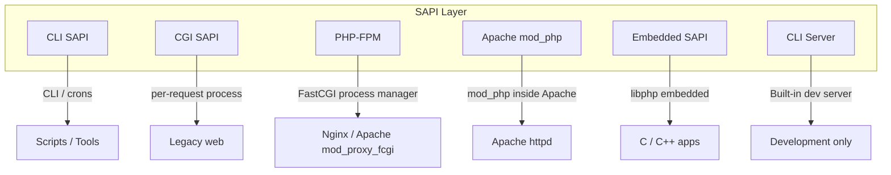
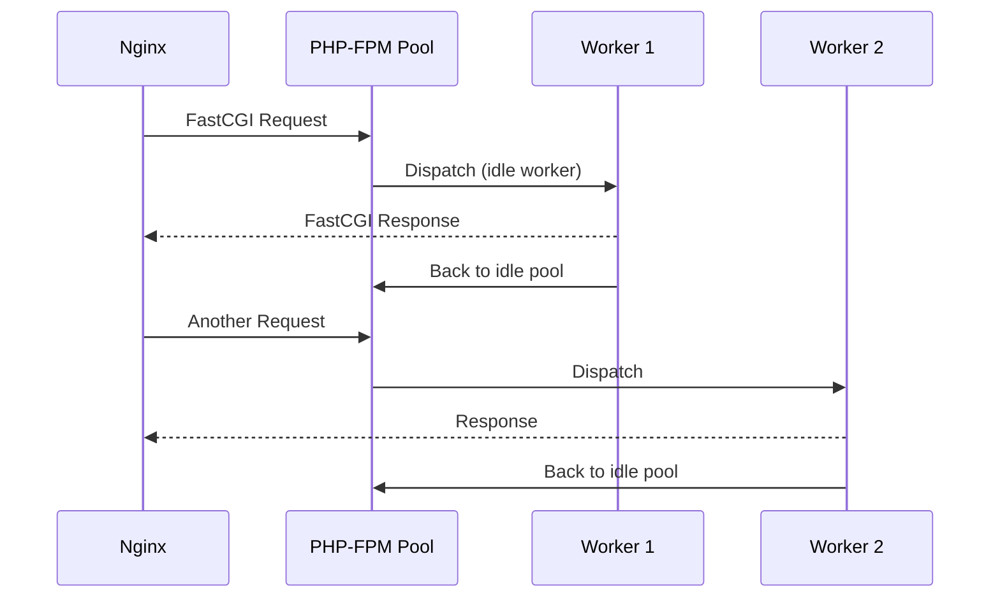

# PHP SAPI — Server API Reference

## Overview

A **SAPI** (Server API) is the interface between PHP and its host environment. Different SAPIs serve different execution models: command-line scripting, web serving via FastCGI, Apache module integration, embedded runtimes, and more. Choosing the right SAPI and understanding its constraints is critical for performance, security, and reliability.



## SAPI Comparison

| Feature | CLI | CGI | FastCGI | FPM | Apache mod_php | Built-in Server |
|---------|-----|-----|---------|-----|---------------|----------------|
| **Process model** | Single run | Per-request process | Persistent workers | Dynamic pool workers | Apache workers | Single-threaded |
| **Performance** | N/A | Low (fork overhead) | High | Very high | High (shared memory) | Low (dev only) |
| **`chdir()` behavior** | Script dir | Script dir | Varies | Configurable | Request dir | Script dir |
| **`max_execution_time`** | 0 (unlimited) | php.ini | php.ini | php.ini | php.ini | 0 |
| **Output buffering** | Off by default | Implicit flush | Implicit flush | Configurable | Chunked by default | On |
| **Security model** | Direct access | CGI security | Process isolation | User/group isolation | Apache user/group | Process isolation |
| **Persistence** | None | None | Full (class, DB, OPCache) | Full | Full | None |
| **Use case** | Scripts, cron | Legacy hosting | Production web | Production web at scale | Shared hosting | Development |

## CLI SAPI (Command-Line Interface)

The CLI SAPI is designed for running PHP scripts from the terminal, cron jobs, and interactive shells.

### Key Characteristics

- **No execution timeout** (`max_execution_time = 0`)
- **No output buffering** by default (use `ob_start()` explicitly)
- **Current directory** changes to the script's directory
- **`$_SERVER['argv']`** and **`$_SERVER['argc']`** always available
- **Error messages** output as plain text (no HTML)
- **`STDIN`**, **`STDOUT`**, **`STDERR`** constants predefined

### CLI Usage Patterns

```php
#!/usr/bin/env php
<?php
declare(strict_types=1);

// CLI script for batch processing
// Usage: php batch.php --input=/path/to/file --limit=100

$options = getopt('', ['input:', 'limit:']);
$input  = $options['input'] ?? throw new \RuntimeException('--input required');
$limit  = (int)($options['limit'] ?? 50);

// Read from stdin
while ($line = fgets(STDIN)) {
    processLine(trim($line));
}

// Write to stderr
fwrite(STDERR, "Processing complete\n");

// Exit codes for shell scripting
exit(0);  // Success — non-zero for errors
```

### CLI-Specific `php.ini` Files

CLI can use a separate `php.ini` (commonly `/etc/php/8.4/cli/php.ini` on Linux). Verify with:

```bash
php --ini
php -i | grep "Loaded Configuration File"
```

### Interactive Shell (`php -a`)

```bash
php -a
# Interactive shell
php > echo "Hello, World!\n";
php > $x = range(1, 10);
php > print_r($x);
```

### Useful CLI Options

| Option | Example | Description |
|--------|---------|-------------|
| `-a` | `php -a` | Interactive shell |
| `-c` | `php -c /path/to/php.ini` | Use custom ini |
| `-n` | `php -n script.php` | No php.ini loaded |
| `-d` | `php -d memory_limit=512M` | Define ini directive |
| `-e` | `php -e script.php` | Extended info for debugger |
| `-f` | `php -f file.php` | Parse and execute file |
| `-i` | `php -i` | phpinfo() output |
| `-l` | `php -l file.php` | Syntax check only (lint) |
| `-m` | `php -m` | List loaded extensions |
| `-r` | `php -r 'echo 1+1;'` | Execute inline code |
| `-S` | `php -S localhost:8080` | Built-in server |
| `-t` | `php -S 0:8080 -t public/` | Document root for built-in server |
| `-B` | `php -B 'init_code'` | Code to run before processing |
| `-E` | `php -E 'end_code'` | Code to run after processing |
| `-R` | `php -R 'process_code'` | Code for each input line |

### CLI Server (Built-in Development Server)

PHP 5.4+ includes a single-threaded development server. **Not for production.**

```bash
# Basic usage
php -S localhost:8080

# Custom document root
php -S localhost:8080 -t public/

# With router script
php -S localhost:8080 router.php

# Listen on all interfaces
php -S 0.0.0.0:8080
```

```php
<?php
// router.php — URL rewriting for built-in server
declare(strict_types=1);

$uri = parse_url($_SERVER['REQUEST_URI'], PHP_URL_PATH);

// Serve existing files directly
if (file_exists(__DIR__ . '/public' . $uri)) {
    return false;
}

// Route everything else to index.php
$_SERVER['SCRIPT_NAME'] = '/index.php';
require __DIR__ . '/public/index.php';
```

## CGI SAPI (Common Gateway Interface)

The original web SAPI. PHP runs as a separate process for every HTTP request. **Legacy — avoid for new deployments.**

### Characteristics

- One process per request — high overhead
- Environment variables carry request data
- Limited to few concurrent requests
- Still used in some shared hosting environments

### CGI Security (`cgi.force_redirect`)

```ini
; Required CGI security directives
cgi.force_redirect = 1
cgi.redirect_status_env = "REDIRECT_STATUS"
cgi.fix_pathinfo = 0           ; [Critical] Prevent path info attacks
cgi.discard_path = 0
cgi.check_shebang_line = 1
```

## FastCGI SAPI

FastCGI is a protocol for interfacing external programs with web servers. PHP as FastCGI keeps processes alive between requests.



### Configuration

```ini
; www.conf — PHP-FPM pool configuration
[www]
user = www-data
group = www-data
listen = /run/php/php8.4-fpm.sock  ; Unix socket
; listen = 127.0.0.1:9000          ; TCP socket

pm = dynamic                        ; dynamic|static|ondemand
pm.max_children = 50
pm.start_servers = 5
pm.min_spare_servers = 5
pm.max_spare_servers = 35
pm.max_requests = 500               ; Graceful restart after N requests

pm.status_path = /status            ; FPM status page
ping.path = /ping                   ; Health check
ping.response = pong

; Process isolation
chdir = /var/www
security.limit_extensions = .php
access.log = /var/log/php-fpm-access.log
slowlog = /var/log/php-fpm-slow.log
request_slowlog_timeout = 5s        ; Log slow requests
request_terminate_timeout = 30s     ; Kill hanging requests
catch_workers_output = yes

; Environment
env[HOSTNAME] = $HOSTNAME
env[PATH] = /usr/local/bin:/usr/bin:/bin
; Pass specific env vars only — not PATH by default
; clear_env = no
```

### Process Manager Modes

| Mode | Description | Best For |
|------|-------------|----------|
| `static` | Fixed pool of workers. `pm.max_children` always running. | Predictable traffic |
| `dynamic` | Pool scales between `min_spare` and `max_spare` | General-purpose |
| `ondemand` | Workers spawned on demand, idle workers removed after timeout | Low-traffic / memory-constrained |

### Nginx Reverse Proxy Configuration

```nginx
server {
    listen 80;
    server_name example.com;
    root /var/www/public;

    index index.php;

    location / {
        try_files $uri $uri/ /index.php?$query_string;
    }

    location ~ \.php$ {
        fastcgi_pass unix:/run/php/php8.4-fpm.sock;
        fastcgi_index index.php;
        fastcgi_param SCRIPT_FILENAME $document_root$fastcgi_script_name;
        include fastcgi_params;
        fastcgi_buffering on;
        fastcgi_buffer_size 128k;
        fastcgi_buffers 4 256k;
        fastcgi_busy_buffers_size 256k;
    }
}
```

### Performance Tuning Tips

1. **Unix sockets over TCP** — Lower latency, avoid DNS resolution
2. **`pm.max_children`** = `(Total RAM - OS - other services) / avg. PHP process size`
3. **`pm.max_requests`** — Set to 500–10000 to prevent memory leaks from accumulating
4. **`request_terminate_timeout`** — Hard kill for hanging requests (set slightly above `max_execution_time`)
5. **`slowlog`** — Identify slow operations
6. **OPcache file cache** — Reduces recompilation after pool restarts

## Apache mod_php (mod_php8)

PHP runs as an Apache module embedded in the httpd process.

### Advantages

- **Shared memory** — OPcache across requests (no separate pool)
- **`.htaccess`** — `PHP_VALUE`/`PHP_ADMIN_VALUE` per-directory config
- **Simpler deployment** — No FastCGI process management
- **`$_SERVER['PHP_SELF']`** and `$_SERVER['REQUEST_URI']` directly available

### Configuration

```apache
# Load the module
LoadModule php_module modules/libphp.so
<FilesMatch \.php$>
    SetHandler application/x-httpd-php
</FilesMatch>

# Per-directory PHP settings via .htaccess
php_value memory_limit 256M
php_value upload_max_filesize 64M
php_flag display_errors Off

# PHP-FPM proxy (alternative to mod_php)
# ProxyPassMatch ^/(.*\.php)$ fcgi://127.0.0.1:9000/var/www/public/$1
```

### Disadvantages

- **Apache binds PHP lifecycle** — each Apache child has PHP embedded, higher memory per process
- **No process isolation** — a PHP crash takes down the Apache worker
- **MPM dependency** — Requires `prefork` MPM (not `event` or `worker`) for `mod_php`
- **Same-user security** — All virtual hosts run as the Apache user unless using `mpm-itk`
- **Not suitable for high concurrency** — Prefork MPM consumes significant RAM per child

## Embedded SAPI

Allows embedding PHP into C/C++ applications via the `libphp` library.

### Typical Use Cases

- **Game engines** — Scriptable game logic in PHP
- **Desktop applications** — Plugin system for PHP scripts
- **Network services** — Custom protocol handlers
- **IoT devices** — Lightweight scripting on embedded Linux

### Basic C Integration

```c
#include <sapi/embed/php_embed.h>

int main(int argc, char *argv[]) {
    PHP_EMBED_START_BLOCK(argc, argv);
    
    zend_eval_string("echo 'Hello from embedded PHP!\n';", NULL, "embedded");
    
    PHP_EMBED_END_BLOCK();
    return 0;
}
```

## SAPI Detection at Runtime

```php
<?php
declare(strict_types=1);

// Check which SAPI is running
$sapi = PHP_SAPI;

match ($sapi) {
    'cli'             => print("Running from command line\n"),
    'cli-server'      => print("Running PHP built-in server\n"),
    'fpm-fcgi'        => print("Running PHP-FPM\n"),
    'cgi-fcgi'        => print("Running CGI/FastCGI\n"),
    'apache2handler'  => print("Running Apache mod_php\n"),
    'embed'           => print("Running as embedded PHP\n"),
    default           => print("Unknown SAPI: $sapi\n"),
};

// SAPI-specific behavior
function getMaxExecutionTime(): int {
    return PHP_SAPI === 'cli' || PHP_SAPI === 'cli-server' ? 0 : (int)ini_get('max_execution_time');
}

function isWebRequest(): bool {
    return PHP_SAPI !== 'cli' && PHP_SAPI !== 'cli-server';
}
```

## Common Pitfalls

1. **`mod_php` + `mpm_event` incompatible** — mod_php requires `prefork` MPM. Use PHP-FPM with `mpm_event` instead.
2. **`clear_env = no` in FPM** — Exposes all environment variables to PHP (security risk). Explicitly set required vars.
3. **`REQUEST_TIME_FLOAT` precision** — In CLI, `$_SERVER['REQUEST_TIME_FLOAT']` is not set; use `microtime(true)`.
4. **Built-in server single-threaded** — One request blocks all others. Never use in production or behind a load balancer without isolation.
5. **FPM `pm.max_children` miscalculation** — Each PHP process can consume 20–50 MB. `pm.max_children = 200` with 50 MB/process = 10 GB RAM.
6. **`cgi.fix_pathinfo = 1`** — Critical security vulnerability when using Nginx + PHP-FPM (the `/uploads/not-a.php.jpg` attack). Always set to `0`.
7. **CLI `memory_limit` default** — While CLI defaults to unlimited, explicit `memory_limit = -1` in `php.ini` is safer for long-running daemons.

## References

- [PHP: SAPI Overview](https://www.php.net/manual/en/sapi.php)
- [PHP: CLI SAPI](https://www.php.net/manual/en/features.commandline.php)
- [PHP: Built-in Server](https://www.php.net/manual/en/features.commandline.webserver.php)
- [PHP: FPM Configuration](https://www.php.net/manual/en/install.fpm.configuration.php)
- [PHP: Embedded SAPI](https://www.php.net/manual/en/embed.php)
- [PHP-FPM: Process Manager](https://www.php.net/manual/en/install.fpm.php)
