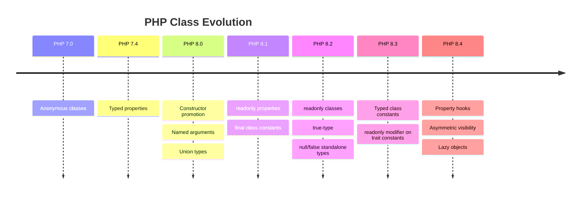

# PHP Classes & Objects

## 1. Overview

PHP classes are the foundational unit of object-oriented code. From PHP 8.0 through 8.4, the class system has undergone transformative improvements: constructor promotion, readonly classes, property hooks, asymmetric visibility, and lazy objects. Modern PHP classes enable concise, immutable, and expressive domain modeling.



## 2. Core Concepts

### 2.1 Class Declaration

```php
declare(strict_types=1);

#[Attribute]
class Example
{
    public string $name;
    private int $count = 0;

    public function __construct(string $name)
    {
        $this->name = $name;
    }
}
```

### 2.2 Constructor Promotion (PHP 8.0+)

Declare and assign properties directly in the constructor signature:

```php
readonly class CreateUserCommand
{
    public function __construct(
        public string $name,
        public string $email,
        public ?string $referrer = null,
    ) {}
}
```

Promoted properties can have:
- Visibility modifiers (`public`, `protected`, `private`)
- Readonly modifier
- Type declarations
- Default values
- Attributes (PHP 8.0+)
- `readonly` + asymmetric visibility (PHP 8.4+)

### 2.3 Readonly Classes (PHP 8.2+)

All properties are implicitly readonly. No untyped properties allowed.

```php
readonly class Address
{
    public function __construct(
        public string $street,
        public string $city,
        public string $country,
        public string $postalCode,
    ) {}
}
```

**Rules:**
- Cannot declare `readonly` on individual properties (already class-level)
- Cannot use untyped properties
- No dynamic properties
- No `Clone` that modifies properties (clone creates new, but properties remain readonly)
- Can hold mutable objects (shallow immutability only)

### 2.4 Property Hooks (PHP 8.4+)

Computed and side-effecting properties without getter/setter methods:

```php
class UserProfile
{
    public private(set) string $firstName {
        set(string $value) {
            if (strlen($value) < 2) {
                throw new \InvalidArgumentException('Too short');
            }
            $this->firstName = trim($value);
        }
    }

    public string $lastName {
        set => $this->lastName = trim($value);
    }

    public string $fullName {
        get => trim("{$this->firstName} {$this->lastName}");
    }
}
```

**Hook types:**

| Hook | Purpose | Syntax |
|------|---------|--------|
| `get` | Computed read | `get => expr;` or `get { ... }` |
| `set` | Intercepted write | `set(Type $value) { ... }` or `set => expr;` |
| `set` (implicit) | No type validation | `set { ... }` uses `mixed` |

### 2.5 Asymmetric Visibility (PHP 8.4+)

Different read vs write visibility:

```php
class Account
{
    public private(set) string $id;
    public protected(set) string $status = 'pending';
    protected private(set) array $logs = [];
}
```

Pattern: `{read-visibility} {write-visibility}(set)`.

### 2.6 Anonymous Classes (PHP 7.0+)

One-off implementations without a named class:

```php
$logger = new class implements LoggerInterface {
    public function log(string $message): void
    {
        file_put_contents('/tmp/app.log', $message . "\n", FILE_APPEND);
    }
};
```

## 3. Architecture & Design

### 3.1 Class Roles in Domain-Driven Design

### 3.2 When to Use Each Class Type

| Class Type | Use Case | Key Feature |
|------------|----------|-------------|
| `readonly class` | Value objects, DTOs, Commands, Events | Immutability guarantee |
| `final class` | Services, Repositories, Controllers | No extension, safe extension |
| `abstract class` | Template method pattern | Partial implementation |
| Anonymous class | Tests, one-off adapters | No name pollution |
| `enum` (not class) | Finite set of values | Exhaustive matching |

## 4. Syntax & Usage

### 4.1 Complete Class Example (PHP 8.4)

```php
declare(strict_types=1);

readonly class OrderConfirmation
{
    public function __construct(
        public string $orderId,
        public string $customerEmail,
        /** @var LineItem[] */
        public array $items,
        public \DateTimeImmutable $createdAt = new \DateTimeImmutable(),
    ) {}
}

class Order
{
    public private(set) string $status = 'pending' {
        set(string $value) {
            $valid = ['pending', 'confirmed', 'shipped', 'delivered', 'cancelled'];
            if (!in_array($value, $valid, true)) {
                throw new \InvalidArgumentException("Invalid status: $value");
            }
            $this->status = $value;
        }
    }

    public float $total {
        get {
            return array_sum(array_map(
                fn(LineItem $item) => $item->price * $item->quantity,
                $this->items,
            ));
        }
    }

    /** @var LineItem[] */
    private array $items = [];

    public function addItem(LineItem $item): void
    {
        $this->items[] = $item;
    }
}
```

### 4.2 Lazy Objects (PHP 8.4)

```php
// Create a lazy ghost (zero-initialized, populates on first access)
$initializer = function (Order $ghost): void {
    $ghost->__construct($this->loadFromDb($ghost->id));
};
$order = \Symfony\Component\VarExporter\LazyGhostTrait::createLazyGhost(
    Order::class,
    $initializer,
);
```

## 5. Best Practices

1. **Default to `readonly class`** for all data-carrying classes
2. **Default to `final class`** unless designed for inheritance
3. **Always use constructor promotion** — never manually assign from parameters
4. **Use property hooks instead of getXxx()/setXxx() methods** (PHP 8.4+)
5. **Use asymmetric visibility** to restrict writes while allowing reads
6. **Use `\DateTimeImmutable`** over `\DateTime` in all readonly classes
7. **Type every property** — no untyped class properties
8. **Use `null` as explicit default** for optional promoted properties
9. **Keep classes under ~200 lines** — if larger, extract
10. **Use `readonly` with `private(set)`** for write-once external contracts

## 6. Anti-Patterns

### 6.1 Manual Property Assignment
```php
// ❌ BAD
class User
{
    public string $name;
    public string $email;

    public function __construct(string $name, string $email)
    {
        $this->name = $name;
        $this->email = $email;
    }
}

// ✅ GOOD
class User
{
    public function __construct(
        public string $name,
        public string $email,
    ) {}
}
```

### 6.2 Getter/Setter Proliferation
```php
// ❌ BAD (pre-8.4 pattern, now obsolete)
class Product
{
    private string $name;

    public function getName(): string { return $this->name; }
    public function setName(string $name): void { $this->name = $name; }
    private string $sku;
    public function getSku(): string { return $this->sku; }
    public function setSku(string $sku): void { $this->sku = $sku; }
}

// ✅ GOOD (PHP 8.4+)
class Product
{
    public string $name;
    public string $sku;
    // or with hooks:
    public string $name { set => $this->name = trim(ucfirst($value)); }
}
```

### 6.3 Mutable DTOs
```php
// ❌ BAD
class OrderData
{
    public string $id;
    public float $total;
}

// ✅ GOOD
readonly class OrderData
{
    public function __construct(
        public string $id,
        public float $total,
    ) {}
}
```

### 6.4 Long Constructor
```php
// ❌ BAD — too many parameters
class OrderService
{
    public function __construct(
        private Database $db,
        private Mailer $mailer,
        private Logger $logger,
        private Cache $cache,
        private Queue $queue,
        private PdfGenerator $pdf,
        private SmsService $sms,
        private Analytics $analytics,
        private FileStorage $storage,
        private Config $config,
    ) {}
}

// ✅ GOOD — group dependencies
class OrderService
{
    public function __construct(
        private OrderDependencies $deps,
    ) {}
}
```

## 7. Trade-offs

| Decision | Benefit | Cost |
|----------|---------|------|
| `readonly` class | Immutability, thread-safety | Cannot lazy-load, no setters |
| `final` class | Safe to reason about, inlinable | Cannot extend for tests (use mocking) |
| Property hooks | Cleaner code than getter/setter | Reflection bypasses hooks |
| Constructor promotion | 50% less boilerplate | Less obvious for complex init |
| Anonymous classes | No file pollution | Can't autoload, harder to test |
| Asymmetric visibility | Fine-grained access | Additional syntax complexity |

## 8. AI Reasoning Guide

### When generating PHP classes:

1. **Identity data → readonly class** — DTOs, commands, events, value objects
2. **Services with DI → readonly class** — injected dependencies never change
3. **Domain entities → regular class** — identity matters, state changes over time
4. **Needs computed property → property hook** — instead of `getFullName()` method
5. **Needs write validation → property hook `set`** — validates on assignment
6. **Multiple constructors → named constructors** — `public static function fromArray(...)`
7. **Class used once → anonymous class** — in tests or adapters
8. **Read-only from outside, writable internally → asymmetric visibility**

### Property hook decision tree:

```
Need a computed value?
  ├─ Lightweight (no IO)? → get hook
  └─ Heavy (DB/API)? → method (hooks should be cheap)

Need to intercept writes?
  ├─ Validation → set hook
  ├─ Normalization → set hook
  └─ Side-effect → set hook (but consider events instead)
```

## 9. Examples

### 9.1 Value Object with Property Hooks

```php
declare(strict_types=1);

readonly class Temperature
{
    public function __construct(
        private float $celsius,
    ) {}

    public float $fahrenheit {
        get => ($this->celsius * 9 / 5) + 32;
    }

    public float $kelvin {
        get => $this->celsius + 273.15;
    }

    public static function fromFahrenheit(float $f): self
    {
        return new self(($f - 32) * 5 / 9);
    }
}
```

### 9.2 Entity with Asymmetric Visibility

```php
declare(strict_types=1);

class Article
{
    public private(set) string $id;
    public protected(set) string $status = 'draft';
    public private(set) \DateTimeImmutable $createdAt;

    public string $title {
        set(string $value) {
            $value = trim($value);
            if (strlen($value) < 5) {
                throw new \InvalidArgumentException('Title too short');
            }
            $this->title = $value;
        }
    }

    public function __construct(
        string $title,
    ) {
        $this->id = \bin2hex(\random_bytes(16));
        $this->createdAt = new \DateTimeImmutable();
        $this->title = $title;
    }

    public function publish(): void
    {
        $this->status = 'published';
    }
}
```

## 10. Common Pitfalls

1. **Forgetting immutable objects hold mutable references** — a `readonly` class containing an array or object isn't deeply immutable
2. **Property hooks run on every access** — avoid DB/API calls in `get` hooks
3. **`readonly` class + untyped property = compile error**
4. **Constructor promotion with complex default values** — cannot use expressions in default values (use named constructors)
5. **Anonymous classes can't be autoloaded** — cannot reference by name
6. **Asymmetric visibility doesn't prevent internal mutation** — `private(set)` only restricts external write, not internal
7. **Property hooks bypassed by `\Closure::bind` and reflection**
8. **Late static binding confusion** — use `static::` for runtime resolution, `self::` for compile-time
9. **`clone` with readonly classes** — clone creates a shallow copy but properties remain readonly
10. **Mixing promoted and non-promoted properties** — readability suffers

## 11. Related Features

| Feature | Relevance |
|---------|-----------|
| Enums | Alternative to class constants + sealed classes |
| Interfaces | Contract for classes |
| Traits | Horizontal code reuse in classes |
| Attributes | Metadata on classes and properties |
| Types | Union, intersection, and generics (via docblock/static analysis) |
| Closures / Arrow functions | First-class callables from class context |
| Match expression | Exhaustive branching useful with enum classes |

## 12. Version Compatibility

| Feature | PHP Version | Status |
|---------|-------------|--------|
| Basic classes | 4.0+ | Stable |
| Abstract classes | 5.0+ | Stable |
| Anonymous classes | 7.0+ | Stable |
| Typed properties | 7.4+ | Stable |
| Constructor promotion | 8.0+ | Stable |
| `readonly` properties | 8.1+ | Stable |
| `readonly` classes | 8.2+ | Stable |
| Typed constants | 8.3+ | Stable |
| Property hooks | 8.4+ | Stable |
| Asymmetric visibility | 8.4+ | Stable |
| Lazy objects | 8.4+ | Stable |

## 13. Reference

- [PHP Manual: Classes and Objects](https://www.php.net/manual/en/language.oop5.php)
- [PHP RFC: Constructor Promotion](https://wiki.php.net/rfc/constructor_promotion)
- [PHP RFC: Readonly Class Amendments](https://wiki.php.net/rfc/readonly_amendments)
- [PHP RFC: Property Hooks](https://wiki.php.net/rfc/property-hooks)
- [PHP RFC: Asymmetric Visibility](https://wiki.php.net/rfc/asymmetric-visibility)
- [PHP RFC: Lazy Objects](https://wiki.php.net/rfc/lazy-objects)
