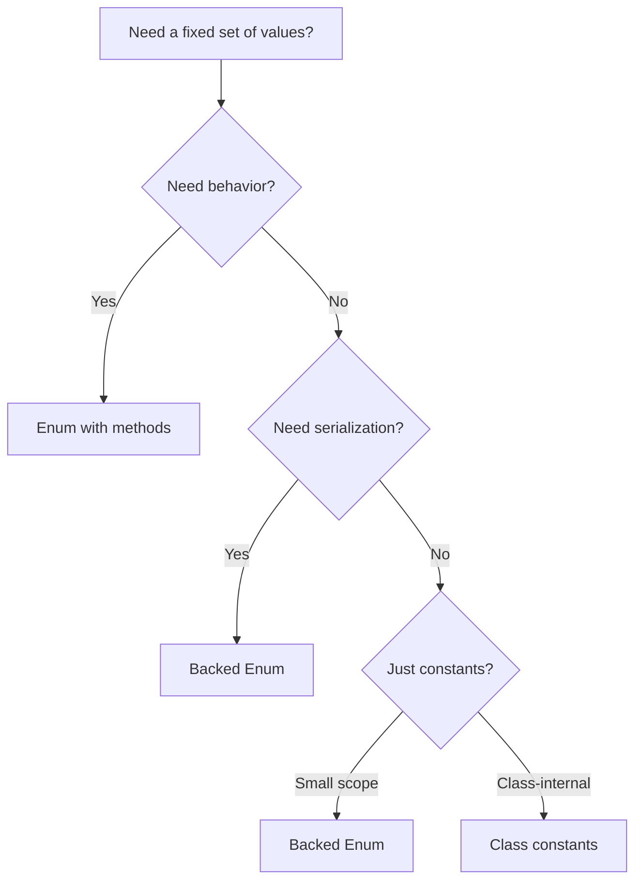

# PHP Enumerations

## 1. Overview

PHP 8.1 introduced native **enumerations** (enums), a first-class language construct for representing a fixed set of named values. Unlike simple `const` definitions, enums are full-fledged classes with methods, interfaces, and type safety. Backed enums map to scalar values for serialization.

```mermaid
mindmap
  PHP Enums
    Pure Enums
      No scalar backing
      Identity comparison
      Singleton pattern
    Backed Enums
      string backed
      int backed
      from() / tryFrom()
    Features
      Methods
      Interfaces
      Traits
      Constants
      Match exhaustive
    Benefits
      Type safety
      No invalid states
      IDE autocomplete
      Exhaustive matching
```

## 2. Core Concepts

### 2.1 Pure Enums

```php
enum Status
{
    case Pending;
    case Confirmed;
    case Shipped;
    case Delivered;
    case Cancelled;
}
```

### 2.2 Backed Enums

```php
enum Status: string
{
    case Pending   = 'pending';
    case Confirmed = 'confirmed';
    case Shipped   = 'shipped';
    case Delivered = 'delivered';
    case Cancelled = 'cancelled';
}

// or int-backed
enum Priority: int
{
    case Low    = 10;
    case Medium = 20;
    case High   = 30;
    case Urgent = 40;
}
```

### 2.3 Enum Identity & Comparison

Enum cases are **singletons** — comparison is by identity, not value:

```php
$status = Status::Pending;

$status === Status::Pending;     // true (identity)
$status === Status::Confirmed;   // false
$status instanceof Status;       // true

// Enums can be used as array keys
$handlers = [
    Status::Pending   => 'handlePending',
    Status::Confirmed => 'handleConfirmed',
];
```

## 3. Architecture & Design

### 3.1 Enum vs Constants



### 3.2 State Machine Pattern

```php
enum OrderStatus: string
{
    case Pending        = 'pending';
    case PaymentConfirmed = 'payment_confirmed';
    case Preparing      = 'preparing';
    case Shipped        = 'shipped';
    case Delivered      = 'delivered';
    case Cancelled      = 'cancelled';
    case Refunded       = 'refunded';

    public function transitions(): array
    {
        return match ($this) {
            self::Pending => [
                self::PaymentConfirmed,
                self::Cancelled,
            ],
            self::PaymentConfirmed => [
                self::Preparing,
                self::Cancelled,
            ],
            self::Preparing => [
                self::Shipped,
                self::Cancelled,
            ],
            self::Shipped => [
                self::Delivered,
            ],
            self::Delivered => [
                self::Refunded,
            ],
            self::Cancelled, self::Refunded => [],
        };
    }

    public function canTransitionTo(self $target): bool
    {
        return in_array($target, $this->transitions(), true);
    }
}
```

## 4. Syntax & Usage

### 4.1 Enum Methods

```php
enum PaymentMethod: string
{
    case CreditCard = 'cc';
    case PayPal     = 'pp';
    case BankTransfer = 'bt';
    case Crypto     = 'crypto';

    public function label(): string
    {
        return match ($this) {
            self::CreditCard   => 'Credit Card',
            self::PayPal       => 'PayPal',
            self::BankTransfer => 'Bank Transfer',
            self::Crypto       => 'Cryptocurrency',
        };
    }

    public function requiresRedirect(): bool
    {
        return match ($this) {
            self::CreditCard   => false,
            self::PayPal       => true,
            self::BankTransfer => false,
            self::Crypto       => true,
        };
    }

    public function feePercent(): float
    {
        return match ($this) {
            self::CreditCard   => 2.9,
            self::PayPal       => 3.5,
            self::BankTransfer => 0.0,
            self::Crypto       => 0.5,
        };
    }
}
```

### 4.2 Enum with Match (Exhaustive)

```php
function getShippingCost(OrderStatus $status): string
{
    return match ($status) {
        OrderStatus::Pending,
        OrderStatus::PaymentConfirmed => 'N/A',
        OrderStatus::Preparing        => 'Pending calculation',
        OrderStatus::Shipped          => '$12.99',
        OrderStatus::Delivered        => '$12.99 (paid)',
        OrderStatus::Cancelled        => '$0.00',
        OrderStatus::Refunded         => '$0.00 (refunded)',
    };
}
```

### 4.3 Enum Implementing Interface

```php
interface HasNotificationTemplate
{
    public function notificationTemplate(): string;
    public function shouldNotify(): bool;
}

enum OrderEvent: string implements HasNotificationTemplate
{
    case Created  = 'created';
    case Shipped  = 'shipped';
    case Delivered = 'delivered';

    public function notificationTemplate(): string
    {
        return "order.{$this->value}";
    }

    public function shouldNotify(): bool
    {
        return match ($this) {
            self::Created  => false,
            self::Shipped  => true,
            self::Delivered => true,
        };
    }
}
```

### 4.4 Enum with Traits (PHP 8.2+)

```php
trait ApiSerializable
{
    public function toApiValue(): string
    {
        return $this->value ?? $this->name;
    }
}

enum Role: string
{
    use ApiSerializable;

    case Admin    = 'admin';
    case Editor   = 'editor';
    case Viewer   = 'viewer';
}
```

### 4.5 Enum Constants

```php
enum Currency: string
{
    case USD = 'USD';
    case EUR = 'EUR';
    case GBP = 'GBP';
    case JPY = 'JPY';

    public const int SCALE = 2;

    // Computed constants (PHP 8.3+ with dynamic evaluation? No, use static methods)
    public static function fiatCurrencies(): array
    {
        return [self::USD, self::EUR, self::GBP];
    }
}
```

### 4.6 from() and tryFrom()

```php
// Backed enum — from scalar
$status = Status::from('pending');          // Status::Pending
// Throws ValueError if invalid

$status = Status::tryFrom('invalid');       // null
// Returns null if invalid

// Pure enum — no from()/tryFrom()
$status = Status::tryFrom('pending');       // Fatal error
```

## 5. Best Practices

1. **Replace string constants with backed enums** — type-safe, self-documenting
2. **Always use `match` for exhaustive handling** — new cases trigger compile errors
3. **Use backed enums for DB persistence** — string/int backing for columns
4. **Use pure enums for internal state** — no serialization needed
5. **Implement interfaces for behavior** — enum + interface = type-safe strategy
6. **Keep enum methods pure** — no IO, no side effects
7. **Use enum as discriminated union** — different methods return different types
8. **Document scalar values in PhpDoc** — `@return Status::Pending|Status::Confirmed`
9. **Use `tryFrom()` for user input** — safe conversion
10. **Leverage `->value` and `->name`** — `$status->value` (backed scalar), `$status->name` (case name string)

## 6. Anti-Patterns

### 6.1 Using Constants Instead of Enums

```php
// ❌ BAD — no type safety
class OrderStatus
{
    public const PENDING    = 'pending';
    public const CONFIRMED  = 'confirmed';
    public const CANCELLED  = 'cancelled';
}
function process(string $status): void { /* accepts any string */ }

// ✅ GOOD — type-safe
function process(OrderStatus $status): void { /* only valid cases */ }
```

### 6.2 Storing Non-Enum Data in Cases

```php
// ❌ BAD — enum cases shouldn't carry mutable data
enum CacheTTL: int
{
    case Short  = 60;
    case Medium = 3600;
    case Long   = 86400;

    private array $storage = []; // ❌ Stateful!
}

// ✅ GOOD — use methods for computed values
enum CacheDuration: int
{
    case Short  = 60;
    case Medium = 3600;
    case Long   = 86400;

    public function inMinutes(): float
    {
        return $this->value / 60;
    }
}
```

### 6.3 Swallowing Unknown Values

```php
// ❌ BAD
$status = Status::tryFrom($input) ?? Status::Pending; // silently falls back

// ✅ GOOD — fail fast on invalid input
$status = Status::from($input);
```

### 6.4 If-Else Chains on Enum

```php
// ❌ BAD — non-exhaustive
function label(Status $s): string
{
    if ($s === Status::Pending) return 'Pending';
    elseif ($s === Status::Confirmed) return 'Confirmed';
    // forgot Cancelled! No compiler error.
}

// ✅ GOOD — exhaustive
function label(Status $s): string
{
    return match ($s) {
        Status::Pending   => 'Pending',
        Status::Confirmed => 'Confirmed',
        Status::Cancelled => 'Cancelled',
    };
}
```

## 7. Trade-offs

| Decision | Benefit | Cost |
|----------|---------|------|
| Pure vs Backed | Pure = no scalar coupling | Can't serialize to DB directly |
| Enum with methods | Encapsulated behavior | More complex enum file |
| Enum implementing interfaces | Polymorphism | More boilerplate setup |
| match exhaustive | Compile-time safety | Must update all match statements on new case |
| Enum vs class constants | Type safety, IDE support | More verbose definition |

## 8. AI Reasoning Guide

### When generating enums:

1. **Finite set of related values** → enum (not constants or strings)
2. **State machine** → enum with `transitions()` method
3. **DB column with CHECK constraint** → backed enum for mapping
4. **Form/API select options** → backed enum with `label()` method
5. **Strategy pattern with fixed strategies** → enum implementing interface
6. **Need `match` exhaustiveness guarantees** → always use match with enums

### Backing type decision:

```
Will the enum be stored in DB or transmitted over API?
├─ Yes → Backed enum (string usually better than int)
└─ No  → Pure enum (simpler, no scalar coupling)

Backed type selection:
├─ Human-readable → string (preferred: 'pending', 'confirmed')
├─ Database space → int (tinyint column)
└─ Need both → string (more readable, still indexable)
```

### Common AI mistakes:

- Using `tryFrom()` with a default fallback (silently ignores invalid data)
- Making enums too large (hundreds of cases → rethink design)
- Using pure enum when serialization is needed
- Forgetting enum cases are singletons — `new` doesn't work
- Putting IO/side effects in enum methods

## 9. Examples

### 9.1 Full Feature Enum

```php
declare(strict_types=1);

enum UserRole: string
{
    case SuperAdmin  = 'super_admin';
    case Admin       = 'admin';
    case Editor      = 'editor';
    case Author      = 'author';
    case Subscriber  = 'subscriber';

    /**
     * @return self[] Roles that can access admin panel
     */
    public function canAccessAdmin(): bool
    {
        return match ($this) {
            self::SuperAdmin,
            self::Admin,
            self::Editor   => true,
            self::Author,
            self::Subscriber => false,
        };
    }

    public function canPublish(): bool
    {
        return match ($this) {
            self::SuperAdmin,
            self::Admin,
            self::Editor   => true,
            self::Author    => false, // can draft but not publish
            self::Subscriber => false,
        };
    }

    /** @return self[] */
    public static function editorialRoles(): array
    {
        return [self::Admin, self::Editor, self::Author];
    }

    public function label(): string
    {
        return match ($this) {
            self::SuperAdmin => 'Super Admin',
            self::Admin      => 'Administrator',
            self::Editor     => 'Editor',
            self::Author     => 'Author',
            self::Subscriber => 'Subscriber',
        };
    }
}
```

### 9.2 Enum Strategy Pattern (Discriminated Union)

```php
declare(strict_types=1);

interface ExportFormatter
{
    public function format(array $data): string;
    public function mimeType(): string;
}

enum ExportFormat: string implements ExportFormatter
{
    case CSV  = 'csv';
    case JSON = 'json';
    case XML  = 'xml';

    public function format(array $data): string
    {
        return match ($this) {
            self::CSV  => $this->formatCsv($data),
            self::JSON => json_encode($data, JSON_THROW_ON_ERROR | JSON_PRETTY_PRINT),
            self::XML  => $this->formatXml($data),
        };
    }

    public function mimeType(): string
    {
        return match ($this) {
            self::CSV  => 'text/csv',
            self::JSON => 'application/json',
            self::XML  => 'application/xml',
        };
    }

    private function formatCsv(array $data): string
    {
        // ...
    }

    private function formatXml(array $data): string
    {
        // ...
    }
}
```

### 9.3 Enum in Domain Entity

```php
declare(strict_types=1);

readonly class Order
{
    public function __construct(
        public string $id,
        public OrderStatus $status = OrderStatus::Pending,
        public PaymentMethod $paymentMethod,
        /** @var LineItem[] */
        public array $items,
        public \DateTimeImmutable $createdAt = new \DateTimeImmutable(),
    ) {}

    public function confirm(): Order
    {
        if (!$this->status->canTransitionTo(OrderStatus::PaymentConfirmed)) {
            throw new \DomainException('Cannot confirm from ' . $this->status->name);
        }
        return new Order(
            id: $this->id,
            status: OrderStatus::PaymentConfirmed,
            paymentMethod: $this->paymentMethod,
            items: $this->items,
            createdAt: $this->createdAt,
        );
    }
}
```

## 10. Common Pitfalls

1. **`from()` throws ValueError** — use `tryFrom()` for uncertain input
2. **No `serialize()` on pure enums** — use backed enums for DB/API
3. **Enum cases are singletons** — `clone` and `new` are forbidden
4. **`tryFrom()` returns `null`, not `false`** — type strictness matters
5. **`match($enum)` requires exhaustive cases** — but can use `default` (defeats purpose)
6. **Cannot extend enums** — no inheritance, no `extends`
7. **Cannot add dynamic properties** — properties are fixed and strongly typed
8. **Enum case names follow class naming conventions** — PascalCase by convention
9. **Serialization with `json_encode` requires `JsonSerializable`** — enum doesn't implement it automatically
10. **Doctrine ORM needs custom type for backed enums** (or native enum type in newer versions)

## 11. Related Features

| Feature | Relationship |
|---------|--------------|
| Match expression | Exhaustive enum handling |
| Union types | `Status::Pending|Status::Confirmed` as parameter type |
| readonly classes | Enum properties in immutable DTOs |
| Attributes | Add metadata to enum cases |
| Interfaces | Enum implementing contracts |
| Traits | Shared behavior across enums |
| Constructor promotion | Enum methods receive typed params |

## 12. Version Compatibility

| Feature | PHP Version | Notes |
|---------|-------------|-------|
| Pure enums | 8.1+ | Stable |
| Backed enums | 8.1+ | Stable |
| Enum methods | 8.1+ | Stable |
| Enum implements interface | 8.1+ | Stable |
| `from()` / `tryFrom()` | 8.1+ | Backed only |
| `->name` / `->value` | 8.1+ | Magic properties |
| `json_encode` support | 8.1+ | `true` for backed, requires JsonSerializable for pure |
| Traits in enums | 8.2+ | Stable |
| `readonly` enum properties | 8.3+ | (though enum properties are implicitly final) |

## 13. Reference

- [PHP Manual: Enumerations](https://www.php.net/manual/en/language.enumerations.php)
- [PHP RFC: Enumerations](https://wiki.php.net/rfc/enumerations)
- [PHP RFC: Traits in Enums](https://wiki.php.net/rfc/traits_in_enums)
- [Doctrine ORM Enum Types](https://www.doctrine-project.org/projects/doctrine-orm/en/current/cookbook/enum-values.html)
- [PHP The Right Way: Enums](https://phptherightway.com/#enums)
