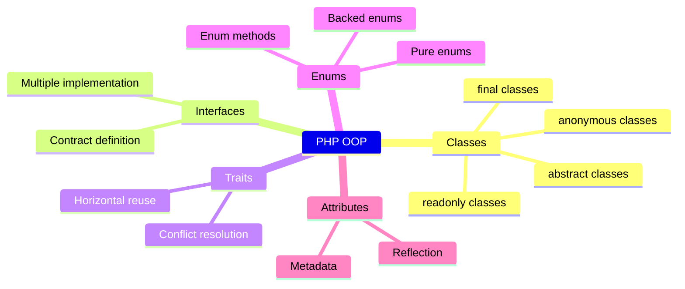

# PHP OOP Architecture Overview

## 1. Overview

PHP's object-oriented programming (OOP) model has evolved from a basic class system in PHP 3/4 into a full-featured, modern OOP language by PHP 8.4. It supports classes, abstract classes, interfaces, traits, enums, anonymous classes, readon ly properties, property hooks, constructor promotion, and a rich type system.

PHP OOP is **class-based** (not prototype-based), single-inheritance with multiple trait composition, and supports runtime polymorphism through interfaces and abstract methods.



## 2. Core Concepts

### 2.1 Classes & Objects

A **class** is a blueprint; an **object** is an instance. PHP 8.4 adds readonly classes, property hooks, and asymmetric visibility.

```php
readonly class ValueObject
{
    public function __construct(
        public string $name,
        public int    $age,
    ) {}
}
```

### 2.2 Inheritance

PHP supports **single inheritance** — a class extends one parent. Use `final` to prevent inheritance.

### 2.3 Encapsulation

Visibility: `public`, `protected`, `private`. PHP 8.4 adds **asymmetric visibility** (`public private(set)`).

```php
class User
{
    public private(set) string $email;  // readable publicly, settable only internally
    public protected(set) string $role; // readable publicly, settable by children
}
```

### 2.4 Polymorphism

Achieved through **interfaces** and **abstract classes**. PHP is structurally typed for method signatures but nominally typed for class/interface relationships.

### 2.5 Composition over Inheritance

Traits and interfaces enable horizontal composition without the diamond problem.

## 3. Architecture & Design

### 3.1 Layered Architecture with PHP OOP

### 3.2 Dependency Injection

Constructor promotion + readonly classes make DI concise:

```php
readonly class OrderService
{
    public function __construct(
        private OrderRepositoryInterface $repository,
        private EventDispatcherInterface $events,
        private LoggerInterface          $logger,
    ) {}
}
```

### 3.3 SOLID Principles in PHP

| Principle | PHP Implementation |
|-----------|-------------------|
| **S**ingle Responsibility | Each class = one reason to change |
| **O**pen/Closed | Prefer interfaces + composition over inheritance |
| **L**iskov Substitution | Subtypes must satisfy parent contracts |
| **I**nterface Segregation | Small, focused interfaces |
| **D**ependency Inversion | Depend on abstractions, not concretions |

## 4. Syntax & Usage

```php
declare(strict_types=1);

// Interface
interface CacheInterface
{
    public function get(string $key): mixed;
    public function set(string $key, mixed $value, int $ttl = 3600): void;
}

// Trait
trait Loggable
{
    protected function log(string $message): void
    {
        echo "[{$this->getLogPrefix()}] $message\n";
    }
    abstract protected function getLogPrefix(): string;
}

// Readonly class with constructor promotion
readonly class RedisCache implements CacheInterface
{
    use Loggable;

    public function __construct(
        private string $prefix = 'app:',
    ) {}

    public function get(string $key): mixed
    {
        $this->log("GET: {$this->prefix}{$key}");
        // ...
    }

    public function set(string $key, mixed $value, int $ttl = 3600): void
    {
        $this->log("SET: {$this->prefix}{$key}");
        // ...
    }

    protected function getLogPrefix(): string
    {
        return 'Cache';
    }
}
```

## 5. Best Practices

1. **Prefer `readonly` classes** for value objects, DTOs, and service dependencies
2. **Favor composition over inheritance** — use interfaces + traits
3. **Use `declare(strict_types=1)`** in every file
4. **Leverage constructor promotion** for clean DI
5. **Use `final` by default** unless the class is designed for extension
6. **Keep classes small** — one responsibility, under ~200 lines
7. **Name classes after their role** (Service, Repository, Factory, ValueObject)
8. **Use property hooks** (PHP 8.4) for computed/side-effecting properties
9. **Prefer typed properties** over untyped ones
10. **Use `self` vs `static`** intentionally — `self` binds at definition, `static` at runtime (late static binding)

## 6. Anti-Patterns

### 6.1 God Class
```php
// ❌ BAD: Does everything
class OrderManager
{
    public function createOrder(): void { /* ... */ }
    public function sendEmail(): void { /* ... */ }
    public function generatePdf(): void { /* ... */ }
    public function chargeCreditCard(): void { /* ... */ }
    public function updateInventory(): void { /* ... */ }
}
```

### 6.2 Extending Concrete Classes for Reuse
```php
// ❌ BAD: Inheritance for code reuse
class Database
{
    public function query(string $sql): array { /* ... */ }
}
class UserRepository extends Database { /* ... */ }

// ✅ GOOD: Composition
class UserRepository
{
    public function __construct(
        private Database $db,
    ) {}
}
```

### 6.3 Mutable Value Objects
```php
// ❌ BAD: Mutable
class Money
{
    public float $amount;
    public string $currency;
}

// ✅ GOOD: Immutable
readonly class Money
{
    public function __construct(
        public float $amount,
        public string $currency,
    ) {}
}
```

### 6.4 Static Method Abuse
```php
// ❌ BAD: Hard to test, global state
class Config
{
    private static array $items = [];
    public static function get(string $key): mixed { /* ... */ }
}

// ✅ GOOD: Injectable
class Config
{
    public function __construct(
        private array $items,
    ) {}
    public function get(string $key): mixed { /* ... */ }
}
```

## 7. Trade-offs

| Pattern | Pros | Cons |
|---------|------|------|
| Inheritance | Code reuse, natural hierarchy | Tight coupling, fragile base class |
| Composition | Flexibility, testability | More boilerplate |
| Traits | Horizontal reuse, no diamond problem | Hidden dependencies, debugging |
| readonly classes | Immutability guarantees | All properties must be readonly |
| Constructor promotion | Concise, DRY | Cannot mix promoted/non-promoted cleanly |
| Property hooks | Computed properties, validation | New in 8.4, learning curve |
| Asymmetric visibility | Fine-grained access control | Can leak internal state accidentally |

## 8. AI Reasoning Guide

### When generating PHP OOP code:

1. **Start with interfaces** — define contracts before implementations
2. **Use readonly classes for data transfer** — all DTOs, commands, events
3. **Use constructor promotion** — reduces boilerplate 50%+
4. **Check if `final` is appropriate** — default to final unless extension is part of the design
5. **Consider traits for cross-cutting concerns** — logging, serialization, caching
6. **Use property hooks for computed values** — instead of getter methods
7. **Leverage `enum` over `string` constants** — type safety, exhaustive matching
8. **Use PHP 8 attributes for metadata** — instead of docblock annotations
9. **Apply match expression with enums** — exhaustive, no default needed
10. **Model domain entities with readonly properties** — value semantics

### Common AI mistakes:

- Generating mutable value objects (use `readonly class`)
- Overusing inheritance when composition is better
- Skipping `declare(strict_types=1)`
- Using `array` when a typed collection interface would be clearer
- Mixing domain logic with infrastructure concerns
- Forgetting to mark classes `final` or `readonly` when appropriate

## 9. Examples

### 9.1 Fraction — Immutable Value Object

```php
declare(strict_types=1);

readonly class Fraction
{
    public function __construct(
        private int $numerator,
        private int $denominator,
    ) {
        if ($denominator === 0) {
            throw new \InvalidArgumentException('Denominator cannot be zero');
        }
    }

    public function add(Fraction $other): self
    {
        $num = $this->numerator * $other->denominator + $other->numerator * $this->denominator;
        $den = $this->denominator * $other->denominator;
        return new self($num, $den);
    }

    public function toFloat(): float
    {
        return $this->numerator / $this->denominator;
    }
}
```

### 9.2 Repository Interface + Implementation

```php
declare(strict_types=1);

interface UserRepositoryInterface
{
    public function find(UserId $id): ?User;
    public function save(User $user): void;
    public function delete(UserId $id): void;
}

final readonly class PostgresUserRepository implements UserRepositoryInterface
{
    public function __construct(
        private DatabaseConnection $connection,
    ) {}

    public function find(UserId $id): ?User { /* ... */ }
    public function save(User $user): void { /* ... */ }
    public function delete(UserId $id): void { /* ... */ }
}
```

## 10. Common Pitfalls

1. **Forgetting `declare(strict_types=1)`** — type coercion leads to subtle bugs
2. **Using `self` instead of `static`** for late static binding scenarios
3. **Not using `finally`** in try/catch when cleanup is needed
4. **Mutating constructor-promoted properties** (use `readonly` to prevent)
5. **Overusing traits** — they add hidden coupling
6. **Forgetting `parent::__construct()`** in extended classes
7. **Mixing concerns** — a class that both queries and mutates
8. **Public properties without readonly** — external mutation risk
9. **Not defining __clone** when objects hold mutable references
10. **Using `new` inside constructors** — makes DI impossible

## 11. Related Features

| Feature | Description | PHP Version |
|---------|-------------|-------------|
| Enum | Named constants with methods | 8.1+ |
| Fiber | Coroutines for async | 8.1+ |
| readonly classes | Immutable classes | 8.2+ |
| Trait | Horizontal reuse | 5.4+ |
| Interface | Contract definition | 5.0+ |
| Abstract class | Partial implementation | 5.0+ |
| Anonymous class | One-off implementations | 7.0+ |
| Property hooks | Computed/virtual properties | 8.4+ |
| Asymmetric visibility | Set-only at different level | 8.4+ |
| Constructor promotion | Declare + assign parameters | 8.0+ |
| Named arguments | Named parameter passing | 8.0+ |
| Match expression | Exhaustive switch | 8.0+ |
| Attributes | Metadata declarations | 8.0+ |

## 12. Version Compatibility

| Feature | Min PHP |
|---------|---------|
| Classes | 4.0 |
| Abstract classes | 5.0 |
| Interfaces | 5.0 |
| Traits | 5.4 |
| Anonymous classes | 7.0 |
| Typed properties | 7.4 |
| Constructor promotion | 8.0 |
| Union types | 8.0 |
| Named arguments | 8.0 |
| Attributes | 8.0 |
| Enums | 8.1 |
| readonly properties | 8.1 |
| readonly classes | 8.2 |
| Intersection types | 8.2 |
| Typed constants | 8.3 |
| Property hooks | 8.4 |
| Asymmetric visibility | 8.4 |
| Lazy objects | 8.4 |

## 13. Reference

- [PHP Manual: Classes and Objects](https://www.php.net/manual/en/language.oop5.php)
- [PHP RFC: Readonly classes](https://wiki.php.net/rfc/readonly_amendments)
- [PHP RFC: Property hooks](https://wiki.php.net/rfc/property-hooks)
- [PHP RFC: Asymmetric visibility](https://wiki.php.net/rfc/asymmetric-visibility)
- [PHP The Right Way: OOP](https://phptherightway.com/#object-oriented-programming)
- [Design Patterns: Elements of Reusable Software (Gang of Four)]
