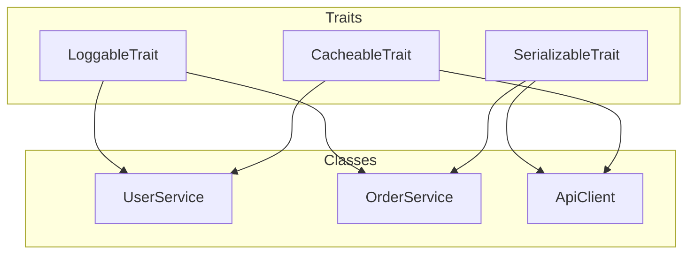
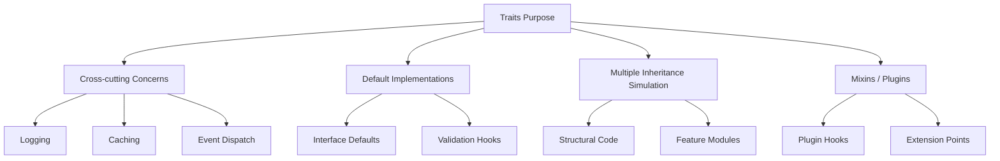

# PHP Traits

## 1. Overview

Traits are a mechanism for **horizontal code reuse** in PHP's single-inheritance model. Introduced in PHP 5.4, traits enable sharing methods across unrelated classes without inheritance. They solve the "diamond problem" through explicit conflict resolution and method precedence rules.



## 2. Core Concepts

### 2.1 Trait Declaration

```php
trait Loggable
{
    public function log(string $message): void
    {
        echo "[LOG] " . $this->getChannel() . ": $message\n";
    }

    abstract protected function getChannel(): string;
}
```

### 2.2 Using Traits

```php
class FileLogger
{
    use Loggable;

    protected function getChannel(): string
    {
        return 'file';
    }
}
```

### 2.3 Multiple Traits

```php
class OrderService
{
    use Loggable;
    use Cacheable;
    use EventDispatcher;
}
```

### 2.4 Trait Precedence

PHP trait method resolution:
1. **Current class** methods override trait methods
2. **Trait methods** override parent class methods

```php
class Base {
    public function sayHello(): string { return 'Base'; }
}

trait Hello {
    public function sayHello(): string { return 'Trait'; }
}

class Child extends Base {
    use Hello;
    // sayHello() returns 'Trait' (trait overrides parent)
}

class GrandChild extends Base {
    use Hello;
    public function sayHello(): string { return 'Class'; }
    // sayHello() returns 'Class' (class overrides trait)
}
```

## 3. Architecture & Design

### 3.1 Trait Usage Patterns



### 3.2 When Traits Are Appropriate

| Scenario | Use Traits? | Alternative |
|----------|-------------|-------------|
| Cross-cutting concern (logging, caching) | ✅ Yes | Decorator pattern |
| Interface default implementation | ✅ Yes | Abstract class |
| Utility methods only | ⚠️ Consider | Static helpers or composition |
| Shared state | ❌ No | Composition with service class |
| Large code block | ⚠️ Use sparingly | Extract service class |
| Framework plugin hooks | ✅ Yes | Event system |

## 4. Syntax & Usage

### 4.1 Trait Members

```php
trait Timestampable
{
    private \DateTimeImmutable $createdAt;
    private \DateTimeImmutable $updatedAt;

    public function initializeTimestamps(): void
    {
        $now = new \DateTimeImmutable();
        $this->createdAt ??= $now;
        $this->updatedAt = $now;
    }

    public function getCreatedAt(): \DateTimeImmutable
    {
        return $this->createdAt;
    }

    public function getUpdatedAt(): \DateTimeImmutable
    {
        return $this->updatedAt;
    }

    abstract public function touch(): void;
}

class Entity
{
    use Timestampable;

    public function __construct()
    {
        $this->initializeTimestamps();
    }

    public function touch(): void
    {
        $this->updatedAt = new \DateTimeImmutable();
    }
}
```

### 4.2 Conflict Resolution

When two traits have the same method, resolve explicitly:

```php
trait A
{
    public function process(): string { return 'A'; }
}

trait B
{
    public function process(): string { return 'B'; }
}

class Processor
{
    use A, B {
        A::process insteadof B;      // Use A's version
        B::process as protected;     // Rename B's version with alias
    }

    public function runBoth(): array
    {
        return [$this->process(), $this->process()]; // both = A + B
    }
}
```

### 4.3 Trait Aliasing

```php
trait Searchable
{
    public function find(int $id): ?array { /* ... */ }
    public function findAll(): array { /* ... */ }
}

class UserRepository
{
    use Searchable {
        find as protected;           // Change visibility
        find as findById;            // Create alias
        findAll as public listAll;   // Alias with visibility change
    }
}
```

### 4.4 Composing Traits from Traits

```php
trait JsonSerializable
{
    public function toJson(): string
    {
        return json_encode($this->toArray(), JSON_THROW_ON_ERROR);
    }

    abstract public function toArray(): array;
}

trait ApiSerializable
{
    use JsonSerializable;

    public function toApiResponse(): array
    {
        return [
            'data' => $this->toArray(),
            'meta' => [
                'version' => '1.0',
                'timestamp' => time(),
            ],
        ];
    }
}
```

### 4.5 Trait Properties

```php
trait Counter
{
    private int $count = 0;

    public function increment(): void
    {
        $this->count++;
    }

    public function getCount(): int
    {
        return $this->count;
    }
}
```

**Important:** If a class defines a property with the same name as a trait property, they must have **identical** declaration (same visibility, type, and default). PHP 8+ produces a fatal error on conflict.

## 5. Best Practices

1. **Keep traits focused** — one cross-cutting concern per trait
2. **Name traits as adjectives or -able suffixes** — `Loggable`, `Cacheable`, `Serializable`
3. **Use `abstract` methods in traits** to require implementing classes to provide context
4. **Prefer composition over inheritance** — traits are okay for small cross-cutting, not large feature sets
5. **Avoid state in traits** — prefer stateless traits that call abstract methods for data
6. **Document trait requirements** — which methods/properties a using class must provide
7. **Use `insteadof` and `as` explicitly** — never leave conflict resolution ambiguous
8. **Test traits both standalone and in composition**
9. **Limit to 2-3 traits per class** — more suggests a design problem
10. **Prefix private methods with trait name** — avoid naming collisions

## 6. Anti-Patterns

### 6.1 Trait as God Object

```php
// ❌ BAD — too many concerns
trait AllInOne
{
    public function log(string $msg): void { /* ... */ }
    public function cache(string $key, mixed $val): void { /* ... */ }
    public function notify(string $event, array $data): void { /* ... */ }
    public function validate(array $data): bool { /* ... */ }
    public function render(string $template): string { /* ... */ }
    public function sendEmail(string $to, string $subject): void { /* ... */ }
    public function authorize(string $role): bool { /* ... */ }
}

// ✅ GOOD — one concern per trait
trait Loggable { /* logging only */ }
trait Cacheable { /* caching only */ }
trait Notifiable { /* notifications only */ }
```

### 6.2 Trait with Global State

```php
// ❌ BAD
trait RequestTracker
{
    private static int $requestCount = 0;

    public static function trackRequest(): void
    {
        self::$requestCount++;
    }
}

// ✅ GOOD — inject state
trait RequestTracker
{
    abstract protected function getTracker(): RequestCounter;

    public function trackRequest(): void
    {
        $this->getTracker()->increment();
    }
}
```

### 6.3 Trait for Compositional Depth > 2

```php
// ❌ BAD — deep trait nesting
trait A { /* ... */ }
trait B { use A; /* ... */ }
trait C { use B; /* ... */ }
trait D { use C; /* ... */ }
class Service { use D; /* wtf? */ }

// ✅ GOOD — shallow composition
trait Loggable { /* ... */ }
trait Serializable { /* ... */ }
class Service {
    use Loggable, Serializable;
}
```

### 6.4 Trait Replacing Parent Method Silently

```php
// ❌ BAD — parent method lost
trait Overrider
{
    public function save(): void
    {
        $this->validate();
        // forgot: parent::save();
    }
}

// ✅ GOOD — respect parent
trait Validatable
{
    public function save(): void
    {
        $this->validate();
        parent::save();
    }
}
```

## 7. Trade-offs

| Aspect | Pros | Cons |
|--------|------|------|
| Code reuse | Horizontal sharing across unrelated classes | Hidden dependencies on the using class |
| Over inheritance | No diamond problem, explicit resolution | Debugging harder — "where is this method from?" |
| Composition | Flexible, no hierarchy constraint | Implicit contract: trait assumes certain methods exist |
| Testability | Can test trait in isolation | Using class must satisfy abstract requirements |
| State | Can define properties | State conflicts with using class properties |
| Refactoring | Easy to add/remove from class | IDE support weaker than for classes |

## 8. AI Reasoning Guide

### When generating traits:

1. **First ask: "Should this be a service class instead?"** — if the logic holds state or IO, prefer composition
2. **Use traits for stateless behavior only** — logging, serialization, formatting
3. **Always declare abstract methods** for context that the using class must provide
4. **Limit to 1-2 traits per class** — more suggests missing abstraction
5. **Prefer interface + default trait pair** — provide an interface for the contract and a trait for default impl
6. **Use `insteadof` over `as`** for conflict resolution; use `as` only for aliasing

### Trait vs Interface vs Abstract Class decision tree:

```
Need code sharing?
├─ Pure contract (no implementation)?
│   └─ Interface
├─ Partial implementation + inheritance relationship?
│   └─ Abstract class
├─ Implementation across unrelated classes?
│   └─ Trait
└─ Single class, any combination?
    └─ Direct implementation in class
```

### Common AI mistakes:

- Generating traits that assume specific class names or properties exist
- Using traits where a decorated service class would be cleaner
- Forgetting to document trait requirements
- Creating traits with overlapping method names
- Using traits for large algorithmic code

## 9. Examples

### 9.1 Interface + Default Trait

```php
declare(strict_types=1);

interface CacheableInterface
{
    public function getCacheKey(): string;
    public function getCacheTtl(): int;
    public function clearCache(): void;
}

trait CacheableDefaultTrait
{
    public function getCacheTtl(): int
    {
        return 3600;
    }

    public function clearCache(): void
    {
        // Default: no-op
        // Override in using class if needed
    }
}

class ExpensiveReport implements CacheableInterface
{
    use CacheableDefaultTrait;

    public function getCacheKey(): string
    {
        return 'report:' . static::class;
    }

    // getCacheTtl() uses default (3600)
    // clearCache() is no-op
}
```

### 9.2 Logging with Context

```php
declare(strict_types=1);

trait ContextLogger
{
    private function log(string $level, string $message, array $context = []): void
    {
        $logger = $this->resolveLogger();
        $context = array_merge(
            $this->getLogContext(),
            $context,
        );
        $logger->log($level, $message, $context);
    }

    abstract protected function resolveLogger(): \Psr\Log\LoggerInterface;

    protected function getLogContext(): array
    {
        return ['class' => static::class];
    }
}
```

### 9.3 Conflict Resolution with Aliases

```php
declare(strict_types=1);

trait Readable
{
    public function get(string $key): mixed
    {
        return $this->items[$key] ?? null;
    }
}

trait Writeable
{
    public function set(string $key, mixed $value): void
    {
        $this->items[$key] = $value;
    }
}

trait Sychronizable
{
    public function set(string $key, mixed $value): void
    {
        // sync implementation
    }
}

class Storage
{
    use Readable, Writeable, Sychronizable {
        // Resolve conflict: Writeable::set vs Sychronizable::set
        Writeable::set insteadof Sychronizable;
        Sychronizable::set as syncSet;
    }

    private array $items = [];

    public function set(string $key, mixed $value): void
    {
        $this->set($key, $value); // Writeable's version
        $this->syncSet($key, $value); // Also sync
    }
}
```

## 10. Common Pitfalls

1. **Property name collision** — using class can't define same property differently
2. **Hidden method dependencies** — trait calls methods that don't exist in using class (only caught at runtime)
3. **Debugging difficulty** — no IDE "go to definition" across trait boundaries in large codebases
4. **Serialization issues** — `__serialize`/`__unserialize` in traits can conflict
5. **`final` trait methods** — PHP doesn't support `final` methods in traits
6. **Trait can't implement interfaces** — the using class must implement it
7. **Static analysis confusion** — PHPStan/Psalm need explicit trait handling
8. **Overuse of `use` with aliasing** — creates confusing method maps
9. **Trait assuming constructor exists** — can initialize from `__construct` but better to require explicit init
10. **Memory overhead** — each use of a trait in a different class creates separate method copies in opcache

## 11. Related Features

| Feature | Relationship |
|---------|--------------|
| Interfaces | Traits can implement interface methods (class must declare implements) |
| Abstract classes | Traits provide similar partial implementation without inheritance chain |
| Enums | Enums can use traits (PHP 8.2+) |
| Attributes | Can add attributes to trait methods |
| Anonymous classes | Can use traits inside anonymous classes |
| Constructor promotion | Traits cannot add promoted properties |

## 12. Version Compatibility

| Feature | PHP Version |
|---------|-------------|
| Basic traits | 5.4+ |
| Trait precedence | 5.4+ |
| `insteadof` / `as` | 5.4+ |
| Trait properties | 5.4+ |
| Abstract methods in traits | 5.4+ |
| Traits in enums | 8.2+ |
| readonly trait properties | 8.3+ |

## 13. Reference

- [PHP Manual: Traits](https://www.php.net/manual/en/language.oop5.traits.php)
- [PHP RFC: Traits](https://wiki.php.net/rfc/traits)
- [PHP RFC: Typed trait properties](https://wiki.php.net/rfc/typed_trait_properties)
- [PHP The Right Way: Traits](https://phptherightway.com/#traits)
