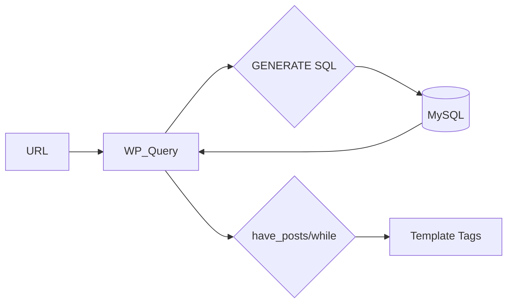

# WordPress Database API & WP_Query — Complete Reference

> Source: https://developer.wordpress.org/apis/database/ + WP_Query reference
> WordPress Version: 6.7+

## 1. Overview

WordPress provides multiple layers for database access:

| Layer | Use Case | Complexity |
|---|---|---|
| **WP_Query** | Fetch posts/pages/CPTs by criteria | Low |
| **$wpdb** | Direct SQL queries (raw) | High |
| **Options API** | Simple key-value settings | Low |
| **Metadata API** | Post/user/term/comment meta | Low |
| **Transients API** | Cached data with expiration | Low |

## 2. WP_Query — The Post Query Layer

### Architecture


### Constructor Parameters
```php
$query = new WP_Query( array(
    // Content type
    'post_type'      => 'post',           // 'post', 'page', 'product', 'any', or custom
    'post_status'    => 'publish',        // 'publish', 'draft', 'pending', 'private', 'any'
    'posts_per_page' => 10,               // -1 = all (use with caution!)

    // Ordering
    'orderby'        => 'date',           // 'date', 'title', 'rand', 'comment_count', 'menu_order'
    'order'          => 'DESC',           // 'ASC' or 'DESC'

    // Filtering by taxonomy
    'category_name'  => 'news',           // Category slug
    'tag'            => 'featured',       // Tag slug
    'tax_query'      => array(            // Complex taxonomy queries
        array(
            'taxonomy' => 'genre',
            'field'    => 'slug',
            'terms'    => array( 'fiction', 'non-fiction' ),
            'operator' => 'IN',           // 'IN', 'NOT IN', 'AND'
        ),
    ),

    // Filtering by meta
    'meta_key'       => 'rating',
    'meta_value'     => '5',
    'meta_query'     => array(
        array(
            'key'     => 'featured',
            'value'   => '1',
            'compare' => '=',
        ),
    ),

    // Date queries
    'date_query'     => array(
        array(
            'after'     => '2024-01-01',
            'before'    => '2024-12-31',
            'inclusive' => true,
        ),
    ),

    // Search
    's'              => 'search term',

    // Pagination
    'paged'          => get_query_var( 'paged', 1 ),
) );
```

### The Loop Pattern
```php
$query = new WP_Query( $args );

if ( $query->have_posts() ) :
    while ( $query->have_posts() ) : $query->the_post();
        // Template tags available:
        the_title( '<h2>', '</h2>' );
        the_content();
        the_permalink();
        the_post_thumbnail( 'medium' );
        the_excerpt();
        the_category( ', ' );
        the_tags();
        echo get_the_date();
        echo get_the_author();
    endwhile;

    // Pagination
    echo paginate_links( array(
        'total'   => $query->max_num_pages,
        'current' => max( 1, get_query_var( 'paged' ) ),
    ) );

    wp_reset_postdata(); // 🔴 ALWAYS reset after custom query
endif;
```

### Performance Tips
```php
// ✅ Good — only get fields you need
new WP_Query( array(
    'fields'         => 'ids', // Only get IDs, not full post objects
    'no_found_rows'  => true,  // Skip pagination count when not needed
    'update_post_meta_cache' => false,
    'update_post_term_cache' => false,
) );
```

## 3. $wpdb — Direct Database Access

### Architecture
```php
global $wpdb;

// All tables are accessible via properties
$wpdb->posts;         // wp_posts
$wpdb->postmeta;      // wp_postmeta
$wpdb->users;         // wp_users
$wpdb->usermeta;      // wp_usermeta
$wpdb->options;       // wp_options
$wpdb->terms;         // wp_terms
$wpdb->term_taxonomy; // wp_term_taxonomy
$wpdb->termmeta;      // wp_termmeta
$wpdb->comments;      // wp_comments
$wpdb->commentmeta;   // wp_commentmeta
$wpdb->prefix;        // Table prefix (e.g., 'wp_')
```

### Common Methods

```php
// SELECT — get results as array of objects
$results = $wpdb->get_results( "SELECT * FROM {$wpdb->posts} LIMIT 10" );

// Single row
$row = $wpdb->get_row( "SELECT * FROM {$wpdb->posts} WHERE ID = 1" );

// Single variable
$count = $wpdb->get_var( "SELECT COUNT(*) FROM {$wpdb->posts}" );

// INSERT
$wpdb->insert(
    $wpdb->prefix . 'my_table',
    array( 'name' => 'John', 'email' => 'john@example.com' ),
    array( '%s', '%s' )  // Format strings: %s, %d, %f
);

// UPDATE
$wpdb->update(
    $wpdb->prefix . 'my_table',
    array( 'name' => 'Jane' ),
    array( 'ID' => 1 ),
    array( '%s' ),    // Data format
    array( '%d' )     // Where format
);

// DELETE
$wpdb->delete(
    $wpdb->prefix . 'my_table',
    array( 'ID' => 1 ),
    array( '%d' )
);
```

### 🔴 Prepared Statements (ALWAYS use!)
```php
// ❌ NEVER do this:
$results = $wpdb->get_results( "SELECT * FROM {$wpdb->posts} WHERE post_title = '{$_GET['title']}'" );

// ✅ ALWAYS prepare:
$results = $wpdb->get_results( $wpdb->prepare(
    "SELECT * FROM {$wpdb->posts} WHERE post_title = %s AND post_type = %s",
    $_GET['title'],
    'post'
) );

// LIKE queries with prepare
$results = $wpdb->get_results( $wpdb->prepare(
    "SELECT * FROM {$wpdb->posts} WHERE post_title LIKE %s",
    '%' . $wpdb->esc_like( $search_term ) . '%'
) );
```

## 4. Metadata API

### Post Meta
```php
// Add/update
update_post_meta( $post_id, 'rating', 5 );
add_post_meta( $post_id, 'featured', 1, true ); // unique = true

// Get
$rating = get_post_meta( $post_id, 'rating', true );  // single value
$all_meta = get_post_meta( $post_id );                 // all meta as array

// Delete
delete_post_meta( $post_id, 'rating' );
```

### User Meta
```php
update_user_meta( $user_id, 'phone', '+1234567890' );
$phone = get_user_meta( $user_id, 'phone', true );
```

### Term Meta
```php
update_term_meta( $term_id, 'icon', 'star' );
$icon = get_term_meta( $term_id, 'icon', true );
```

### Comment Meta
```php
update_comment_meta( $comment_id, 'verified', 1 );
$verified = get_comment_meta( $comment_id, 'verified', true );
```

## 5. Options API

```php
// Simple key-value storage (wp_options table)
add_option( 'myplugin_setting', 'default_value' );
update_option( 'myplugin_setting', 'new_value' );
$value = get_option( 'myplugin_setting', 'default' );
delete_option( 'myplugin_setting' );

// Autoload options are loaded on every page — use wisely
update_option( 'myplugin_setting', $value, false ); // $autoload = false
```

## 6. Security

| Attack Vector | Prevention |
|---|---|
| **SQL Injection** | Always use `$wpdb->prepare()` |
| **XSS in meta data** | Escape on output (`esc_html`, `esc_attr`) |
| **Unauthorized meta access** | Check `current_user_can()` before get/update |
| **Serialized data injection** | WordPress handles serialization, but validate input |

## 7. Performance

- Use `WP_Query` over `$wpdb` for posts when possible (caching built-in)
- Transients API for expensive queries:
```php
function get_featured_posts() {
    $cache_key = 'featured_posts';
    $posts = get_transient( $cache_key );

    if ( false === $posts ) {
        $posts = new WP_Query( array(
            'meta_key'   => 'featured',
            'meta_value' => '1',
            'posts_per_page' => 5,
        ) );
        set_transient( $cache_key, $posts, HOUR_IN_SECONDS );
    }
    return $posts;
}
```

- For large data sets, use `wp_cache_set()`/`wp_cache_get()` (object cache)
- Minimize calls to `count()` inside loops (use `$wpdb->get_var()` instead)

## 8. AI Reasoning Notes

When solving database problems:
1. For **post queries**: prefer `WP_Query` over `$wpdb` (caching, hooks, standardization)
2. For **custom tables or complex SQL**: use `$wpdb` with prepared statements
3. For **key-value settings**: Options API
4. For **attached data** (to posts/users/terms): Metadata API
5. For **cached expensive operations**: Transients API
6. **Always escape**: sanitize input, prepare SQL, escape output
7. **Always reset**: `wp_reset_postdata()` after custom WP_Query loops
