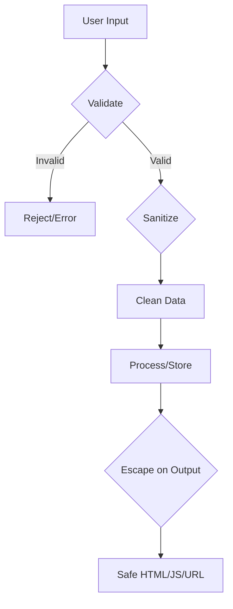

# WordPress Security — Complete Reference

> Source: https://developer.wordpress.org/apis/security/
> WordPress Version: 6.7+

## 1. Overview

WordPress security follows three core principles:
1. **Validate** input (reject bad data)
2. **Sanitize** input (clean data before use)
3. **Escape** output (secure data before display)

### The Security Mindset
- **Don't trust any data** — not users, not the database, not third-party APIs
- **Rely on WordPress APIs** — built-in functions handle sanitization/escaping
- **Keep code updated** — security vulnerabilities evolve

## 2. Three-Layer Defense



## 3. Input Validation

### Validate First (better than sanitization)
```php
// ✅ Safelist approach — most secure
$allowed_roles = array( 'subscriber', 'contributor', 'author' );
if ( ! in_array( $_POST['role'], $allowed_roles, true ) ) {
    wp_die( 'Invalid role' );
}

// ✅ Type checking
if ( ! is_numeric( $_GET['id'] ) ) {
    wp_die( 'Invalid ID' );
}
$id = intval( $_GET['id'] );

// ✅ Format validation (regex)
if ( ! preg_match( '/^\d{5}(-\d{4})?$/', $_POST['zip'] ) ) {
    wp_die( 'Invalid ZIP code' );
}
```

### Validation Functions
| Function | Purpose |
|---|---|
| `is_email( $email )` | Validate email format |
| `term_exists( $term, $taxonomy )` | Check if term exists |
| `username_exists( $username )` | Check if user exists |
| `email_exists( $email )` | Check if email exists |
| `post_exists( $title )` | Check if post exists |

## 4. Input Sanitization

### Always sanitize untrusted input before use
```php
// Text fields
$safe_text = sanitize_text_field( $_POST['title'] );           // Strips all HTML
$safe_area = sanitize_textarea_field( $_POST['bio'] );         // For textarea content

// HTML content (preserves some tags)
$safe_html = wp_kses_post( $_POST['content'] );                // Like post content
$safe_custom = wp_kses( $_POST['html'], array(                 // Custom allowed tags
    'a' => array( 'href' => array(), 'title' => array() ),
    'br' => array(),
    'strong' => array(),
) );

// Specific types
$safe_email = sanitize_email( $_POST['email'] );
$safe_url   = sanitize_url( $_POST['url'] );                   // Note: sanitize_url() NOT esc_url() for storage
$safe_key   = sanitize_key( $_POST['option_name'] );
$safe_file  = sanitize_file_name( $_FILES['file']['name'] );
$safe_hex   = sanitize_hex_color( $_POST['color'] );
$safe_class = sanitize_html_class( $_POST['class'] );
$safe_title = sanitize_title( $_POST['slug'] );
$safe_user  = sanitize_user( $_POST['username'] );

// Numeric
$id    = intval( $_GET['id'] );
$price = floatval( $_POST['price'] );
$count = absint( $_POST['count'] );  // Absolute integer (non-negative)
```

## 5. Output Escaping — THE CRITICAL LAYER

### Golden Rule: Escape as Late as Possible
Escape when you `echo`, not when you store.

### Escaping Functions

| Context | Function | Example |
|---|---|---|
| **HTML tag body** | `esc_html()` | `<h4><?php echo esc_html( $title ); ?></h4>` |
| **HTML attribute** | `esc_attr()` | `<div class="<?php echo esc_attr( $class ); ?>">` |
| **URL** | `esc_url()` | `<a href="<?php echo esc_url( $url ); ?>">` |
| **URL for storage** | `esc_url_raw()` | `update_post_meta( $id, 'url', esc_url_raw( $url ) );` |
| **JavaScript** | `esc_js()` | `<a onclick="<?php echo esc_js( $code ); ?>">` |
| **Textarea** | `esc_textarea()` | `<textarea><?php echo esc_textarea( $text ); ?></textarea>` |
| **XML** | `esc_xml()` | XML output |
| **HTML (trusted)** | `wp_kses_post()` | Post content with allowed HTML |

### With Translation (Built-in Escaping)
```php
esc_html__( 'String', 'textdomain' );   // __() + esc_html()
esc_html_e( 'String', 'textdomain' );   // _e() + esc_html()
esc_html_x( 'String', 'context', 'textdomain' );
esc_attr__( 'String', 'textdomain' );
esc_attr_e( 'String', 'textdomain' );
esc_attr_x( 'String', 'context', 'textdomain' );
```

### Complete Examples
```php
// ✅ Late escaping — BEST PRACTICE
echo '<a href="' . esc_url( $url ) . '" title="' . esc_attr( $title ) . '">'
    . esc_html( $text ) . '</a>';

// ❌ Early escaping — fragile, less clear
$safe_url = esc_url( $url );
$safe_text = esc_html( $text );
echo '<a href="' . $safe_url . '">' . $safe_text . '</a>';

// ✅ Numeric — simplest escape
echo (int) $number;
echo absint( $count );  // Ensures non-negative
```

## 6. Nonces (CSRF Protection)

### Create and Verify Nonces
```php
// In a form
wp_nonce_field( 'my_action', 'my_nonce' );

// In a URL
$url = add_query_arg( '_wpnonce', wp_create_nonce( 'delete_post_' . $post_id ), $url );

// Verify
if ( ! isset( $_POST['my_nonce'] ) || ! wp_verify_nonce( $_POST['my_nonce'], 'my_action' ) ) {
    wp_die( 'Security check failed' );
}

// Verify admin referer (common pattern)
check_admin_referer( 'my_action', 'my_nonce' );
check_ajax_referer( 'my_action', 'nonce' );  // For AJAX
```

### Nonce Lifespan
- Default: 12 hours (or until user logs out)
- Can be filtered with `nonce_life` hook
- Not time-based for logged-out users

## 7. Capabilities & Authorization

```php
// Check current user
if ( current_user_can( 'manage_options' ) ) {
    // Show admin options
}
if ( current_user_can( 'edit_post', $post_id ) ) {
    // Show edit button
}
if ( current_user_can( 'edit_posts' ) ) {
    // Show post editor
}

// Check specific user
if ( user_can( $user_id, 'delete_posts' ) ) {
    // Allow deletion
}

// Check for multisite
if ( current_user_can_for_blog( 2, 'manage_options' ) ) {
    // Has options on blog 2
}
```

## 8. SQL Injection Prevention

```php
// ❌ DANGEROUS — never concatenate variables
$wpdb->get_results( "SELECT * FROM {$wpdb->posts} WHERE ID = {$_GET['id']}" );

// ✅ ALWAYS prepare
$wpdb->get_results( $wpdb->prepare(
    "SELECT * FROM {$wpdb->posts} WHERE ID = %d",
    $_GET['id']
) );

// ✅ For LIKE clauses, escape wildcards
$wpdb->get_results( $wpdb->prepare(
    "SELECT * FROM {$wpdb->posts} WHERE post_title LIKE %s",
    '%' . $wpdb->esc_like( $search ) . '%'
) );

// ✅ IN clause with array
$ids = array_map( 'intval', $_POST['ids'] );
$placeholders = array_fill( 0, count( $ids ), '%d' );
$wpdb->get_results( $wpdb->prepare(
    "SELECT * FROM {$wpdb->posts} WHERE ID IN (" . implode( ',', $placeholders ) . ")",
    $ids
) );
```

## 9. CSRF / XSS Protection Summary

| Attack | Defense |
|---|---|
| **XSS (Cross-Site Scripting)** | Escape on output (`esc_html`, `esc_attr`, `esc_url`) |
| **CSRF (Cross-Site Request Forgery)** | Nonces (`wp_nonce_field`, `wp_verify_nonce`) |
| **SQL Injection** | Prepared statements (`$wpdb->prepare`) |
| **Privilege Escalation** | Capability checks (`current_user_can()`) |
| **Path Traversal** | `basename()`, `realpath()`, sanitize_file_name() |

## 10. Practical Checklist

- [ ] All `$_GET`/`$_POST`/`$_REQUEST` data is sanitized before use
- [ ] All output is escaped (`esc_html`, `esc_attr`, `esc_url`)
- [ ] All forms have nonces
- [ ] All AJAX handlers have nonces
- [ ] All database queries use `$wpdb->prepare()`
- [ ] Capability checks on privileged actions
- [ ] Upload file types are restricted
- [ ] Debug mode disabled in production
- [ ] File permissions: 644 for files, 755 for dirs

## 11. AI Reasoning Notes

When analyzing security:
1. **Identify data flow**: Input → Storage → Output
2. **Sanitize at input**: clean data before saving
3. **Escape at output**: secure data when displaying
4. **Prepared statements**: always for SQL
5. **Nonces**: on all forms/actions that change data
6. **Capabilities**: check before privileged operations
7. **Late escaping**: escape at the last possible moment (echo time)
